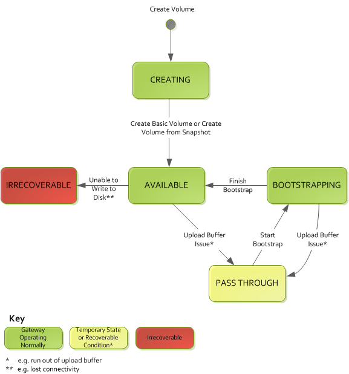
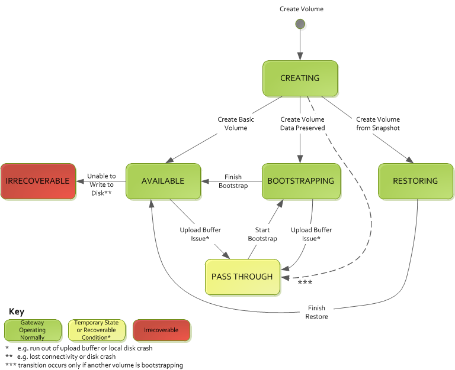

# Understanding Volume Statuses and

Transitions

Each volume has an associated status that tells you at a glance what the health of the
volume is. Most of the time, the status indicates that the volume is functioning normally
and that no action is needed on your part. In some cases, the status indicates a problem
with the volume that might or might not require action on your part. You can find
information following to help you decide when you need to act. You can see volume status on
the Storage Gateway console or by using one of the Storage Gateway API operations, for example [DescribeCachediSCSIVolumes](../APIReference/API_DescribeCachediSCSIVolumes.md "../APIReference/API_DescribeCachediSCSIVolumes.md") or [DescribeStorediSCSIVolumes](../APIReference/API_DescribeStorediSCSIVolumes.md "../APIReference/API_DescribeStorediSCSIVolumes.md").

###### Topics

- [Understanding Volume Status](#StorageVolumeStatuses2 "#StorageVolumeStatuses2")
- [Understanding Attachment Status](#VolumeAttachStatuses "#VolumeAttachStatuses")
- [Understanding Cached Volume Status
  Transitions](#CachedVolumeStatusTransition "#CachedVolumeStatusTransition")
- [Understanding Stored Volume Status
  Transitions](#StorageVolumeStatusTransition "#StorageVolumeStatusTransition")

## Understanding Volume Status

The following table shows volume status on the Storage Gateway console. Volume status
appears in the **Status** column for each storage volume on your
gateway. A volume that is functioning normally has a status of
**Available**.

In the following table, you can find a description of each storage volume status, and
if and when you should act based on each status. The **Available**
status is the normal status of a volume. A volume should have this status all or most of
the time it's in use.

| Status                              | Meaning                                                                                                                                                                                                                                                                                                                                                                                                                                                                                                                                                                                                                                                                                                                                                                                                                                                                                                                                                                                                                                                                                                                                                                                                                                                                                                                                                                                                                                                                                                                                                                                                                                                                                                                                                                                                                                                                                                                                                                                                                                                                                                                                                                                                                                                                                                                                                                                                                                                                                                                                                                                                                                                                                                                                                                                                                                                                                                                                                                                                                                                                                                                                                                                                                                                                                                                      |
| ----------------------------------- | ---------------------------------------------------------------------------------------------------------------------------------------------------------------------------------------------------------------------------------------------------------------------------------------------------------------------------------------------------------------------------------------------------------------------------------------------------------------------------------------------------------------------------------------------------------------------------------------------------------------------------------------------------------------------------------------------------------------------------------------------------------------------------------------------------------------------------------------------------------------------------------------------------------------------------------------------------------------------------------------------------------------------------------------------------------------------------------------------------------------------------------------------------------------------------------------------------------------------------------------------------------------------------------------------------------------------------------------------------------------------------------------------------------------------------------------------------------------------------------------------------------------------------------------------------------------------------------------------------------------------------------------------------------------------------------------------------------------------------------------------------------------------------------------------------------------------------------------------------------------------------------------------------------------------------------------------------------------------------------------------------------------------------------------------------------------------------------------------------------------------------------------------------------------------------------------------------------------------------------------------------------------------------------------------------------------------------------------------------------------------------------------------------------------------------------------------------------------------------------------------------------------------------------------------------------------------------------------------------------------------------------------------------------------------------------------------------------------------------------------------------------------------------------------------------------------------------------------------------------------------------------------------------------------------------------------------------------------------------------------------------------------------------------------------------------------------------------------------------------------------------------------------------------------------------------------------------------------------------------------------------------------------------------------------------------------------------- |
| **Available**                       | The volume is available for use. This status is the normal running status for a volume. When a **Bootstrapping\* • phase is completed, the volume returns to **Available* • state. That is, the gateway has synchronized any changes made to the volume since it first entered \*\*Pass Through* • status.                                                                                                                                                                                                                                                                                                                                                                                                                                                                                                                                                                                                                                                                                                                                                                                                                                                                                                                                                                                                                                                                                                                                                                                                                                                                                                                                                                                                                                                                                                                                                                                                                                                                                                                                                                                                                                                                                                                                                                                                                                                                                                                                                                                                                                                                                                                                                                                                                                                                                                                                                                                                                                                                                                                                                                                                                                                                                                                                                                                           |
| **Bootstrapping**                   | The gateway is synchronizing data locally with a copy of the data stored in AWS. You typically don't need to take action for this status, because the storage volume automatically sees the **Available\* • status in most cases. The following are scenarios when a volume status is **Bootstrapping**: • A gateway has unexpectedly shut down. • A gateway's upload buffer has been exceeded. In this scenario, bootstrapping occurs when your volume has the **Pass Through* • status and the amount of free upload buffer increases sufficiently. You can provide additional upload buffer space as one way to increase the percentage of free upload buffer space. In this particular scenario, the storage volume goes from \*\*Pass Through* • to **Bootstrapping\* • to **Available* • status. You can continue to use this volume during this bootstrapping period. However, you can't take snapshots of the volume at this point. • You are creating a stored Volume Gateway and preserving existing local disk data. In this scenario, your gateway starts uploading all of the data to AWS. The volume has the \*\*Bootstrapping* • status until all of the data from the local disk is copied to AWS. You can use the volume during this bootstrapping period. However, you can't take snapshots of the volume at this point.                                                                                                                                                                                                                                                                                                                                                                                                                                                                                                                                                                                                                                                                                                                                                                                                                                                                                                                                                                                                                                                                                                                                                                                                                                                                                                                                                                                                                                                                                                                                                                                                                                                                                                                                                                                                                                                                                   |
| **Creating**                        | The volume is currently being created and is not ready for use. The \*_Creating_ • status is transitional. No action is required.                                                                                                                                                                                                                                                                                                                                                                                                                                                                                                                                                                                                                                                                                                                                                                                                                                                                                                                                                                                                                                                                                                                                                                                                                                                                                                                                                                                                                                                                                                                                                                                                                                                                                                                                                                                                                                                                                                                                                                                                                                                                                                                                                                                                                                                                                                                                                                                                                                                                                                                                                                                                                                                                                                                                                                                                                                                                                                                                                                                                                                                                                                                                                                                   |
| **Deleting**                        | The volume is currently being deleted. The \*_Deleting_ • status is transitional. No action is required.                                                                                                                                                                                                                                                                                                                                                                                                                                                                                                                                                                                                                                                                                                                                                                                                                                                                                                                                                                                                                                                                                                                                                                                                                                                                                                                                                                                                                                                                                                                                                                                                                                                                                                                                                                                                                                                                                                                                                                                                                                                                                                                                                                                                                                                                                                                                                                                                                                                                                                                                                                                                                                                                                                                                                                                                                                                                                                                                                                                                                                                                                                                                                                                                            |
| **Irrecoverable**                   | An error occurred from which the volume cannot recover. For information on what to do in this situation, see [Troubleshooting volume issues](troubleshoot-volume-issues.md "troubleshoot-volume-issues.md").                                                                                                                                                                                                                                                                                                                                                                                                                                                                                                                                                                                                                                                                                                                                                                                                                                                                                                                                                                                                                                                                                                                                                                                                                                                                                                                                                                                                                                                                                                                                                                                                                                                                                                                                                                                                                                                                                                                                                                                                                                                                                                                                                                                                                                                                                                                                                                                                                                                                                                                                                                                                                                                                                                                                                                                                                                                                                                                                                                                                                                                                                                              |
| **Pass Through**                 | Data maintained locally is out of sync with data stored in AWS. Data written to a volume while the volume is in **Pass Through\* • status remains in the cache until the volume status is **Bootstrapping**. This data starts to upload to AWS when **Bootstrapping* • status begins. The \*\*Pass Through* • status can occur for several reasons, listed following: • The **Pass Through** status occurs if your gateway has run out of upload buffer space. Your applications can continue to read from and write data to your storage volumes while the volumes have the **Pass Through\* • status. However, the gateway isn't writing any of your volume data to its upload buffer or uploading any of this data to AWS. The gateway continues to upload any data written to the volume before the volume entered the **Pass Through* • status. Any pending or scheduled snapshots of a storage volume fail while the volume has the \*\*Pass Through* • status. For information about what to do when your storage volume has the **Pass Through\* • status because the upload buffer has been exceeded, see [Troubleshooting volume issues](troubleshoot-volume-issues.md "troubleshoot-volume-issues.md"). To return to ACTIVE status, a volume in **Pass Through* • must complete the \*\*Bootstrapping* • phase. During **Bootstrapping**, the volume re-establishes synchronization within AWS, so that it can resume the record (log) of changes to the volume, and activate `CreateSnapshot` functionality. During **Bootstrapping**, writes to the volume are recorded in upload buffer. • The **Pass Through** status occurs when there is more than one storage volume bootstrapping at once. Only one gateway storage volume can bootstrap at a time. For example, suppose that you create two storage volumes and choose to preserve existing data on both of them. In this case, the second storage volume has the **Pass Through\* • status until the first storage volume finishes bootstrapping. In this scenario, you don't need to act. Each storage volume changes to the **Available* • status automatically when it is finished being created. You can read and write to the storage volume while it has the \*\*Pass Through* • or **Bootstrapping** status. • Infrequently, the **Pass Through** status can indicate that a disk allocated for upload buffer use has failed. For information about what action to take in this scenario, see [Troubleshooting volume issues](troubleshoot-volume-issues.md "troubleshoot-volume-issues.md"). • The **Pass Through** status can occur when a volume is in **Active\* • or **Bootstrapping* • state. In this case, the volume receives a write, but the upload buffer has insufficient capacity to record (log) that write. • The **Pass Through** status occurs when a volume is in any state and the gateway is not shut down cleanly. This type of shutdown can happen because the software crashed or the VM was powered off. In this case, a volume in any state transitions to \*\*Pass Through* • status. |
| **Restoring**                       | The volume is being restored from an existing snapshot. This status applies only for stored volumes. For more information, see [How Volume Gateway works](StorageGatewayConcepts.md "StorageGatewayConcepts.md"). If you restore two storage volumes at the same time, both storage volumes show **Restoring\* • as their status. Each storage volume changes to the **Available* • status automatically when it is finished being created. You can read and write to a storage volume and take a snapshot of it while it has the \*\*Restoring* • status.                                                                                                                                                                                                                                                                                                                                                                                                                                                                                                                                                                                                                                                                                                                                                                                                                                                                                                                                                                                                                                                                                                                                                                                                                                                                                                                                                                                                                                                                                                                                                                                                                                                                                                                                                                                                                                                                                                                                                                                                                                                                                                                                                                                                                                                                                                                                                                                                                                                                                                                                                                                                                                                                                                                               |
| **Restoring Pass Through**          | The volume is being restored from an existing snapshot and has encountered an upload buffer issue. This status applies only for stored volumes. For more information, see [How Volume Gateway works](StorageGatewayConcepts.md "StorageGatewayConcepts.md"). One reason that can cause the **Restoring Pass Through\* • status is if your gateway has run out of upload buffer space. Your applications can continue to read from and write data to your storage volumes while they have the **Restoring Pass Through* • status. However, you can't take snapshots of a storage volume during the \*\*Restoring Pass Through* • status period. For information about what action to take when your storage volume has the **Restoring Pass Through\* • status because upload buffer capacity has been exceeded, see [Troubleshooting volume issues](troubleshoot-volume-issues.md "troubleshoot-volume-issues.md"). Infrequently, the **Restoring Pass Through\*\* status can indicate that a disk allocated for an upload buffer has failed. For information about what action to take in this scenario, see [Troubleshooting volume issues](troubleshoot-volume-issues.md "troubleshoot-volume-issues.md").                                                                                                                                                                                                                                                                                                                                                                                                                                                                                                                                                                                                                                                                                                                                                                                                                                                                                                                                                                                                                                                                                                                                                                                                                                                                                                                                                                                                                                                                                                                                                                                                                                                                                                                                                                                                                                                                                                                                                                                                                                                 |
| **Upload Buffer Not Configured** | You can't create or use the volume because the gateway doesn't have an upload buffer configured. For information on how to add upload buffer capacity for volumes in a cached volume setup, see [Determining the size of upload buffer to allocate](decide-local-disks-and-sizes.md#CachedLocalDiskUploadBufferSizing-common "decide-local-disks-and-sizes.md#CachedLocalDiskUploadBufferSizing-common"). For information on how to add upload buffer capacity for volumes in a stored volume setup, see [Determining the size of upload buffer to allocate](decide-local-disks-and-sizes.md#CachedLocalDiskUploadBufferSizing-common "decide-local-disks-and-sizes.md#CachedLocalDiskUploadBufferSizing-common").                                                                                                                                                                                                                                                                                                                                                                                                                                                                                                                                                                                                                                                                                                                                                                                                                                                                                                                                                                                                                                                                                                                                                                                                                                                                                                                                                                                                                                                                                                                                                                                                                                                                                                                                                                                                                                                                                                                                                                                                                                                                                                                                                                                                                                                                                                                                                                                                                                                                                                                                                                                      |

## Understanding Attachment Status

You can detach a volume from a gateway or attach it to a gateway by using the Storage
Gateway console or API. The following table shows volume attachment status on the
Storage Gateway console. Volume attachment status appears in the **Attachment
status** column for each storage volume on your gateway. For example, a
volume that is detached from a gateway has a status of **Detached**.
For information about how to detach and attach a volume, see [Moving Your Volumes to a Different
Gateway](attach-detach-volume.md "attach-detach-volume.md").

| Status        | Meaning                                                                                                                                                   |
| ------------- | --------------------------------------------------------------------------------------------------------------------------------------------------------- |
| **Attached**  | The volume is attached to a gateway.                                                                                                                      |
| **Detached**  | The volume is detached from a gateway.                                                                                                                    |
| **Detaching** | The volume is being detached from a gateway. When you are detaching a volume and the volume doesn't have data on it, you might not see this status. |

## Understanding Cached Volume Status

Transitions

Use the following state diagram to understand the most common transitions between
statuses for volumes in cached gateways. You don't need to understand the diagram
in detail to use your gateway effectively. Rather, the diagram provides detailed
information if you are interested in knowing more about how Volume Gateways
work.

The diagram doesn't show the **Upload Buffer Not Configured** status
or the **Deleting** status. Volume states in the diagram appear as
green, yellow, and red boxes. You can interpret the colors as described
following.

| Color      | Volume Status                                                                                                                                                                                                                                                                                                                                                                                                                                                                                                                                                                                                                                                                                                                                                                                                                                                                                                                                                                      |
| ---------- | ---------------------------------------------------------------------------------------------------------------------------------------------------------------------------------------------------------------------------------------------------------------------------------------------------------------------------------------------------------------------------------------------------------------------------------------------------------------------------------------------------------------------------------------------------------------------------------------------------------------------------------------------------------------------------------------------------------------------------------------------------------------------------------------------------------------------------------------------------------------------------------------------------------------------------------------------------------------------------------- |
| **Green**  | The gateway is operating normally. The volume status is **Available\* • or eventually becomes **Available\*\*.                                                                                                                                                                                                                                                                                                                                                                                                                                                                                                                                                                                                                                                                                                                                                                                                                                                            |
| **Yellow** | The volume has the **Pass Through\* • status, which indicates there is a potential issue with the storage volume. If this status appears because the upload buffer space is filled, then in some cases buffer space becomes available again. At that point, the storage volume self-corrects to the **Available\* • status. In other cases, you might have to add more upload buffer space to your gateway to allow the storage volume status to become **Available**. For information on how to troubleshoot a case when upload buffer capacity has been exceeded, see [Troubleshooting volume issues](troubleshoot-volume-issues.md "troubleshoot-volume-issues.md"). For information on how to add upload buffer capacity, see [Determining the size of upload buffer to allocate](decide-local-disks-and-sizes.md#CachedLocalDiskUploadBufferSizing-common "decide-local-disks-and-sizes.md#CachedLocalDiskUploadBufferSizing-common"). |
| **Red**    | The storage volume has the \*_Irrecoverable_ • status. In this case, you should delete the volume. For information on how to do this, see [To delete a volume](ApplicationStorageVolumesCached-Removing.md#CachedRemovingAStorageVolume "ApplicationStorageVolumesCached-Removing.md#CachedRemovingAStorageVolume").                                                                                                                                                                                                                                                                                                                                                                                                                                                                                                                                                                                                                                                      |

In the diagram, a transition between two states is depicted with a labeled line. For
example, the transition from the **Creating** status to the
**Available** status is labeled as _Create Basic Volume or
Create Volume from Snapshot_. This transition represents creating a cached
volume. For more information about creating storage volumes, see [Adding and expanding volumes](volume-size-increase.md "volume-size-increase.md").

###### Note

The volume status of **Pass Through** appears as yellow in this
diagram. However, this doesn't match the color of this status icon in the
**Status** box of the Storage Gateway console.

## Understanding Stored Volume Status

Transitions

Use the following state diagram to understand the most common transitions between
statuses for volumes in stored gateways. You don't need to understand the diagram
in detail to use your gateway effectively. Rather, the diagram provides detailed
information if you are interested in understanding more about how Volume Gateways
work.

The diagram doesn't show the **Upload Buffer Not Configured** status
or the **Deleting** status. Volume states in the diagram appear as
green, yellow, and red boxes. You can interpret the colors as described
following.

| Color      | Volume Status                                                                                                                                                                                                                                                                                                                                                                                                                                                                                                                                                                                                                                                                                                                                                                                                                                                                                                                                                                                                                                                                                                                                                                                                                                                                                                                                                                                                                                                   |
| ---------- | --------------------------------------------------------------------------------------------------------------------------------------------------------------------------------------------------------------------------------------------------------------------------------------------------------------------------------------------------------------------------------------------------------------------------------------------------------------------------------------------------------------------------------------------------------------------------------------------------------------------------------------------------------------------------------------------------------------------------------------------------------------------------------------------------------------------------------------------------------------------------------------------------------------------------------------------------------------------------------------------------------------------------------------------------------------------------------------------------------------------------------------------------------------------------------------------------------------------------------------------------------------------------------------------------------------------------------------------------------------------------------------------------------------------------------------------------------------- |
| **Green**  | The gateway is operating normally. The volume status is **Available\* • or eventually becomes **Available\*\*.                                                                                                                                                                                                                                                                                                                                                                                                                                                                                                                                                                                                                                                                                                                                                                                                                                                                                                                                                                                                                                                                                                                                                                                                                                                                                                                                         |
| **Yellow** | When you are creating a storage volume and preserving data, then the path from the **Creating\* • status to the **Pass Through* • status occurs if another volume is bootstrapping. In this case, the volume with the **Pass Through** status goes to the \*\*Bootstrapping* • status and then to the **Available\* • status when the first volume is finished bootstrapping. Other than the specific scenario mentioned, yellow (**Pass Through* • status) indicates that there is a potential issue with the storage volume, the most common one being an upload buffer issue. If upload buffer capacity has been exceeded, then in some cases buffer space becomes available again. At that point, the storage volume self-corrects to the **Available** status. In other cases, you might have to add more upload buffer capacity to your gateway to return the storage volume to the \*\*Available* • status. For information on how to troubleshoot a case when upload buffer capacity has been exceeded, see [Troubleshooting volume issues](troubleshoot-volume-issues.md "troubleshoot-volume-issues.md"). For information on how to add upload buffer capacity, see [Determining the size of upload buffer to allocate](decide-local-disks-and-sizes.md#CachedLocalDiskUploadBufferSizing-common "decide-local-disks-and-sizes.md#CachedLocalDiskUploadBufferSizing-common"). |
| **Red**    | The storage volume has the \*_Irrecoverable_ • status. In this case, you should delete the volume. For information on how to do this, see [Deleting storage volumes](ApplicationStorageVolumesCached-Removing.md "ApplicationStorageVolumesCached-Removing.md").                                                                                                                                                                                                                                                                                                                                                                                                                                                                                                                                                                                                                                                                                                                                                                                                                                                                                                                                                                                                                                                                                                                                                                                    |

In the following diagram, a transition between two states is depicted with a labeled
line. For example, the transition from the **Creating** status to the
**Available** status is labeled as _Create Basic
Volume_. This transition represents creating a storage volume without
preserving data or creating the volume from a snapshot.

###### Note

The volume status of **Pass Through** appears as yellow in this
diagram. However, this doesn't match the color of this status icon in the
**Status** box of the Storage Gateway console.
