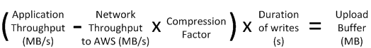

# Deciding the amount of local disk

storage

The number and size of disks that you want to allocate for your gateway is up to you.
Depending on the storage solution you deploy, the gateway requires the following
additional storage:

- Volume Gateways:

      + Stored gateways require at least one disk to use as an upload
       buffer.
      + Cached gateways require at least two disks. One to use as a cache, and
       one to use as an upload buffer.

  The following table recommends sizes for local disk storage for your deployed gateway.
  You can add more local storage later after you set up the gateway, and as your workload
  demands increase.

| Local storage | Description                                                                                                                                                                                                                                                                                                                                                                                                                          |
| ------------- | ------------------------------------------------------------------------------------------------------------------------------------------------------------------------------------------------------------------------------------------------------------------------------------------------------------------------------------------------------------------------------------------------------------------------------------ |
| Upload buffer | The upload buffer provides a staging area for the data before the<br>gateway uploads the data to Amazon S3. Your gateway uploads this buffer data<br>over an encrypted Secure Sockets Layer (SSL) connection to<br>AWS.                                                                                                                                                                                                              |
| Cache storage | The cache storage acts as the on-premises durable store for data that<br>is pending upload to Amazon S3 from the upload buffer. When your application<br>performs I/O on a volume or tape, the gateway saves the data to the<br>cache storage for low-latency access. When your application requests<br>data from a volume or tape, the gateway first checks the cache storage<br>for the data before downloading the data from AWS. |

###### Note

When you provision disks, we strongly recommend that you do not provision local
disks for the upload buffer and cache storage if they use the same physical resource
(the same disk). Underlying physical storage resources are represented as a data
store in VMware. When you deploy the gateway VM, you choose a data store on which to
store the VM files. When you provision a local disk (for example, to use as cache
storage or upload buffer), you have the option to store the virtual disk in the same
data store as the VM or a different data store.

If you have more than one data store, we strongly recommend that you choose one
data store for the cache storage and another for the upload buffer. A data store
that is backed by only one underlying physical disk can lead to poor performance in
some situations when it is used to back both the cache storage and upload buffer.
This is also true if the backup is a less-performant RAID configuration such as
RAID1.

After the initial configuration and deployment of your gateway, you can adjust the
local storage by adding or removing disks for an upload buffer. You can also add disks
for cache storage.

## Determining the size of

upload buffer to allocate

You can determine the size of your upload buffer to allocate by using an upload
buffer formula. We strongly recommend that you allocate at least 150 GiB of upload
buffer. If the formula returns a value less than 150 GiB, use 150 GiB as the amount
you allocate to the upload buffer. You can configure up to 2 TiB of upload buffer
capacity for each gateway.

###### Note

For Volume Gateways, when the upload buffer reaches its
capacity, your volume goes to PASS THROUGH status. In this status, new data that
your application writes is persisted locally but not uploaded to AWS
immediately. Thus, you cannot take new snapshots. When the upload buffer
capacity frees up, the volume goes through BOOTSTRAPPING status. In this status,
any new data that was persisted locally is uploaded to AWS. Finally, the
volume returns to ACTIVE status. Storage Gateway then resumes normal
synchronization of the data stored locally with the copy stored in AWS, and
you can start taking new snapshots. For more information about volume status,
see [Understanding Volume Statuses and
Transitions](StorageVolumeStatuses.md "StorageVolumeStatuses.md").

To estimate the amount of upload buffer to allocate, you can determine the
expected incoming and outgoing data rates and plug them into the following
formula.

**Rate of incoming data**

This rate refers to the application throughput, the rate at which your
on-premises applications write data to your gateway over some period of
time.

**Rate of outgoing data**

This rate refers to the network throughput, the rate at which your
gateway is able to upload data to AWS. This rate depends on your
network speed, utilization, and whether you've activated bandwidth
throttling. This rate should be adjusted for compression. When uploading
data to AWS, the gateway applies data compression where possible. For
example, if your application data is text-only, you might get an
effective compression ratio of about 2:1. However, if you are writing
videos, the gateway might not be able to achieve any data compression
and might require more upload buffer for the gateway.

We strongly recommend that you allocate at least 150 GiB of upload buffer space if
either of the following is true:

- Your incoming rate is higher than the outgoing rate.
- The formula returns a value less than 150 GiB.



For example, assume that your business applications write text data to your
gateway at a rate of 40 MB per second for 12 hours per day and your network
throughput is 12 MB per second. Assuming a compression factor of 2:1 for the text
data, you would allocate approximately 690 GiB of space for the upload
buffer.

```
((40 MB/sec) - (12 MB/sec * 2)) * (12 hours * 3600 seconds/hour) = 691200 megabytes
```

You can initially use this approximation to determine the disk size that you want
to allocate to the gateway as upload buffer space. Add more upload buffer space as
needed using the Storage Gateway console. Also, you can use the Amazon CloudWatch operational
metrics to monitor upload buffer usage and determine additional storage
requirements. For information on metrics and setting the alarms, see [Monitoring the upload buffer](PerfUploadBuffer-common.md "PerfUploadBuffer-common.md").

## Determining the size of cache

storage to allocate

Your gateway uses its cache storage to provide low-latency access to your recently
accessed data. The cache storage acts as the on-premises durable store for data that
is pending upload to Amazon S3 from the upload buffer. Generally speaking, you size the
cache storage at 1.1 times the upload buffer size. For more information about how to
estimate your cache storage size, see [Determining the size of
upload buffer to allocate](#CachedLocalDiskUploadBufferSizing-common "#CachedLocalDiskUploadBufferSizing-common").

You can initially use this approximation to provision disks for the cache storage.
You can then use Amazon CloudWatch operational metrics to monitor the cache storage usage and
provision more storage as needed using the console. For information on using the
metrics and setting up alarms, see [Monitoring cache storage](PerfCache-common.md "PerfCache-common.md").
