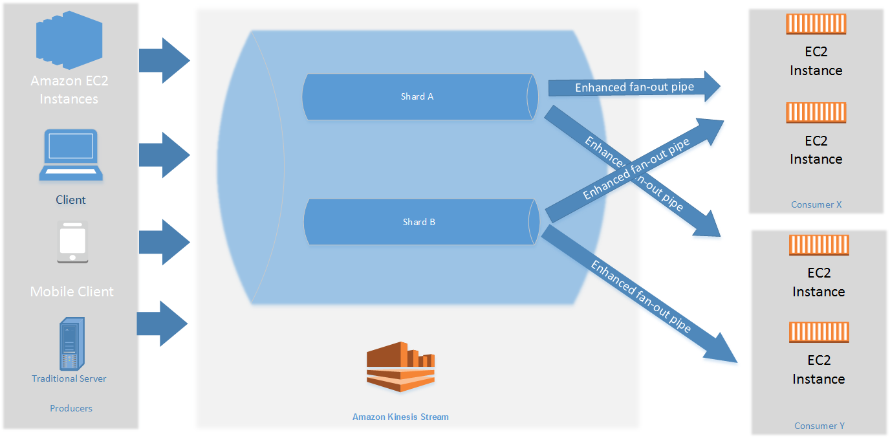

# Develop enhanced fan-out consumers with dedicated

throughput

In Amazon Kinesis Data Streams, you can build consumers that use a feature called _enhanced
fan-out_. This feature lets consumers receive records from a stream with
throughput of up to 2 MB of data per second per shard. This throughput is dedicated, which
means that consumers that use enhanced fan-out don't have to contend with other consumers
that are receiving data from the stream. Kinesis Data Streams pushes data records from the stream to
consumers that use enhanced fan-out. Therefore, these consumers don't need to poll for
data.

###### Important

With On-demand Advantage mode, you can register up to 50 consumers per stream to use enhanced fan-out. With On-demand Standard and Provisioned streams, you can register up to 20 consumers per stream to use enhanced
fan-out.

The following diagram shows the enhanced fan-out architecture. If you use version 2.0 or
later of the Amazon Kinesis Client Library (KCL) to build a consumer, the KCL sets up the
consumer to use enhanced fan-out to receive data from all the shards of the stream. If you
use the API to build a consumer that uses enhanced fan-out, then you can subscribe to
individual shards.

The diagram shows the following:

- A stream with two shards.
- Two consumers that are using enhanced fan-out to receive data from the stream:
  Consumer X and Consumer Y. Each of the two consumers is subscribed to all of the
  shards and all of the records of the stream. If you use version 2.0 or later of the
  KCL to build a consumer, the KCL automatically subscribes that consumer to all
  the shards of the stream. On the other hand, if you use the API to build a consumer,
  you can subscribe to individual shards.
- Arrows representing the enhanced fan-out pipes that the consumers use to receive
  data from the stream. An enhanced fan-out pipe provides up to 2 MB/sec of data per
  shard, independently of any other pipes or of the total number of consumers.

###### Topics

- [Differences between shared throughput
  consumer and enhanced fan-out consumer](#enhanced-consumers-differences "#enhanced-consumers-differences")
- [Regions supported for up to 50 enhanced fan-out consumers (On-demand Advantage only)](#supported-regions "#supported-regions")
- [Manage enhanced fan-out consumers with the AWS CLI or APIs](building-enhanced-consumers-console.md "building-enhanced-consumers-console.md")

## Differences between shared throughput

consumer and enhanced fan-out consumer

The following table compares default shared-throughput consumers to enhanced fan-out
consumers. Message propagation delay is defined as the time taken in milliseconds for a
payload sent using the payload-dispatching APIs (like `PutRecord` and
`PutRecords`) to reach the consumer application through the
payload-consuming APIs (like `GetRecords` and
`SubscribeToShard`).

This table compares shared-throughput consumers to enhanced fan-out
consumers| Characteristics | Shared throughput consumers without enhanced fan-out | Enhanced fan-out consumers |
| --- | --- | --- |
| Read throughput | Fixed at a total of 2 MB/sec per shard. If there are multiple consumers reading from the same shard, they all share this throughput. The sum of the throughputs they receive from the shard doesn't exceed 2 MB/sec. | Scales as consumers register to use enhanced fan-out. Each consumer registered to use enhanced fan-out receives its own read throughput per shard, up to 2 MB/sec, independently of other consumers. |
| Message propagation delay | An average of around 200 ms if you have one consumer reading from the stream. This average goes up to around 1000 ms if you have five consumers. | Typically an average of 70 ms whether you have one consumer or five consumers. |
| Cost | Not applicable | There is a data retrieval cost and a consumer-shard hour cost. For more information, see [Amazon Kinesis Data Streams Pricing](https://aws.amazon.com/kinesis/data-streams/pricing/?nc=sn&loc=3 "https://aws.amazon.com/kinesis/data-streams/pricing/?nc=sn&loc=3"). |
| Record delivery model | Pull model over HTTP using GetRecords. | Kinesis Data Streams pushes the records to you over HTTP/2 using SubscribeToShard. |

## Regions supported for up to 50 enhanced fan-out consumers (On-demand Advantage only)

Support for up to 50 enhanced fan-out consumers in On-demand Advantage mode is available only in the following AWS Regions:

| AWS Region     | Region Name               |
| -------------- | ------------------------- |
| eu-north-1     | Europe (Stockholm)        |
| me-south-1     | Middle East (Bahrain)     |
| ap-south-1     | Asia Pacific (Mumbai)     |
| eu-west-3      | Europe (Paris)            |
| ap-southeast-3 | Asia Pacific (Jakarta)    |
| us-east-2      | US East (Ohio)            |
| af-south-1     | Africa (Cape Town)        |
| eu-west-1      | Europe (Ireland)          |
| me-central-1   | Middle East (UAE)         |
| eu-central-1   | Europe (Frankfurt)        |
| sa-east-1      | South America (São Paulo) |
| ap-east-1      | Asia Pacific (Hong Kong)  |
| ap-south-2     | Asia Pacific (Hyderabad)  |
| us-east-1      | US East (N. Virginia)     |
| ap-northeast-2 | Asia Pacific (Seoul)      |
| ap-northeast-3 | Asia Pacific (Osaka)      |
| eu-west-2      | Europe (London)           |
| ap-southeast-4 | Asia Pacific (Melbourne)  |
| ap-northeast-1 | Asia Pacific (Tokyo)      |
| us-west-2      | US West (Oregon)          |
| us-west-1      | US West (N. California)   |
| ap-southeast-1 | Asia Pacific (Singapore)  |
| ap-southeast-2 | Asia Pacific (Sydney)     |
| il-central-1   | Israel (Tel Aviv)         |
| ca-central-1   | Canada (Central)          |
| ca-west-1      | Canada West (Calgary)     |
| eu-south-2     | Europe (Spain)            |
| cn-northwest-1 | China (Ningxia)           |
| eu-central-2   | Europe (Zurich)           |
| us-gov-east-1  | AWS GovCloud (US-East)    |
| us-gov-west-1  | AWS GovCloud (US-West)    |
