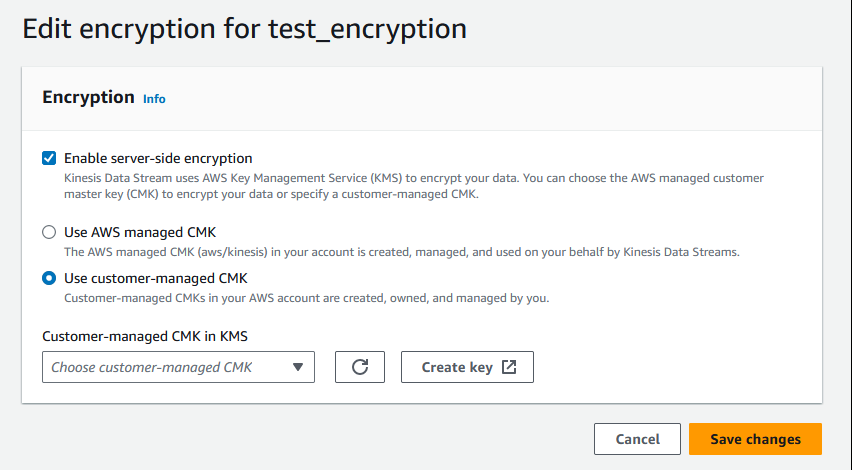

# What is server-side encryption for Kinesis Data Streams?

Server-side encryption is a feature in Amazon Kinesis Data Streams that automatically encrypts data
before it's at rest by using an AWS KMS customer master key (CMK) you specify. Data is
encrypted before it's written to the Kinesis stream storage layer, and decrypted after it’s
retrieved from storage. As a result, your data is encrypted at rest within the Kinesis Data Streams
service. This allows you to meet strict regulatory requirements and enhance the security
of your data.

With server-side encryption, your Kinesis stream producers and consumers don't need to
manage master keys or cryptographic operations. Your data is automatically encrypted as
it enters and leaves the Kinesis Data Streams service, so your data at rest is encrypted. AWS KMS
provides all the master keys that are used by the server-side encryption feature. AWS KMS
makes it easy to use a CMK for Kinesis that is managed by AWS, a user-specified AWS KMS
CMK, or a master key imported into the AWS KMS service.

###### Note

Server-side encryption encrypts incoming data only after encryption is enabled.
Preexisting data in an unencrypted stream is not encrypted after server-side
encryption is enabled.

When encrypting your data streams and sharing access to other principals, you must
grant permission in both the key policy for the AWS KMS key and the IAM policies in the
external account. For more information, see [Allowing
users in other accounts to use a KMS key](../../../kms/latest/developerguide/key-policy-modifying-external-accounts.md "../../../kms/latest/developerguide/key-policy-modifying-external-accounts.md").

If you have enabled server-side encryption for a data stream with AWS managed KMS key and want to share access via a resource policy, you must switch to using customer-managed key (CMK), as shown following:

In addition, you must allow your sharing principal entities to have access to your CMK, using KMS cross account sharing capabilities. Make sure to also make the change in the IAM policies for the sharing principal entities.
For more information, see [Allowing users in other accounts to use a KMS key](../../../kms/latest/developerguide/key-policy-modifying-external-accounts.md "../../../kms/latest/developerguide/key-policy-modifying-external-accounts.md").
