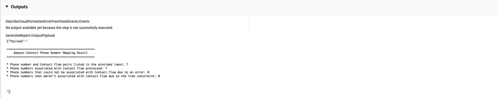
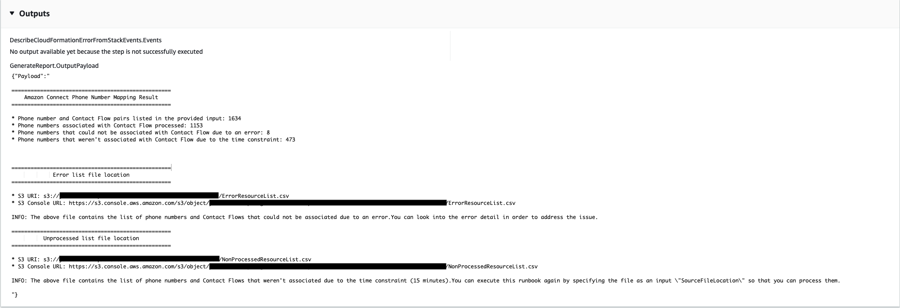

# `AWSSupport-AssociatePhoneNumbersToConnectContactFlows`

**Description**

The `AWSSupport-AssociatePhoneNumbersToConnectContactFlows` helps you
associate phone numbers to contact flows in your Amazon Connect instance. By providing the mappings
of phone numbers and contact flows in an input comma-separated values (CSV) file, the
runbook associates as many phone numbers to contact flows as possible within 14.5 minutes.
The runbook produces a CSV file of all phone number and contact flow pairs that it couldn't
associate within the time limit so that you can input them in the next run.

**How does it work?**

The runbook `AWSSupport-AssociatePhoneNumbersToConnectContactFlows` helps you
associate phone numbers to contact flows in your Amazon Connect instance using a CSV file of mapping
data that is stored in an Amazon Simple Storage Service (Amazon S3) bucket. The input CSV file should align to the
following format, with `PhoneNumber` values in [E.164](https://www.itu.int/rec/T-REC-E.164/en "https://www.itu.int/rec/T-REC-E.164/en") format.

**Example of the input CSV file**

```
PhoneNumber,ContactFlowName
+1800555xxxx,ContactFlowA
+1800555yyyy,ContactFlowB
+1800555zzzz,ContactFlowC
```

The automation runbook also creates the following files in the destination location
specified in the `DestinationFileBucket` and
`DestinationFilePath`.

- **`automation:EXECUTION_ID/ResourceIdList.csv`**: A temporary
  file that contains the `PhoneNumberId` and `ContactFlowId`
  pairs that are required for the `AssociatePhoneNumberContactFlow`
  API.
- **`automation:EXECUTION_ID/ErrorResourceList.csv`**: A file
  that contains the phone number and contact flow pairs that could not be processed
  due to an error, such as `ResourceNotFoundException` in the format of
  `PhoneNumber,ContactFlowName,ErrorMessage`.
- **`automation:EXECUTION_ID/NonProcessedResourceList.csv`**:
  A file that contains the phone number and contact flow pairs that weren't processed.
  The runbook tries to process as many phone numbers and contact flows as possible
  within 14.5 min (15 min of AWS Lambda function timeout - 30 seconds of buffer). If
  there are some phone numbers / contact flows that could not be processed due to the
  time constraint, the runbook includes them in a CSV file to use as an input for the
  next runbook execution.
  **Document type**

Automation

**Owner**

Amazon

**Platforms**

Linux, macOS, Windows

**Parameters**

**Required IAM permissions**

The `AutomationAssumeRole` parameter requires the following actions to
use the runbook successfully.

```

        {
            "Statement": [
                {
                    "Action": [
                        "s3:GetBucketPublicAccessBlock",
                        "s3:GetBucketPolicyStatus",
                        "s3:GetBucketAcl",
                        "s3:GetObject",
                        "s3:GetObjectAttributes",
                        "s3:PutObject",
                        "s3:PutObjectAcl"
                    ],
                    "Resource": [
                    "arn:aws:s3:::`YOUR-BUCKET`/*",
                    "arn:aws:s3:::`YOUR-BUCKET`"
                    ],
                    "Effect": "Allow"
                },
                {
                    "Action": [
                        "cloudformation:CreateStack",
                        "cloudformation:DescribeStacks",
                        "cloudformation:DeleteStack",
                        "iam:CreateRole",
                        "iam:DeleteRole",
                        "iam:DeleteRolePolicy",
                        "iam:GetRole",
                        "iam:PutRolePolicy",
                        "lambda:CreateFunction",
                        "lambda:DeleteFunction",
                        "lambda:GetFunction",
                        "lambda:InvokeFunction",
                        "lambda:TagResource",
                        "connect:AssociatePhoneNumberContactFlow",
                        "logs:CreateLogGroup",
                        "logs:TagResource",
                        "logs:PutRetentionPolicy",
                        "logs:DeleteLogGroup",
                        "s3:GetAccountPublicAccessBlock"
                    ],
                    "Resource": "*",
                    "Effect": "Allow"
                },
                {
                    "Action": [
                        "connect:DescribeInstance",
                        "connect:ListPhoneNumbers",
                        "connect:ListContactFlows",
                        "ds:DescribeDirectories"
                    ],
                    "Resource": "*",
                    "Effect": "Allow"
                },
                {
                    "Condition": {
                        "StringLikeIfExists": {
                            "iam:PassedToService": [
                                "ssm.amazonaws.com",
                                "lambda.amazonaws.com"
                            ]
                        }
                    },
                    "Action": [
                        "iam:PassRole"
                    ],
                    "Resource": "*",
                    "Effect": "Allow"
                }
            ]
        }

```

If providing `LambdaRoleArn` parameter, the role requires the following actions to use the runbook successfully.

JSON

```
`{
 "Version":"2012-10-17",
 "Statement": [
 {
 "Action": [
 "logs:CreateLogGroup"
 ],
 "Resource": "arn:aws:logs:`us-east-1`:`111122223333`:*",
 "Effect": "Allow"
 },
 {
 "Action": [
 "logs:CreateLogStream",
 "logs:PutLogEvents"
 ],
 "Resource": "arn:aws:logs:`us-east-1`:`111122223333`:*",
 "Effect": "Allow"
 },
 {
 "Action": [
 "connect:AssociatePhoneNumberContactFlow"
 ],
 "Resource": "*",
 "Effect": "Allow"
 },
 {
 "Action": [
 "s3:PutObject",
 "s3:GetObject"
 ],
 "Resource": "arn:aws:s3:::`amzn-s3-demo-bucket`/`DESTINATION_FILE_PATH`*",
 "Effect": "Allow"
 }
 ]
}`

```

**Instructions**

Follow these steps to configure the automation:

1.  Navigate to [`AWSSupport-AssociatePhoneNumbersToConnectContactFlows`](https://console.aws.amazon.com/systems-manager/documents/AWSSupport-AssociatePhoneNumbersToConnectContactFlows/description "https://console.aws.amazon.com/systems-manager/documents/AWSSupport-AssociatePhoneNumbersToConnectContactFlows/description")
    in Systems Manager under Documents.
2.  Select Execute automation.
3.  For the input parameters, enter the following:
    - **AutomationAssumeRole (Optional)**

    The Amazon Resource Name (ARN) of the AWS AWS Identity and Access Management (IAM) role that
    allows Systems Manager Automation to perform the actions on your behalf. If no role is
    specified, Systems Manager Automation uses the permissions of the user who starts this
    runbook.
    - **ConnectInstanceId (Required)**

    The ID of your Amazon Connect instance.
    - **SourceFileBucket (Required)**

    The Amazon S3 bucket that stores the CSV file that contains the phone number
    and contact flow pairs.
    - **SourceFilePath (Required)**

    The Amazon S3 object key of the CSV file that contains the phone number and
    contact flow pairs. For example, `path/to/input.csv`.
    - **DestinationFileBucket (Required)**

    The Amazon S3 bucket into which the automation will place an intermediate file
    and result report.
    - **DestinationFilePath (Optional)**

    The Amazon S3 object path in `DestinationFileBucket` under which an
    intermediate file and result report should be stored. For example, if you
    specify `path/to/files/`, files are stored under
    `s3://[DestinationFileBucket]/path/to/files/[automation:EXECUTION_ID]/`.
    - **S3BucketOwnerAccount (Optional)**

    The AWS Account Number that owns the Amazon S3 bucket where you want to
    upload the Contact Flow Log. If you do not specify this parameter, the
    runbooks uses the AWS account ID of the user or role in which the
    Automation runs.
    - **S3BucketOwnerRoleArn (Optional)**

    The ARN of the IAM role with permissions to get the Amazon S3 bucket and
    account block public access settings, bucket encryption configuration, the
    bucket ACLs, the bucket policy status, and upload objects to the bucket. If
    this parameter is not specified, the runbook uses the
    `AutomationAssumeRole` (if specified) or user that starts
    this runbook (if `AutomationAssumeRole` is not specified). Please
    see the required permissions section in the runbook description.
    - **LambdaRoleArn (Optional)**

    The ARN of the IAM role that allows AWS Lambda function to access required AWS services and resources. If no role is specified, this automation will create one IAM role for Lambda in your account.

4.  Select Execute.
5.  The automation initiates.
6.  The document performs the following steps:
    - **CheckConnectInstanceExistance**

    Checks if the Amazon Connect instance provided in `ConnectInstanceId`
    exists.
    - **CheckS3BucketPublicStatus**

    Checks if the Amazon S3 buckets specified in the `SourceFileBucket`
    and `DestinationFileBucket` allow anonymous or public read or
    write access permissions.
    - **CheckSourceFileExistenceAndSize**

    Checks if the source CSV file specified in the `SourceFilePath`
    exists and if the file size exceeds the of 25 MiB limit.
    - **GenerateResourceIdMap**

    Downloads the source CSV file specified in the `SourceFilePath`
    and identify `PhoneNumberId` and `ContactFlowId` for
    each resource. After it's done, it uploads a CSV file that contains
    `PhoneNumber`, `PhoneNumberId`,
    `ContactFlowName`, and `ContactFlowId` to the
    destination Amazon S3 bucket specified in `DestinationFileBucket`. If
    `PhoneNumberId` cannot be identified for a certain number,
    the filed will be empty in the CSV file.
    - **AssociatePhoneNumbersToContactFlows**

    Creates an AWS Lambda function in your account using an AWS CloudFormation stack.
    The AWS Lambda function associates each number to a contact flow listed in
    the source CSV file specified in `SourceFileBucket` and
    `SourceFilePath` and the AWS CloudFormation stack invokes the
    function. The AWS Lambda function map as many phone numbers to contact flows
    as possible before it times out (15 minutes). The list of phone numbers and
    contact flows that could not be processed due to error is uploaded in
    `[automation:EXECUTION_ID]/ErrorResourceList.csv`. The ones
    that could not be processed due to an excess of the maximum number of phone
    numbers that can be processed in a single execution are uploaded in
    `[automation:EXECUTION_ID]/NonProcessedResourceList.csv`. If
    this step fails, it goes to the
    `DescribeCloudFormationErrorFromStackEvents` step to show why
    it failed from AWS CloudFormation stack events.
    - **WaitForPhoneNumberContactFlowAssociationCompletion**

    Waits until the AWS Lambda function that maps phone numbers to contact
    flows is created and the AWS CloudFormation stack completes its invocation.
    - **GenerateReport**

    Generates the report that contains the number of phone numbers mapped to
    contact flows, the ones that could not be processed due to error, and the
    ones that could not be processed due to an excess of the maximum number of
    phone numbers that can be processed in single execution. The report also
    shows the location (Amazon S3 URI and Amazon S3 console URL) for
    `[automation:EXECUTION_ID]/ErrorResourceList.csv` or
    `[automation:EXECUTION_ID]/NonProcessedResourceList.csv`, if
    applicable.
    - **`DeleteCloudFormationStack`**

    Deletes the AWS CloudFormation stack, including the Lambda function for
    mapping.
    - **`DescribeCloudFormationErrorFromStackEvent`**

    Describes errors from the AWS CloudFormation stack of the
    `AssociatePhoneNumbersToContactFlows` step.

7.  After completed, review the Outputs section for the detailed results of the
    execution:

        * **GenerateReport.OutputPayload**


         Output of phone number and contact flow associations. This report
         contains following information:


        	+ The number of phone number and contact flow pairs listed in the
        	 input CSV file
        	+ The number of phone numbers associated with contact flows as
        	 specified in the input CSV file
        	+ The number of phone numbers that could not be associated with
        	 contact flows due to error
        	+ The number of phone numbers that weren't associated with contact
        	 flows due to time constraint
        	+ The location (Amazon S3 URI and Amazon S3 console URL) of the CSV file that
        	 contains the phone number and contact flow pairs that could not be
        	 associated due to error
        	+ The location (Amazon S3 URI and Amazon S3 Console URL) of the CSV file that
        	 contains the phone number and contact flow pairs that weren't
        	 associated due to time constraint
        * **DescribeCloudFormationErrorFromStackEvents.Events**


        Output that shows AWS CloudFormation stack events if the
         `AssociatePhoneNumbersToContactFlows` step fails.

    Output of execution with a small number of phone numbers and contact flows


Output of execution with a large number of phone numbers and contact flows and phone
numbers that weren't associated due to error or time constraint



**References**

Systems Manager Automation

- [Run this Automation (console)](https://console.aws.amazon.com/systems-manager/documents/AWSSupport-AssociatePhoneNumbersToConnectContactFlows/description "https://console.aws.amazon.com/systems-manager/documents/AWSSupport-AssociatePhoneNumbersToConnectContactFlows/description")
- [Run an
  automation](../../../systems-manager/latest/userguide/automation-working-executing.md "../../../systems-manager/latest/userguide/automation-working-executing.md")
- [Setting up an
  Automation](../../../systems-manager/latest/userguide/automation-setup.md "../../../systems-manager/latest/userguide/automation-setup.md")
- [Support Automation
  Workflows landing page](https://aws.amazon.com/premiumsupport/technology/saw/ "https://aws.amazon.com/premiumsupport/technology/saw/")
