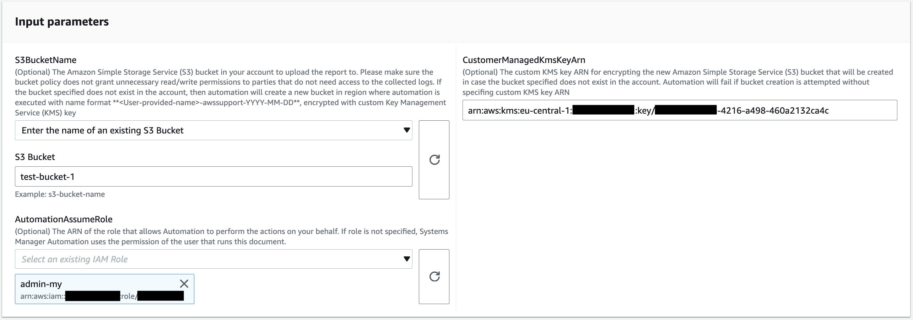
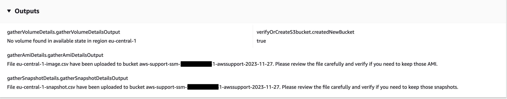

# `AWSSupport-AnalyzeEBSResourceUsage`

**Description**

The `AWSSupport-AnalyzeEBSResourceUsage` automation runbook is used to analyze
resource usage on Amazon Elastic Block Store (Amazon EBS). It analyzes volume usage and identifies abandoned
volumes, images, and snapshots in a given AWS Region.

**How does it work?**

The runbook performs the following four tasks:

1. Verifies that an Amazon Simple Storage Service (Amazon S3) bucket exists, or creates a new Amazon S3
   bucket.
2. Gathers all the Amazon EBS volumes in the available state.
3. Gathers all Amazon EBS snapshots for which source volume has been deleted.
4. Gathers all Amazon Machine Images (AMIs) which are not in use by any
   non-terminated Amazon Elastic Compute Cloud (Amazon EC2) instances.
   The runbook generates CSV reports and stores them in a user-provided Amazon S3 bucket. The
   provided bucket should be secured following AWS security best practices as outlined in the
   end. If the user provided Amazon S3 bucket does not exist in the account, the runbook creates a
   new Amazon S3 bucket with the name format
   `<User-provided-name>-awssupport-YYYY-MM-DD`, encrypted with a custom
   AWS Key Management Service (AWS KMS) key, with object versioning enabled, blocked public access, and require
   requests to use SSL/TLS.

If you want to specify your own Amazon S3 bucket, please make sure it is configured following
these best practices:

- Block public access to the bucket (set `IsPublic` to
  `False`).
- Turn on Amazon S3 access logging.
- [Allow
  only SSL requests to your bucket](https://repost.aws/knowledge-center/s3-bucket-policy-for-config-rule "https://repost.aws/knowledge-center/s3-bucket-policy-for-config-rule").
- Turn on object versioning.
- Use an AWS Key Management Service (AWS KMS) key to encrypt your bucket.

###### Important

Using this runbook might incur extra charges against your account for the creation of
Amazon S3 buckets and objects. See [Amazon S3
Pricing](https://aws.amazon.com/s3/pricing/ "https://aws.amazon.com/s3/pricing/") for more details on the charges that might incur.

**Document type**

Automation

**Owner**

Amazon

**Platforms**

Linux, macOS, Windows

**Parameters**

- AutomationAssumeRole

Type: String

Description: (Optional) The Amazon Resource Name (ARN) of the AWS Identity and Access Management
(IAM) role that allows Systems Manager Automation to perform the actions on your
behalf. If no role is specified, Systems Manager Automation uses the permissions of
the user that starts this runbook.

- S3BucketName

Type: `AWS::S3::Bucket::Name`

Description: (Required) The Amazon S3 bucket in your account to upload the report to.
Ensure the bucket policy does not grant unnecessary read/write permissions to
parties that do not need access to the collected logs. If the bucket specified does
not exist in the account, then automation creates a new bucket in the Region where
automation is initiated with the name format
`<User-provided-name>-awssupport-YYYY-MM-DD`, encrypted with a
custom AWS KMS key.

Allowed Pattern:
`$|^(?!(^(([0-9]{1,3}[.]){3}[0-9]{1,3}$)))^((?!xn—)(?!.*-s3alias))[a-z0-9][-.a-z0-9]{1,61}[a-z0-9]$`

- CustomerManagedKmsKeyArn

Type: String

Description: (Optional) The custom AWS KMS key Amazon Resource Name (ARN) for
encrypting the new Amazon S3 bucket that will create if the bucket specified does not
exist in the account. Automation fails if the bucket creation is attempted without
specifying a custom AWS KMS key ARN.

Allowed Pattern: `(^$|^arn:aws:kms:[-a-z0-9]:[0-9]:key/[-a-z0-9]*$)`
**Required IAM permissions**

The `AutomationAssumeRole` parameter requires the following actions to
use the runbook successfully.

- `ec2:DescribeImages`
- `ec2:DescribeInstances`
- `ec2:DescribeSnapshots`
- `ec2:DescribeVolumes`
- `kms:Decrypt`
- `kms:GenerateDataKey`
- `s3:CreateBucket`
- `s3:GetBucketAcl`
- `s3:GetBucketPolicyStatus`
- `s3:GetBucketPublicAccessBlock`
- `s3:ListBucket`
- `s3:ListAllMyBuckets`
- `s3:PutObject`
- `s3:PutBucketLogging`
- `s3:PutBucketPolicy`
- `s3:PutBucketPublicAccessBlock`
- `s3:PutBucketTagging`
- `s3:PutBucketVersioning`
- `s3:PutEncryptionConfiguration`
- `ssm:DescribeAutomationExecutions`

**Example policy with minimum required IAM Permissions to run this
runbook:**

JSON

```
`{
 "Version":"2012-10-17",
 "Statement": [{
 "Sid": "ReadOnlyPermissions",
 "Effect": "Allow",
 "Action": [
 "ec2:DescribeImages",
 "ec2:DescribeInstances",
 "ec2:DescribeSnapshots",
 "ec2:DescribeVolumes",
 "ssm:DescribeAutomationExecutions"
 ],
 "Resource": "*"
 }, {
 "Sid": "KMSGeneratePermissions",
 "Effect": "Allow",
 "Action": ["kms:GenerateDataKey", "kms:Decrypt"],
 "Resource": "arn:aws:kms:`us-east-1`:`111122223333`:key/`1234abcd-12ab-34cd-56ef-1234567890ab`"
 }, {
 "Sid": "S3ReadOnlyPermissions",
 "Effect": "Allow",
 "Action": [
 "s3:GetBucketAcl",
 "s3:GetBucketPolicyStatus",
 "s3:GetBucketPublicAccessBlock",
 "s3:ListBucket"
 ],
 "Resource": [
 "arn:aws:s3:::`amzn-s3-demo-bucket1`",
 "arn:aws:s3:::`amzn-s3-demo-bucket2`/"
 ]
 }, {
 "Sid": "S3CreatePermissions",
 "Effect": "Allow",
 "Action": [
 "s3:CreateBucket",
 "s3:PutObject",
 "s3:PutBucketLogging",
 "s3:PutBucketPolicy",
 "s3:PutBucketPublicAccessBlock",
 "s3:PutBucketTagging",
 "s3:PutBucketVersioning",
 "s3:PutEncryptionConfiguration"
 ],
 "Resource": "*"
 }]
 }`

```

**Instructions**

Follow these steps to configure the automation:

1. Navigate to the [AWSSupport-AnalyzeEBSResourceUsage](https://console.aws.amazon.com/systems-manager/documents/AWSSupport-AnalyzeEBSResourceUsage/description "https://console.aws.amazon.com/systems-manager/documents/AWSSupport-AnalyzeEBSResourceUsage/description") in the AWS Systems Manager console.
2. For the input parameters enter the following:
   - **AutomationAssumeRole (Optional):**

   The Amazon Resource Name (ARN) of the AWS Identity and Access Management (IAM) role that allows Systems Manager
   Automation to perform the actions on your behalf. If no role is specified,
   Systems Manager Automation uses the permissions of the user that starts this
   runbook.
   - **S3BucketName (Required):**

   The Amazon S3 bucket in your account to upload the report to.
   - **CustomerManagedKmsKeyArn
     (Optional):**

   The custom AWS KMS key Amazon Resource Name (ARN) for encrypting the new
   Amazon S3 bucket that will create if the bucket specified does not exist in the
   account.

 3. Select **Execute.** 4. The automation initiates. 5. The automation runbook performs the following steps:

    * **checkConcurrency:**


    Ensures there is only one initiation of this runbook in the Region. If the
     runbook finds another execution in progress, it returns an error and
     ends.
    * **verifyOrCreateS3bucket:**


    Verifies if the Amazon S3 bucket exists. If not, it creates a new Amazon S3 bucket
     in the Region where automation is initiated with the name format
     `<User-provided-name>-awssupport-YYYY-MM-DD`, encrypted
     with a custom AWS KMS key.
    * **gatherAmiDetails:**


    Searches for AMIs, which are not in use by any Amazon EC2 instances, generates
     the report with the name format `<region>-images.csv`, and
     uploads it to the Amazon S3 bucket.
    * **gatherVolumeDetails:**


    Verifies Amazon EBS volumes in the available state, generates the report with
     the name format `<region>-volume.csv`, and uploads it in an
     Amazon S3 bucket.
    * **gatherSnapshotDetails:**


    Looks for the Amazon EBS snapshots of the Amazon EBS volumes that are deleted
     already, generates the report with the name format
     `<region>-snapshot.csv`, and uploads it to Amazon S3
     bucket.

6. After completed, review the Outputs section for the detailed results of the
   execution.



**References**

Systems Manager Automation

- [Run
  this Automation (console)](https://console.aws.amazon.com/systems-manager/automation/execute/AWSSupport-AnalyzeEBSResourceUsage "https://console.aws.amazon.com/systems-manager/automation/execute/AWSSupport-AnalyzeEBSResourceUsage")
- [Run an
  automation](../../../systems-manager/latest/userguide/automation-working-executing.md "../../../systems-manager/latest/userguide/automation-working-executing.md")
- [Setting up an
  Automation](../../../systems-manager/latest/userguide/automation-setup.md "../../../systems-manager/latest/userguide/automation-setup.md")
- [Support Automation
  Workflows landing page](https://aws.amazon.com/premiumsupport/technology/saw/ "https://aws.amazon.com/premiumsupport/technology/saw/")
