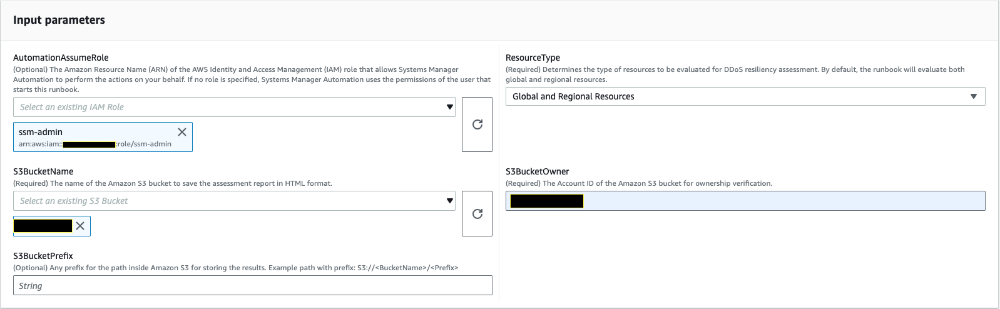
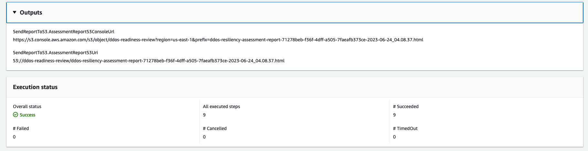

# `AWSPremiumSupport-DDoSResiliencyAssessment`

**Description**

The `AWSPremiumSupport-DDoSResiliencyAssessment`, AWS Systems Manager automation
runbook helps you to check DDoS vulnerabilities and configuration of resources in
accordance with the AWS Shield Advanced protection for your AWS account. It provides a
configuration settings report for resources that are vulnerable to Distributed Denial of Service
(DDoS) attacks. It is used to collect, analyze, and assess the following
resources: Amazon Route 53, Amazon Load Balancers, Amazon CloudFront distributions, AWS Global Accelerator and
AWS Elastic IPs for their configuration settings in accordance with the
recommended best practices for AWS Shield Advanced Protection. The final configuration
report is available in an Amazon S3 bucket of your choice as an HTML file.

**How does it work?**

This runbook contains a series of checks for the various types of resources that are
enabled for public access and if they have protections configured as per the
recommendations in the [AWS DDoS Best Practices Whitepaper](../../../pdfs/whitepapers/latest/aws-best-practices-ddos-resiliency/aws-best-practices-ddos-resiliency.md "../../../pdfs/whitepapers/latest/aws-best-practices-ddos-resiliency/aws-best-practices-ddos-resiliency.md"). The runbook performs the
following:

- Checks if a subscription to AWS Shield Advanced is enabled.
- If enabled, it finds if there are any Shield Advanced protected
  resources.
- It finds all the global and regional resources in the AWS account
  and checks if these are Shield protected.
- It requires the Resource Type parameters for assessment, Amazon S3 bucket
  name, and the Amazon S3 bucket AWS account ID (S3BucketOwner).
- It returns the findings as an HTML report stored in the Amazon S3 bucket
  provided.
  The input parameters `AssessmentType` decides if the checks on all
  resources will be performed. By default, the runbook checks for all types of
  resources. If only `GlobalResources` or `RegionalResources`
  parameter is selected, the runbook performs checks only on the selected resource
  types.

###### Important

- Access to `AWSPremiumSupport-*` runbooks requires
  a Business + Support, Enterprise Support or Unified Operations Subscription. For more
  information, see [Compare
  AWS Support Plans](https://aws.amazon.com/premiumsupport/plans/ "https://aws.amazon.com/premiumsupport/plans/").
- This runbook requires an `ACTIVE`
  [AWS Shield Advanced
  subscription.](../../../waf/latest/developerguide/enable-ddos-prem.md "../../../waf/latest/developerguide/enable-ddos-prem.md")

[Run this Automation (console)](https://console.aws.amazon.com/systems-manager/automation/execute/AWSPremiumSupport-DDoSResiliencyAssessment "https://console.aws.amazon.com/systems-manager/automation/execute/AWSPremiumSupport-DDoSResiliencyAssessment")

**Document type**

Automation

**Owner**

Amazon

**Platforms**

Linux, macOS, Windows

**Parameters**

- AutomationAssumeRole

Type: String

Description: (Optional) The Amazon Resource Name (ARN) of the AWS Identity and Access Management
(IAM) role that allows Systems Manager Automation to perform the actions on your
behalf. If no role is specified, Systems Manager Automation uses the permissions of
the user that starts this runbook.

- AssessmentType

Type: String

Description: (Optional) Determines the type of resources to be
evaluated for DDoS resiliency assessment. By default, the runbook
will evaluate both global and regional resources. For regional
resources, the runbook describes all Application (ALB) and Network
(NLB) load balancers as well as all the Auto Scaling group in your
AWS account/region.

Valid values: `['Global Resources', 'Regional Resources', 'Global
 and Regional Resources']`

Default: Global and Regional Resources

- S3BucketName

Type: `AWS::S3::Bucket::Name`

Description: (Required) The Amazon S3 bucket name where the report will be
uploaded.

Allowed Pattern: `^[0-9a-z][a-z0-9\-\.]{3,63}$`

- S3BucketOwnerAccount

Type: String

Description: (Optional) The AWS account that owns the Amazon S3 bucket.
Please specify this parameter if the Amazon S3 bucket belongs to a
different AWS account, otherwise you can leave this parameter
empty.

Allowed Pattern: `^$|^[0-9]{12,13}$`

- S3BucketOwnerRoleArn

Type: `AWS::IAM::Role::Arn`

Description: (Optional) The ARN of an IAM role with permissions to
describe the Amazon S3 bucket and AWS account block public access
configuration if the bucket is in a different AWS account. If this
parameter is not specified, the runbook uses the
`AutomationAssumeRole` or the IAM user that
starts this runbook (if `AutomationAssumeRole` is not
specified). Please see the required permissions section in the
runbook description.

Allowed Pattern:
`^$|^arn:(aws|aws-cn|aws-us-gov|aws-iso|aws-iso-b):iam::[0-9]{12,13}:role/.*$`

- S3BucketPrefix

Type: String

Description: (Optional) The prefix for the path inside Amazon S3 for
storing the results.

Allowed Pattern: `^[a-zA-Z0-9][-./a-zA-Z0-9]{0,255}$|^$`
**Required IAM permissions**

The `AutomationAssumeRole` parameter requires the following actions to
use the runbook successfully.

- `autoscaling:DescribeAutoScalingGroups`
- `cloudfront:ListDistributions`
- `ec2:DescribeAddresses`
- `ec2:DescribeNetworkAcls`
- `ec2:DescribeInstances`
- `elasticloadbalancing:DescribeLoadBalancers`
- `elasticloadbalancing:DescribeTargetGroups`
- `globalaccelerator:ListAccelerators`
- `iam:GetRole`
- `iam:ListAttachedRolePolicies`
- `route53:ListHostedZones`
- `route53:GetHealthCheck`
- `shield:ListProtections`
- `shield:GetSubscriptionState`
- `shield:DescribeSubscription`
- `shield:DescribeEmergencyContactSettings`
- `shield:DescribeDRTAccess`
- `waf:GetWebACL`
- `waf:GetRateBasedRule`
- `wafv2:GetWebACL`
- `wafv2:GetWebACLForResource`
- `waf-regional:GetWebACLForResource`
- `waf-regional:GetWebACL`
- `s3:ListBucket`
- `s3:GetBucketAcl`
- `s3:GetBucketLocation`
- `s3:GetBucketPublicAccessBlock`
- `s3:GetBucketPolicyStatus`
- `s3:GetBucketEncryption`
- `s3:GetAccountPublicAccessBlock`
- `s3:PutObject`

**Example IAM Policy for the Automation Assume Role**

JSON

```
`{
 "Version":"2012-10-17",
 "Statement": [
 {
 "Action": [
 "s3:ListBucket",
 "s3:GetBucketAcl",
 "s3:GetAccountPublicAccessBlock"
 ],
 "Resource": "*",
 "Effect": "Allow"
 },
 {
 "Action": [
 "s3:ListBucket",
 "s3:GetBucketAcl",
 "s3:GetBucketLocation",
 "s3:GetBucketPublicAccessBlock",
 "s3:GetBucketPolicyStatus",
 "s3:GetEncryptionConfiguration"
 ],
 "Resource": "arn:aws:s3:::<bucket-name>",
 "Effect": "Allow"
 },
 {
 "Action": [
 "s3:PutObject"
 ],
 "Resource": "arn:aws:s3:::<bucket-name>/*",
 "Effect": "Allow"
 },
 {
 "Action": [
 "autoscaling:DescribeAutoScalingGroups",
 "cloudfront:ListDistributions",
 "ec2:DescribeInstances",
 "ec2:DescribeAddresses",
 "ec2:DescribeNetworkAcls",
 "elasticloadbalancing:DescribeLoadBalancers",
 "elasticloadbalancing:DescribeTargetGroups",
 "globalaccelerator:ListAccelerators",
 "iam:GetRole",
 "iam:ListAttachedRolePolicies",
 "route53:ListHostedZones",
 "route53:GetHealthCheck",
 "shield:ListProtections",
 "shield:GetSubscriptionState",
 "shield:DescribeSubscription",
 "shield:DescribeEmergencyContactSettings",
 "shield:DescribeDRTAccess",
 "waf:GetWebACL",
 "waf:GetRateBasedRule",
 "wafv2:GetWebACL",
 "wafv2:GetWebACLForResource",
 "waf-regional:GetWebACLForResource",
 "waf-regional:GetWebACL"
 ],
 "Resource": "*",
 "Effect": "Allow"
 },
 {
 "Action": "iam:PassRole",
 "Resource": "arn:aws:iam::`111122223333`:role/`automation-assume-role-name`",
 "Effect": "Allow"
 }
 ]
 }`

```

**Instructions**

1. Navigate to the [AWSPremiumSupport-DDoSResiliencyAssessment](https://console.aws.amazon.com/systems-manager/automation/execute/AWSPremiumSupport-DDoSResiliencyAssessment "https://console.aws.amazon.com/systems-manager/automation/execute/AWSPremiumSupport-DDoSResiliencyAssessment") in the
   AWS Systems Manager Console.
2. Select **Execute Automation**
3. For input parameters, enter the following:
   - **AutomationAssumeRole
     (Optional):**

   The Amazon Resource Name (ARN) of the AWS Identity and Access Management
   (IAM) role that allows Systems Manager Automation to perform
   the actions on your behalf. If no role is specified,
   Systems Manager Automation uses the permissions of the user
   that starts this runbook.
   - **AssessmentType
     (Optional):**

   Determines the type of resources to evaluate for
   DDoS resiliency assessment. By default, the
   runbook evaluates both global and regional
   resources.
   - **S3BucketName
     (Required):**

   The name of the Amazon S3 bucket to save the assessment
   report in HTML format.
   - **S3BucketOwner
     (Optional):**

   The AWS account ID of the Amazon S3 bucket for ownership
   verification. The AWS account ID is required if
   the report needs to publish to a cross-account Amazon S3
   bucket and optional if the Amazon S3 bucket is in the
   same AWS account as automation initiation.
   - **S3BucketPrefix
     (Optional):**

   Any prefix for the path inside Amazon S3 for storing the
   results.

 4. Select **Execute**. 5. The automation initiates. 6. The document performs the following steps:

    * **CheckShieldAdvancedState:**


    Verifies whether the AWS account is subscribed to AWS Shield Advanced
     and if the runbook has access to the Amazon S3 bucket.
    * **S3BucketSecurityChecks:**


    Checks if the Amazon S3 bucket specified in the
     "S3BucketName" allows anonymous, or public read or
     write access permissions, whether the bucket has
     encryption at rest enabled, and if the AWS account
     ID provided in "S3BucketOwner" is the owner of the
     Amazon S3 bucket.
    * **BranchOnShieldAdvancedStatus:**


    Branches document steps based on the AWS Shield Advanced
     Subscription status and/or Amazon S3 Bucket Ownership
     status.
    * **ShieldAdvancedConfigurationReview:**


    Reviews Shield Advanced configurations to ensure minimum
     required details are present. For example: IAM
     Access for AWS Shield Response Team (SRT) Team, Contact List
     Details, and SRT Proactive Engagement
     Status.
    * **ListShieldAdvancedProtections:**


    Lists the Shield Protected Resources and creates a
     group of protected resources for each
     service.
    * **BranchOnResourceTypeAndCount:**


    Branches document steps based on the value of Resource
     Type parameter and the number of Shield protected
     global resources.
    * **ReviewGlobalResources:**


    Reviews the Shield Advanced protected Global resources like
     Route 53 Hosted Zones, CloudFront Distributions and
     Global Accelerators.
    * **BranchOnResourceType:**


    Branches document steps based on the Resource type
     selections, if Global, Regional, or both.
    * **ReviewRegionalResources:**


    Reviews the Shield Advanced protected Regional resources like
     Application Load Balancers, Network Load Balancers, Classic Load Balancers, Amazon Elastic Compute Cloud (Amazon EC2) Instances
     (Elastic IPs).
    * **SendReportToS3:**


    Uploads the DDoS Assessment Report details to the
     Amazon S3 bucket.

7. After completed, the URI for the assessment report HTML file is
   provided in the Amazon S3 bucket:

**S3 Console link and Amazon S3 URI for the Report on
successful execution of the runbook**



**References**

Systems Manager Automation

- [Run this Automation (console)](https://console.aws.amazon.com/systems-manager/automation/execute/AWSPremiumSupport-DDoSResiliencyAssessment "https://console.aws.amazon.com/systems-manager/automation/execute/AWSPremiumSupport-DDoSResiliencyAssessment")
- [Run an automation](../../../systems-manager/latest/userguide/automation-working-executing.md "../../../systems-manager/latest/userguide/automation-working-executing.md")
- [Setting up an Automation](../../../systems-manager/latest/userguide/automation-setup.md "../../../systems-manager/latest/userguide/automation-setup.md")
- [Support
  Automation Workflows landing page](https://aws.amazon.com/premiumsupport/technology/saw/ "https://aws.amazon.com/premiumsupport/technology/saw/")
  AWS service documentation

- [AWS Shield Advanced](../../../waf/latest/developerguide/ddos-advanced-summary.md "../../../waf/latest/developerguide/ddos-advanced-summary.md")
