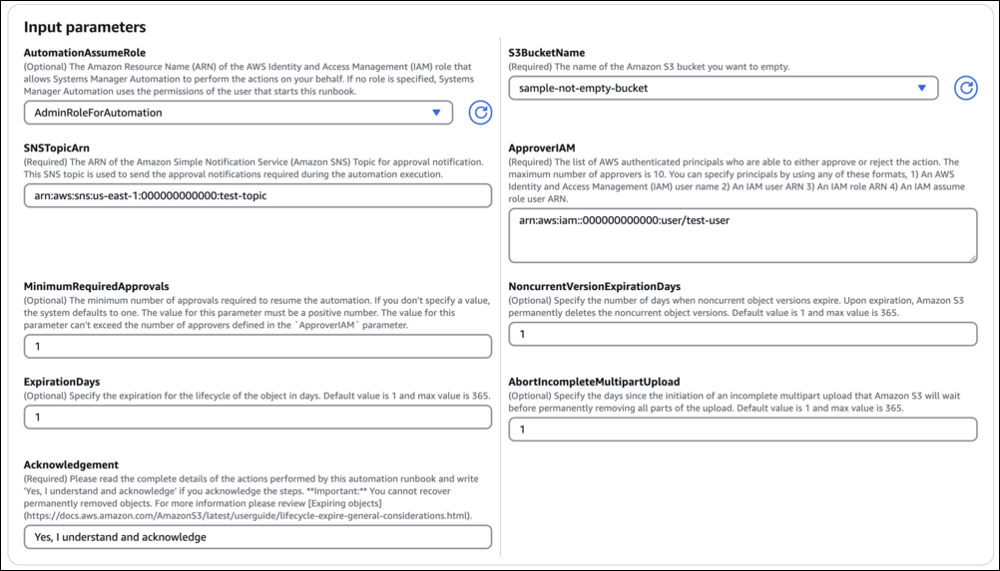
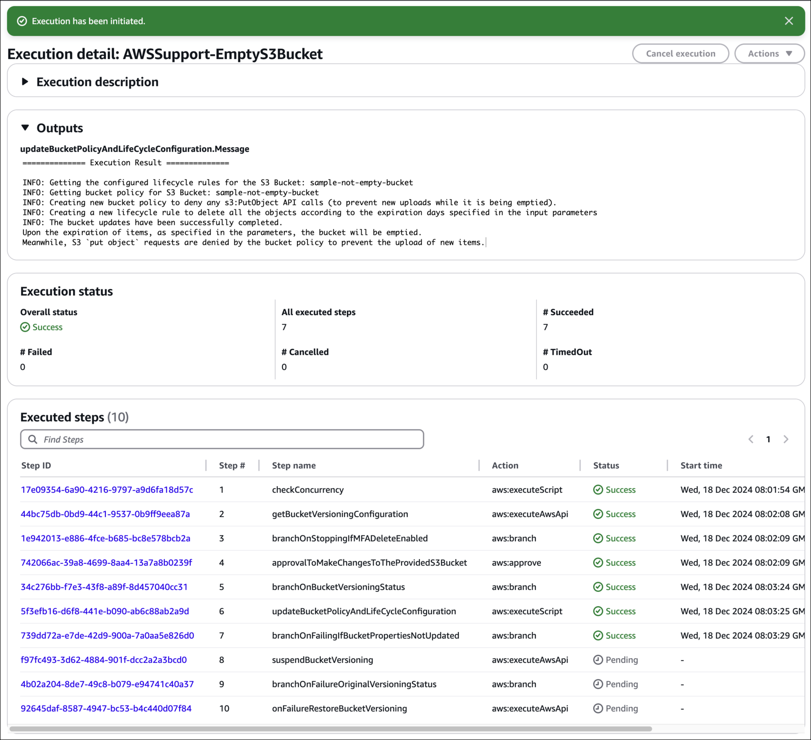
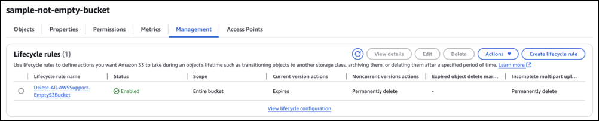

# `AWSSupport-EmptyS3Bucket`

**Description**

The `AWSSupport-EmptyS3Bucket` automation runbook empties an existing Amazon Simple Storage Service
(Amazon S3) bucket by using a lifecycle expiration configuration rule.

###### Important

- Amazon S3 buckets with Multi-factor Authentication (MFA) enabled are not
  supported.
- The lifecycle rules modified by this runbook permanently delete all objects
  and their versions in the specified Amazon S3 bucket. You cannot recover permanently
  deleted objects. For more information, review [Expiring Objects](../../../AmazonS3/latest/userguide/lifecycle-expire-general-considerations.md "../../../AmazonS3/latest/userguide/lifecycle-expire-general-considerations.md").

**How does it work?**

The runbook `AWSSupport-EmptyS3Bucket` performs the following high-level
steps:

- Suspends bucket versioning, if enabled.
- Updates the bucket policy to deny any `s3:PutObject` API calls (to
  prevent new uploads while it is being emptied).
- Updates the lifecycle rules to delete all the objects according to the expiration
  days specified in the input parameters.

###### Note

- Object versions protected with Amazon S3 Object Lock are not deleted or overwritten
  by lifecycle configurations.
- The deletion process is asynchronous and may take time to complete after the
  runbook execution finishes.

[Run this Automation (console)](https://console.aws.amazon.com/systems-manager/automation/execute/AWSSupport-EmptyS3Bucket "https://console.aws.amazon.com/systems-manager/automation/execute/AWSSupport-EmptyS3Bucket")

**Document type**

Automation

**Owner**

Amazon

**Platforms**

/

**Required IAM permissions**

The `AutomationAssumeRole` parameter requires the following actions to
use the runbook successfully.

The AutomationAssumeRole parameter requires the following actions to successfully use the
runbook:

- ssm:DescribeAutomationExecutions
- ssm:GetAutomationExecution
- s3:GetBucketVersioning
- s3:PutBucketVersioning
- s3:GetBucketPolicy
- s3:GetBucketLifecycleConfiguration
- s3:GetLifecycleConfiguration
- s3:PutBucketPolicy
- s3:PutBucketLifecycleConfiguration
- s3:PutLifecycleConfiguration
- s3:DeleteBucketPolicy
- s3:DeleteBucketLifecycle

**Instructions**

Follow these steps to configure the automation:

1.  Navigate to [`AWSSupport-EmptyS3Bucket`](https://console.aws.amazon.com/systems-manager/documents/AWSSupport-EmptyS3Bucket/description "https://console.aws.amazon.com/systems-manager/documents/AWSSupport-EmptyS3Bucket/description") in Systems Manager under
    Documents.
2.  Select Execute automation.
3.  For the input parameters, enter the following:
    - **AutomationAssumeRole (Optional):**

    The Amazon Resource Name (ARN) of the AWS AWS Identity and Access Management (IAM) role that
    allows Systems Manager Automation to perform the actions on your behalf. If no role is
    specified, Systems Manager Automation uses the permissions of the user who starts this
    runbook.
    - **S3BucketName:**

    The name of the Amazon S3 bucket you want to empty.
    - **SNSTopicArn:**

    Provide the ARN of the Amazon SNS Topic for approval notification. This Amazon SNS
    topic is used to send approval notifications during required during the
    automation execution.
    - **ApproverIAM:**

    Provide a list of AWS authenticated principals who are able to either
    approve or reject the action. The maximum number of approvers is
    `10`. You can specify principals by using any of these
    formats, an AWS Identity and Access Management (IAM) user name, an IAM user ARN, an IAM role
    ARN, or an IAM assume role user ARN.
    - **MinimumRequiredApprovals
      (Optional):**

    The minimum number of approvals required to resume the automation. If you
    don't specify a value, the system defaults to `1`. The value for
    this parameter must be a positive number. The value for this parameter can't
    exceed the number of approvers defined by the ApproverIAM parameter.
    - **NoncurrentVersionExpirationDays
      (Optional):**

    Specify the number of days when noncurrent object versions expire. Upon
    expiration, Amazon S3 permanently deletes the noncurrent object versions.

        + Default: `1`
        + Maximum Value: `365`

    - **ExpirationDays (Optional):**

    Specify the expiration for the lifecycle of the object in the form
    days.

        + Default: `1`
        + Maximum Value: `365`

    - **AbortIncompleteMultipartUpload
      (Optional):**

    Specify the days since the initiation of an incomplete multipart upload
    that Amazon S3 will wait before permanently removing all parts of the
    upload.

        + Default: `1`
        + Maximum Value: `365`

    - **Acknowledgement:**

    Please read the complete details of the actions performed by this
    automation runbook and provide consent `Yes, I understand and
 acknowledge` if you acknowledge the steps.

 4. Select Execute. 5. The automation initiates. 6. The document performs the following steps:

    * **`checkConcurrency`**:

    Ensures there is only one execution of this runbook targeting the
     specified Amazon S3 bucket. If the runbook finds another in progress execution
     targeting the same bucket name, it returns an error and ends.
    * **`getBucketVersioningConfiguration`**:

    Fetches the versioning status of the specified Amazon S3 bucket.
    * **`branchOnStoppingIfMFADeleteEnabled`**
     (conditional):

    Stops the automation if Multi-factor Authentication (MFA) is enabled on
     the specified Amazon S3 bucket.
    * **`approvalToMakeChangesToTheProvidedS3Bucket`**:

    Waits for designated principals approval to disable bucket versioning and
     update the bucket policy and lifecycle rules configuration for the specified
     Amazon S3 bucket.
    * **`branchOnBucketVersioningStatus`**
     (conditional):

    If versioning is enabled on the specified Amazon S3 bucket, disable it,
     otherwise continue to update bucket policy and lifecycle
     configuration.
    * **`suspendBucketVersioning`**:

    Suspends the versioning state of the specified Amazon S3 bucket.
    * **`updateBucketPolicyAndLifeCycleConfiguration`**:

    Adds or updates the bucket policy to deny all `s3:PutObject`
     requests and updates the lifecycle configuration to expire objects based on
     the user provided inputs parameters.
    * **`branchOnFailingIfBucketPropertiesNotUpdated`**
     (conditional):

    Checks the status of the
     `updateBucketPolicyAndLifeCycleConfiguration` step and tries
     to revert the original bucket versioning state if changed by
     automation.
    * **`branchOnFailureOriginalVersioningStatus`**
     (conditional):

    On failure, branches to determine the original versioning status. If was
     enabled and suspended by this automation, tries to enable it again.
    * **`onFailureRestoreBucketVersioning`**

    Restores the enabled versioning state of the specified Amazon S3 bucket.

7. After completed, review the Outputs section for the detailed results of the
   execution:

    * **Successful execution**

    This workflow updates the bucket's lifecycle rule. Objects will be deleted
     according to the `Delete-All-AWSSupport-EmptyS3-Bucket` lifecycle
     policy.

    
    * **Failure execution**

    Partial deletion will not be performed. If execution fails, the lifecycle
     and other bucket settings are rolled back.

**References**

Systems Manager Automation

- [Run this
  Automation (console)](https://console.aws.amazon.com/systems-manager/documents/AWSSupport-EmptyS3Bucket/description "https://console.aws.amazon.com/systems-manager/documents/AWSSupport-EmptyS3Bucket/description")
- [Run an
  automation](../../../systems-manager/latest/userguide/automation-working-executing.md "../../../systems-manager/latest/userguide/automation-working-executing.md")
- [Setting up an
  Automation](../../../systems-manager/latest/userguide/automation-setup.md "../../../systems-manager/latest/userguide/automation-setup.md")
- [Support Automation
  Workflows](https://aws.amazon.com/premiumsupport/technology/saw/ "https://aws.amazon.com/premiumsupport/technology/saw/")
  For more information on managing Amazon S3 buckets and objects, see [Emptying a bucket](../../../AmazonS3/latest/userguide/empty-bucket.md "../../../AmazonS3/latest/userguide/empty-bucket.md").
