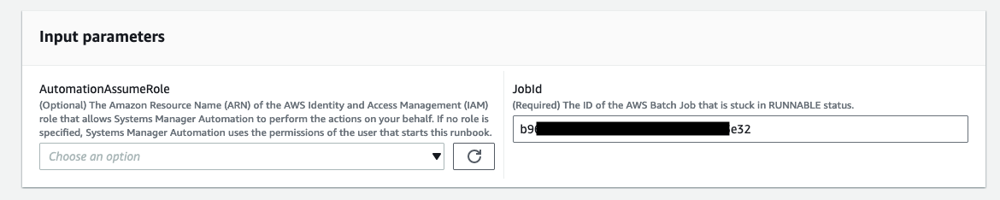
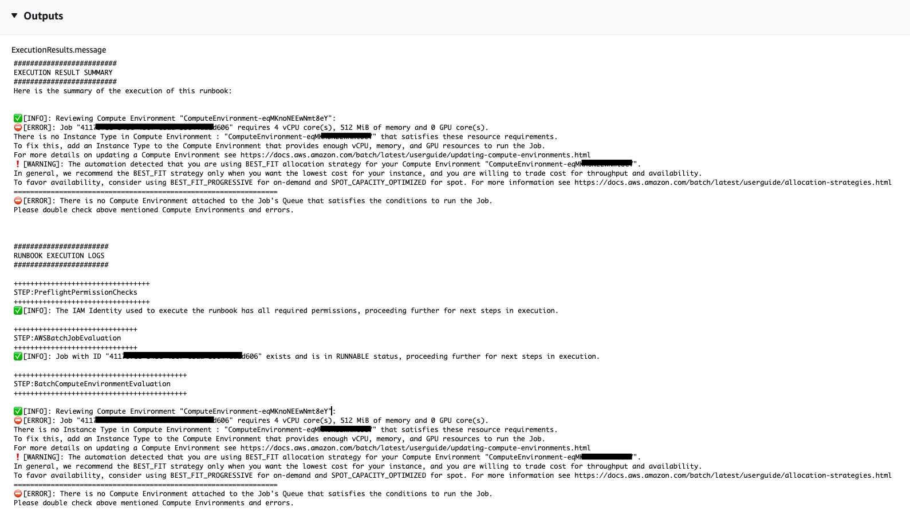

# `AWSSupport-TroubleshootAWSBatchJob`

**Description**

The `AWSSupport-TroubleshootAWSBatchJob` runbook helps you to troubleshoot
issues that prevent an AWS Batch job from progressing from `RUNNABLE` to
`STARTING` status.

**How does it work?**

This runbook performs the following checks:

- If the compute environment is in an `INVALID` or
  `DISABLED` state.
- If the compute environment’s `Max vCPU` parameter is large
  enough to accommodate the job volume in the job queue.
- If the jobs require more vCPUs or memory resources than what the
  compute environment’s instance types can provide.
- If the jobs should run on GPU-based instances but the compute
  environment is not configured to use GPU-based instances.
- If the Auto Scaling group for the compute environment failed to launch
  instances.
- If the launched instances can join the underlying Amazon Elastic Container Service (Amazon ECS) cluster;
  if not, it runs the [AWSSupport-TroubleshootECSContainerInstance](automation-aws-troubleshoot-ecs-container-instance.md "automation-aws-troubleshoot-ecs-container-instance.md")
  runbook.
- If any permissions issue is blocking specific actions that are
  required to run the job.

###### Important

- This runbook must be initiated in the same AWS Region as
  your job that is stuck in `RUNNABLE`
  status.
- This runbook can be initiated for AWS Batch jobs scheduled on
  Amazon ECS, AWS Fargate or Amazon Elastic Compute Cloud (Amazon EC2) instances. If the
  automation is initiated for an AWS Batch job on Amazon Elastic Kubernetes Service
  (Amazon EKS), the initiation stops.
- If instances are available to run the job but fail to register
  the Amazon ECS cluster, this runbook initiates the
  `AWSSupport-TroubleshootECSContainerInstance`
  automation runbook to try determine why. For more
  information, reference the [AWSSupport-TroubleshootECSContainerInstance](automation-aws-troubleshoot-ecs-container-instance.md "automation-aws-troubleshoot-ecs-container-instance.md")
  runbook.

[Run this Automation (console)](https://console.aws.amazon.com/systems-manager/automation/execute/AWSSupport-TroubleshootAWSBatchJob "https://console.aws.amazon.com/systems-manager/automation/execute/AWSSupport-TroubleshootAWSBatchJob")

**Document type**

Automation

**Owner**

Amazon

**Platforms**

Linux, macOS, Windows

**Parameters**

- AutomationAssumeRole

Type: String

Description: (Optional) The Amazon Resource Name (ARN) of the AWS Identity and Access Management
(IAM) role that allows Systems Manager Automation to perform the actions on your
behalf. If no role is specified, Systems Manager Automation uses the permissions of
the user that starts this runbook.

- JobId

Type: String

Description: (Required) The ID of the AWS Batch Job that is stuck in
`RUNNABLE` status.

Allowed Pattern:
`^[a-f0-9]{8}(-[a-f0-9]{4}){3}-[a-f0-9]{12}(:[0-9]+)?(#[0-9]+)?$`
**Required IAM permissions**

The `AutomationAssumeRole` parameter requires the following actions to
use the runbook successfully.

- `autoscaling:DescribeAutoScalingGroups`
- `autoscaling:DescribeScalingActivities`
- `batch:DescribeComputeEnvironments`
- `batch:DescribeJobs`
- `batch:DescribeJobQueues`
- `batch:ListJobs`
- `cloudtrail:LookupEvents`
- `ec2:DescribeIamInstanceProfileAssociations`
- `ec2:DescribeInstanceAttribute`
- `ec2:DescribeInstances`
- `ec2:DescribeInstanceTypeOfferings`
- `ec2:DescribeInstanceTypes`
- `ec2:DescribeNetworkAcls`
- `ec2:DescribeRouteTables`
- `ec2:DescribeSecurityGroups`
- `ec2:DescribeSpotFleetInstances`
- `ec2:DescribeSpotFleetRequests`
- `ec2:DescribeSpotFleetRequestHistory`
- `ec2:DescribeSubnets`
- `ec2:DescribeVpcEndpoints`
- `ec2:DescribeVpcs`
- `ecs:DescribeClusters`
- `ecs:DescribeContainerInstances`
- `ecs:ListContainerInstances`
- `iam:GetInstanceProfile`
- `iam:GetRole`
- `iam:ListRoles`
- `iam:PassRole`
- `iam:SimulateCustomPolicy`
- `iam:SimulatePrincipalPolicy`
- `ssm:DescribeAutomationExecutions`
- `ssm:DescribeAutomationStepExecutions`
- `ssm:GetAutomationExecution`
- `ssm:StartAutomationExecution`
- `sts:GetCallerIdentity`

**Instructions**

1. Navigate to the [AWSSupport-TroubleshootAWSBatchJob](https://console.aws.amazon.com/systems-manager/automation/execute/AWSSupport-TroubleshootAWSBatchJob "https://console.aws.amazon.com/systems-manager/automation/execute/AWSSupport-TroubleshootAWSBatchJob") in the AWS Systems Manager
   Console.
2. Select **Execute Automation**
3. For input parameters, enter the following:
   - **AutomationAssumeRole
     (Optional):**

   The Amazon Resource Name (ARN) of the AWS Identity and Access Management
   (IAM) role that allows Systems Manager Automation to perform
   the actions on your behalf. If no role is specified,
   Systems Manager Automation uses the permissions of the user
   that starts this runbook.
   - **JobId
     (Required):**

   The ID of the AWS Batch Job that is stuck in the
   `RUNNABLE` status.

 4. Select **Execute**. 5. Notice that the automation initiates. 6. The document performs the following steps:

    * **PreflightPermissionChecks:**

    Performs preflight IAM permission checks against the
     initiating user/role. If there are any missing
     permissions, this step provides the API Actions
     missing in the global output section.
    * **ProceedOnlyIfUserHasPermission:**

    Branches based on if you have permissions to all
     required actions for the runbook.
    * **AWSBatchJobEvaluation:**

    Performs checks against the AWS Batch Job verifying it
     exists and is in the `RUNNABLE`
     status.
    * **ProceedOnlyIfBatchJobExistsAndIsinRunnableState:**

    Branches based on if the jobs exists and is in the
     `RUNNABLE` status.
    * **BatchComputeEnvironmentEvaluation:**

    Performs checks against the AWS Batch Compute
     Environment.
    * **ProceedOnlyIfComputeEnvironmentChecksAreOK:**

    Branches based on if compute environment checks
     succeeded.
    * **UnderlyingInfraEvaluation:**

    Performs checks against the underlying Auto Scaling
     Group or Spot Fleet Request.
    * **ProceedOnlyIfInstancesNotJoiningEcsCluster:**

     Branches based on if there are instances not joining
     the Amazon ECS cluster.
    * **EcsAutomationRunner:**

    Runs the Amazon ECS automation for the instances not
     joining the cluster.
    * **ExecutionResults:**

    Generates output based on previous steps.

7. After completing, the URI for the assessment report HTML file is
   provided:

**S3 Console link and Amazon S3 URI for the Report on
successful execution of the runbook**

**References**

Systems Manager Automation

- [Run this Automation (console)](https://console.aws.amazon.com/systems-manager/automation/execute/AWSSupport-TroubleshootAWSBatchJob "https://console.aws.amazon.com/systems-manager/automation/execute/AWSSupport-TroubleshootAWSBatchJob")
- [Run an automation](../../../systems-manager/latest/userguide/automation-working-executing.md "../../../systems-manager/latest/userguide/automation-working-executing.md")
- [Setting up an Automation](../../../systems-manager/latest/userguide/automation-setup.md "../../../systems-manager/latest/userguide/automation-setup.md")
- [Support
  Automation Workflows landing page](https://aws.amazon.com/premiumsupport/technology/saw/ "https://aws.amazon.com/premiumsupport/technology/saw/")
