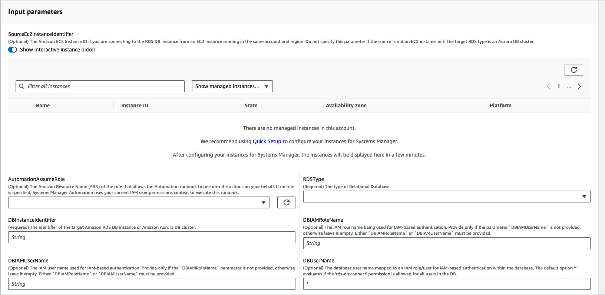
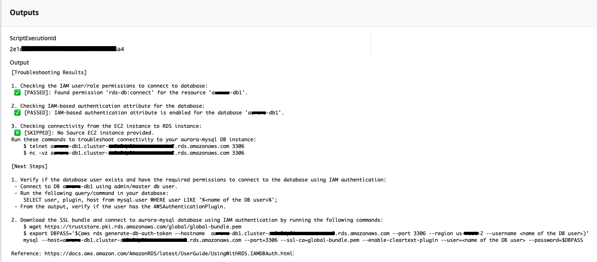

# `AWSSupport-TroubleshootRDSIAMAuthentication`

**Description**

The `AWSSupport-TroubleshootRDSIAMAuthentication` helps troubleshoot
AWS Identity and Access Management (IAM) authentication for Amazon RDS for PostgreSQL, Amazon RDS for MySQL,
Amazon RDS for MariaDB, Amazon Aurora PostgreSQL, and Amazon Aurora MySQL instances. Use this runbook to
verify the configuration required for IAM authentication with an Amazon RDS instance or
Aurora Cluster. It also provides steps to rectify the connectivity issues to the
Amazon RDS Instance or Aurora Cluster.

###### Important

This runbook does not support Amazon RDS for Oracle or Amazon RDS for Microsoft SQL Server.

###### Important

If a source Amazon EC2 Instance is provided and the target Database is Amazon RDS, a
child automation `AWSSupport-TroubleshootConnectivityToRDS` is
invoked to troubleshoot TCP connectivity. The output also provides commands
you can run on your Amazon EC2 instance or source machine to connect to the Amazon RDS
instances using IAM authentication.

**How does it work?**

This runbook consists of six steps:

- **Step 1: validateInputs:** Validates the
  inputs to the automation.
- **Step 2: branchOnSourceEC2Provided:** Verifies if a source Amazon EC2 Instance ID is provided in the
  input parameters.
- **Step 3: validateRDSConnectivity:**
  Validates Amazon RDS connectivity from the source Amazon EC2 instance if
  provided.
- **Step 4: validateRDSIAMAuthentication:** Validates if the IAM Authentication feature is
  enabled.
- **Step 5: validateIAMPolicies:** Verifies
  if the required IAM permissions are present in the IAM user/role
  provided.
- **Step 6: generateReport:** Generates a
  report of the results of the previously executed steps.

[Run this Automation (console)](https://console.aws.amazon.com/systems-manager/automation/execute/AWSSupport-TroubleshootRDSIAMAuthentication "https://console.aws.amazon.com/systems-manager/automation/execute/AWSSupport-TroubleshootRDSIAMAuthentication")

**Document type**

Automation

**Owner**

Amazon

**Platforms**

Linux

**Parameters**

- AutomationAssumeRole

Type: String

Description: (Optional) The Amazon Resource Name (ARN) of the AWS Identity and Access Management
(IAM) role that allows Systems Manager Automation to perform the actions on your
behalf. If no role is specified, Systems Manager Automation uses the permissions of
the user that starts this runbook.

- RDSType

Type: String

Description: (Required): Select the type of relational database to
which you are trying to connect and authenticate.

Allowed Values: `Amazon RDS` or `Amazon Aurora
 Cluster.`

- DBInstanceIdentifier

Type: String

Description: (Required) The identifier of the target Amazon RDS Database
Instance or Aurora Database Cluster.

Allowed Pattern: `^[A-Za-z0-9]+(-[A-Za-z0-9]+)*$`

Max Characters: 63

- SourceEc2InstanceIdentifier

Type: `AWS::EC2::Instance::Id`

Description: (Optional) The Amazon EC2 Instance ID if you are connecting to
the Amazon RDS Database Instance from an Amazon EC2 Instance running in the
same account and region. Do not specify this parameter if the source
is not an Amazon EC2 instance or if the target Amazon RDS type is an Aurora
Database Cluster.

Default: `""`

- DBIAMRoleName

Type: String

Description: (Optional) The IAM role name being used for IAM-based
authentication. Provide only if the parameter
`DBIAMUserName` is not provided, otherwise leave
it empty. Either `DBIAMRoleName` or
`DBIAMUserName` must be provided.

Allowed Pattern: `^[a-zA-Z0-9+=,.@_-]{1,64}$|^$`

Max Characters: 64

Default: `""`

- DBIAMUserName

Type: String

Description: (Optional) The IAM user name used for IAM-based
authentication. Provide only if the `DBIAMRoleName`
parameter is not provided, otherwise leave it empty. Either
`DBIAMRoleName` or `DBIAMUserName`
must be provided.

Allowed Pattern: `^[a-zA-Z0-9+=,.@_-]{1,64}$|^$`

Max Characters: 64

Default: `""`

- DBUserName

Type: String

Description: (Optional) The database user name mapped to an IAM
role/user for IAM-based authentication within the database. The
default option `*` evaluates if the
`rds-db:connect` permission is allowed for all
users in the Database.

Allowed Pattern: `^[a-zA-Z0-9+=,.@*_-]{1,64}$`

Max Characters: 64

Default: `*`
**Required IAM permissions**

The `AutomationAssumeRole` parameter requires the following actions to
use the runbook successfully.

- `ec2:DescribeInstances`
- `ec2:DescribeNetworkAcls`
- `ec2:DescribeRouteTables`
- `ec2:DescribeSecurityGroups`
- `ec2:DescribeSubnets`
- `iam:GetPolicy`
- `iam:GetRole`
- `iam:GetUser`
- `iam:ListAttachedRolePolicies`
- `iam:ListAttachedUserPolicies`
- `iam:ListRolePolicies`
- `iam:ListUserPolicies`
- `iam:SimulatePrincipalPolicy`
- `rds:DescribeDBClusters`
- `rds:DescribeDBInstances`
- `ssm:DescribeAutomationStepExecutions`
- `ssm:GetAutomationExecution`
- `ssm:StartAutomationExecution`

**Instructions**

1. Navigate to the [AWSSupport-TroubleshootRDSIAMAuthentication](https://console.aws.amazon.com/systems-manager/automation/execute/AWSSupport-TroubleshootRDSIAMAuthentication "https://console.aws.amazon.com/systems-manager/automation/execute/AWSSupport-TroubleshootRDSIAMAuthentication") in the
   AWS Systems Manager Console.
2. Select **Execute Automation**
3. For input parameters, enter the following:
   - **AutomationAssumeRole
     (Optional):**

   The Amazon Resource Name (ARN) of the AWS Identity and Access Management
   (IAM) role that allows Systems Manager Automation to perform
   the actions on your behalf. If no role is specified,
   Systems Manager Automation uses the permissions of the user
   that starts this runbook.
   - **RDSType
     (Required):**

   Select the type of Amazon RDS to which you are trying to
   connect and authenticate. Choose from the two
   allowed values: `Amazon RDS` or
   `Amazon Aurora Cluster.`
   - **DBInstanceIdentifier
     (Required):**

   Enter the identifier of the target Amazon RDS Database
   Instance or the Aurora Cluster to which you are
   trying to connect and use IAM credentials for
   authentication.
   - **SourceEc2InstanceIdentifier
     (Optional):**

   Provide the Amazon EC2 Instance ID if you are connecting to
   the Amazon RDS Database Instance from an Amazon EC2 Instance
   present in the same account and region. Leave blank
   if the source is not Amazon EC2 or if the target Amazon RDS
   type is an Aurora Cluster.
   - **DBIAMRoleName
     (Optional):**

   Enter the IAM Role name used for IAM-Based
   authentication. Provide only if
   `DBIAMUserName` is not provided;
   otherwise, leave blank. Either
   `DBIAMRoleName` or
   `DBIAMUserName` must be
   provided.
   - **DBIAMUserName
     (Optional):**

   Enter the IAM User used for IAM-Based
   authentication. Provide only if
   `DBIAMRoleName` is not provided,
   otherwise, leave blank. Either
   `DBIAMRoleName` or
   `DBIAMUserName` must be
   provided.
   - **DBUserName
     (Optional):**

   Enter the database user mapped to an IAM role/user
   for IAM-Based authentication within the database.
   The default option `*` is used to
   evaluate; nothing is provided in this field.

 4. Select **Execute**. 5. Notice that the automation initiates. 6. The document performs the following steps:

    * **Step 1:
     validateInputs:**

    Validates the inputs to the automation -
     `SourceEC2InstanceIdentifier`
     (optional), `DBInstanceIdentifier` or
     `ClusterID`, and
     `DBIAMRoleName` or
     `DBIAMUserName`. It verifies if the
     input parameters entered are present in your account
     and region. It also verifies if the user entered one
     of the IAM parameters (for example,
     `DBIAMRoleName` or
     `DBIAMUserName`). Additionally, it
     performs other verifications, such as if the
     Database mentioned is in Available status.
    * **Step 2:
     branchOnSourceEC2Provided:**

    Verifies if Source Amazon EC2 is provided in the input
     parameters and the Database is Amazon RDS. If yes, it
     proceeds to step 3. If not, it skips step 3, which
     is Amazon EC2-Amazon RDS Connectivity validation and proceeds
     to step 4.
    * **Step 3:
     validateRDSConnectivity:**

    If the Source Amazon EC2 is provided in the input
     parameters and the Database is Amazon RDS, step 2
     initiates step 3. In this step, the child automation
     `AWSSupport-TroubleshootConnectivityToRDS`
     is invoked to validate Amazon RDS connectivity from
     source Amazon EC2. The child automation runbook
     `AWSSupport-TroubleshootConnectivityToRDS`
     verifies if the required network configurations
     (Amazon Virtual Private Cloud [Amazon VPC], Security Groups, Network Access
     Control List [NACL], Amazon RDS availability) are in
     place so that you can connect from the Amazon EC2
     instance to the Amazon RDS instance.
    * **Step 4:
     validateRDSIAMAuthentication:**

    Validates if the IAM Authentication feature is
     enabled on the Amazon RDS instance or Aurora
     Cluster.
    * **Step 5:
     validateIAMPolicies:**

    Verifies if the required IAM permissions are present
     in the IAM user/role passed to enable the IAM
     credentials to authenticate into the Amazon RDS instance
     for the specified Database User (if any).
    * **Step 6:
     generateReport:**

    Obtains all the information from the previous steps
     and prints the result or the output of each step. It
     also lists the steps to refer to and perform, to
     connect to the Amazon RDS instance using the IAM
     credentials.

7. When the automation is complete, review the **Outputs** section for the detailed results:
   - **Checking the IAM User/Role
     permission to connect to
     Database:**

   Verifies if the required IAM permissions are present
   in the IAM user/role passed to enable the IAM
   credentials to authenticate into the Amazon RDS Instance
   for the specified Database User (if any).
   - **Checking IAM-Based
     Authentication Attribute for the
     Database:**

   Verifies if the feature of the IAM authentication is
   enabled for the specified Amazon RDS Database/Aurora
   Cluster.
   - **Checking Connectivity from Amazon EC2
     Instance to Amazon RDS Instance:**

   Verifies if the required network configurations
   (Amazon VPC, Security Groups, NACL, Amazon RDS availability)
   are in place so that you can connect from the Amazon EC2
   instance to the Amazon RDS Instance.
   - **Next Steps:**

   Lists the commands and steps to refer to and perform,
   to connect to the Amazon RDS Instance using the IAM
   credentials.

**References**

Systems Manager Automation

- [Run this Automation (console)](https://console.aws.amazon.com/systems-manager/automation/execute/AWSSupport-TroubleshootRDSIAMAuthentication "https://console.aws.amazon.com/systems-manager/automation/execute/AWSSupport-TroubleshootRDSIAMAuthentication")
- [Run an automation](../../../systems-manager/latest/userguide/automation-working-executing.md "../../../systems-manager/latest/userguide/automation-working-executing.md")
- [Setting up an Automation](../../../systems-manager/latest/userguide/automation-setup.md "../../../systems-manager/latest/userguide/automation-setup.md")
- [Support
  Automation Workflows landing page](https://aws.amazon.com/premiumsupport/technology/saw/ "https://aws.amazon.com/premiumsupport/technology/saw/")
