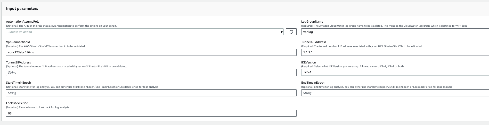
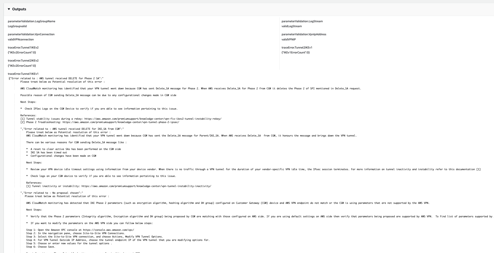

# `AWSSupport-TroubleshootVPN`

**Description**

The `AWSSupport-TroubleshootVPN` runbook helps you to trace and resolve errors
in an AWS Site-to-Site VPN connection. The automation includes several automated checks designed to
trace `IKEv1` or `IKEv2` errors related to AWS Site-to-Site VPN connection
tunnels. The automation tries to match specific errors and its corresponding resolution form
a list of common issues.

**Note:** This automation does not rectify the errors. It runs
for the mentioned time range and scans the log group for errors in [VPN CloudWatch logs
group](../../../vpn/latest/s2svpn/log-contents.md "../../../vpn/latest/s2svpn/log-contents.md").

**How does it work?**

The runbook runs a parameter validation to confirm if the Amazon CloudWatch log group included in
the input parameter exists, if there are any log streams in the log group that correspond to
VPN tunnel logging, if VPN connection id exists, and if the Tunnel IP address exists. It
makes Logs Insights API calls on your CloudWatch log group that are configured for VPN
logging.

**Document type**

Automation

**Owner**

Amazon

**Platforms**

Linux, macOS, Windows

**Parameters**

- AutomationAssumeRole

Type: String

Description: (Optional) The Amazon Resource Name (ARN) of the AWS Identity and Access Management
(IAM) role that allows Systems Manager Automation to perform the actions on your
behalf. If no role is specified, Systems Manager Automation uses the permissions of
the user that starts this runbook.

- LogGroupName

Type: String

Description: (Required) The Amazon CloudWatch log group name configured for AWS Site-to-Site VPN
connection logging

Allowed Pattern: `^[\.\-_/#A-Za-z0-9]{1,512}`

- VpnConnectionId

Type: String

Description: (Required) The AWS Site-to-Site VPN connection id to be troubleshooted.

Allowed Pattern: `^vpn-[0-9a-f]{8,17}$`

- TunnelAIPAddress

Type: String

Description: (Required) The tunnel number 1 IPv4 address associated with your
AWS Site-to-Site VPN.

Allowed Pattern:
`^((25[0-5]|2[0-4][0-9]|[01]?[0-9][0-9]?)[.]){3}(25[0-5]|2[0-4][0-9]|[01]?[0-9][0-9]?){1}$`

- TunnelBIPAddress

Type: String

Description: (Optional) The tunnel number 2 IPv4 address associated with your
AWS Site-to-Site VPN.

Allowed Pattern:
`^((25[0-5]|2[0-4][0-9]|[01]?[0-9][0-9]?)[.]){3}(25[0-5]|2[0-4][0-9]|[01]?[0-9][0-9]?){1}|^$`

- IKEVersion

Type: String

Description: (Required) Select what IKE Version you are using. Allowed values :
IKEv1, IKEv2

Valid values: `['IKEv1', 'IKEv2']`

- StartTimeinEpoch

Type: String

Description: (Optional) Start time for log analysis. You can either use
StartTimeinEpoch/EndTimeinEpoch or LookBackPeriod for logs analysis

Allowed Pattern: `^\d{10}|^$`

- EndTimeinEpoch

Type: String

Description: (Optional) End time for log analysis. You can either use
StartTimeinEpoch/EndTimeinEpoch or LookBackPeriod for logs analysis. If given both
StartTimeinEpoch/EndTimeinEpoch and LookBackPeriod then LookBackPeriod takes
precedence

Allowed Pattern: `^\d{10}|^$`

- LookBackPeriod

Type: String

Description: (Optional) Two digit time in hours to look back for log analysis.
Valid range : 01 - 99. This value takes precedence if you also give StartTimeinEpoch
and EndTime

Allowed Pattern: `^(\d?[1-9]|[1-9]0)|^$`
**Required IAM permissions**

The `AutomationAssumeRole` parameter requires the following actions to
use the runbook successfully.

- `logs:DescribeLogGroups`
- `logs:GetQueryResults`
- `logs:DescribeLogStreams`
- `logs:StartQuery`
- `ec2:DescribeVpnConnections`

**Instructions**

**Note:** This automation works on the CloudWatch log groups that is
configured for your VPN tunnel logging, when the logging Output format is JSON.

Follow these steps to configure the automation:

1.  Navigate to the [AWSSupport-TroubleshootVPN](https://console.aws.amazon.com/systems-manager/documents/AWSSupport-TroubleshootVPN/description "https://console.aws.amazon.com/systems-manager/documents/AWSSupport-TroubleshootVPN/description") in the AWS Systems Manager console.
2.  For the input parameters enter the following:

        * **AutomationAssumeRole (Optional):**

        The Amazon Resource Name (ARN) of the AWS Identity and Access Management (IAM) role that allows Systems Manager
         Automation to perform the actions on your behalf. If no role is specified,
         Systems Manager Automation uses the permissions of the user that starts this
         runbook.
        * **LogGroupName (Required):**

        The Amazon CloudWatch log group name to be validated. This must be the CloudWatch log
         group which is configured for VPN to send logs to.
        * **VpnConnectionId (Required):**

        The AWS Site-to-Site VPN connection id whose log group is traced for VPN
         error.
        * **TunnelAIPAddress (Required):**

        The tunnel A IP address associated with your AWS Site-to-Site VPN connection.
        * **TunnelBIPAddress (Optional):**

        The tunnel B IP address associated with your AWS Site-to-Site VPN connection.
        * **IKEVersion (Required):**

        Select what IKEversion you are using. Allowed values : IKEv1,
         IKEv2.
        * **StartTimeinEpoch (Optional):**

        The beginning of the time range to query for error. The range is
         inclusive, so the specified start time is included in the query. Specified
         as epoch time, the number of seconds since January 1, 1970, 00:00:00
         UTC.
        * **EndTimeinEpoch (Optional):**

        The end of the time range to query for errors. The range is inclusive, so
         the specified end time is included in the query. Specified as epoch time,
         the number of seconds since January 1, 1970, 00:00:00 UTC.
        * **LookBackPeriod (Required):**

        Time in hours to look back to query for error.

    **Note:** Configure a StartTimeinEpoch,
    EndTimeinEpoch, or LookBackPeriod to fix the time range for log analysis. Give a
    two-digit number in hours to check for errors in the past from the automation start
    time. Or, if the error is in the past within a specific time range, include
    StartTimeinEpoch and EndTimeinEpoch, instead of LookBackPeriod.

 3. Select **Execute.** 4. The automation initiates. 5. The automation runbook performs the following steps:

    * **parameterValidation:**

    Runs a series of validation on input parameters included in
     automation.
    * **branchOnValidationOfLogGroup:**

    Checks if log group mentioned in the parameter is valid. If invalid, it
     halts the further initiation of automation steps.
    * **branchOnValidationOfLogStream:**

    Checks if log stream exists in the included CloudWatch log group. If invalid, it
     halts the further initiation of automation steps.
    * **branchOnValidationOfVpnConnectionId:**

    Checks if the VPN Connection id included in the parameter is valid. If
     invalid, it halts the further initiation of automation steps.
    * **branchOnValidationOfVpnIp:**

    Checks if Tunnel IP address mentioned in parameter is valid or not. If
     invalid then it halts the further execution of automation steps.
    * **traceError:**

    Makes a logs insight API call in your included CloudWatch log group and searches
     for the error related to IKEv1/IKEv2 along with a related suggested
     resolution.

6. After completed, review the Outputs section for the detailed results of the
   execution.

**References**

Systems Manager Automation

- [Run this Automation (console)](https://console.aws.amazon.com/systems-manager/automation/execute/AWSPremiumSupport-DDoSResiliencyAssessment "https://console.aws.amazon.com/systems-manager/automation/execute/AWSPremiumSupport-DDoSResiliencyAssessment")
- [Run an
  automation](../../../systems-manager/latest/userguide/automation-working-executing.md "../../../systems-manager/latest/userguide/automation-working-executing.md")
- [Setting up an
  Automation](../../../systems-manager/latest/userguide/automation-setup.md "../../../systems-manager/latest/userguide/automation-setup.md")
- [Support Automation
  Workflows landing page](https://aws.amazon.com/premiumsupport/technology/saw/ "https://aws.amazon.com/premiumsupport/technology/saw/")
  AWS service documentation

- [Contents of
  Site-to-Site VPN logs](../../../vpn/latest/s2svpn/log-contents.md "../../../vpn/latest/s2svpn/log-contents.md")
