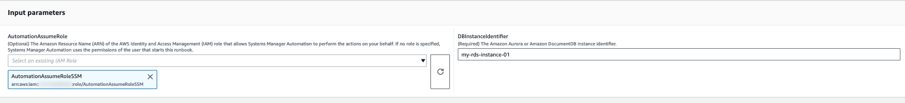
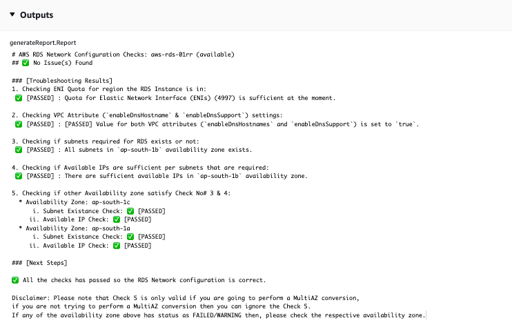
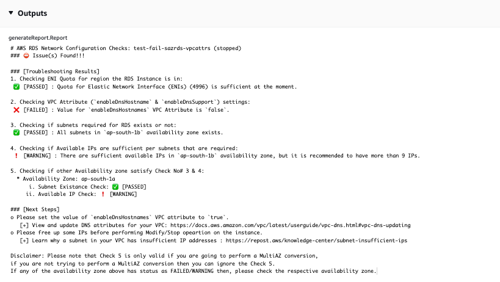

# `AWSSupport-ValidateRdsNetworkConfiguration`

**Description**

`AWSSupport-ValidateRdsNetworkConfiguration` automation helps to avoid
incompatible-network state for your existing Amazon Relational Database Service (Amazon RDS) / Amazon Aurora / Amazon DocumentDB
instance before you perform `ModifyDBInstance` or
`StartDBInstance` operation. If the instance is already in
incompatible-network state, the runbook will provide the reason.

**How does it work?**

This runbook determines if your Amazon RDS database instance will go into
incompatilble-network state, or if it has, determine the reason it's in
incompatible-network state.

The runbook performs the following checks against your Amazon RDS database instance:

- Amazon Elastic Network Interface (ENI) quota per region.
- All subnets in the database Subnet Group exist.
- There are sufficient free IP addresses available for the
  subnet(s).
- (For publicly accessible Amazon RDS instances) Settings of VPC
  attributes (`enableDnsSupport` and
  `enableDnsHostnames`).

###### Important

When using this document against Amazon Aurora / Amazon DocumentDB clusters, ensure that you
use `DBInstanceIdentifier` instead of
`ClusterIdentifier`. Otherwise, the document will fail in
the first step.

[Run this Automation (console)](https://console.aws.amazon.com/systems-manager/automation/execute/AWSSupport-ValidateRdsNetworkConfiguration "https://console.aws.amazon.com/systems-manager/automation/execute/AWSSupport-ValidateRdsNetworkConfiguration")

**Document type**

Automation

**Owner**

Amazon

**Platforms**

Databases

**Required IAM permissions**

The `AutomationAssumeRole` parameter requires the following actions to
use the runbook successfully.

- `rds:DescribeDBInstances`
- `servicequotas:GetServiceQuota`
- `ec2:DescribeNetworkInterfaces`
- `ec2:DescribeVpcAttribute`
- `ec2:DescribeSubnets`
  Sample policy:

JSON

```
`{
 "Version":"2012-10-17",
 "Statement": [
 {
 "Sid": "ValidateRdsNetwork",
 "Effect": "Allow",
 "Action": [
 "rds:DescribeDBInstances",
 "servicequotas:GetServiceQuota",
 "ec2:DescribeNetworkInterfaces",
 "ec2:DescribeVpcAttribute",
 "ec2:DescribeSubnets"
 ],
 "Resource": [
 "arn:aws:rds:`us-east-1`:`111122223333`:db:`db-instance-name`"
 ]
 }
 ]
}`

```

**Instructions**

1. Navigate to the [AWSSupport-ValidateRdsNetworkConfiguration](https://console.aws.amazon.com/systems-manager/automation/execute/AWSSupport-ValidateRdsNetworkConfiguration "https://console.aws.amazon.com/systems-manager/automation/execute/AWSSupport-ValidateRdsNetworkConfiguration") in the
   AWS Systems Manager Console.
2. Select **Execute Automation**
3. For input parameters, enter the following:
   - **AutomationAssumeRole
     (Optional):**

   The Amazon Resource Name (ARN) of the AWS Identity and Access Management
   (IAM) role that allows Systems Manager Automation to perform
   the actions on your behalf. If no role is specified,
   Systems Manager Automation uses the permissions of the user
   that starts this runbook.
   - **DBInstanceIdentifier
     (Required):**

   Enter the Amazon Relational Database Service Instance Identifier.

 4. Select **Execute**. 5. Notice that the automation initiates. 6. The document performs the following steps:

    * **Step 1:
     assertRdsState:**


    Checks if the provided instance identifier exists and
     has any of the following states:
     `available`, `stopped`, or
     `incompatible-network`.
    * **Step 2:
     gatherRdsInformation:**


    Gathers required information about the Amazon RDS instance
     to use later in the automation.
    * **Step 3:
     checkEniQuota:**


    Checks for the current available quota of Amazon ENI
     for the region.
    * **Step 4:
     validateVpcAttributes:**


    Validates that the DNS parameters
     (`enableDnsSupport` and
     `enableDnsHostnames`) of the Amazon VPC are
     set to true (or not if the Amazon RDS instance is
     `PubliclyAccessible`).
    * **Step 5:
     validateSubnetAttributes:**


    Validates the existence of subnets in the
     `DBSubnetGroup` and checks for
     available IPs for each subnet.
    * **Step 6:
     generateReport:**


    Obtains all the information from the previous steps
     and prints the result or the output of each step. It
     also lists the steps to refer to and perform, to
     connect to the Amazon RDS instance using the IAM
     credentials.

7. When the automation is complete, review the **Outputs** section for the detailed results:

Amazon RDS instance with valid network configuration:



Amazon RDS instance with incorrect network configuration (VPC
attribute enableDnsHostnames is set to false):



**References**

Systems Manager Automation

- [Run this Automation (console)](https://console.aws.amazon.com/systems-manager/automation/execute/AWSSupport-ValidateRdsNetworkConfiguration "https://console.aws.amazon.com/systems-manager/automation/execute/AWSSupport-ValidateRdsNetworkConfiguration")
- [Run an automation](../../../systems-manager/latest/userguide/automation-working-executing.md "../../../systems-manager/latest/userguide/automation-working-executing.md")
- [Setting up an Automation](../../../systems-manager/latest/userguide/automation-setup.md "../../../systems-manager/latest/userguide/automation-setup.md")
- [Support
  Automation Workflows landing page](https://aws.amazon.com/premiumsupport/technology/saw/ "https://aws.amazon.com/premiumsupport/technology/saw/")
  AWS service documentation

- [How
  do I resolve issues with an Amazon RDS database that is in
  an incompatible-network state?](https://repost.aws/knowledge-center/rds-incompatible-network "https://repost.aws/knowledge-center/rds-incompatible-network")
- [How do I resolve issues with an Amazon DocumentDB instance
  that is in an incompatible-network state?](https://repost.aws/knowledge-center/documentdb-incompatible-network "https://repost.aws/knowledge-center/documentdb-incompatible-network")
