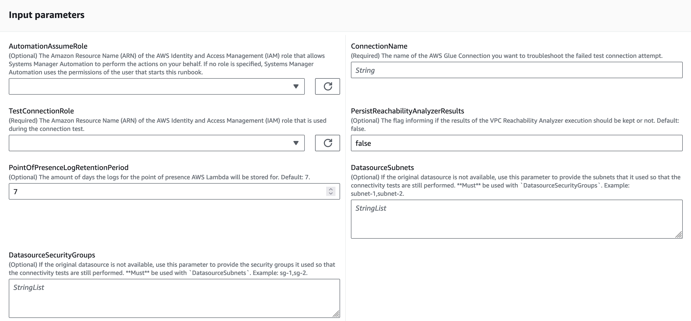
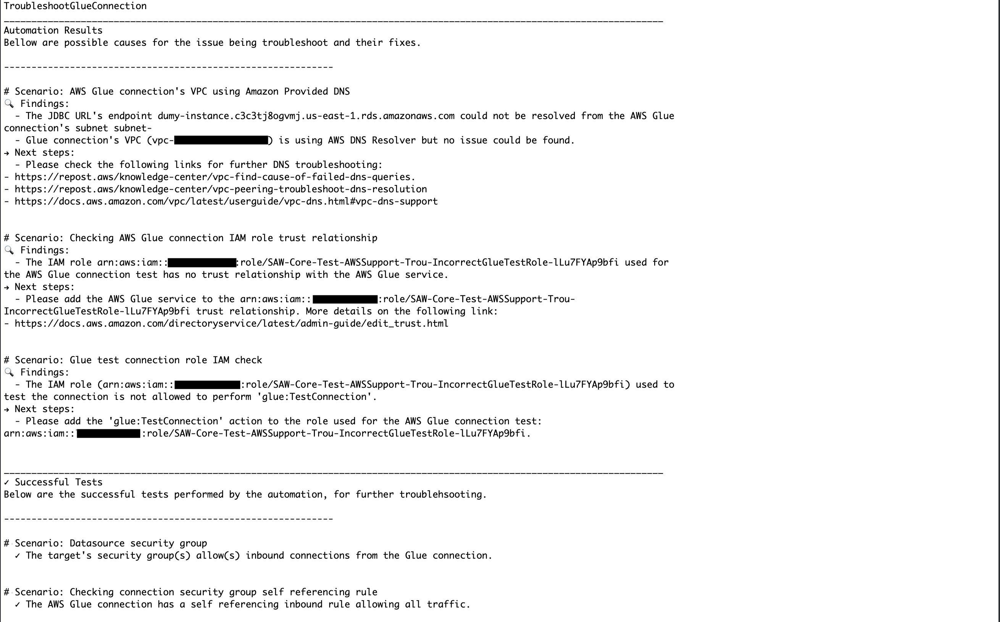

# `AWSSupport-TroubleshootGlueConnection`

**Description**

The **AWSSupport-TroubleshootGlueConnections** runbook helps
troubleshoot AWS Glue connection issues. The target of the tested connection must be
reached through a JDBC connection and can be either an Amazon Relational Database Service (Amazon RDS) cluster/instance, a
Amazon Redshift cluster, or any other target accessible through JDBC. In the first two cases, the
Reachability Analyzer tool is used to determine if the connectivity between the source (AWS Glue) and the
target (Amazon RDS or Amazon Redshift) is granted.

If the target of the connection is not Amazon RDS nor Amazon Redshift, connectivity is still tested by
creating an AWS Lambda function in the same subnet as the AWS Glue connection (a network point
of presence) and checking if the target name is resolvable and if it's reachable in the
target port.

###### Important

In order to run the [Reachability Analyzer](../../../vpc/latest/reachability/what-is-reachability-analyzer.md "../../../vpc/latest/reachability/what-is-reachability-analyzer.md")
checks, [Elastic Network Interfaces](../../../AWSEC2/latest/UserGuide/using-eni.md "../../../AWSEC2/latest/UserGuide/using-eni.md") will be created in each of the connection's
datasource subnets. Please make sure you have enough free IPs on those subnets and that
the consumption of one IP will not impact your workload before running this automation.

###### Important

All the resources created by this automation are tagged so that they can be easily
found. The tags used are:

- `AWSSupport-TroubleshootGlueConnection`: true
- `AutomationExecutionId`: `Amazon EC2 Systems Manager Execution
Id`

**How does it work?**

The runbook performs the following steps:

- Describes the AWS Glue connection to get the source information (subnet and security
  groups) for the connectivity checks.
- Fetches the target information (subnet and security groups) from the datasource
  referenced in the JDBC URL or from the `DatasourceSecurityGroups` and
  `DatasourceSubnets` parameters if they are present.
- If the datasource present in the JDBC URL is a Amazon RDS instance or cluster or a Amazon Redshift
  cluster, this automation creates ENIs using both the source and target information
  gathered in the previous steps and uses Reachability Analyzer to perform a connectivity check between
  them.
- A Lambda function (network point of presence, in the context of this automation) is
  used to perform L4 connectivity and name resolution checks.
- The same Lambda function is used to perform the checks against the Amazon S3
  endpoint.
- Policy Simulator is used to determine if the IAM role used in the connection has the needed
  permissions.
- The automation checks if the security group used by the connection has the
  expected configuration.
- A report is generated containing the possible causes for the failure in the test
  connection operation and/or also the succeeded tests that were performed.

[Run this Automation (console)](https://console.aws.amazon.com/systems-manager/automation/execute/AWSSupport-TroubleshootGlueConnection "https://console.aws.amazon.com/systems-manager/automation/execute/AWSSupport-TroubleshootGlueConnection")

**Document type**

Automation

**Owner**

Amazon

**Platforms**

/

**Required IAM permissions**

The `AutomationAssumeRole` parameter requires the following actions to
use the runbook successfully.

- `cloudformation:CreateStack`
- `cloudformation:DeleteStack`
- `ec2:CreateNetworkInsightsPath`
- `ec2:CreateNetworkInterface`
- `ec2:CreateTags`
- `ec2:DeleteNetworkInsightsAnalysis`
- `ec2:DeleteNetworkInsightsPath`
- `ec2:DeleteNetworkInterface`
- `ec2:StartNetworkInsightsAnalysis`
- `iam:AttachRolePolicy`
- `iam:CreateRole`
- `iam:DeleteRole`
- `iam:DeleteRolePolicy`
- `iam:DetachRolePolicy`
- `iam:PutRolePolicy`
- `iam:TagRole`
- `lambda:CreateFunction`
- `lambda:DeleteFunction`
- `lambda:TagResource`
- `logs:CreateLogGroup`
- `logs:DeleteLogGroup`
- `logs:PutRetentionPolicy`
- `logs:TagResource`
- `glue:GetConnection`
- `glue:GetDataCatalogEncryptionSettings`
- `cloudformation:DescribeStacks`
- `cloudformation:DescribeStackEvents`
- `ec2:DescribeDhcpOptions`
- `ec2:DescribeNetworkInsightsPaths`
- `ec2:DescribeNetworkInsightsAnalyses`
- `ec2:DescribeSecurityGroupRules`
- `ec2:DescribeSecurityGroups`
- `ec2:DescribeSubnets`
- `ec2:DescribeVpcs`
- `ec2:DescribeVpcAttribute`
- `iam:GetRole`
- `iam:ListAttachedRolePolicies`
- `iam:SimulatePrincipalPolicy`
- `kms:DescribeKey`
- `lambda:InvokeFunction`
- `lambda:GetFunction`
- `s3:GetEncryptionConfiguration`
- `iam:PassRole`

###### Important

In addition to the above mentioned actions, the `AutomationAssumeRole`
should have the [AmazonVPCReachabilityAnalyzerFullAccessPolicy](../../../aws-managed-policy/latest/reference/AmazonVPCReachabilityAnalyzerFullAccessPolicy.md "../../../aws-managed-policy/latest/reference/AmazonVPCReachabilityAnalyzerFullAccessPolicy.md") as an [attached
managed policy](../../../IAM/latest/UserGuide/access_policies_manage-attach-detach.md "../../../IAM/latest/UserGuide/access_policies_manage-attach-detach.md") so that the [Reachability Analyzer](../../../vpc/latest/reachability/what-is-reachability-analyzer.md "../../../vpc/latest/reachability/what-is-reachability-analyzer.md") tests
are performed successfully.

Here is an example of a policy that could be granted for the
`AutomationAssumeRole`:

JSON

```
`{
 "Version":"2012-10-17",
 "Statement": [{
 "Sid": "TaggedAWSResourcesPermissions",
 "Effect": "Allow",
 "Condition": {
 "StringEquals": {
 "aws:ResourceTag/AWSSupport-TroubleshootGlueConnection": "true"
 }
 },
 "Action": [
 "iam:AttachRolePolicy",
 "iam:CreateRole",
 "iam:DeleteRole",
 "iam:DeleteRolePolicy",
 "iam:DetachRolePolicy",
 "iam:TagRole",
 "lambda:CreateFunction",
 "lambda:DeleteFunction",
 "lambda:TagResource",
 "logs:DeleteLogGroup",
 "logs:CreateLogGroup",
 "logs:PutRetentionPolicy",
 "logs:TagResource",
 "cloudformation:CreateStack",
 "cloudformation:DeleteStack"
 ],
 "Resource": "*"
 },
 {
 "Sid": "TaggedEC2ResourcesPermissions",
 "Effect": "Allow",
 "Condition": {
 "StringEquals": {
 "ec2:ResourceTag/AWSSupport-TroubleshootGlueConnection": "true"
 }
 },
 "Action": [
 "ec2:DeleteNetworkInterface"
 ],
 "Resource": "*"
 },
 {
 "Sid": "PutRolePolicy",
 "Effect": "Allow",
 "Condition": {
 "StringEquals": {
 "iam:ResourceTag/AWSSupport-TroubleshootGlueConnection": "true"
 }
 },
 "Action": [
 "iam:PutRolePolicy",
 "iam:DeleteRolePolicy"
 ],
 "Resource": "*"
 },
 {
 "Sid": "InvokeFunction",
 "Effect": "Allow",
 "Action": [
 "lambda:InvokeFunction"
 ],
 "Resource": "arn:*:lambda:*:*:function:point-of-presence-*"
 },
 {
 "Sid": "UnTaggedActions",
 "Effect": "Allow",
 "Action": [
 "ec2:CreateNetworkInsightsPath",
 "ec2:DeleteNetworkInsightsAnalysis",
 "ec2:DeleteNetworkInsightsPath",
 "ec2:CreateNetworkInterface",
 "ec2:CreateTags",
 "ec2:StartNetworkInsightsAnalysis",
 "glue:GetConnection",
 "glue:GetDataCatalogEncryptionSettings",
 "cloudformation:DescribeStacks",
 "cloudformation:DescribeStackEvents",
 "ec2:DescribeDhcpOptions",
 "ec2:DescribeNetworkInsightsPaths",
 "ec2:DescribeNetworkInsightsAnalyses",
 "ec2:DescribeSecurityGroupRules",
 "ec2:DescribeSecurityGroups",
 "ec2:DescribeSubnets",
 "ec2:DescribeVpcs",
 "ec2:DescribeVpcAttribute",
 "iam:GetRole",
 "iam:ListAttachedRolePolicies",
 "iam:SimulatePrincipalPolicy",
 "kms:DescribeKey",
 "lambda:GetFunction",
 "s3:GetEncryptionConfiguration"
 ],
 "Resource": "*"
 },
 {
 "Effect": "Allow",
 "Action": [
 "iam:PassRole"
 ],
 "Resource": "arn:*:iam::*:role/point-of-presence-*",
 "Condition": {
 "StringLikeIfExists": {
 "iam:PassedToService": "lambda.amazonaws.com"
 }
 }
 }
 ]
}`

```

**Instructions**

Follow these steps to configure the automation:

1. Navigate to [`AWSSupport-TroubleshootGlueConnection`](https://console.aws.amazon.com/systems-manager/documents/AWSSupport-TroubleshootGlueConnection/description "https://console.aws.amazon.com/systems-manager/documents/AWSSupport-TroubleshootGlueConnection/description") in Systems Manager under Documents.
2. Select Execute automation.
3. For the input parameters, enter the following:
   - **AutomationAssumeRole (Optional):**

   The Amazon Resource Name (ARN) of the AWS AWS Identity and Access Management (IAM) role that
   allows Systems Manager Automation to perform the actions on your behalf. If no role is
   specified, Systems Manager Automation uses the permissions of the user who starts this
   runbook.
   - **TestConnectionRole (Required)**

   The Amazon Resource Name (ARN) of the IAM role that is used during the
   connection test.
   - **ConnectionName (Required)**

   AWS Glue failed test connection name you want to troubleshoot.
   - **PersistReachabilityAnalyzerResults
     (Optional)**

   The flag informing if the results of the Reachability Analyzer execution should be kept or
   not. Default: `false.`
   - **PointOfPresenceLogRetentionPeriod
     (Optional)**

   The amount of days the logs for the point of presence Lambda will be
   stored for. Default: `7`.
   - **DatasourceSubnets (Optional)**

   If the original datasource is not available, use this parameter to
   provide the subnets that it used so that the connectivity tests are still
   performed. **Must** be used with
   `DatasourceSecurityGroups`. Example:
   `subnet-1,subnet-2`.
   - **DatasourceSecurityGroups (Optional)**

   If the original datasource is not available, use this parameter to
   provide the security groups it used so that the connectivity tests are still
   performed. **Must** be used with
   `DatasourceSubnets`. Example: `sg-1,sg-2`.

 4. Select Execute. 5. The automation initiates. 6. The automation runbook performs the following steps:

    * **ParseInputs:**


     This step validates the combination of inputs. If both
     `DatasourceSecurityGroups` and `DatasourceSubnets`
     are provided, they are valid and returned as is. If none are provided, two
     empty lists are returned. If just one of them is provided, the step raises a
     `ValueException`.
    * **GetConnectionDetails:**


    This steps returns the details of the provided AWS Glue connection.
    * **ParseSecurityGroupList:**


     This step is used to concatenate the `SecurityGroupIdList` in
     a `String` for future utilization in this automation.
    * **GetConnectionData:**


     Determines based on the JDBC URL, what type of connection between:
     `RedShift`, `RdsInstance`, `RdsCluster`
     and `Other`. In addition, returns the domain and port used in the
     JDBC connection, the connection's Amazon VPC and its domain name servers.
    * **GetNetworkDetails:**


     Gets the subnet and security group information from the Amazon RDS or Amazon Redshift
     target.
    * **CreateENITemplate:**


     Generates the AWS CloudFormation template used to create the network interfaces
     that are used to test connectivity. This is required to run the Reachability Analyzer
     tool.
    * **CreateENIStack:**


     Creates the AWS CloudFormation stack from the template created in the previous step.
    * **GetStackDetails:**


     Describes the AWS CloudFormation stack created in the previous stack and retrieve the
     `SourceNetworkInterface` an
     `TargetNetworkInterfaces` information.
    * **RunSourceToTargetCheck:**


     Runs checks between the source and target ENIs created in the previous
     step using the Reachability Analyzer tool.
    * **DeleteENIStack:**


    Deletes the AWS CloudFormation stack that creates Network Interfaces
    * **CreateNetworkPointOfPresence:**


     AWS CloudFormation creates the Lambda function used as network point of presence.
    * **GetFunctionName:**


     Performs a AWS CloudFormation describe stack API call to retrieve the name of the
     Lambda function created in the previous step.
    * **RunEndpointChecks:**


     Uses the network point of presence to determine if the endpoint present
     in the JDBC connection is resolvable and reachable in the declared port.
    * **CheckS3Connectivity:**


     Checks the network connectivity from the AWS Glue connection to the Amazon S3
     service.
    * **DeletePointOfPresence:**


     Deletes the AWS CloudFormation stack that creates the network point of presence Lambda.
    * **TestIAMRolePermissions:**


     Checks if the IAM role used for the test has the needed permissions to
     execute it.
    * **CheckConnectionSecurityGroupReferencingRule:**


     Checks if the security group used in the AWS Glue connection is allowing all
     ingress traffic from itself. It will return a list of the security groups
     without this rule, if any.
    * **GenerateReport:**


     Generates a report containing a list o findings (possible reasons for the
     failure in the connection test) and next steps (attempts to resolve the
     connection test failure).

7. After completed, review the Outputs section for the detailed results of the
   execution:
   - **Automation Results**

   In this section, you will find scenarios describing possible causes for
   the test connection operation to fail (findings) and how they can be fixed
   (next steps). If the automation cannot find the cause of the test failure,
   this will be informed in this section as well.
   - **Successful Tests**

   In this section, you will find scenarios informing what has been
   successfully tested by this automation. Succeeded tests are useful in case
   the automation is not able to identify the cause of the test connection
   failure as they reduce the scope of the investigation by informing what is
   not contributing for the issue.
   - **Automation Errors**

   In this section, you will find scenarios describing issues that happened
   during the automation, that may have limited the number of tests the
   automation could perform. The description of the scenario will inform which
   step has failed.



**References**

Systems Manager Automation

- [Run this Automation (console)](https://console.aws.amazon.com/systems-manager/documents/AWSSupport-TroubleshootGlueConnection/description "https://console.aws.amazon.com/systems-manager/documents/AWSSupport-TroubleshootGlueConnection/description")
- [Run an
  automation](../../../systems-manager/latest/userguide/automation-working-executing.md "../../../systems-manager/latest/userguide/automation-working-executing.md")
- [Setting up an
  Automation](../../../systems-manager/latest/userguide/automation-setup.md "../../../systems-manager/latest/userguide/automation-setup.md")
- [Support Automation
  Workflows landing page](https://aws.amazon.com/premiumsupport/technology/saw/ "https://aws.amazon.com/premiumsupport/technology/saw/")
