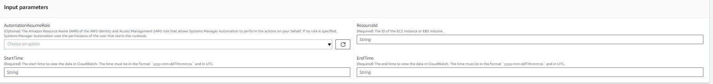
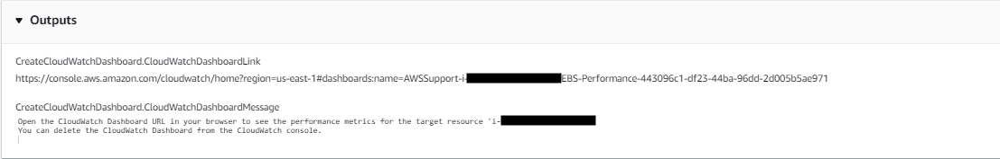
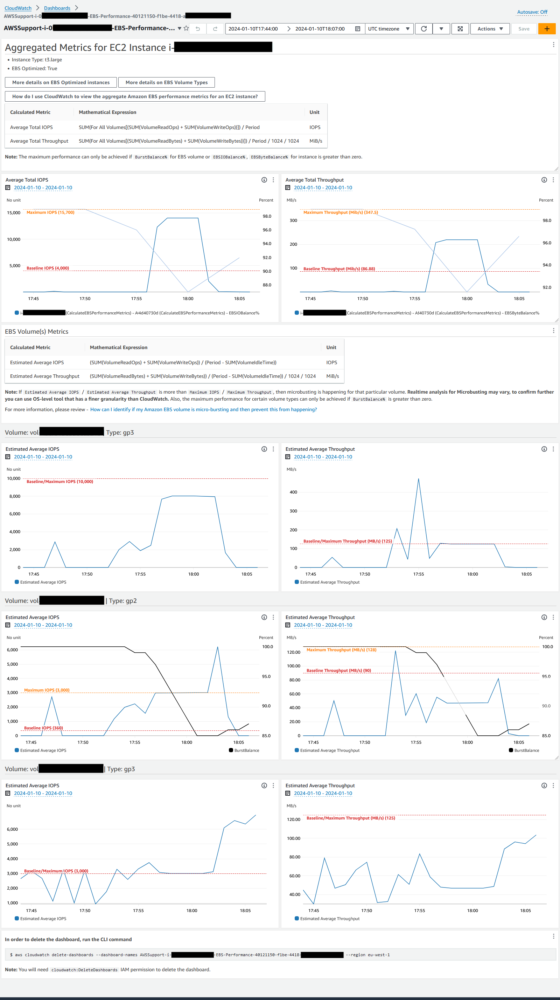
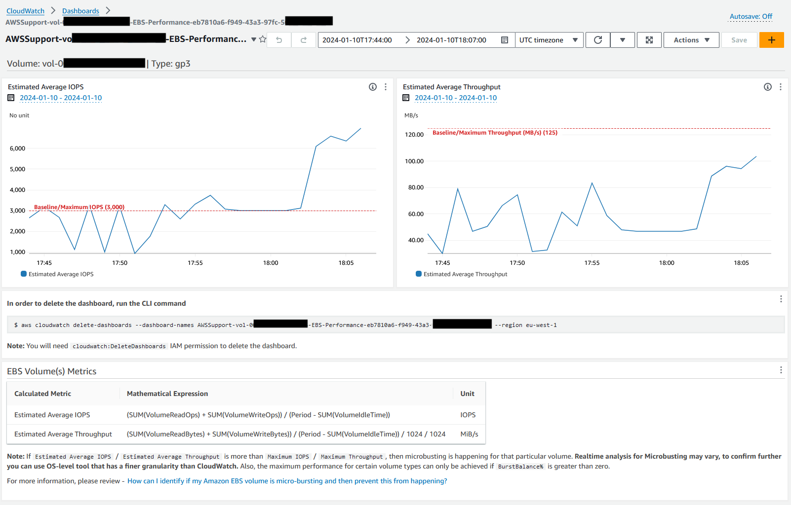

# `AWSSupport-CalculateEBSPerformanceMetrics`

**Description**

The `AWSSupport-CalculateEBSPerformanceMetrics` runbook helps diagnose Amazon EBS
performance issues by calculating and publishing performance metrics to a CloudWatch dashboard.
The dashboard displays the estimated average IOPS and throughput for a target Amazon EBS volume
or all the volumes attached to the target Amazon Elastic Compute Cloud (Amazon EC2) instance. For Amazon EC2 instances,
it also shows the instance's average IOPS and throughput. The runbook outputs the link to
the newly created CloudWatch dashboard that displays the relevant calculated CloudWatch metrics. The
CloudWatch dashboard is created in your account with the name:
`AWSSupport-<ResourceId>-EBS-Performance-<automation:EXECUTION_ID>`.

**How does it work?**

The runbook performs the following steps:

- Ensures that the specified timestamps are valid.
- Validates if the Resource ID (Amazon EBS Volume or Amazon EC2 Instance) is valid.
- When you provide an Amazon EC2 as a ResourceID, it creates a CloudWatch dashboard with Actual
  Total IOPS/Throughput for that Amazon EC2 instance and Estimated Average IOPS/Throughput
  graph for all Amazon EBS volumes attached to an Amazon EC2 instance.
- When you provide an Amazon EBS Volume as a ResourceID, it creates a CloudWatch dashboard with
  Estimated Average IOPS/Throughput graph for that volume.
- After the CloudWatch dashboard is generated, if Estimated Average IOPS or Estimated
  Average Throughput is more than Maximum IOPS or Maximum Throughput, respectively,
  then microbursting is possible for the volume or volumes attached to an Amazon EC2
  instance.

###### Note

For burstable volumes (gp2, sc2, and st1), the maximum IOPS/throughput should be
consider, until you have burst balance. After burst balance is completely utilized i.e.
it becomes zero, consider baseline IOPS/throughput metrics.

###### Important

Creating the CloudWatch dashboard might result in your extra charges to your account. For
more information, consult the [Amazon CloudWatch
Pricing guide](https://aws.amazon.com/cloudwatch/pricing "https://aws.amazon.com/cloudwatch/pricing").

[Run this Automation (console)](https://console.aws.amazon.com/systems-manager/automation/execute/AWSSupport-CalculateEBSPerformanceMetrics "https://console.aws.amazon.com/systems-manager/automation/execute/AWSSupport-CalculateEBSPerformanceMetrics")

**Document type**

Automation

**Owner**

Amazon

**Platforms**

Linux, macOS, Windows

**Parameters**

**Required IAM permissions**

The `AutomationAssumeRole` parameter requires the following actions to
use the runbook successfully.

- `ec2:DescribeVolumes`
- `ec2:DescribeInstances`
- `ec2:DescribeInstanceTypes`
- `cloudwatch:PutDashboard`
  Sample Policy

JSON

```
`{
 "Version":"2012-10-17",
 "Statement": [
 {
 "Sid": "VisualEditor0",
 "Effect": "Allow",
 "Action": "cloudwatch:PutDashboard",
 "Resource": "arn:aws:cloudwatch::`111122223333`:dashboard/*-EBS-Performance-*"
 },
 {
 "Sid": "VisualEditor1",
 "Effect": "Allow",
 "Action": [
 "ec2:DescribeInstances",
 "ec2:DescribeVolumes",
 "ec2:DescribeInstanceTypes"
 ],
 "Resource": "*"
 }
 ]
}`

```

**Instructions**

Follow these steps to configure the automation:

1. Navigate to [`AWSSupport-CalculateEBSPerformanceMetrics`](https://console.aws.amazon.com/systems-manager/documents/AWSSupport-CalculateEBSPerformanceMetrics/description "https://console.aws.amazon.com/systems-manager/documents/AWSSupport-CalculateEBSPerformanceMetrics/description") in Systems Manager
   under Documents.
2. Select Execute automation.
3. For the input parameters, enter the following:
   - **AutomationAssumeRole (Optional):**

   The Amazon Resource Name (ARN) of the AWS AWS Identity and Access Management (IAM) role that
   allows Systems Manager Automation to perform the actions on your behalf. If no role is
   specified, Systems Manager Automation uses the permissions of the user who starts this
   runbook.
   - **ResourceID (Required):**

   The ID of the Amazon EC2 instance or Amazon EBS volume.
   - **Start time (Required):**

   The start time to view the data in CloudWatch. The time must be in the format
   `yyyy-mm-ddThh:mm:ss` and in UTC.
   - **End time (Required):**

   The end time to view the data in CloudWatch. The time must be in the format
   `yyyy-mm-ddThh:mm:ss` and in UTC.

 4. Select Execute. 5. The automation initiates. 6. The document performs the following steps:

    * **CheckResourceIdAndTimeStamps:**


    Checks if end time is greater than start time by at least one minute and
     if the resource provided exists.
    * **CreateCloudWatchDashboard:**


    Calculates Amazon EBS performance and displays a graph based on your Resource
     ID. If you provide an Amazon EBS Volume ID for the parameter Resource ID, this
     runbook creates a CloudWatch dashboard with estimated average IOPS and estimated
     average throughput for the Amazon EBS volume. If you provide an Amazon EC2 Instance ID
     for the parameter Resource ID, this runbook creates a CloudWatch dashboard with
     Average Total IOPS and Average Total Throughput for Amazon EC2 instance and with
     Estimated average IOPS and estimated average throughput for all Amazon EBS
     volumes attached to the Amazon EC2 instance.

7. After completed, review the Outputs section for the detailed results of the
   execution:



Example CloudWatch Dashboard For Resource ID as Amazon EC2 instance



Example CloudWatch Dashboard For Resource ID as Amazon EBS volume id



**References**

Systems Manager Automation

- [Run this Automation (console)](https://console.aws.amazon.com/systems-manager/documents/AWSSupport-CalculateEBSPerformanceMetrics/description "https://console.aws.amazon.com/systems-manager/documents/AWSSupport-CalculateEBSPerformanceMetrics/description")
- [Run an
  automation](../../../systems-manager/latest/userguide/automation-working-executing.md "../../../systems-manager/latest/userguide/automation-working-executing.md")
- [Setting up an
  Automation](../../../systems-manager/latest/userguide/automation-setup.md "../../../systems-manager/latest/userguide/automation-setup.md")
- [Support Automation
  Workflows landing page](https://aws.amazon.com/premiumsupport/technology/saw/ "https://aws.amazon.com/premiumsupport/technology/saw/")
  AWS service documentation

- [How can I
  identify if my Amazon EBS volume is micro-bursting and then prevent this from
  happening?](https://repost.aws/knowledge-center/ebs-identify-micro-bursting "https://repost.aws/knowledge-center/ebs-identify-micro-bursting")
- [How
  do I use CloudWatch to view the aggregate Amazon EBS performance metrics for an
  EC2 instance?](https://repost.aws/knowledge-center/ebs-aggregate-cloudwatch-performance "https://repost.aws/knowledge-center/ebs-aggregate-cloudwatch-performance")
