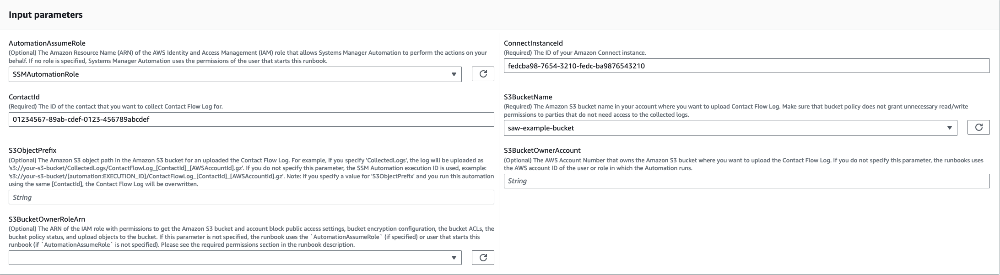
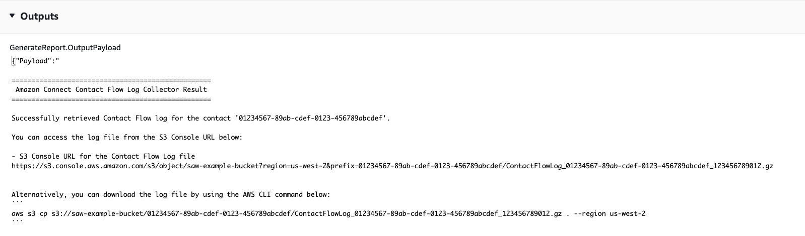

# `AWSSupport-CollectAmazonConnectContactFlowLog`

**Description**

The `AWSSupport-CollectAmazonConnectContactFlowLog` automation runbook is used
to collect the Amazon Connect contact flow logs for a specific contact ID. By providing your Amazon Connect
instance ID and contact ID, the runbook searches contact flow logs for the contact from the
Amazon CloudWatch log group and uploads them to the Amazon Simple Storage Service (Amazon S3) bucket that is specified in the
request parameter. The runbook generates output that provides Amazon S3 console URL and AWS CLI
command for you to download the logs.

**How does it work?**

The `AWSSupport-CollectAmazonConnectContactFlowLog` automation runbook helps to
collect the Amazon Connect contact flow logs for a specific contact ID stored in the configured CloudWatch
log group and uploads them to a specified Amazon S3 bucket. To help with the security of the logs
gathered from your Amazon Connect contact flow, the automation evaluates the Amazon S3 bucket
configuration to determine if the bucket grants public `read` or
`write` access permissions and is owned by the AWS account specified in the
`S3BucketOwnerAccountId` parameter. If your Amazon S3 bucket uses server-side
encryption with AWS Key Management Service keys (SSE-KMS), make sure that the user or AWS Identity and Access Management (IAM) role
that is running this automation has the `kms:GenerateDataKey` permissions on the
AWS KMS key. For more information about the logs generated by your Amazon Connect instance, see [Flow logs
stored in an Amazon CloudWatch log group](../../../connect/latest/adminguide/contact-flow-logs-stored-in-cloudwatch.md "../../../connect/latest/adminguide/contact-flow-logs-stored-in-cloudwatch.md").

###### Important

The CloudWatch Logs Insights queries incur charges based on the amount of data that is queried.
Free tier customers are charged only for usage that exceeds service quotas. For more
information, see [Amazon CloudWatch
Pricing](https://aws.amazon.com/cloudwatch/pricing/ "https://aws.amazon.com/cloudwatch/pricing/").

[Run this Automation (console)](https://console.aws.amazon.com/systems-manager/automation/execute/AWSSupport-CollectAmazonConnectContactFlowLog "https://console.aws.amazon.com/systems-manager/automation/execute/AWSSupport-CollectAmazonConnectContactFlowLog")

**Document type**

Automation

**Owner**

Amazon

**Platforms**

Linux, macOS, Windows

**Parameters**

**Required IAM permissions**

The `AutomationAssumeRole` parameter requires the following actions to
use the runbook successfully.

```

        {
            "Statement": [
                {
                    "Action": [
                        "s3:GetBucketPublicAccessBlock",
                        "s3:GetBucketPolicyStatus",
                        "s3:GetBucketAcl",
                        "s3:GetObject",
                        "s3:GetObjectAttributes",
                        "s3:PutObject",
                        "s3:PutObjectAcl"
                    ],
                    "Resource": [
                    "arn:aws:s3:::`amzn-s3-demo-bucket`/*",
                    "arn:aws:s3:::`amzn-s3-demo-bucket`"
                    ],
                    "Effect": "Allow"
                },
                {
                    "Action": [
                        "connect:DescribeInstance",
                        "connect:DescribeContact",
                        "ds:DescribeDirectories"
                    ],
                    "Resource": "*",
                    "Effect": "Allow"
                },
                {
                    "Action": [
                        "logs:StartQuery",
                        "logs:GetQueryResults"

                    "Resource": "*",
                    "Effect": "Allow"
                }
            ]
        }

```

**Instructions**

Follow these steps to configure the automation:

1. Navigate to [`AWSSupport-CollectAmazonConnectContactFlowLog`](https://console.aws.amazon.com/systems-manager/documents/AWSSupport-CollectAmazonConnectContactFlowLog/description "https://console.aws.amazon.com/systems-manager/documents/AWSSupport-CollectAmazonConnectContactFlowLog/description") in Systems Manager
   under Documents.
2. Select Execute automation.
3. For the input parameters, enter the following:
   - **AutomationAssumeRole (Optional):**

   The Amazon Resource Name (ARN) of the AWS Identity and Access Management (IAM) role that allows
   Systems Manager Automation to perform the actions on your behalf. If no role is
   specified, Systems Manager Automation uses the permissions of the user who starts this
   runbook.
   - **ConnectInstanceId (Required):**

   The ID of your Amazon Connect instance.
   - **ContactId (Required):**

   The ID of the contact that you want to collect contact flow log
   for.
   - **S3BucketName (Required):**

   The Amazon S3 bucket name in your account where you want to upload the contact
   flow log. Make sure that bucket policy does not grant unnecessary read/write
   permissions to parties that do not need access to the collected logs.
   - **S3ObjectPrefix (Optional):**

   The Amazon S3 object path in the Amazon S3 bucket for an uploaded contact flow log.
   For example, if you specify `CollectedLogs`, the log will be
   uploaded as
   `s3://your-s3-bucket/CollectedLogs/ContactFlowLog_[ContactId][AWSAccountId].gz`.
   If you do not specify this parameter, the Systems Manager Automation execution ID is
   used, for example:
   `s3://your-s3-bucket/[automation:EXECUTION_ID]/ContactFlowLog[ContactId]_[AWSAccountId].gz`.
   Note: if you specify a value for `S3ObjectPrefix` and run this
   automation using the same [ContactId], the contact flow log will be
   overwritten.
   - **S3BucketOwnerAccount (Optional):**

   The AWS account number that owns the Amazon S3 bucket where you want to
   upload the contact flow log. If you do not specify this parameter, the
   runbook uses the AWS account ID of the user or role in which the
   automation runs.
   - **S3BucketOwnerRoleArn (Optional):**

   The ARN of the IAM role with permissions to get the Amazon S3 bucket and
   account block public access settings, bucket encryption configuration,
   bucket ACLs, bucket policy status, and upload objects to the bucket. If this
   parameter is not specified, the runbook uses the
   `AutomationAssumeRole` (if specified) or user that starts
   this runbook (if `AutomationAssumeRole` is not specified). See
   the required permissions section in the runbook description.

 4. Select Execute. 5. The automation initiates. 6. The document performs the following steps:

    * **CheckConnectInstanceExistance**


    Checks if the Amazon Connect instance provided in the
     `ConnectInstanceId` is `ACTIVE`.
    * **CheckS3BucketPublicStatus**


    Checks if the Amazon S3 bucket specified in the `S3BucketName`
     allows anonymous or public read or write access permissions.
    * **GenerateLogSearchTimeRange**


    Generates `StartTime` and `EndTime` for the
     `StartQuery` step based on the
     `InitiationTimestamp` and `LastUpdateTimestamp`
     returned by the `DescribeContact` API. `StartTime`
     will be an hour before `InitiationTimestamp` and
     `EndTime` will be an hour after
     `LastUpdateTimestamp`.
    * **StartQuery**


    Starts a query log for the provided `ContactId` in the CloudWatch Logs
     log group associated with the Amazon Connect instance provided in
     `ConnectInstanceId`. Queries time out after 60 minutes of
     runtime. If your query times out, reduce the time range being searched. You
     can view the queries currently in progress as well as your recent query
     history in the CloudWatch console. For more information see [View running queries or query history](../../../AmazonCloudWatch/latest/logs/CloudWatchLogs-Insights-Query-History.md "../../../AmazonCloudWatch/latest/logs/CloudWatchLogs-Insights-Query-History.md").
    * **WaitForQueryCompletion**


    Waits for the CloudWatch Logs query log for the provided `ContactId` to
     complete. Notice that the query times out after 60 minutes of runtime. If
     your query times out, reduce the time range being searched. You can view the
     queries currently in progress as well as your recent query history in the
     Amazon Connect console. For more information see [View running queries or query history](../../../AmazonCloudWatch/latest/logs/CloudWatchLogs-Insights-Query-History.md "../../../AmazonCloudWatch/latest/logs/CloudWatchLogs-Insights-Query-History.md").
    * **UploadContactFlowLog**


    Gets the query result and uploads the contact flow log to the Amazon S3 bucket
     specified in `S3BucketName`.
    * **GenerateReport**


    Returns the Amazon S3 console URL where the contact flow log was uploaded and
     an example AWS CLI command that you can use to download the log
     file.

7. After completed, review the Outputs section for the detailed results of the
   execution:
   - **GenerateReport.OutputPayload**

   Output that tells you the runbook successfully retrieved contact flow logs
   for the specified contact. This report also contains Amazon S3 console URL and an
   example AWS CLI command so that you can download the log file.



**References**

Systems Manager Automation

- [Run this Automation (console)](https://console.aws.amazon.com/systems-manager/documents/AWSSupport-CollectAmazonConnectContactFlowLog/description "https://console.aws.amazon.com/systems-manager/documents/AWSSupport-CollectAmazonConnectContactFlowLog/description")
- [Run an
  automation](../../../systems-manager/latest/userguide/automation-working-executing.md "../../../systems-manager/latest/userguide/automation-working-executing.md")
- [Setting up an
  Automation](../../../systems-manager/latest/userguide/automation-setup.md "../../../systems-manager/latest/userguide/automation-setup.md")
- [Support Automation
  Workflows landing page](https://aws.amazon.com/premiumsupport/technology/saw/ "https://aws.amazon.com/premiumsupport/technology/saw/")
