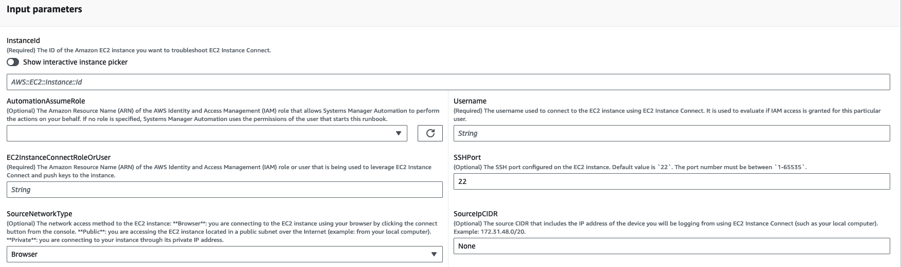
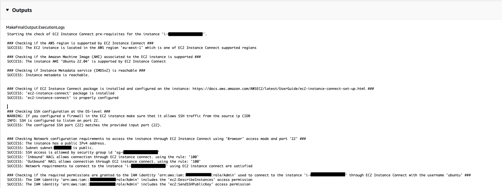
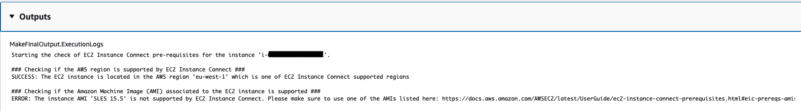

# `AWSSupport-TroubleshootEC2InstanceConnect`

**Description**

`AWSSupport-TroubleshootEC2InstanceConnect` automation helps analyze and detect
errors preventing the connection to an Amazon Elastic Compute Cloud (Amazon EC2) instance using [Amazon EC2
Instance Connect](../../../AWSEC2/latest/UserGuide/connect-linux-inst-eic.md "../../../AWSEC2/latest/UserGuide/connect-linux-inst-eic.md"). It identifies issues caused by an unsupported Amazon Machine
Image (AMI), missing OS-level package installation or configuration, missing AWS Identity and Access Management
(IAM) permissions, or network configuration issues.

**How does it work?**

The runbook takes the Amazon EC2 instance ID, username, connection mode, source IP CIDR, SSH
port, and Amazon Resource Name (ARN) for the IAM role or user experiencing issues with
Amazon EC2 Instance Connect. It then checks the [prerequisites](../../../AWSEC2/latest/UserGuide/ec2-instance-connect-prerequisites.md "../../../AWSEC2/latest/UserGuide/ec2-instance-connect-prerequisites.md") for connecting to an Amazon EC2 instance using Amazon EC2 Instance Connect:

- The instance is running and in a healthy state.
- The instance is located in an AWS region supported by Amazon EC2 Instance
  Connect.
- AMI of the instance is supported by Amazon EC2 Instance Connect.
- The instance can reach the Instance Metadata Service (IMDSv2).
- Amazon EC2 Instance Connect package is properly installed and configured at the OS
  level.
- The network configuration (security groups, network ACL, and route table rules)
  allows connection to the instance through Amazon EC2 Instance Connect.
- The IAM role or user that's used to leverage Amazon EC2 Instance Connect has access
  to push keys to the Amazon EC2 instance.

###### Important

- To check the instance AMI, IMDSv2 reachability, and Amazon EC2 Instance Connect
  package installation, the instance must be SSM managed. Otherwise, it skips
  those steps. For more information, see [Why is my Amazon EC2 instance not displaying as a managed node.](https://repost.aws/knowledge-center/systems-manager-ec2-instance-not-appear "https://repost.aws/knowledge-center/systems-manager-ec2-instance-not-appear")
- The network check will only detect if security group and network ACL rules
  block traffic when SourceIpCIDR is provided as an input parameter. Otherwise, it
  will only display SSH-related rules.
- Connections using [Amazon EC2 Instance
  Connect Endpoint](../../../AWSEC2/latest/UserGuide/connect-using-eice.md "../../../AWSEC2/latest/UserGuide/connect-using-eice.md") are not validated in this runbook.
- For private connections, the automation does not check if the SSH client is
  installed on the source machine and if it can reach the instance's private IP
  address.
  **Document type**

Automation

**Owner**

Amazon

**Platforms**

Linux

**Parameters**

**Required IAM permissions**

The `AutomationAssumeRole` parameter requires the following actions to
use the runbook successfully.

- `ec2:DescribeInstances`
- `ec2:DescribeSecurityGroups`
- `ec2:DescribeNetworkAcls`
- `ec2:DescribeRouteTables`
- `ec2:DescribeInternetGateways`
- `iam:SimulatePrincipalPolicy`
- `ssm:DescribeInstanceInformation`
- `ssm:ListCommands`
- `ssm:ListCommandInvocations`
- `ssm:SendCommand`

**Instructions**

Follow these steps to configure the automation:

1.  Navigate to the [`AWSSupport-TroubleshootEC2InstanceConnect`](https://console.aws.amazon.com/systems-manager/documents/AWSSupport-TroubleshootEC2InstanceConnect/description "https://console.aws.amazon.com/systems-manager/documents/AWSSupport-TroubleshootEC2InstanceConnect/description") in the
    AWS Systems Manager console.
2.  Select Execute automation.
3.  For the input parameters, enter the following:
    - **InstanceId (Required):**

    The ID of the target Amazon EC2 instance that you could not connect to using
    Amazon EC2 Instance Connect.
    - **AutomationAssumeRole (Optional):**

    The ARN of the IAM role that allows Systems Manager Automation to perform the
    actions on your behalf. If no role is specified, Systems Manager Automation uses the
    permissions of the user who starts this runbook.
    - **Username (Required):**

    The username used to connect to the Amazon EC2 instance using Amazon EC2 Instance
    Connect. It is used to evaluate if IAM access is granted for this
    particular user.
    - **EC2InstanceConnectRoleOrUser
      (Required):**

    The ARN of the IAM role or user that is leveraging Amazon EC2 Instance
    Connect to push keys to the instance.
    - **SSHPort (Optional):**

    The SSH port configured on the Amazon EC2 instance. Default value is
    `22`. The port number must be between
    `1-65535`.
    - **SourceNetworkType (Optional):**

    The network access method to the Amazon EC2 instance:

        + **Browser:** You connect from the
         AWS Management Console.
        + **Public:** You connect to the
         instance located in a public subnet over the internet (for example,
         your local computer).
        + **Private:** You connect through the
         instance's private IP address.

    - **SourceIpCIDR (Optional):**

    The source CIDR that includes the IP address of the device (such as your
    local computer) you will log from using Amazon EC2 Instance Connect. Example:
    172.31.48.6/32. If no value is provided with public or private access mode,
    the runbook will not evaluate if the Amazon EC2 instance security group and
    network ACL rules allow SSH traffic. It will display SSH-related rules
    instead.

 4. Select Execute. 5. The automation initiates. 6. The document performs the following steps:

    * **AssertInitialState:**

    Ensures that the Amazon EC2 instance status is running. Otherwise, the
     automation ends.
    * **GetInstanceProperties:**

    Gets the current Amazon EC2 instance properties (PlatformDetails,
     PublicIpAddress, VpcId, SubnetId and MetadataHttpEndpoint).
    * **GatherInstanceInformationFromSSM:**

    Gets the Systems Manager instance's ping status and operating system details if the
     instance is SSM managed.
    * **CheckIfAWSRegionSupported:**

    Checks if the Amazon EC2 instance is located in an Amazon EC2 Instance Connect
     supported AWS region.
    * **BranchOnIfAWSRegionSupported:**

    Continues the execution if the AWS Region is supported by Amazon EC2 Instance
     Connect. Otherwise, it creates the output and exits the automation.
    * **CheckIfInstanceAMIIsSupported:**

    Checks if the AMI associated with the instance is supported by Amazon EC2
     Instance Connect.
    * **BranchOnIfInstanceAMIIsSupported:**

    If the instance AMI is supported, it performs the OS-level checks, like
     metadata reachability and Amazon EC2 Instance Connect package installation and
     configuration. Otherwise, it checks if HTTP metadata is enabled using AWS
     API, then advances to the network check step.
    * **CheckIMDSReachabilityFromOs:**

    Runs a Bash script on the target Amazon EC2 Linux instance to check if it is
     able to reach the IMDSv2.
    * **CheckEICPackageInstallation:**

    Runs a Bash script on the target Amazon EC2 Linux instance to check if the
     Amazon EC2 Instance Connect package is properly installed and configured.
    * **CheckSSHConfigFromOs:**

    Runs a Bash script on the target Amazon EC2 Linux instance to check if the
     configured SSH port matches the input parameter `SSHPort.`
    * **CheckMetadataHTTPEndpointIsEnabled:**

    Checks if the instance metadata service HTTP endpoint is enabled.
    * **CheckEICNetworkAccess:**

    Checks if the network configuration (security groups, network ACL, and
     route table rules) allows connection to the instance through Amazon EC2 Instance
     Connect.
    * **CheckIAMRoleOrUserPermissions:**

    Checks if the IAM role or user used to leverage Amazon EC2 Instance Connect
     has access to push keys to the Amazon EC2 instance using the provided
     username.
    * **MakeFinalOutput:**

    Consolidates the output of all previous steps.

7. After completed, review the **Outputs** section for
   the detailed results of the execution:

Execution where the target instance has all required prerequisites:

Execution where the AMI of the target instance is not supported:

**References**

Systems Manager Automation

- [Run this Automation (console)](https://console.aws.amazon.com/systems-manager/documents/AWSSupport-TroubleshootEC2InstanceConnect/description "https://console.aws.amazon.com/systems-manager/documents/AWSSupport-TroubleshootEC2InstanceConnect/description")
- [Run an
  automation](../../../systems-manager/latest/userguide/automation-working-executing.md "../../../systems-manager/latest/userguide/automation-working-executing.md")
- [Setting up an
  Automation](../../../systems-manager/latest/userguide/automation-setup.md "../../../systems-manager/latest/userguide/automation-setup.md")
- [Support Automation
  Workflows landing page](https://aws.amazon.com/premiumsupport/technology/saw/ "https://aws.amazon.com/premiumsupport/technology/saw/")
  AWS service documentation

- [How
  do I troubleshoot issues connecting to my Amazon EC2 instance using Amazon EC2 Instance
  Connect?](https://repost.aws/knowledge-center/ec2-instance-connect-troubleshooting "https://repost.aws/knowledge-center/ec2-instance-connect-troubleshooting")
