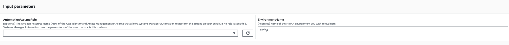
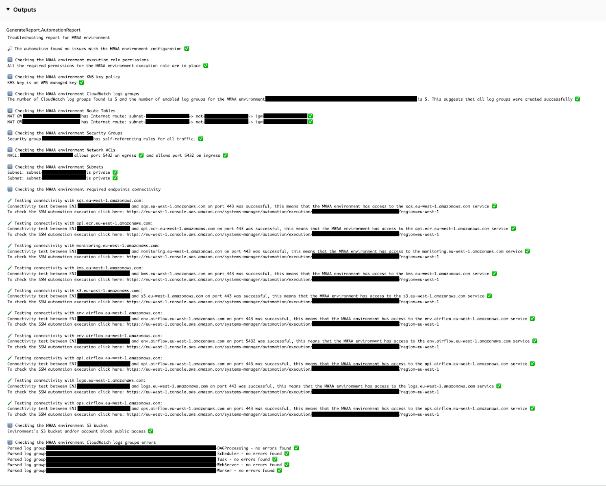

# `AWSSupport-TroubleshootMWAAEnvironmentCreation`

**Description**

The `AWSSupport-TroubleshootMWAAEnvironmentCreation` runbook provides
information to debug Amazon Managed Workflows for Apache Airflow (Amazon MWAA) environment creation issues, and perform checks
along with the documented reasons on a best effort basis to help identify the failure.

**How does it work?**

The runbook performs the following steps:

- Retrieves the details of the Amazon MWAA environment.
- Verifies the execution role permissions.
- Checks if the environment has permissions to use the provided AWS KMS key for
  logging, and if the required CloudWatch log group exists.
- Parses the logs in the provided log group to locate any errors.
- Checks the network configuration to verify if the Amazon MWAA environment has access to
  the required endpoints.
- Generates a report with the findings.

[Run this Automation (console)](https://console.aws.amazon.com/systems-manager/automation/execute/AWSSupport-TroubleshootMWAAEnvironmentCreation "https://console.aws.amazon.com/systems-manager/automation/execute/AWSSupport-TroubleshootMWAAEnvironmentCreation")

**Document type**

Automation

**Owner**

Amazon

**Platforms**

/

**Required IAM permissions**

The `AutomationAssumeRole` parameter requires the following actions to
use the runbook successfully.

- `airflow:GetEnvironment`
- `cloudtrail:LookupEvents`
- `ec2:DescribeNatGateways`
- `ec2:DescribeNetworkAcls`
- `ec2:DescribeNetworkInterfaces`
- `ec2:DescribeRouteTables`
- `ec2:DescribeSecurityGroups`
- `ec2:DescribeSubnets`
- `ec2:DescribeVpcEndpoints`
- `iam:GetPolicy`
- `iam:GetPolicyVersion`
- `iam:GetRolePolicy`
- `iam:ListAttachedRolePolicies`
- `iam:ListRolePolicies`
- `iam:SimulateCustomPolicy`
- `kms:GetKeyPolicy`
- `kms:ListAliases`
- `logs:DescribeLogGroups`
- `logs:FilterLogEvents`
- `s3:GetBucketAcl`
- `s3:GetBucketPolicyStatus`
- `s3:GetPublicAccessBlock`
- `s3control:GetPublicAccessBlock`
- `ssm:StartAutomationExecution`
- `ssm:GetAutomationExecution`

**Instructions**

Follow these steps to configure the automation:

1. Navigate to [`AWSSupport-TroubleshootMWAAEnvironmentCreation`](https://console.aws.amazon.com/systems-manager/documents/AWSSupport-TroubleshootMWAAEnvironmentCreation/description "https://console.aws.amazon.com/systems-manager/documents/AWSSupport-TroubleshootMWAAEnvironmentCreation/description") in
   Systems Manager under Documents.
2. Select Execute automation.
3. For the input parameters, enter the following:
   - **AutomationAssumeRole (Optional):**

   The Amazon Resource Name (ARN) of the AWS AWS Identity and Access Management (IAM) role that
   allows Systems Manager Automation to perform the actions on your behalf. If no role is
   specified, Systems Manager Automation uses the permissions of the user who starts this
   runbook.
   - **EnvironmentName (Required):**

   Name of the Amazon MWAA environment you wish to evaluate.

 4. Select Execute. 5. The automation initiates. 6. The document performs the following steps:

    * **`GetMWAAEnvironmentDetails:`**

    Retrieves the details of the Amazon MWAA environment. If this step fails, the
     automation process will halt and show as `Failed`.
    * **`CheckIAMPermissionsOnExecutionRole:`**

    Verifies that the execution role has the required permissions for Amazon MWAA,
     Amazon S3, CloudWatch Logs, CloudWatch, and Amazon SQS resources. If it detects a customer managed
     AWS Key Management Service (AWS KMS) key, the automation validates the key's required
     permissions. This step employs the `iam:SimulateCustomPolicy` API
     to ascertain if the automation execution role meets all required
     permissions.
    * **`CheckKMSPolicyOnKMSKey:`**

    Checks if the AWS KMS key policy allows the Amazon MWAA environment to use the
     key for encrypting CloudWatch Logs. If the AWS KMS key is AWS-managed, the
     automation skips this check.
    * **`CheckIfRequiredLogGroupsExists:`**

    Checks if the required CloudWatch log groups for the Amazon MWAA environment exist.
     If not, the automation checks CloudTrail for `CreateLogGroup` and
     `DeleteLogGroup` events. This step also checks for
     `CreateLogGroup` events.
    * **`BranchOnLogGroupsFindings:`**

    Branches based on the existence of CloudWatch log groups related to the Amazon MWAA
     environment. If at least one log group exists, the automation parses it to
     locate errors. If no log groups are present, the automation skips the next
     step.
    * **`CheckForErrorsInLogGroups:`**

    Parses the CloudWatch log groups to locate errors.
    * **`GetRequiredEndPointsDetails:`**

    Retrieves the service endpoints utilized by the Amazon MWAA environment.
    * **`CheckNetworkConfiguration:`**

    Verifies that the Amazon MWAA environment's network configuration meets the
     requirements, including checks on security groups, network ACLs, subnets,
     and route table configurations.
    * **`CheckEndpointsConnectivity:`**

    Invokes the `AWSSupport-ConnectivityTroubleshooter` child
     automation to validate the Amazon MWAA's connectivity to the required
     endpoints.
    * **`CheckS3BlockPublicAccess:`**

    Checks whether the Amazon MWAA environment's Amazon S3 bucket has `Block Public
     Access` enabled and also reviews the account's overall Amazon S3 Block
     Public Access settings.
    * **`GenerateReport:`**

    Gathers information from the automation and prints the result or output of
     each step.

7. After completed, review the Outputs section for the detailed results of the
   execution:
   - **Checking the Amazon MWAA environment execution role
     permissions:**

   Verifies if the execution role has the required permissions for Amazon MWAA,
   Amazon S3, CloudWatch Logs, CloudWatch, and Amazon SQS resources. If a Customer Managed AWS KMS key
   is detected, the automation validates the key's required permissions.
   - **Checking the Amazon MWAA environment AWS KMS key
     policy:**

   Verifies whether the execution role possesses the necessary permissions
   for Amazon MWAA, Amazon S3, CloudWatch Logs, CloudWatch, and Amazon SQS resources. Additionally, if a
   Customer Managed AWS KMS key is detected, the automation checks for the key's
   required permissions.
   - **Checking the Amazon MWAA environment CloudWatch logs
     groups:**

   Checks whether the required CloudWatch Log Groups for the Amazon MWAA environment
   exist. If they do not, the automation then checks CloudTrail to locate
   `CreateLogGroup` and `DeleteLogGroup`
   events.
   - **Checking the Amazon MWAA environment Route
     Tables:**

   Checks whether the Amazon VPC route tables in the Amazon MWAA environment are
   properly configured.
   - **Checking the Amazon MWAA environment Security
     Groups:**

   Checks if the Amazon MWAA environment Amazon VPC security groups are properly
   configured.
   - **Checking the Amazon MWAA environment Network
     ACLs:**

   Checks whether the Amazon VPC security groups in the Amazon MWAA environment are
   properly configured.
   - **Checking the Amazon MWAA environment
     Subnets:**

   Verifies whether the Amazon MWAA environment's subnets are private.
   - **Checking the Amazon MWAA environment required endpoints
     connectivity:**

   Verifies whether the Amazon MWAA environment can access the required endpoints.
   For this purpose, the automation invokes the
   `AWSSupport-ConnectivityTroubleshooter` automation.
   - **Checking the Amazon MWAA environment Amazon S3
     bucket:**

   Checks whether the Amazon MWAA environment's Amazon S3 bucket has `Block Public
 Access` enabled and also reviews the account's Amazon S3 Block Public
   Access settings.
   - **Checking the Amazon MWAA environment CloudWatch logs groups
     errors:**

   Parses the existing CloudWatch log groups of the Amazon MWAA environment to locate
   errors.

**References**

Systems Manager Automation

- [Run this Automation (console)](https://console.aws.amazon.com/systems-manager/documents/AWSSupport-TroubleshootMWAAEnvironmentCreation/description "https://console.aws.amazon.com/systems-manager/documents/AWSSupport-TroubleshootMWAAEnvironmentCreation/description")
- [Run an
  automation](../../../systems-manager/latest/userguide/automation-working-executing.md "../../../systems-manager/latest/userguide/automation-working-executing.md")
- [Setting up an
  Automation](../../../systems-manager/latest/userguide/automation-setup.md "../../../systems-manager/latest/userguide/automation-setup.md")
- [Support Automation
  Workflows landing page](https://aws.amazon.com/premiumsupport/technology/saw/ "https://aws.amazon.com/premiumsupport/technology/saw/")
