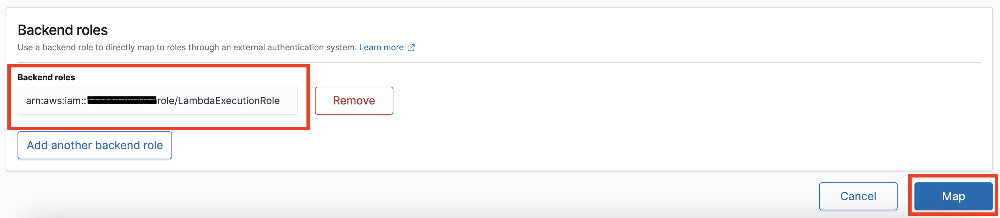
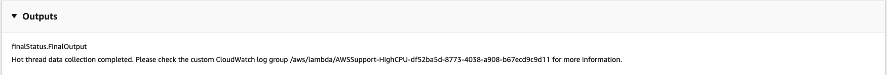

# `AWSSupport-TroubleshootOpenSearchHighCPU`

**Description**

The `AWSSupport-TroubleshootOpenSearchHighCPU` runbook provides an automated
solution to collect diagnostic data from an Amazon OpenSearch Service domain to troubleshoot [high CPU](https://repost.aws/knowledge-center/opensearch-troubleshoot-high-cpu "https://repost.aws/knowledge-center/opensearch-troubleshoot-high-cpu")
issues.

**How does it work?**

The `AWSSupport-TroubleshootOpenSearchHighCPU` runbook helps to troubleshoot
high CPU utilization in the Amazon OpenSearch Service domain.

The runbook performs the following steps:

- Runs the [DescribeDomain](../../../opensearch-service/latest/APIReference/API_DescribeDomain.md "../../../opensearch-service/latest/APIReference/API_DescribeDomain.md") API against the provided Amazon OpenSearch Service domain to get the
  cluster metadata.
- Checks whether the Amazon OpenSearch Service domain is public or Amazon VPC-based and with the help of
  AWS CloudFormation, creates a public or [Amazon VPC-based](../../../opensearch-service/latest/developerguide/vpc.md "../../../opensearch-service/latest/developerguide/vpc.md")
  AWS Lambda function.
- The Lambda function fetches diagnostic data from the Amazon OpenSearch Service domains.
- Uses an AWS Step Functions state machine to orchestrate multiple Lambda function executions
  to gather more comprehensive data.
- Stores the collected data in an Amazon CloudWatch log group for 24 hours by default.
- Deletes the created resources, except the CloudWatch log group.
  **Document type**

Automation

**Owner**

Amazon

**Platforms**

Linux, macOS, Windows

**Parameters**

**Required IAM permissions**

The `AutomationAssumeRole` parameter requires the following actions to
use the runbook successfully.

- `cloudformation:CreateStack`
- `cloudformation:CreateStack`
- `cloudformation:DescribeStacks`
- `cloudformation:DescribeStackEvents`
- `cloudformation:DeleteStack`
- `lambda:CreateFunction`
- `lambda:DeleteFunction`
- `lambda:InvokeFunction`
- `lambda:GetFunction`
- `lambda:TagResource`
- `es:DescribeDomain`
- `ec2:DescribeSecurityGroups`
- `ec2:DescribeSubnets`
- `ec2:DescribeVpcs`
- `ec2:DescribeNetworkInterfaces`
- `ec2:CreateNetworkInterface`
- `ec2:DescribeInstances`
- `ec2:AttachNetworkInterface`
- `ec2:DeleteNetworkInterface`
- `logs:CreateLogGroup`
- `logs:PutRetentionPolicy`
- `logs:TagResource`
- `states:CreateStateMachine`
- `states:DeleteStateMachine`
- `states:StartExecution`
- `states:TagResource`
- `states:DescribeStateMachine`
- `states:DescribeExecution`
- `iam:PassRole`
- `iam:CreateRole`
- `iam:DeleteRole`
- `iam:GetRole`
- `iam:PutRolePolicy`
- `iam:DeleteRolePolicy`
- `ssm:DescribeAutomationExecutions`
- `ssm:GetAutomationExecution`

###### Note

The `iam:CreateRole`, `iam:DeleteRole`,
`iam:GetRole`, `iam:PutRolePolicy`
`iam:PutRolePolicy`, and `iam:DeleteRolePolicy`
are only required if you are not using an existing IAM role for
**LambdaInvocationRoleForStepFunctions**
parameter

The `LambdaExecutionRole` parameter requires the following actions to
successfully use the runbook:

- `es:ESHttpGet`
- `ec2:CreateNetworkInterface`
- `ec2:DescribeNetworkInterfaces`
- `ec2:DeleteNetworkInterface`
- `logs:CreateLogStream`
- `logs:PutLogEvents`
  The Lambda execution role grants the function permission to access AWS services and
  resources required by this runbook. For more information, see [Lambda execution
  role](../../../lambda/latest/dg/lambda-intro-execution-role.md "../../../lambda/latest/dg/lambda-intro-execution-role.md").

###### Note

The `ec2:DescribeNetworkInterfaces`,
`ec2:CreateNetworkInterface`, and `ec2:DeleteNetworkInterface`
are only required if your OpenSearch Service cluster is [Amazon VPC-based](../../../opensearch-service/latest/developerguide/vpc.md "../../../opensearch-service/latest/developerguide/vpc.md") to
allow the Lambda function to create and manage the Amazon VPC network interfaces. For more
information, see [Connecting outbound
networking to resources in a Amazon VPC](../../../lambda/latest/dg/configuration-vpc.md#vpc-permissions "../../../lambda/latest/dg/configuration-vpc.md#vpc-permissions") and [Lambda execution
role](../../../lambda/latest/dg/lambda-intro-execution-role.md "../../../lambda/latest/dg/lambda-intro-execution-role.md").

The `LambdaInvocationRoleForStepFunctions` parameter grants the permissions for AWS Step Functions
state machine to invoke the Lambda function. The following is an example IAM policy that grants Step Functions
permission to invoke the Lambda function that fetches diagnostic data from the OpenSearch Service domain. For more information,
see [Creating a state machine IAM role](../../../step-functions/latest/dg/procedure-create-iam-role.md "../../../step-functions/latest/dg/procedure-create-iam-role.md")
in AWS Step Functions Developer Guide.

JSON

```
`{
 "Version":"2012-10-17",
 "Statement": [
 {
 "Effect": "Allow",
 "Action": "lambda:InvokeFunction",
 "Resource": [
 "arn:aws:lambda:`us-east-1`:`111122223333`:function:AWSSupport-HighCPU-*"
 ]
 }
 ]
}`

```

**Instructions**

Follow these steps to configure the automation:

1. Navigate to the [AWSSupport-TroubleshootOpenSearchHighCPU](https://console.aws.amazon.com/systems-manager/documents/AWSSupport-TroubleshootOpenSearchHighCPU/description "https://console.aws.amazon.com/systems-manager/documents/AWSSupport-TroubleshootOpenSearchHighCPU/description") in the AWS Systems Manager
   console.
2. Select Execute automation.
3. For the input parameters enter the following:
   - **AutomationAssumeRole (Optional):**

   The Amazon Resource Name (ARN) of the AWS Identity and Access Management (IAM) role that allows
   Systems Manager Automation to perform the actions on your behalf. If no role is
   specified, Systems Manager Automation uses the permissions of the user that starts
   this runbook.
   - **DomainName (Required):**

   The name of the Amazon OpenSearch Service domain that you want to troubleshoot for high
   CPU issues.
   - **LambdaExecutionRoleForOpenSearch
     (Required):**

   The ARN of the IAM role to attach to the Lambda function. The Lambda
   function uses the credentials from this role to sign requests to the
   Amazon OpenSearch Service domain. If fine-grained access control is enabled on the Amazon OpenSearch Service
   domain, you must map this role to an OpenSearch Service Dashboards backend role with a
   minimum of "cluster_monitor" permission.
   - **LambdaInvocationRoleForStepFunctions
     (Optional):**

   (Optional) The ARN of the IAM role to attach to the Step Functions workflow.
   The state machine uses the credentials from this role to invoke the Lambda
   function that fetches diagnostic data from the OpenSearch Service domain. If no role
   is specified, this automation will create an IAM role for Step Functions
   in your account.
   - **DataRetentionDays (Optional):**

   The number of days to retain the diagnostic data collected from the
   Amazon OpenSearch Service domain. By default, the data is retained for 24 hours (one day).
   You can choose to retain the data for a maximum of up to 30 days.
   - **NumberOfDataSamples (Optional):**

   The number of data samples to collect from the Amazon OpenSearch Service domain. By
   default, 5 data sample are collected. You can collect up to 10 samples and
   the Lambda function will be invoked for each sample collection.

4. If you have enabled [fine-grained access
   control](../../../opensearch-service/latest/developerguide/fgac.md "../../../opensearch-service/latest/developerguide/fgac.md") on an OpenSearch Service cluster, make sure that the
   `LambdaExecutionRole` role arn is mapped to a role with at least
   `cluster_monitor` permission.


 5. Select Execute. 6. The automation initiates. 7. The automation runbook performs the following steps:

    * **checkConcurrency:**


    Ensures that there is only one execution of this runbook targeting the
     specified Amazon OpenSearch Service domain. If the runbook finds another execution targeting
     the same domain name, it returns an error and ends.
    * **getDomainConfig:**


    Gets the configuration details for the target OpenSearch Service domain.
    * **provisionResources:**


    Provisions the resources for data collection using AWS CloudFormation.
    * **waitForStackCreation:**


    Waits for the AWS CloudFormation stack to complete.
    * **describeStackResources:**


    Describes the AWS CloudFormation stack and gets the ARN of the state machine.
    * **runStateMachine:**


    Invokes the data collector Lambda function one or more times by running a
     Step Functions state machine.
    * **describeErrorsFromStackEvents:**


    Describes errors from the AWS CloudFormation stack for errors.
    * **unstageOpenSearchHighCPUAutomation:**


    Deletes the `AWSSupport-TroubleshootOpenSearchHighCPU` AWS CloudFormation
     stack.
    * **describeErrorsFromStackDeletion:**


    Describes errors encountered while deleting the AWS CloudFormation stack.
    * **finalStatus:**


    Returns the final output of the
     `AWSSupport-TroubleshootOpenSearchHighCPU` runbook.

8. After completed, review the Outputs section for the detailed results of the
   execution.
   - **finalStatus.FinalOutput:**

   Provides the CloudWatch log group where the diagnostic data is stored.



**References**

Systems Manager Automation

- [Run this Automation (console)](https://console.aws.amazon.com/systems-manager/automation/execute/AWSSupport-TroubleshootOpenSearchHighCPU "https://console.aws.amazon.com/systems-manager/automation/execute/AWSSupport-TroubleshootOpenSearchHighCPU")
- [Run an
  automation](../../../systems-manager/latest/userguide/automation-working-executing.md "../../../systems-manager/latest/userguide/automation-working-executing.md")
- [Setting up an
  Automation](../../../systems-manager/latest/userguide/automation-setup.md "../../../systems-manager/latest/userguide/automation-setup.md")
- [Support Automation
  Workflows landing page](https://aws.amazon.com/premiumsupport/technology/saw/ "https://aws.amazon.com/premiumsupport/technology/saw/")
  AWS service documentation

- Refer to[Troubleshooting Amazon OpenSearch Service](../../../opensearch-service/latest/developerguide/handling-errors.md "../../../opensearch-service/latest/developerguide/handling-errors.md") for more information
