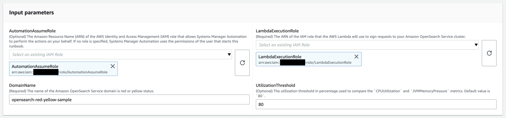
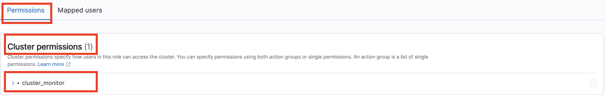
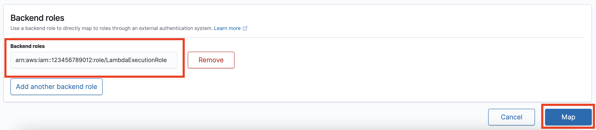

# `AWSSupport-TroubleshootOpenSearchRedYellowCluster`

**Description**

`AWSSupport-TroubleshootOpenSearchRedYellowCluster` automation runbook is used to
identify the cause for [red](../../../opensearch-service/latest/developerguide/handling-errors.md#handling-errors-red-cluster-status "../../../opensearch-service/latest/developerguide/handling-errors.md#handling-errors-red-cluster-status") or [yellow](../../../opensearch-service/latest/developerguide/handling-errors.md#handling-errors-yellow-cluster-status "../../../opensearch-service/latest/developerguide/handling-errors.md#handling-errors-yellow-cluster-status") cluster health status and guide you through changing the cluster back to
green.

**How does it work?**

The runbook `AWSSupport-TroubleshootOpenSearchRedYellowCluster` helps you
troubleshoot the cause of red or yellow cluster and provides the next steps to resolve this
issue by analyzing the cluster configuration and resource utilization.

The runbook performs the following steps:

- Calls the [DescribeDomain](../../../opensearch-service/latest/APIReference/API_DescribeDomain.md "../../../opensearch-service/latest/APIReference/API_DescribeDomain.md") API against the target domain to get the cluster
  configuration.
- Checks if the OpenSearch Service domain is internet-based (public) or [Amazon Virtual Private Cloud (VPC)-based](../../../opensearch-service/latest/developerguide/vpc.md "../../../opensearch-service/latest/developerguide/vpc.md").
- Creates a public or [Amazon VPC-based](../../../lambda/latest/dg/foundation-networking.md "../../../lambda/latest/dg/foundation-networking.md") AWS Lambda
  function depending on the cluster configuration. Note: The Lambda function contains
  the troubleshooting code that run the OpenSearch Service APIs against the cluster to determine
  why the cluster is in red or yellow state.
- Deletes the Lambda function.
- Displays the checks performed and the next recommended steps to resolve the red
  or yellow cluster issue.
  **Document type**

Automation

**Owner**

Amazon

**Platforms**

Linux, macOS, Windows

**Parameters**

**Required IAM permissions**

The `AutomationAssumeRole` parameter requires the following actions to
use the runbook successfully.

- `cloudformation:CreateStack`
- `cloudformation:DescribeStacks`
- `cloudformation:DescribeStackEvents`
- `cloudformation:DeleteStack`
- `lambda:CreateFunction`
- `lambda:DeleteFunction`
- `lambda:InvokeFunction`
- `lambda:GetFunction`
- `es:DescribeDomain`
- `es:DescribeDomainConfig`
- `ec2:DescribeSecurityGroups`
- `ec2:DescribeSubnets`
- `ec2:DescribeVpcs`
- `ec2:DescribeNetworkInterfaces`
- `ec2:CreateNetworkInterface`
- `ec2:DeleteNetworkInterface`
- `ec2:DescribeInstances`
- `ec2:AttachNetworkInterface`
- `cloudwatch:GetMetricData`
- `iam:PassRole`
  The `LambdaExecutionRole` parameter requires the following actions to
  successfully use the runbook:

- `es:ESHttpGet`
- `ec2:CreateNetworkInterface`
- `ec2:DescribeNetworkInterfaces`
- `ec2:DeleteNetworkInterface`
  Overview of `LambdaExecutionRole` policy:

The following is an example of a Lambda function's execution role (AWS Identity and Access Management (IAM) role)
that grants the function permission to access AWS services and resources required by this
runbook. For more information, see [Lambda execution role](../../../lambda/latest/dg/lambda-intro-execution-role.md "../../../lambda/latest/dg/lambda-intro-execution-role.md").

###### Note

The `ec2:DescribeNetworkInterfaces`,
`ec2:CreateNetworkInterface`, and `ec2:DeleteNetworkInterface`
are only required if your OpenSearch Service cluster is [Amazon VPC-based](../../../opensearch-service/latest/developerguide/vpc.md "../../../opensearch-service/latest/developerguide/vpc.md") to
allow the Lambda function to create and manage the Amazon VPC network interfaces. For more
information, see [Connecting outbound
networking to resources in a Amazon VPC](../../../lambda/latest/dg/configuration-vpc.md#vpc-permissions "../../../lambda/latest/dg/configuration-vpc.md#vpc-permissions") and [Lambda execution
role](../../../lambda/latest/dg/lambda-intro-execution-role.md "../../../lambda/latest/dg/lambda-intro-execution-role.md").

JSON

```
`{
 "Version":"2012-10-17",
 "Statement": [
 {
 "Effect": "Allow",
 "Action": "es:ESHttpGet",
 "Resource": [
 "arn:aws:es:`us-east-1`:`111122223333`:domain/`domain-name`/",
 "arn:aws:es:`us-east-1`:`111122223333`:domain/`domain-name`/_cluster/health",
 "arn:aws:es:`us-east-1`:`111122223333`:domain/`domain-name`/_cat/indices",
 "arn:aws:es:`us-east-1`:`111122223333`:domain/`domain-name`/_cat/allocation",
 "arn:aws:es:`us-east-1`:`111122223333`:domain/`domain-name`/_cluster/allocation/explain"
 ]
 },
 {
 "Condition": {
 "ArnLikeIfExists": {
 "ec2:Vpc": "arn:aws:ec2:`us-east-1`:`111122223333`:vpc/`vpc_id`"
 }
 },
 "Action": [
 "ec2:DeleteNetworkInterface",
 "ec2:CreateNetworkInterface",
 "ec2:DescribeNetworkInterfaces",
 "ec2:UnassignPrivateIpAddresses",
 "ec2:AssignPrivateIpAddresses"
 ],
 "Resource": "*",
 "Effect": "Allow"
 }
 ]
}`

```

**Instructions**

Follow these steps to configure the automation:

1. Navigate to the [AWSSupport-TroubleshootOpenSearchRedYellowCluster](https://console.aws.amazon.com/systems-manager/documents/AWSSupport-TroubleshootOpenSearchRedYellowCluster/description "https://console.aws.amazon.com/systems-manager/documents/AWSSupport-TroubleshootOpenSearchRedYellowCluster/description") in the AWS Systems Manager
   console.
2. Select Execute automation.
3. For the input parameters enter the following:
   - **AutomationAssumeRole (Optional):**

   The Amazon Resource Name (ARN) of the AWS Identity and Access Management (IAM) role that allows Systems Manager
   Automation to perform the actions on your behalf. If no role is specified,
   Systems Manager Automation uses the permissions of the user that starts this
   runbook.
   - **LambdaExecutionRole (Required):**

   The ARN of the IAM role that Lambda will use to sign requests to your
   Amazon OpenSearch Service cluster.
   - **DomainName (Required):**

   The name of the OpenSearch Service domain with red or yellow cluster health
   status.
   - **UtilizationThreshold (Optional):**

   The utilization threshold percentage used to compare the CPUUtilization
   and JVMMemoryPressure metrics. Default value is 80.

 4. If you have enabled [fine-grained access
control](../../../opensearch-service/latest/developerguide/fgac.md "../../../opensearch-service/latest/developerguide/fgac.md") on an OpenSearch Service cluster, make sure that the
`LambdaExecutionRole` role arn is mapped to a role with at least
`cluster_monitor` permission.



 5. Select Execute. 6. The automation initiates. 7. The automation runbook performs the following steps:

    * **GetClusterConfiguration:**


    Fetches the OpenSearch Service cluster configuration.
    * **CreateAWSLambdaFunctionStack:**


    Creates a temporary Lambda function in your account using AWS CloudFormation. The Lambda
     function is used to run the OpenSearch Service APIs.
    * **WaitForAWSLambdaFunctionStack:**


    Waits for the CloudFormation stack to complete.
    * **GetClusterMetricsFromCloudWatch:**


    Gets the Amazon CloudWatch ClusterStatus, CPUUtilization, and JVMMemoryPressure
     OpenSearch Service cluster related metrics and its creation date.
    * **RunOpenSearchAPIs:**


    Uses the Lambda function to call the OpenSearch Service APIs and analyze the cluster
     metrics data to diagnose the cause for the red or yellow cluster
     status.
    * **DeleteAWSLambdaFunctionStack:**


    Deletes the Lambda function created by this automation in your
     account.

8. After completed, review the Outputs section for the detailed results of the
   execution.
   - **RootCause:**

   Provides an overview of the identified cause for cluster health to be in
   red or yellow state.
   - **IssueDescription:**

   Provides details for why the cluster is in red or yellow state and
   possible steps to return the cluster to green state.

**References**

Systems Manager Automation

- [Run this Automation (console)](https://console.aws.amazon.com/systems-manager/automation/execute/AWSSupport-TroubleshootOpenSearchRedYellowCluster "https://console.aws.amazon.com/systems-manager/automation/execute/AWSSupport-TroubleshootOpenSearchRedYellowCluster")
- [Run an
  automation](../../../systems-manager/latest/userguide/automation-working-executing.md "../../../systems-manager/latest/userguide/automation-working-executing.md")
- [Setting up an
  Automation](../../../systems-manager/latest/userguide/automation-setup.md "../../../systems-manager/latest/userguide/automation-setup.md")
- [Support Automation
  Workflows landing page](https://aws.amazon.com/premiumsupport/technology/saw/ "https://aws.amazon.com/premiumsupport/technology/saw/")
  AWS service documentation

- Refer to[Troubleshooting Amazon OpenSearch Service](../../../opensearch-service/latest/developerguide/handling-errors.md "../../../opensearch-service/latest/developerguide/handling-errors.md") for more information
