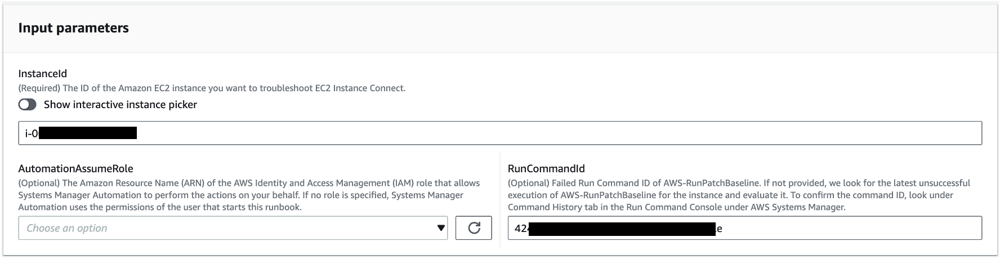
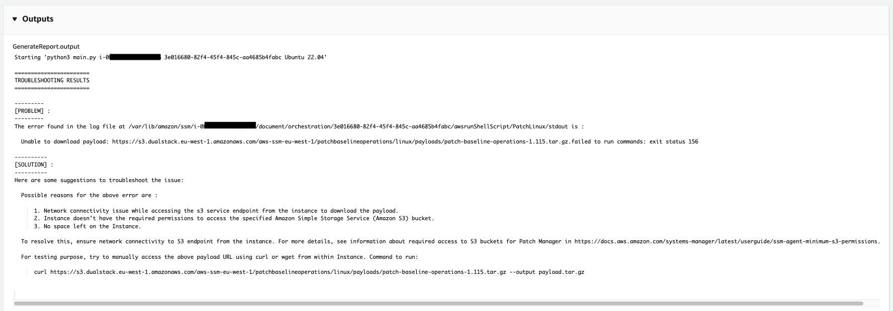

# `AWSSupport-TroubleshootPatchManagerLinux`

**Description**

The `AWSSupport-TroubleshootPatchManagerLinux` runbook troubleshoots common
issues that can cause a patch failure on Linux-based managed nodes using Patch Manager, a tool in
AWS Systems Manager. The main goal of this runbook is to identify the patch command failure root cause
and suggest a remediation plan.

**How does it work?**

The `AWSSupport-TroubleshootPatchManagerLinux` runbook considers the couple
instance ID/Command ID provided by you for troubleshooting. If no Command ID is provided, it
selects the latest failed patch command within the last 30 days on the provided instance.
After checking the command status, the prerequisites fulfillment, and the OS distribution,
the runbook downloads and runs a log analyzer package. The output includes the issue root
cause as well as the needed action to fix the issue.

**Document Type**

Automation

**Owner**

Amazon

**Platforms**

- Amazon Linux 2 and AL2023
- Red Hat Enterprise Linux 8.X and 9.X
- Centos 8.X and 9.X
- SUSE 15.X
  **Parameters**

**Required IAM permissions**

The `AutomationAssumeRole` parameter requires the following actions to
use the runbook successfully.

- `ssm:SendCommand`
- `ssm:DescribeDocument`
- `ssm:GetCommandInvocation`
- `ssm:ListCommands`
- `ssm:DescribeInstanceInformation`
- `ssm:ListCommandInvocations`
- `ssm:GetDocument`
- `ssm:DescribeAutomationExecutions`
- `ssm:GetAutomationExecution`

**Instructions**

Follow these steps to configure the automation:

1. Navigate to the [`AWSSupport-TroubleshootPatchManagerLinux`](https://console.aws.amazon.com/systems-manager/documents/AWSSupport-TroubleshootPatchManagerLinux/description "https://console.aws.amazon.com/systems-manager/documents/AWSSupport-TroubleshootPatchManagerLinux/description") in the
   AWS Systems Manager console.
2. Select Execute automation.
3. For the input parameters, enter the following:
   - **InstanceId (Required):**

   Use the interactive instance picker to choose the ID of the Linux Based
   SSM Managed Node (Amazon Elastic Compute Cloud (Amazon EC2) or Hybrid Activated server) that the
   patch command failed against, or manually enter the ID of the SSM Managed
   instance.
   - **AutomationAssumeRole (Optional):**

   Enter the ARN of the IAM role that allows Automation to perform actions
   on your behalf. If a role isn't specified, Automation uses the permissions
   of the user who starts this runbook.
   - **RunCommandId (Optional):**

   Enter the Failed Run Command ID of the `AWS-RunPatchBaseline`
   document. If you don't provide a Command ID, the runbook will look for the
   latest failed patch command within the last 30 days on the selected
   instance.

 4. Select Execute. 5. The automation initiates. 6. The document performs the following steps:

    * **CheckConcurrency:**

    Ensures that there is only one execution of this runbook targeting the
     same instance. If the runbook finds another execution in progress targeting
     the same instance, it returns an error and ends.
    * **ValidateCommandID:**

    Validates if the provided Command ID, as input parameter, was executed for
     the `AWS-RunPatchBaseline` SSM Document. If no Command ID is
     provided, the runbook will consider the latest failed execution of
     `AWS-RunPatchBaseline` within the last 30 days on the
     selected instance.
    * **BranchOnCommandStatus:**

    Confirms that the status of the provided command is failed. Otherwise, the
     runbook ends the execution and generates a report stating that the provided
     command was successfully executed.
    * **VerifyPrerequistes:**

    Confirms that the Prerequisites mentioned above are fulfilled.
    * **GetPlatformDetails:**

    Retrieves the Operating System (OS) distribution and version.
    * **GetDownloadURL:**

    Retrieves the download URL for the PatchManager Log Analyzer
     package.
    * **EvaluatePatchManagerLogs:**

    Downloads and executes the PatchManager Log Analyzer python package on the
     instance to evaluate the log file.
    * **GenerateReport:**

    Generates a final report of the runbook execution that includes the
     identified problem and suggested solution.

7. After completed, review the Outputs section for the detailed results of the
   execution:

**References**

Systems Manager Automation

- [Run this Automation (console)](https://console.aws.amazon.com/systems-manager/documents/AWSSupport-TroubleshootPatchManagerLinux/description "https://console.aws.amazon.com/systems-manager/documents/AWSSupport-TroubleshootPatchManagerLinux/description")
- [Run an
  automation](../../../systems-manager/latest/userguide/automation-working-executing.md "../../../systems-manager/latest/userguide/automation-working-executing.md")
- [Setting up an
  Automation](../../../systems-manager/latest/userguide/automation-setup.md "../../../systems-manager/latest/userguide/automation-setup.md")
- [Support Automation
  Workflows landing page](https://aws.amazon.com/premiumsupport/technology/saw/ "https://aws.amazon.com/premiumsupport/technology/saw/")
