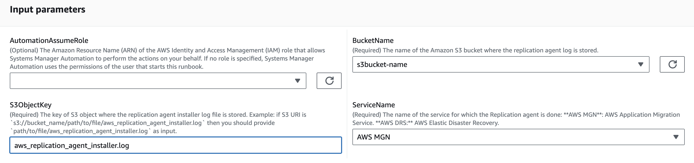
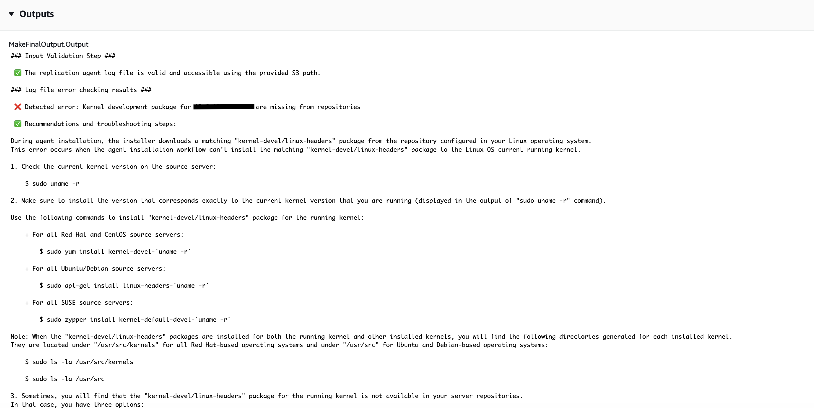

# `AWSSupport-TroubleshootLinuxMGNDRSAgentLogs`

**Description**

`AWSSupport-TroubleshootLinuxMGNDRSAgentLogs` automation runbook is used to
detect common errors when installing the AWS Application Migration Service (AWS MGN) and AWS Elastic Disaster Recovery (AWS DRS)
replication agents in Linux servers to migrate source servers to the AWS cloud.

**How does it work?**

The runbook `AWSSupport-TroubleshootLinuxMGNDRSAgentLogs` takes the Amazon Simple Storage Service
(Amazon S3) path where the AWS MGN or AWS DRS installation log
`aws_replication_agent_installer.log` is uploaded as parameter. Then, it
performs the following tasks:

- **Validation:** Checks if the provided log file is
  valid and that it contains at least one agent installation.
- **Parsing:** Thoroughly parses the latest agent
  installation in the log file for known AWS MGN or AWS DRS errors.
- **Error Detection and resolution:** Based on the
  parsing, it detects and lists any errors or issues during the agent installation
  process. For each detected error, the runbook provides detailed steps to help
  resolve or mitigate the issue.

[Run this Automation (console)](https://console.aws.amazon.com/systems-manager/automation/execute/AWSSupport-TroubleshootLinuxMGNDRSAgentLogs "https://console.aws.amazon.com/systems-manager/automation/execute/AWSSupport-TroubleshootLinuxMGNDRSAgentLogs")

**Document type**

Automation

**Owner**

Amazon

**Platforms**

Linux

**Parameters**

**Required IAM permissions**

The `AutomationAssumeRole` parameter requires the following actions to
use the runbook successfully.

- `s3:GetObject`
- `s3:ListBucket`

**Instructions**

Follow these steps to configure the automation:

1. Navigate to [`AWSSupport-TroubleshootLinuxMGNDRSAgentLogs`](https://console.aws.amazon.com/systems-manager/documents/AWSSupport-TroubleshootLinuxMGNDRSAgentLogs/description "https://console.aws.amazon.com/systems-manager/documents/AWSSupport-TroubleshootLinuxMGNDRSAgentLogs/description") in Systems Manager
   under Documents.
2. Select Execute automation.
3. For the input parameters, enter the following:
   - **AutomationAssumeRole (Optional):**

   The Amazon Resource Name (ARN) of the AWS AWS Identity and Access Management (IAM) role that
   allows Systems Manager Automation to perform the actions on your behalf. If no role is
   specified, Systems Manager Automation uses the permissions of the user who starts this
   runbook.
   - **BucketName (Required):**

   The name of the Amazon S3 bucket where the replication agent log is
   stored.
   - **S3ObjectKey (Required):**

   The key of the Amazon S3 object where the replication agent installer log file
   is stored. Example: If the Amazon S3 URI is
   `s3://bucket_name/path/to/file/aws_replication_agent_installer.log`,
   then you should input
   `path/to/file/aws_replication_agent_installer.log`.
   - **ServiceName (Required):**

   The name of the service for which the replication agent is installed.
   Allowed values: `AWS MGN` or `AWS DRS`

 4. Select Execute. 5. The automation initiates. 6. The document performs the following steps:

    * **`ValidateInput`**

    Ensures that the replication agent log file is valid and accessible using
     the provided Amazon S3 bucket name and path to the object, then returns the byte
     number of the latest agent installation.
    * **`CheckReplicationAgentLogErrors`**

    Reads the replication agent log file starting from the latest installation
     byte and search for known AWS MGN or AWS DRS errors.
    * **`MakeFinalOutput`**

     Creates the output from the previous checks including information about
     the errors found and troubleshooting recommendations.

7. After completed, review the Outputs section for the detailed results of the
   execution:

**References**

Systems Manager Automation

- [Run this Automation (console)](https://console.aws.amazon.com/systems-manager/documents/AWSSupport-TroubleshootLinuxMGNDRSAgentLogs/description "https://console.aws.amazon.com/systems-manager/documents/AWSSupport-TroubleshootLinuxMGNDRSAgentLogs/description")
- [Run an
  automation](../../../systems-manager/latest/userguide/automation-working-executing.md "../../../systems-manager/latest/userguide/automation-working-executing.md")
- [Setting up an
  Automation](../../../systems-manager/latest/userguide/automation-setup.md "../../../systems-manager/latest/userguide/automation-setup.md")
- [Support Automation
  Workflows landing page](https://aws.amazon.com/premiumsupport/technology/saw/ "https://aws.amazon.com/premiumsupport/technology/saw/")
