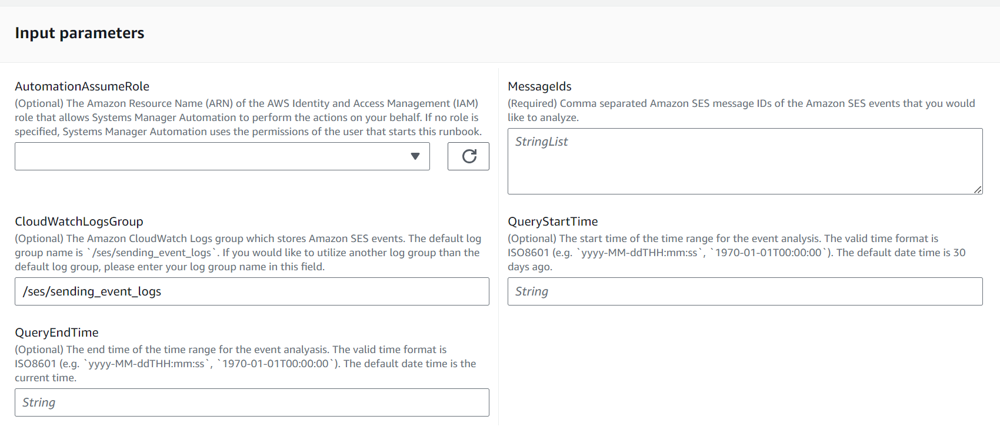
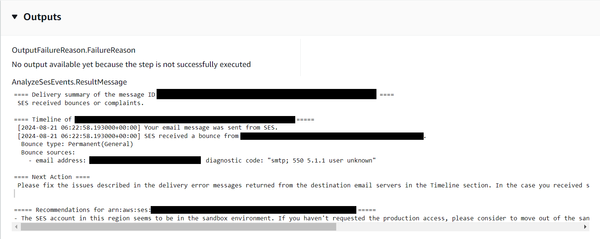

# `AWSSupport-AnalyzeSESMessageSendingStatus`

###### Description

The `AWSSupport-AnalyzeSESMessageSendingStatus` automation runbook
summarizes the email delivery status of undelivered email messages and gives you advice
to solve why it was undelivered. The runbook retrieves Amazon Simple Email Service (Amazon SES) email sending
events stored in an Amazon CloudWatch Logs group published by Amazon SES. For Amazon SES event publishing
details, please refer to [Monitoring using Amazon Simple Email Service event publishing](../../../ses/latest/dg/monitor-using-event-publishing.md "../../../ses/latest/dg/monitor-using-event-publishing.md"). The
runbook also provides a summary and the timeline of the email deliveries as well as
recommendations which can potentially affect undelivered email messages. You can find
those messages in the output section of each executions. Please note that this runbook
can only troubleshoot the events after the event store deployment.

**How does it work?**

The runbook performs the following steps:

- Checks concurrent automation executions for the same CloudWatch Logs group.

- Analyze Amazon SES events corresponding to message IDs given by the automation
  parameter.

- Output delivery summaries to the output section of the automation
  execution.

###### Important

- Before executing this runbook, you have to store published Amazon SES events to a
  CloudWatch Logs log group specified by the automation parameter. This runbook only
  analyzes Amazon SES events stored in the log group.

[Run this Automation (console)](https://console.aws.amazon.com/systems-manager/automation/execute/AWSSupport-AnalyzeSESMessageSendingStatus "https://console.aws.amazon.com/systems-manager/automation/execute/AWSSupport-AnalyzeSESMessageSendingStatus")

**Document type**

Automation

**Owner**

Amazon

**Platforms**

Linux, macOS, Windows

**Parameters**

**Required IAM permissions**

The `AutomationAssumeRole` parameter requires the following actions to
use the runbook successfully.

- `logs:StartQuery`
- `logs:GetQueryResults`
- `ses:GetIdentityMailFromDomainAttributes`
- `ses:GetSendQuota`
- `ssm:DescribeAutomationExecutions`
- `ssm:GetAutomationExecution`

**Instructions**

Follow these steps to configure the automation:

1. Navigate to [`AWSSupport-AnalyzeSESMessageSendingStatus`](https://console.aws.amazon.com/systems-manager/documents/AWSSupport-AnalyzeSESMessageSendingStatus/description "https://console.aws.amazon.com/systems-manager/documents/AWSSupport-AnalyzeSESMessageSendingStatus/description") in Systems Manager
   under Documents.
2. Select Execute automation.
3. For the input parameters, enter the following:
   - **AutomationAssumeRole (Optional):**

   The Amazon Resource Name (ARN) of the AWS AWS Identity and Access Management (IAM) role that
   allows Systems Manager Automation to perform the actions on your behalf. If no role is
   specified, Systems Manager Automation uses the permissions of the user who starts this
   runbook.
   - **MessageIds (Required)**

   Comma separated Amazon Simple Email Service message IDs of the Amazon Simple Email Service events that you
   would like to analyze.
   - **CloudWatchLogsGroup (Optional)**

   The Amazon CloudWatch Logs group which stores Amazon Simple Email Service events. The default log group
   name is `/ses/sending\_event\_logs`. If you would like to utilize another log
   group than the default log group, please enter your log group name in this
   field.",
   - **QueryStartTime (Optional)**

   The start time of the time range for the event analysis. The valid time
   format is ISO8601 (e.g. `yyyy-MM-ddTHH:mm:ss`, `1970-01-01T00:00:00`). The
   default date time is 30 days ago.
   - **QueryEndTime (Optional)**

   The end time of the time range for the event analyasis. The valid time
   format is ISO8601 (e.g. `yyyy-MM-ddTHH:mm:ss`, `1970-01-01T00:00:00`). The
   default date time is the current time.

 4. Select Execute. 5. The automation initiates. 6. The document performs the following steps:

    * **`CheckConcurrency:`**

    Ensures that there is only one execution of this runbook targeting the
     Amazon CloudWatch Logs group. If the runbook finds another execution targeting the same
     log group, it returns an error and ends.
    * **`AnalyzeSesEvents:`**

    Analyze Amazon Simple Email Service events stored in the Amazon CloudWatch Logs group specified by the
     automation parameter.
    * **`OutputFailureReason:`**

    Output execution step failure messages when the
     `AnalyzeSESMessageSendingStatus` step failed.

7. After completed, review the Outputs section for the detailed results of the
   execution:
   - **Output of analysis on an undelivered email message
     because of a bounce**

   Output of an automation execution for an email message that didn't reach
   the destination mailbox because of a bounce.

**References**

Systems Manager Automation

- [Run this Automation (console)](https://console.aws.amazon.com/systems-manager/documents/AWSSupport-AnalyzeSESMessageSendingStatus/description "https://console.aws.amazon.com/systems-manager/documents/AWSSupport-AnalyzeSESMessageSendingStatus/description")
- [Run an
  automation](../../../systems-manager/latest/userguide/automation-working-executing.md "../../../systems-manager/latest/userguide/automation-working-executing.md")
- [Setting up an
  Automation](../../../systems-manager/latest/userguide/automation-setup.md "../../../systems-manager/latest/userguide/automation-setup.md")
- [Support Automation
  Workflows landing page](https://aws.amazon.com/premiumsupport/technology/saw/ "https://aws.amazon.com/premiumsupport/technology/saw/")
