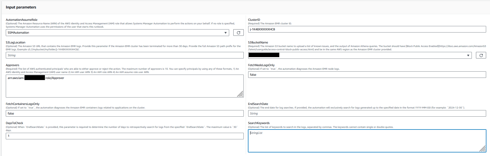
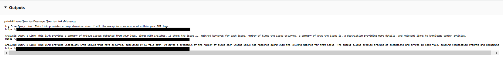

# `AWSSupport-DiagnoseEMRLogsWithAthena`

**Description**

The `AWSSupport-DiagnoseEMRLogsWithAthena` runbook helps diagnose Amazon EMR logs
using Amazon Athena in integration with AWS Glue Data Catalog. Amazon Athena is used to query the
Amazon EMR log files for containers, node logs, or both, with optional parameters for specific
date ranges or keyword-based searches.

The runbook can automatically retrieve the Amazon EMR log location for an existing cluster, or
you can specify the Amazon S3 log location. To analyze the logs, the runbook:

- Creates an AWS Glue database and executes Amazon Athena Data Definition Language
  (DDL) queries on the Amazon EMR Amazon S3 log location to create tables for cluster logs and a
  list of known issues.
- Executes Data Manipulation Language (DML) queries to search for known issue
  patterns in the Amazon EMR logs. The queries return a list of detected issues, their
  occurrence count, and the number of matched keywords by Amazon S3 file path.
- The results are uploaded to an Amazon S3 bucket you specify under the prefix
  `saw_diagnose_EMR_known_issues`.
- The runbook returns the Amazon Athena query results, highlighting findings,
  recommendations, and references to Amazon Knowledge Center (KC) articles sourced
  from a predefined subset.
- Upon completion or failure, the AWS Glue database and the known issues files
  uploaded to the Amazon S3 bucket are deleted.

**How does it work?**

The `AWSSupport-DiagnoseEMRLogsWithAthena` perform analysis of Amazon EMR logs
using Amazon Athena to detect errors and highlight findings, recommendations and relevant
Knowledge Center articles.

The runbook performs the following steps:

- Get Amazon EMR cluster log location using cluster ID or input Amazon S3 location to retrieve
  log location and size.
- Provide Athena costs estimate based on log location size.
- Get approval to proceed by requesting approval from designated IAM principals
  before running Athena queries and continuing to the next steps.
- Upload known issues to the specified Amazon S3 bucket, creates an AWS Glue database
  and tables.
- Execute Athena queries on the Amazon EMR logs data. Queries can search by date range,
  keywords, both criteria, or run without filters based on the provided inputs.
- Analyze results to highlight findings, recommendations, and relevant KC
  articles.
- Output links for Amazon Athena DML queries results.
- Clean up the environment by removing created database, tables, and uploaded known
  issues.
  **Document type**

Automation

**Owner**

Amazon

**Platforms**

/

The AutomationAssumeRole parameter requires the following actions to successfully use the
runbook:

- athena:GetQueryExecution
- athena:StartQueryExecution
- athena:GetPreparedStatement
- athena:CreatePreparedStatement
- glue:GetDatabase
- glue:CreateDatabase
- glue:DeleteDatabase
- glue:CreateTable
- glue:GetTable
- glue:DeleteTable
- elasticmapreduce:DescribeCluster
- s3:ListBucket
- s3:GetBucketVersioning
- s3:ListBucketVersions
- s3:GetBucketPublicAccessBlock
- s3:GetBucketPolicyStatus
- s3:GetObject
- s3:GetBucketLocation
- pricing:GetProducts
- pricing:GetAttributeValues
- pricing:DescribeServices
- pricing:ListPriceLists

###### Important

To restrict access to only the resources needed by this automation, attach the
following policy to the IAM role that trusts the SSM Service. Replace the Partition,
Region and Account with the appropriate values for the partition, region and account
number where the run book is executed.

JSON

```
`{
 "Version":"2012-10-17",
 "Statement": [
 {
 "Effect": "Allow",
 "Action": [
 "elasticmapreduce:DescribeCluster",
 "glue:GetDatabase",
 "athena:GetQueryExecution",
 "athena:StartQueryExecution",
 "athena:GetPreparedStatement",
 "athena:CreatePreparedStatement",
 "s3:ListBucket",
 "s3:GetBucketVersioning",
 "s3:ListBucketVersions",
 "s3:GetBucketPublicAccessBlock",
 "s3:GetBucketPolicyStatus",
 "s3:GetObject",
 "s3:GetBucketLocation",
 "pricing:GetProducts",
 "pricing:GetAttributeValues",
 "pricing:DescribeServices",
 "pricing:ListPriceLists"
 ],
 "Resource": "*"
 },
 {
 "Sid": "RestrictPutObjects",
 "Effect": "Allow",
 "Action": [
 "s3:PutObject"
 ],
 "Resource": [
 "arn:aws:s3:::*/*/results/*",
 "arn:aws:s3:::*/*/saw_diagnose_emr_known_issues/*"
 ]
 },
 {
 "Sid": "RestrictDeleteAccess",
 "Effect": "Allow",
 "Action": [
 "s3:DeleteObject",
 "s3:DeleteObjectVersion"
 ],
 "Resource": [
 "arn:aws:s3:::*/*/saw_diagnose_emr_known_issues/*"
 ]
 },
 {
 "Effect": "Allow",
 "Action": [
 "glue:GetDatabase",
 "glue:CreateDatabase",
 "glue:DeleteDatabase"
 ],
 "Resource": [
 "arn:aws:glue:`us-east-1`:`111122223333`:database/saw_diagnose_emr_database_*",
 "arn:aws:glue:`us-east-1`:`111122223333`:table/saw_diagnose_emr_database_*/*",
 "arn:aws:glue:`us-east-1`:`111122223333`:userDefinedFunction/saw_diagnose_emr_database_*/*",
 "arn:aws:glue:`us-east-1`:`111122223333`:catalog"
 ]
 },
 {
 "Effect": "Allow",
 "Action": [
 "glue:CreateTable",
 "glue:GetTable",
 "glue:DeleteTable"
 ],
 "Resource": [
 "arn:aws:glue:`us-east-1`:`111122223333`:table/saw_diagnose_emr_database_*/saw_diagnose_emr_known_issues",
 "arn:aws:glue:`us-east-1`:`111122223333`:table/saw_diagnose_emr_database_*/saw_diagnose_emr_logs_table",
 "arn:aws:glue:`us-east-1`:`111122223333`:table/saw_diagnose_emr_database_*/j_*",
 "arn:aws:glue:`us-east-1`:`111122223333`:database/saw_diagnose_emr_database_*",
 "arn:aws:glue:`us-east-1`:`111122223333`:catalog"
 ]
 }
 ]
}`

```

**Instructions**

Follow these steps to configure the automation:

1. Navigate [AWSSupport-DiagnoseEMRLogsWithAthena](https://console.aws.amazon.com/systems-manager/documents/AWSSupport-DiagnoseEMRLogsWithAthena/description "https://console.aws.amazon.com/systems-manager/documents/AWSSupport-DiagnoseEMRLogsWithAthena/description") in the AWS Systems Manager under
   Documents.
2. Select Execute automation.
3. For the input parameters enter the following:
   - **AutomationAssumeRole (Optional):**

   The Amazon Resource Name (ARN) of the AWS Identity and Access Management (IAM) role that allows Systems Manager
   Automation to perform the actions on your behalf. If no role is specified,
   Systems Manager Automation uses the permissions of the user that starts this
   runbook.
   - **ClusterID (Required):**

   The Amazon EMR cluster ID.
   - **S3LogLocation (Optional):**

   The Amazon S3 Amazon EMR log location. Input the Path-style URL Amazon S3 location, for
   example: `s3://amzn-s3-demo-bucket/myfolder/j-1K48XXXXXXHCB/`.
   Provide this parameter if the Amazon EMR cluster has been terminated for more
   than `30` days.
   - **S3BucketName (Required):**

   The Amazon S3 bucket name to upload a list of known issues, and the output of
   Amazon Athena queries. The bucket should have [Block Public Access Enabled](../../../AmazonS3/latest/userguide/access-control-block-public-access.md "../../../AmazonS3/latest/userguide/access-control-block-public-access.md") and be in the same AWS region and
   account as the Amazon EMR cluster.
   - **Approvers (Required):**

   The list of AWS authenticated principals who are able to either approve
   or reject the action. You can specify principals by using any of the
   following formats: user name, user ARN, IAM role ARN, or IAM assume
   role ARN. The maximum number of approvers is 10.
   - **FetchNodeLogsOnly (Optional):**

   If set to `true`, the automation diagnoses the Amazon EMR
   application containers logs. The default value is `false`.
   - **FetchContainersLogsOnly
     (Optional):**

   If set to `true`, the automation diagnoses the Amazon EMR
   containers logs. The default value is `false`.
   - **EndSearchDate (Optional):**

   The end date for log searches. If provided, the automation will
   exclusively search for logs generated up to the specified date in the format
   YYYY-MM-DD (for example: `2024-12-30`).
   - **DaysToCheck (Optional):**

   When `EndSearchDate` is provided, this parameter is required
   to determine the number of days to retrospectively search for logs from the
   specified `EndSearchDate`. The maximum value is `30`
   days. The default value is `1`.
   - **SearchKeywords (Optional):**

   The list of keywords to search in the logs, separated by commas. The
   keywords cannot contain single or double quotes.

 4. Select **Execute.** 5. The automation initiates. 6. The document performs the following steps:

    * **getLogLocation:**


    Retrieves the Amazon S3 log location by querying the specified Amazon EMR Cluster
     ID. If the automation is unable to query the log location from the Amazon EMR
     cluster ID, the runbook uses the `S3LogLocation` input
     parameter.
    * **branchOnValidLog:**


    Verifies the Amazon EMR logs location. If the location is valid, proceed to
     estimate the Amazon Athena potential costs when executing queries on the Amazon EMR
     logs.
    * **estimateAthenaCosts:**


    Determines the size of Amazon EMR logs and provides a cost estimate for
     executing Athena scans on the log dataset. For non-commercial regions
     (non-AWS partitions), this step just provides the log size without
     estimating costs. Costs can be calculated using the Athena pricing
     documentation in the specified region.
    * **approveAutomation:**


    Waits for the designated IAM principals approval to proceed with the
     next steps of the automation. The approve notification contains the
     estimated cost of Amazon Athena scan on the Amazon EMR logs, and details about the
     resources being provisioned by the automation.
    * **uploadKnownIssuesExecuteAthenaQueries:**


    Uploads the predefined known issues to the Amazon S3 bucket specified in the
     `S3BucketName` parameter. Creates AWS Glue database and
     tables. Executes Amazon Athena queries in the AWS Glue database based on the
     input parameters.
    * **getQueryExecutionStatus:**


    Waits until the Amazon Athena query execution is in `SUCCEEDED`
     state. The Amazon Athena DML query searches for errors and exceptions in Amazon EMR
     cluster logs.
    * **analyzeAthenaResults:**


    Analyzes the Amazon Athena results to provide findings, recommendations, and
     Knowledge Center (KC) articles sourced from a predefined set of
     mappings.
    * **getAnalyzeResultsQuery1ExecutionStatus:**


    Waits until the query execution is in `SUCCEEDED` state. The
     Amazon Athena DML query analyzes the results from the previous DML query. This
     analysis query will return matched exceptions with resolutions and KC
     articles
    * **getAnalyzeResultsQuery2ExecutionStatus:**


    Waits until the query execution is in `SUCCEEDED` state. The
     Amazon Athena DML query analyzes the results from the previous DML query. This
     analysis query will return a list of exceptions/errors detected in each Amazon S3
     log path.
    * **printAthenaQueriesMessage:**


    Prints links for the Amazon Athena DML queries results.
    * **cleanupResources:**


    Clean-ups resources by deleting the created AWS Glue database and delete
     known issues files that were created in the Amazon EMR logs bucket.

7. After completed, review the Outputs section for the detailed results of the
   execution:

**Output provides three links for Athena query
results:**

    * List of all errors and frequently occurred exceptions found in the Amazon EMR
     cluster logs, along with the corresponding log locations (Amazon S3
     prefix).
    * Summary of unique known exceptions matched in the Amazon EMR logs, along with
     recommended resolutions and KC articles to help in troubleshooting.
    * Details on where specific errors and exceptions appear in the Amazon S3 log
     paths, to support further diagnosis.



**References**

Systems Manager Automation

- [Run this Automation (console)](https://console.aws.amazon.com/systems-manager/documents/AWSSupport-DiagnoseEMRLogsWithAthena/description "https://console.aws.amazon.com/systems-manager/documents/AWSSupport-DiagnoseEMRLogsWithAthena/description")
- [Run an
  automation](../../../systems-manager/latest/userguide/automation-working-executing.md "../../../systems-manager/latest/userguide/automation-working-executing.md")
- [Setting up an
  Automation](../../../systems-manager/latest/userguide/automation-setup.md "../../../systems-manager/latest/userguide/automation-setup.md")
- [Support Automation
  Workflows landing page](https://aws.amazon.com/premiumsupport/technology/saw/ "https://aws.amazon.com/premiumsupport/technology/saw/")
  AWS service documentation

- Refer to[Troubleshooting Amazon EMR
  Clusters](../../../emr/latest/ManagementGuide/emr-troubleshoot.md "../../../emr/latest/ManagementGuide/emr-troubleshoot.md") for more information
