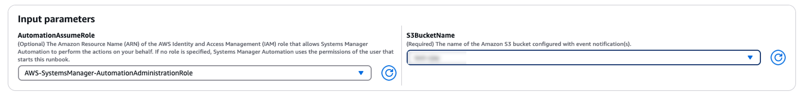
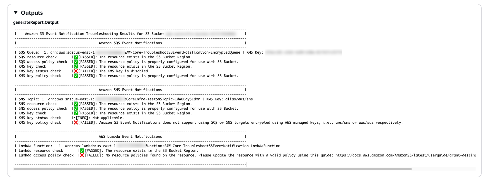

# `AWSSupport-TroubleshootS3EventNotifications`

**Description**

The `AWSSupport-TroubleshootS3EventNotifications` AWS Systems Manager automation runbook
helps troubleshoot Amazon Simple Storage Service (Amazon S3) Bucket Event Notifications configured with AWS Lambda
Functions, Amazon Simple Notification Service (Amazon SNS) Topics, or Amazon Simple Queue Service (Amazon SQS) Queues. It provides a
configuration settings report of the different resources configured with the the Amazon S3 Bucket
as a destination event notification.

**How does it work?**

The runbook performs the following steps:

- Checks if the Amazon S3 Bucket exists in the same account where
  `AWSSupport-TroubleshootS3EventNotifications` is executed.
- Fetches the destination resources (AWS Lambda Function, or Amazon SNS Topic or Amazon SQS
  queue) configured as Event Notifications for the Amazon S3 Bucket using the [GetBucketNotificationConfiguration](../../../AmazonS3/latest/API/API_GetBucketNotificationConfiguration.md "../../../AmazonS3/latest/API/API_GetBucketNotificationConfiguration.md") API.
- Validates that the destination resource exists, then reviews the resource-based
  policy of the destination resources to determine if Amazon S3 is allowed to publish to
  the destination.
- If you encrypted the destination with an AWS Key Management Service (AWS KMS) key, the key policy is
  checked to determine if Amazon S3 access is allowed.
- Generates a report of all the destination resource checks.

###### Important

- This runbook can only evaluate event notification configurations if the Amazon S3
  bucket owner is the same as the AWS account owner where the automation runbook
  is being executed.
- Additionally, this runbook cannot evaluate policies on destination resources
  that are hosted in another AWS account.

[Run this Automation (console)](https://console.aws.amazon.com/systems-manager/automation/execute/AWSSupport-TroubleshootS3EventNotifications "https://console.aws.amazon.com/systems-manager/automation/execute/AWSSupport-TroubleshootS3EventNotifications")

**Document type**

Automation

**Owner**

Amazon

**Platforms**

Linux, macOS, Windows

**Parameters**

- AutomationAssumeRole

Type: String

Description: (Optional) The Amazon Resource Name (ARN) of the AWS Identity and Access Management
(IAM) role that allows Systems Manager Automation to perform the actions on your
behalf. If no role is specified, Systems Manager Automation uses the permissions of
the user that starts this runbook.

- S3BucketName

Type: `AWS::S3::Bucket::Name`

Description: (Required) The name of the Amazon S3 bucket configured with event
notification(s).
**Required IAM permissions**

The `AutomationAssumeRole` parameter requires the following actions to
use the runbook successfully.

- `s3:GetBucketLocation`
- `s3:ListAllMyBuckets`
- `s3:GetBucketNotification`
- `sqs:GetQueueAttributes`
- `sqs:GetQueueUrl`
- `sns:GetTopicAttributes`
- `kms:GetKeyPolicy`
- `kms:DescribeKey`
- `kms:ListAliases`
- `lambda:GetPolicy`
- `lambda:GetFunction`
- `iam:GetContextKeysForCustomPolicy`
- `iam:SimulateCustomPolicy`
- `iam:ListRoles`
- `ssm:DescribeAutomationStepExecutions`

**Example IAM Policy for the Automation Assume Role**

JSON

```
`{
 "Version":"2012-10-17",
 "Statement": [
 {
 "Sid": "S3Permission",
 "Effect": "Allow",
 "Action": [
 "s3:GetBucketLocation",
 "s3:ListAllMyBuckets"
 ],
 "Resource": "*"
 },
 {
 "Sid": "S3PermissionGetBucketNotification",
 "Effect": "Allow",
 "Action": [
 "s3:GetBucketNotification"
 ],
 "Resource": "arn:aws:s3:::`amzn-s3-demo-bucket`"
 },
 {
 "Sid": "SQSPermission",
 "Effect": "Allow",
 "Action": [
 "sqs:GetQueueAttributes",
 "sqs:GetQueueUrl"
 ],
 "Resource": "arn:aws:sqs:`us-east-1`:`111122223333`:*"
 },
 {
 "Sid": "SNSPermission",
 "Effect": "Allow",
 "Action": [
 "sns:GetTopicAttributes"
 ],
 "Resource": "arn:aws:sns:`us-east-1`:`111122223333`:*"
 },
 {
 "Sid": "KMSPermission",
 "Effect": "Allow",
 "Action": [
 "kms:GetKeyPolicy",
 "kms:DescribeKey",
 "kms:ListAliases"
 ],
 "Resource": "arn:aws:kms:`us-east-1`:`111122223333`:key/`key-id`"
 },
 {
 "Sid": "LambdaPermission",
 "Effect": "Allow",
 "Action": [
 "lambda:GetPolicy",
 "lambda:GetFunction"
 ],
 "Resource": "arn:aws:lambda:`us-east-1`:`111122223333`:function:*"
 },
 {
 "Sid": "IAMPermission",
 "Effect": "Allow",
 "Action": [
 "iam:GetContextKeysForCustomPolicy",
 "iam:SimulateCustomPolicy",
 "iam:ListRoles"
 ],
 "Resource": "*"
 },
 {
 "Sid": "SSMPermission",
 "Effect": "Allow",
 "Action": [
 "ssm:DescribeAutomationStepExecutions"
 ],
 "Resource": "*"
 }
 ]
 }`

```

**Instructions**

Follow these steps to configure the automation:

1. Navigate to [`AWSSupport-TroubleshootS3EventNotifications`](https://console.aws.amazon.com/systems-manager/documents/AWSSupport-TroubleshootS3EventNotifications/description "https://console.aws.amazon.com/systems-manager/documents/AWSSupport-TroubleshootS3EventNotifications/description") in Systems Manager
   under Documents.
2. Select Execute automation.
3. For the input parameters, enter the following:
   - **AutomationAssumeRole (Optional):**

   The Amazon Resource Name (ARN) of the AWS AWS Identity and Access Management (IAM) role that
   allows Systems Manager Automation to perform the actions on your behalf. If no role is
   specified, Systems Manager Automation uses the permissions of the user who starts this
   runbook.
   - **S3BucketName (Required):**

   The name of the Amazon S3 bucket configured with event notification(s).

 4. Select Execute. 5. The automation initiates. 6. The document performs the following steps:

    * **ValidateInputs**


    Validates Amazon S3 bucket provided belongs to the same account where the
     automation is executed and fetch the region the bucket is hosted.
    * **GetBucketNotificationConfiguration**


    Calls `GetBucketNotificationConfiguration` API to review Event
     Notifications configured with the Amazon S3 bucket and formats output.
    * **BranchOnSQSResourcePolicy**


    Branches on whether there are Amazon SQS resources in event
     notifications.
    * **ValidateSQSResourcePolicy**


    Validates resource policy on Amazon SQS Queue attributes has
     `sqs:SendMessage` permission for Amazon S3. If the Amazon SQS resource
     is encrypted, checks that encryption is not using default AWS KMS key i.e.
     `aws/sqs` and checks that AWS KMS key policy has permissions
     for Amazon S3.
    * **BranchOnSNSResourcePolicy**


    Branches on whether there are Amazon SNS resources in event
     notifications.
    * **ValidateSNSResourcePolicy**


    Validates resource policy on Amazon SNS Topic attributes has
     `sns:Publish` permission for Amazon S3. If the Amazon SNS resource is
     encrypted, checks that encryption is not using default AWS KMS key i.e.
     `aws/sns` and checks that AWS KMS key policy has permissions
     for Amazon S3.
    * **BranchOnLambdaFunctionResourcePolicy**


    Branches on whether there are AWS Lambda functions in event
     notifications.
    * **ValidateLambdaFunctionResourcePolicy**


    Validates resource policy on AWS Lambda function has
     `lambda:InvokeFunction` permission for Amazon S3.
    * **GenerateReport**


    Returns details of the runbook steps outputs, and recommendations to
     resolve any issue with the event notifications configured with the Amazon S3
     bucket.

7. After completed, review the Outputs section for the detailed results of the
   execution:
   - **Amazon SQS Event Notifications**

   If there are Amazon SQS destination notifications configured with the Amazon S3
   bucket, a list of the Amazon SQS Queues is displayed alongside the results of the
   checks. The report includes Amazon SQS resource check, Amazon SQS access policy check,
   AWS KMS key check, AWS KMS key status check, and AWS KMS key policy check.
   - **Amazon SNS Event Notifications**

   If there are Amazon SNS destination notifications configured with the Amazon S3
   bucket, a list of the Amazon SNS Topics is displayed alongside the results of the
   checks. The report includes Amazon SNS resource check, Amazon SNS access policy check,
   AWS KMS key check, AWS KMS key status check, and AWS KMS key policy check.
   - **AWS Lambda Event Notifications**

   If there are AWS Lambda destination notifications configured with the Amazon S3
   bucket, a list of the Lambda functions is displayed alongside the results of
   the checks. The report includes Lambda resource check and Lambda access policy
   check.



**References**

Systems Manager Automation

- [Run this Automation (console)](https://console.aws.amazon.com/systems-manager/documents/AWSSupport-TroubleshootS3EventNotifications/description "https://console.aws.amazon.com/systems-manager/documents/AWSSupport-TroubleshootS3EventNotifications/description")
- [Run an
  automation](../../../systems-manager/latest/userguide/automation-working-executing.md "../../../systems-manager/latest/userguide/automation-working-executing.md")
- [Setting up an
  Automation](../../../systems-manager/latest/userguide/automation-setup.md "../../../systems-manager/latest/userguide/automation-setup.md")
- [Support Automation
  Workflows landing page](https://aws.amazon.com/premiumsupport/technology/saw/ "https://aws.amazon.com/premiumsupport/technology/saw/")
