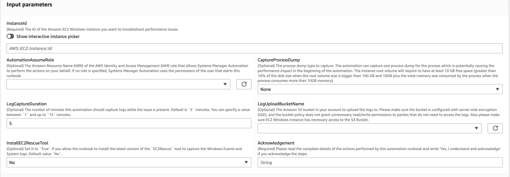
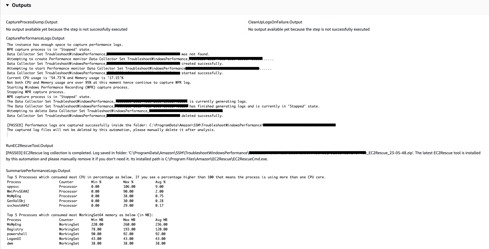
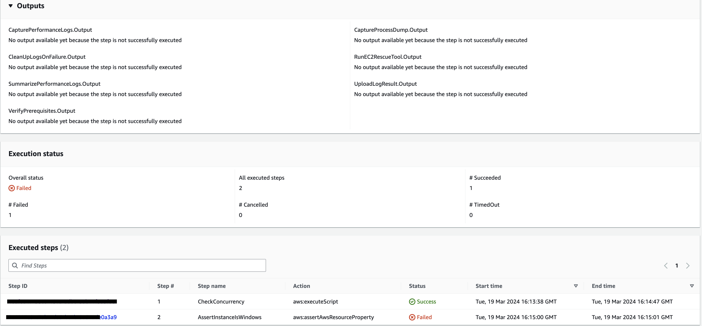
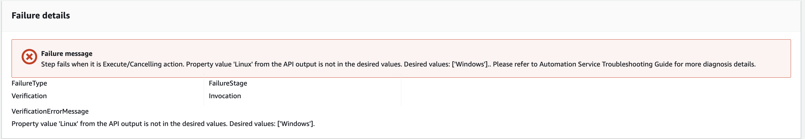

# `AWSSupport-TroubleshootWindowsPerformance`

**Description**

The runbook `AWSSupport-TroubleshootWindowsPerformance` helps troubleshoot
ongoing performance issues on Amazon Elastic Compute Cloud (Amazon EC2) Windows instance. The runbook captures logs
from the target instance and analyzes CPU, memory, disk, and network performance metrics.
Optionally, the automation can capture a process dump to help you determine the potential
cause of performance degradation. The automation also captures the event and system logs by
using the latest [`EC2Rescue`](../../../AWSEC2/latest/WindowsGuide/Windows-Server-EC2Rescue.md "../../../AWSEC2/latest/WindowsGuide/Windows-Server-EC2Rescue.md") tool, if you allow this runbook to install it.

**How does it work?**

The runbook performs the following steps:

- Checks the Amazon EC2 instance for prerequisites.
- Generates performance logs in the root disk of the Amazon EC2 Windows instance
- Stores captured logs in folder
  `C:\ProgramData\Amazon\SSM\TroubleshootWindowsPerformance`
- If an Amazon Simple Storage Service (Amazon S3) bucket is provided, and the automation assume role has the
  required permissions, the captured logs are uploaded to the Amazon S3 bucket.
- Installs the latest `EC2Rescue` tool to the Amazon EC2 Windows instance to
  capture events and system logs if you choose to install it, but it does not analyze
  the process dump and logs captured by `EC2Rescue`.

###### Important

- To execute this runbook, the Amazon EC2 Windows instance must be managed by
  AWS Systems Manager. For more information, see [Why is my Amazon EC2 instance not displaying as a managed node](https://repost.aws/knowledge-center/systems-manager-ec2-instance-not-appear "https://repost.aws/knowledge-center/systems-manager-ec2-instance-not-appear").
- To execute this runbook, the Amazon EC2 Windows instance must be running on
  versions Windows 8.1 / Windows Server 2012 R2 (6.3) or newer with PowerShell 4.0
  or above. For more information, see [Windows Operating System version](https://learn.microsoft.com/en-us/windows/win32/sysinfo/operating-system-version "https://learn.microsoft.com/en-us/windows/win32/sysinfo/operating-system-version").
- For the generation of performance logs, at least 10 GB of free space on the
  root device is required. If the root disk is larger than 100 GB, the free space
  must be greater than 10% of the disk size. If you dump a process during
  execution, the free space must be greater than 10 GB plus the total memory size
  consumed by the process when the process consumes more than 10 GB memory.
- The logs generated on the root device are not deleted automatically.
- The runbook does not uninstall the `EC2Rescue` tool. For more
  information, see [Use
  `EC2Rescue` for Windows Server](../../../AWSEC2/latest/WindowsGuide/Windows-Server-EC2Rescue.md "../../../AWSEC2/latest/WindowsGuide/Windows-Server-EC2Rescue.md").
- It is best practice to run this automation during a performance impact. You
  can also run it periodically using an AWS Systems Manager State Manager association or by
  scheduling AWS Systems Manager Maintenance Windows.

[Run this Automation (console)](https://console.aws.amazon.com/systems-manager/automation/execute/AWSSupport-TroubleshootWindowsPerformance "https://console.aws.amazon.com/systems-manager/automation/execute/AWSSupport-TroubleshootWindowsPerformance")

**Document type**

Automation

**Owner**

Amazon

**Platforms**

Windows

**Parameters**

**Required IAM permissions**

The `AutomationAssumeRole` parameter requires the following actions to
use the runbook successfully.

- `ec2:DescribeInstances`
- `ssm:DescribeAutomationExecutions`
- `ssm:DescribeInstanceInformation`
- `ssm:GetAutomationExecution`
- `ssm:ListCommands`
- `ssm:ListCommandInvocations`
- `ssm:SendCommand`
- `s3:ListBucket`
- `s3:GetEncryptionConfiguration`
- `s3:GetBucketPublicAccessBlock`
- `s3:GetBucketPolicyStatus`
- `s3:PutObject`
- `s3:GetBucketAcl`
- `s3:GetAccountPublicAccessBlock`

_(Optional) The IAM role attached on the instance profile or IAM user
configured on the instance requires the following actions to upload logs to the Amazon S3
bucket specified for parameter `LogUploadBucketName`:_

- `s3:PutObject`
- `s3:GetObject`
- `s3:ListBucket`

**Instructions**

Follow these steps to configure the automation:

1. Navigate to [`AWSSupport-TroubleshootWindowsPerformance`](https://console.aws.amazon.com/systems-manager/documents/AWSSupport-TroubleshootWindowsPerformance/description "https://console.aws.amazon.com/systems-manager/documents/AWSSupport-TroubleshootWindowsPerformance/description") in Systems Manager
   under Documents.
2. Select Execute automation.
3. For the input parameters, enter the following:
   - **AutomationAssumeRole (Optional):**

   The Amazon Resource Name (ARN) of the AWS AWS Identity and Access Management (IAM) role that
   allows Systems Manager Automation to perform the actions on your behalf. If no role is
   specified, Systems Manager Automation uses the permissions of the user who starts this
   runbook.
   - **InstanceId (Required):**

   The ID of the target Amazon EC2 Windows instance where you want to run the
   automation. The instance must be managed by Systems Manager to execute the
   automation.
   - **CaptureProcessDump (Optional):**

   The process dump type to capture. The automation can capture one process
   dump for the process that is potentially causing the performance impact in
   the beginning of the automation. The instance root volume requires at least
   10 GB free space (greater than 10% of the disk size when the root volume
   size is bigger than 100 GB, and 10 GB plus the total memory size consumed by
   the process when the process consumes more than 10 GB memory).
   - **LogCaptureDuration (Optional):**

   The number of minutes, between `1` and `15`, that
   this automation will capture logs while the issue is present. Default is
   `5`.
   - **LogUploadBucketName (Optional):**

   The Amazon S3 bucket in your account where you want to upload the logs. The
   bucket must be configured with server-side encryption (SSE), and the bucket
   policy must not grant unnecessary read/write permissions to parties that do
   not need access to the captured logs. The Amazon EC2 Windows instance must have
   access to the Amazon S3 bucket.
   - **InstallEC2RescueTool (Optional):**

   Set to `Yes` to allow the runbook to install the latest version
   of the `EC2Rescue` tool to capture the Windows Events and System
   logs. Default is `No`.
   - **Acknowledgement (Required):**

   Read the complete details of the actions performed by this automation
   runbook and if you agree, type `Yes, I understand and
 acknowledge`.

 4. Select Execute. 5. The automation initiates. 6. The document performs the following steps:

    * **`CheckConcurrency:`**

    Ensures that there is only one execution of this runbook targeting the
     instance. If the runbook finds another execution targeting the same
     instance, it returns an error and ends.
    * **`AssertInstanceIsWindows:`**

    Asserts that the Amazon EC2 instance is running on Windows Operating System.
     Otherwise, the automation ends.
    * **`AssertInstanceIsManagedInstance:`**

    Asserts that the Amazon EC2 instance is managed by AWS Systems Manager. Otherwise the
     automation ends.
    * **`VerifyPrerequisites:`**

    Verifies the PowerShell version on the instance OS and ensures that the
     instance can be connected through Systems Manager to run PowerShell commands. This
     automation supports PowerShell 4.0 and above running on versions Windows 8.1
     / Server 2012 R2 (6.3) or newer. If the version is older, the automation
     fails. When you choose to upload logs to Amazon S3 bucket, this automation Checks
     that the AWS Tools for PowerShell module is available. If not, the
     automation ends.
    * **`BranchOnProcessDump:`**

    Branches based on if you set it to capture the dump of processes that
     impacted performance.
    * **`CaptureProcessDump:`**

    Checks if the instance has enough space to run this automation (when you
     choose Highest CPU / Memory).
    * **`CapturePerformanceLogs:`**

    Checks the disk space again and runs the PowerShell script on the instance
     to create perfmon counters and start Performance Monitor and Windows
     Performance Recorder logging. The script stops after the defined
     `LogCaptureDuration` is met.
    * **`SummarizePerformanceLogs:`**

    Summarizes the XML report generated on the previous step,
     `CapturePerformanceLogs`, to find the responsible process
     consuming the most WorkingSet64 (Memory) and % Processor Time (CPU) shown as
     output on the automation. It generates similar information for usage of
     LogicalDisk, Network Interface, Memory, TCPv4, IPv4, and UDPv4 and saves it
     to `analysis_output.log` in the output folder.
    * **`BranchOnInstallEC2Rescue:`**

    Branches if you set it to install the latest `EC2Rescue` tool
     in the Amazon EC2 instance.
    * **`InstallEC2RescueTool:`**

    Installs the `EC2Rescue` tool in the instance OS to capture
     `EC2Rescue` logs using
     `AWS-ConfigureAWSPackage`.
    * **`RunEC2RescueTool:`**

    Runs the `EC2Rescue` tool in the instance OS to capture all
     logs needed. `EC2Rescue` captures only the required logs to save
     space.
    * **`BranchOnIfS3BucketProvided:`**

    Branches based on user input of `LogUploadBucketName` to see if
     there is a bucket name available to upload logs.
    * **`GetS3BucketPublicStatus:`**

    Determines if an Amazon S3 bucket is provided, and if so, confirms that the
     Amazon S3 bucket is not public and is configured with SSE.
    * **`UploadLogResult:`**

    Uploads the logs to the Amazon S3 bucket provided. If the PowerShell version is
     5.0 or above, it compresses the logs to a ZIP archive and uploads them. It
     deletes the ZIP file after upload completes. If the PowerShell version is
     below 5.0, it uploads the files directly to a folder.
    * **`CleanUpLogsOnFailure:`**

    Cleans all the logs generated by the `CapturePerformanceLogs`
     step when it fails. The `CleanUpLogsOnFailure` step may fail or
     timeout if SSM Agent isn't working correctly, or the Windows system is
     unresponsive.

7. After completed, review the Outputs section for the detailed results of the
   execution:

Execution where the target instance has all required prerequisites.

Execution where the target instance is on Linux platform and the execution failed.
You would select the step ID to see the failure details.

The failure details of step `AssertInstanceIsWindows`.

**References**

Systems Manager Automation

- [Run this Automation (console)](https://console.aws.amazon.com/systems-manager/documents/AWSSupport-TroubleshootWindowsPerformance/description "https://console.aws.amazon.com/systems-manager/documents/AWSSupport-TroubleshootWindowsPerformance/description")
- [Run an
  automation](../../../systems-manager/latest/userguide/automation-working-executing.md "../../../systems-manager/latest/userguide/automation-working-executing.md")
- [Setting up an
  Automation](../../../systems-manager/latest/userguide/automation-setup.md "../../../systems-manager/latest/userguide/automation-setup.md")
- [Support Automation
  Workflows landing page](https://aws.amazon.com/premiumsupport/technology/saw/ "https://aws.amazon.com/premiumsupport/technology/saw/")
