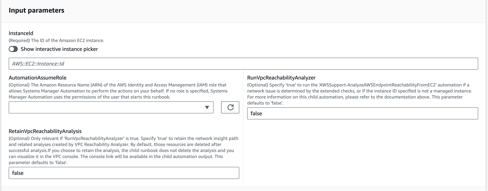
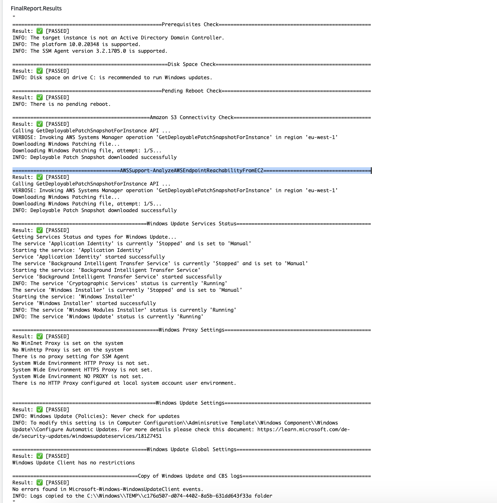

# `AWSSupport-TroubleshootWindowsUpdate`

**Description**

The `AWSSupport-TroubleshootWindowsUpdate` runbook is used to identify issues
that could fail the Windows updates for Amazon Elastic Compute Cloud (Amazon EC2) Windows instances.

**How does it work?**

The runbook performs the following steps:

- Checks if the target Amazon EC2 instance is managed by AWS Systems Manager.
- Checks if the AWS Systems Manager Agent (SSM Agent) and Windows Server versions are
  supported for Systems Manager patching operations.
- Checks the available disk space recommended for Windows updates and if a reboot is
  pending. A pending reboot normally indicates that updates are pending, and a reboot
  is required before performing additional updates.
- Configures the proxy settings at the operating system level, which can help
  troubleshoot connectivity issues.
- Performs an Amazon Simple Storage Service (Amazon S3) endpoint connectivity test and calls the [`GetDeployablePatchSnapshotForInstance`](../../../systems-manager/latest/APIReference/API_GetDeployablePatchSnapshotForInstance.md "../../../systems-manager/latest/APIReference/API_GetDeployablePatchSnapshotForInstance.md") API operation to
  retrieve the current snapshot for the patch baseline the managed node uses.
- If the connection fails, provides the option to run the
  `AWSSupport-AnalyzeAWSEndpointReachabilityFromEC2` runbook to analyze
  the instance's connectivity to Amazon S3 endpoints.
- Validates the Windows updates configuration and tests Windows Server Update
  Services (WSUS) (if applicable).

###### Important

- Active Directory domain controllers are not supported.
- Windows Server version 2008 R2 or previous versions are not supported.
- SSM Agent 1.2.371 or previous versions are not supported.
- The `AWSSupport-AnalyzeAWSEndpointReachabilityFromEC2` runbook uses
  [`VPC
Reachability Analyzer`](../../../vpc/latest/reachability/what-is-reachability-analyzer.md "../../../vpc/latest/reachability/what-is-reachability-analyzer.md") to analyze the network connectivity
  between a source and a service endpoint. You are charged per analysis run
  between a source and destination. For more details, see [Amazon VPC Pricing](https://aws.amazon.com/vpc/pricing/ "https://aws.amazon.com/vpc/pricing/").
- The `AWSSupport-AnalyzeAWSEndpointReachabilityFromEC2` runbook is
  not available in all regions where Systems Manager is supported.

[Run this Automation (console)](https://console.aws.amazon.com/systems-manager/automation/execute/AWSSupport-TroubleshootWindowsUpdate "https://console.aws.amazon.com/systems-manager/automation/execute/AWSSupport-TroubleshootWindowsUpdate")

**Document type**

Automation

**Owner**

Amazon

**Platforms**

Windows

**Parameters**

**Required IAM permissions**

The `AutomationAssumeRole` parameter requires the following actions to
use the runbook successfully.

- `ssm:StartAutomationExecution`
- `ssm:GetAutomationExecution`
- `ssm:DescribeInstanceInformation`
- `ssm:SendCommand`
- `ssm:ListCommandInvocations`
- `ssm:ListCommands`

###### Note

To run the child runbook
`AWSSupport-AnalyzeAWSEndpointReachabilityFromEC2`, add the permissions
listed in [this document](automation-awssupport-analyzeawsendpointreachabilityfromec2.md "automation-awssupport-analyzeawsendpointreachabilityfromec2.md").

**Instructions**

Follow these steps to configure the automation:

1. Navigate to [`AWSSupport-TroubleshootWindowsUpdate`](https://console.aws.amazon.com/systems-manager/documents/AWSSupport-TroubleshootWindowsUpdate/description "https://console.aws.amazon.com/systems-manager/documents/AWSSupport-TroubleshootWindowsUpdate/description") in Systems Manager under
   Documents.
2. Select Execute automation.
3. For the input parameters, enter the following:
   - **AutomationAssumeRole (Optional):**

   The Amazon Resource Name (ARN) of the AWS AWS Identity and Access Management (IAM) role that
   allows Systems Manager Automation to perform the actions on your behalf. If no role is
   specified, Systems Manager Automation uses the permissions of the user who starts this
   runbook.
   - **InstanceId (Required):**

   Enter the ID of the Amazon EC2 instance where the Windows update failed.
   - **RunVpcReachabilityAnalyzer
     (Optional):**

   Specify `true` to run the
   `AWSSupport-AnalyzeAWSEndpointReachabilityFromEC2` automation
   if a network issue is determined by the extended checks or if the instance
   ID specified is not a managed instance. For more information on this child
   automation, refer to the [documentation](automation-awssupport-analyzeawsendpointreachabilityfromec2.md "automation-awssupport-analyzeawsendpointreachabilityfromec2.md"). The default value is `false`.
   - **RetainVpcReachabilityAnalysis
     (Optional):**

   Only relevant if `RunVpcReachabilityAnalyzer` is
   `true`. Specify `true` to retain the network
   insight path and related analyses created by `Reachability
 Analyzer`. By default, those resources are deleted after
   successful analysis. If you choose to retain the analysis, the child runbook
   does not delete the analysis and you can visualize it in the Amazon VPC console.
   The console link will be available in the child automation output. The
   default value `false`.

 4. Select Execute. 5. The automation initiates. 6. The document performs the following steps:

    * **`getWindowsServerAndSSMAgentVersion:`**

    Verifies that the target instance is managed by AWS Systems Manager and gets details
     about the SSM Agent version and Windows version.
    * **`assertifInstanceIsSsmManaged:`**

    Ensures the Amazon EC2 instance is managed by AWS Systems Manager (SSM), otherwise the
     automation ends.
    * **`CheckProxy:`**

    Checks for all proxy types for the Windows instance.
    * **`CheckPrerequisites:`**

    Gets the SSM Agent version and Windows version, and determines if it is
     an Active Directory Domain Controller (DC). If the instance is a DC or the
     SSM Agent or Windows version is not supported, the runbook stops.
    * **`CheckDiskSpace:`**

    Gets and validates the available disk space over the Windows instance if
     it is sufficient for performing the Windows update.
    * **`CheckPendingReboot:`**

    Checks for any pending reboot over the Windows instance.
    * **`CheckS3Connectivity:`**

    Checks if the instance can reach the Amazon S3 endpoints for
     `Patchbaseline`.
    * **`branchOnRunVpcReachabilityAnalyzer:`**

    If `RunVpcReachabilityAnalyzer` is true, then it branches the
     automation to run deeper analysis for the debugging Amazon S3
     connectivity.
    * **`GenerateEndpoints:`**

    Generates an endpoint to have an extended connectivity check for the Amazon S3
     endpoint.
    * **`analyzeAwsEndpointReachabilityFromEC2:`**

    Calls the automation runbook,
     `AWSSupport-AnalyzeAWSEndpointReachabilityFromEC2`. to check
     the reachability of the selected instance to the required endpoints.
    * **`CheckWindowsUpdateServices:`**

    Checks the Windows Update service status and start type.
    * **`CheckWindowsUpdateSettings:`**

    Checks for Windows Update policies configured over the Windows
     instance.
    * **`CheckWSUSSettings:`**

    Checks whether the Windows update is configured with WSUS or Microsoft
     Update Catalog and verifies connectivity.
    * **`CheckWUGlobalSettings:`**

    Checks the Windows Update global settings configured over the Windows
     instance.
    * **`GenerateLogs:`**

    Downloads Windows Update logs and CBS logs onto the instance desktop and
     checks Windows event logs for failure.
    * **`FinalReport:`**

    Generates a complete report of all steps.

7. After completed, review the Outputs section for the detailed results of the
   execution:

**References**

Systems Manager Automation

- [Run this Automation (console)](https://console.aws.amazon.com/systems-manager/documents/AWSSupport-TroubleshootWindowsUpdate/description "https://console.aws.amazon.com/systems-manager/documents/AWSSupport-TroubleshootWindowsUpdate/description")
- [Run an
  automation](../../../systems-manager/latest/userguide/automation-working-executing.md "../../../systems-manager/latest/userguide/automation-working-executing.md")
- [Setting up an
  Automation](../../../systems-manager/latest/userguide/automation-setup.md "../../../systems-manager/latest/userguide/automation-setup.md")
- [Support Automation
  Workflows landing page](https://aws.amazon.com/premiumsupport/technology/saw/ "https://aws.amazon.com/premiumsupport/technology/saw/")
  Documentation related to the AWS service

- Refer to the article, [TroubleShoot
  Windows Update](https://repost.aws/knowledge-center/ec2-windows-update-troubleshoot "https://repost.aws/knowledge-center/ec2-windows-update-troubleshoot"), for more information.
