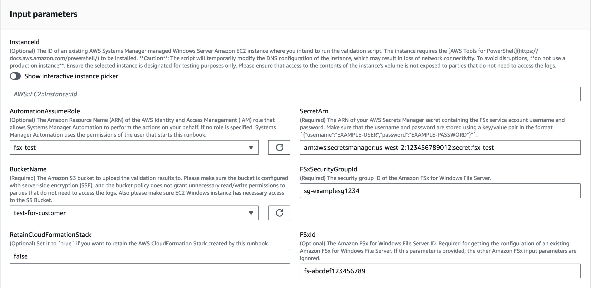
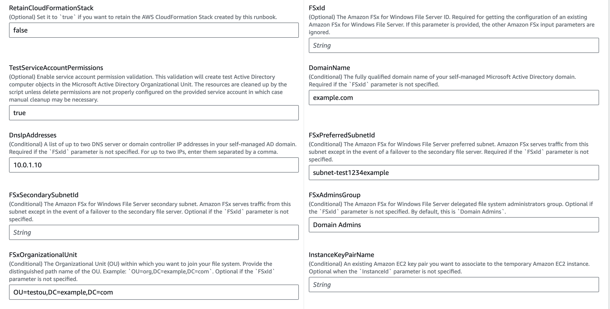
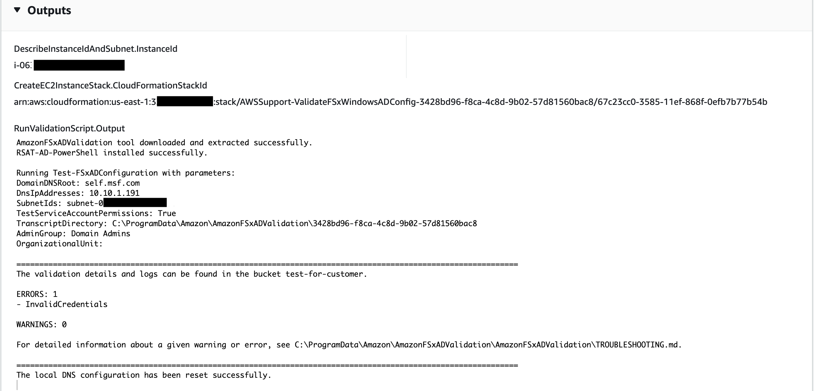

# `AWSSupport-ValidateFSxWindowsADConfig`

**Description**

The `AWSSupport-ValidateFSxWindowsADConfig` runbook is used to validate the
self-managed Active Directory (AD) configuration of an Amazon FSx for Windows File Server

**How does it work?**

The runbook `AWSSupport-ValidateFSxWindowsADConfig` executes the Amazon FSx
validation script on the temporary Amazon Elastic Compute Cloud (Amazon EC2) Windows instance launched by the
runbook on the Amazon FSx subnet. The script performs multiple checks to validate the network
connectivity to self-managed AD/DNS servers and permissions of the Amazon FSx service account.
The runbook can validate a failed or misconfigured Amazon FSx for Windows File Server or create a new
Amazon FSx for Windows File Server with self-managed AD.

By default, the runbook creates the Amazon EC2 Windows instance, security group for AWS Systems Manager
(SSM) access, AWS Identity and Access Management (IAM) role and policy using CloudFormation on the Amazon FSx subnet. If you
want to run the script on an existing Amazon EC2 instance, provide the ID in the parameter
`InstanceId`. On successful execution, it deletes the CloudFormation resources.
However, to retain the resources, set the `RetainCloudFormationStack` parameter
to `true`.

The CloudFormation template creates an IAM role on your behalf with required permissions to
attach to the Amazon EC2 instance to run the Amazon FSx validation script. To specify an existing
IAM instance profile for the temporary instance, use the `InstanceProfileName`
parameter. The associated IAM role must contain the following permissions:

- `ec2:DescribeSubnets` and `ec2:DescribeVpcs` permissions and
  the Amazon Managed Policy `AmazonSSMManagedInstanceCore`.
- Permissions to get the Amazon FSx service account username and password from Systems Manager by
  calling the `GetSecretValue` API.
- Permissions to put object in the Amazon Simple Storage Service (Amazon S3) bucket for the script
  output.

**Prerequisites**

The subnet where the temporary Amazon EC2 instance is created (or the existing instance
provided in the `InstanceId` parameter) must allow access to the AWS Systems Manager,
AWS Secrets Manager, and Amazon S3 endpoints in order to run the `AmazonFSxADValidation` script
using SSM Run Command.

**AWS Secrets Manager setup**

The validation script connects to the Microsoft AD domain by retrieving the Amazon FSx service
account username and password with a runtime call to Secrets Manager. Follow the steps in [Create an
AWS Secrets Manager secret](../../../secretsmanager/latest/userguide/create_secret.md "../../../secretsmanager/latest/userguide/create_secret.md") to create a new Secrets Manager secret. Make sure that the username
and password are stored using a key/value pair in the format
`{"username":"EXAMPLE-USER","password":"EXAMPLE-PASSWORD"}"`. Refer to [Authentication and access control for AWS Secrets Manager](../../../secretsmanager/latest/userguide/auth-and-access.md "../../../secretsmanager/latest/userguide/auth-and-access.md") for information about securing
access to secrets.

For more information about the tool, refer to the `TROUBLESHOOTING.md` and
`README.md` files in the [AmazonFSxADValidation](../../../fsx/latest/WindowsGuide/samples/AmazonFSxADValidation.md "../../../fsx/latest/WindowsGuide/samples/AmazonFSxADValidation.md") file.

**Runbook execution**

Execute the runbook with Amazon FSx ID or AD parameters. Following is the runbook workflow:

- Gets the parameters from the Amazon FSx ID or uses the input AD parameters.
- Creates the temporary validation Amazon EC2 Windows instance on the Amazon FSx subnet,
  security group for SSM access, IAM role and policy (conditional) using
  CloudFormation. If the `InstanceId` parameter is specified, it is
  used.
- Downloads and executes the validation script on the target Amazon EC2 instance in Amazon FSx
  primary subnet.
- Provides the AD validation result code in the automation output. Additionally, the
  complete script output is uploaded to the Amazon S3 bucket.

[Run this Automation (console)](https://console.aws.amazon.com/systems-manager/automation/execute/AWSSupport-ValidateFSxWindowsADConfig "https://console.aws.amazon.com/systems-manager/automation/execute/AWSSupport-ValidateFSxWindowsADConfig")

**Document type**

Automation

**Owner**

Amazon

**Platforms**

Windows

**Parameters**

**Required IAM permissions**

The `AutomationAssumeRole` parameter requires the following actions to
use the runbook successfully.

- `cloudformation:CreateStack`
- `cloudformation:DeleteStack`
- `cloudformation:DescribeStacks`
- `cloudformation:DescribeStackResources`
- `cloudformation:DescribeStackEvents`
- `ec2:CreateTags`
- `ec2:RunInstances`
- `ec2:TerminateInstances`
- `ec2:CreateLaunchTemplate`
- `ec2:DeleteLaunchTemplate`
- `ec2:DescribeSubnets`
- `ec2:DescribeSecurityGroups`
- `ec2:DescribeImages`
- `ec2:DescribeInstances`
- `ec2:DescribeLaunchTemplates`
- `ec2:DescribeLaunchTemplateVersions`
- `ec2:CreateSecurityGroup`
- `ec2:DeleteSecurityGroup`
- `ec2:RevokeSecurityGroupEgress`
- `ec2:AuthorizeSecurityGroupEgress`
- `iam:CreateRole`
- `iam:CreateInstanceProfile`
- `iam:GetInstanceProfile`
- `iam:getRolePolicy`
- `iam:DeleteRole`
- `iam:DeleteInstanceProfile`
- `iam:AddRoleToInstanceProfile`
- `iam:RemoveRoleFromInstanceProfile`
- `iam:AttachRolePolicy`
- `iam:DetachRolePolicy`
- `iam:PutRolePolicy`
- `iam:DeleteRolePolicy`
- `iam:GetRole`
- `iam:PassRole`
- `ssm:SendCommand`
- `ssm:StartAutomationExecution`
- `ssm:DescribeInstanceInformation`
- `ssm:DescribeAutomationExecutions`
- `ssm:GetDocument`
- `ssm:GetAutomationExecution`
- `ssm:DescribeAutomationStepExecutions`
- `ssm:ListCommandInvocations`
- `ssm:GetParameters`
- `ssm:ListCommands`
- `ssm:GetCommandInvocation`
- `fsx:DescribeFileSystems`
- `ds:DescribeDirectories`
- `s3:GetEncryptionConfiguration`
- `s3:GetBucketPublicAccessBlock`
- `s3:GetAccountPublicAccessBlock`
- `s3:GetBucketPolicyStatus`
- `s3:GetBucketAcl`
- `s3:GetBucketLocation`

**Example IAM Policy for the Automation Assume Role**

JSON

```
`{
 "Version":"2012-10-17",
 "Statement": [
 {
 "Sid": "AllowDescribe",
 "Effect": "Allow",
 "Action": [
 "ec2:DescribeSubnets",
 "ec2:DescribeSecurityGroups",
 "ec2:DescribeImages",
 "ec2:DescribeInstances",
 "ec2:DescribeLaunchTemplates",
 "ec2:DescribeLaunchTemplateVersions",
 "ssm:DescribeInstanceInformation",
 "ssm:DescribeAutomationExecutions",
 "ssm:DescribeAutomationStepExecutions",
 "fsx:DescribeFileSystems",
 "ds:DescribeDirectories"
 ],
 "Resource": "*"
 },
 {
 "Sid": "CloudFormation",
 "Effect": "Allow",
 "Action": [
 "cloudformation:DescribeStacks",
 "cloudformation:DescribeStackResources",
 "cloudformation:DescribeStackEvents",
 "cloudformation:CreateStack",
 "cloudformation:DeleteStack"
 ],
 "Resource": "arn:*:cloudformation:*:*:stack/AWSSupport-ValidateFSxWindowsADConfig-*"
 },
 {
 "Sid": "AllowCreateLaunchTemplate",
 "Effect": "Allow",
 "Action": [
 "ec2:CreateLaunchTemplate",
 "ec2:CreateTags"
 ],
 "Resource": [
 "arn:aws:ec2:*:*:launch-template/*"
 ]
 },
 {
 "Sid": "AllowEC2RunInstances",
 "Effect": "Allow",
 "Action": [
 "ec2:RunInstances",
 "ec2:CreateTags"
 ],
 "Resource": [
 "arn:aws:ec2:*::image/*",
 "arn:aws:ec2:*::snapshot/*",
 "arn:aws:ec2:*:*:subnet/*",
 "arn:aws:ec2:*:*:network-interface/*",
 "arn:aws:ec2:*:*:security-group/*",
 "arn:aws:ec2:*:*:key-pair/*",
 "arn:aws:ec2:*:*:launch-template/*"
 ]
 },
 {
 "Sid": "AllowEC2RunInstancesWithTags",
 "Effect": "Allow",
 "Action": [
 "ec2:RunInstances",
 "ec2:CreateTags"
 ],
 "Resource": [
 "arn:aws:ec2:*:*:instance/*",
 "arn:aws:ec2:*:*:volume/*"
 ]
 },
 {
 "Sid": "EC2SecurityGroup",
 "Effect": "Allow",
 "Action": [
 "ec2:CreateSecurityGroup",
 "ec2:RevokeSecurityGroupEgress",
 "ec2:AuthorizeSecurityGroupEgress",
 "ec2:CreateTags"
 ],
 "Resource": [
 "arn:*:ec2:*:*:security-group/*",
 "arn:*:ec2:*:*:vpc/*"
 ]
 },
 {
 "Sid": "EC2Remove",
 "Effect": "Allow",
 "Action": [
 "ec2:TerminateInstances",
 "ec2:DeleteLaunchTemplate",
 "ec2:DeleteSecurityGroup"
 ],
 "Resource": [
 "arn:aws:ec2:*:*:instance/*",
 "arn:aws:ec2:*:*:launch-template/*",
 "arn:*:ec2:*:*:security-group/*"
 ]
 },
 {
 "Sid": "IAMInstanceProfile",
 "Effect": "Allow",
 "Action": [
 "iam:CreateInstanceProfile",
 "iam:DeleteInstanceProfile",
 "iam:GetInstanceProfile",
 "iam:AddRoleToInstanceProfile",
 "iam:RemoveRoleFromInstanceProfile"
 ],
 "Resource": "arn:*:iam::*:instance-profile/*"
 },
 {
 "Sid": "IAM",
 "Effect": "Allow",
 "Action": [
 "iam:CreateRole",
 "iam:DeleteRole",
 "iam:AttachRolePolicy",
 "iam:DetachRolePolicy",
 "iam:getRolePolicy",
 "iam:PutRolePolicy",
 "iam:DeleteRolePolicy",
 "iam:GetRole",
 "iam:TagRole"
 ],
 "Resource": "arn:*:iam::*:role/*"
 },
 {
 "Sid": "SSM",
 "Effect": "Allow",
 "Action": [
 "ssm:StartAutomationExecution",
 "ssm:GetDocument",
 "ssm:GetAutomationExecution",
 "ssm:ListCommandInvocations",
 "ssm:GetParameters",
 "ssm:ListCommands",
 "ssm:GetCommandInvocation"
 ],
 "Resource": "*"
 },
 {
 "Sid": "SSMSendCommand",
 "Effect": "Allow",
 "Action": [
 "ssm:SendCommand"
 ],
 "Resource": "arn:aws:ssm:*:*:document/AWS-RunPowerShellScript"
 },
 {
 "Sid": "SSMSendCommandOnlyFsxInstance",
 "Effect": "Allow",
 "Action": [
 "ssm:SendCommand"
 ],
 "Resource": [
 "arn:aws:ec2:*:*:instance/*"
 ],
 "Condition": {
 "StringLike": {
 "ssm:resourceTag/CreatedBy": [
 "AWSSupport-ValidateFSxWindowsADConfig"
 ]
 }
 }
 },
 {
 "Sid": "AllowPassRoleToEC2",
 "Effect": "Allow",
 "Action": "iam:PassRole",
 "Resource": "arn:*:iam::*:role/AWSSupport-ValidateFSxWindowsADConfig-*",
 "Condition": {
 "StringEquals": {
 "iam:PassedToService": [
 "ec2.amazonaws.com"
 ]
 }
 }
 },
 {
 "Effect": "Allow",
 "Action": [
 "s3:GetEncryptionConfiguration",
 "s3:GetBucketPublicAccessBlock",
 "s3:GetAccountPublicAccessBlock",
 "s3:GetBucketPolicyStatus",
 "s3:GetBucketAcl",
 "s3:GetBucketLocation"
 ],
 "Resource": "*"
 }
 ]
 }`

```

**Instructions**

Follow these steps to configure the automation:

1. Navigate to [`AWSSupport-ValidateFSxWindowsADConfig`](https://console.aws.amazon.com/systems-manager/documents/AWSSupport-ValidateFSxWindowsADConfig/description "https://console.aws.amazon.com/systems-manager/documents/AWSSupport-ValidateFSxWindowsADConfig/description") in Systems Manager under
   Documents.
2. Select **Execute automation.**
3. To validate self-managed AD with an existing failed or misconfigured Amazon FSx, enter
   the following parameters:
   - **AutomationAssumeRole (Optional):**

   The Amazon Resource Name (ARN) of the AWS Identity and Access Management (IAM) role that allows
   Systems Manager Automation to perform the actions on your behalf. If no role is
   specified, Systems Manager Automation uses the permissions of the user who starts this
   runbook.
   - **FSxId (Conditional):**

   The Amazon FSx for Windows File Server ID. This is required to validate existing failed or
   misconfigured Amazon FSx.
   - **SecretArn (Required):**

   The ARN of your Secrets Manager secret containing the Amazon FSx service account
   username and password. Make sure that the username and password are stored
   using a key/value pair in the format
   `{"username":"EXAMPLE-USER","password":"EXAMPLE-PASSWORD"}`.
   The CloudFormation stack creates the validation instance with permissions to
   perform `GetSecretValue` to this ARN.
   - **FSxSecurityGroupId (Required):**

   The security group ID for the Amazon FSx for Windows File Server.
   - **BucketName (Required):**

   The Amazon S3 bucket to upload the validation results to. Make sure that the
   bucket is configured with server-side encryption (SSE) and the bucket policy
   does not grant unnecessary read/write permissions to parties that do not
   need to access the logs. Also make sure that the Amazon EC2 Windows instance has
   necessary access to the Amazon S3 bucket.

 4. To validate self-managed AD configuration for a new Amazon FSx creation, enter the
following parameters:

    * **AutomationAssumeRole (Optional):**


    The Amazon Resource Name (ARN) of the AWS Identity and Access Management (IAM) role that allows
     Systems Manager Automation to perform the actions on your behalf. If no role is
     specified, Systems Manager Automation uses the permissions of the user who starts this
     runbook.
    * **SecretArn (Required):**


    The ARN of your Secrets Manager secret containing the Amazon FSx service account
     username and password. Make sure that the username and password are stored
     using a key/value pair in the format
     `{"username":"EXAMPLE-USER","password":"EXAMPLE-PASSWORD"}`.
     The CloudFormation stack creates the validation instance with permissions to
     perform `GetSecretValue` to this ARN.
    * **FSxSecurityGroupId (Required):**


    The security group ID for the Amazon FSx for Windows File Server.
    * **BucketName (Required):**


    The Amazon S3 bucket to upload the validation results to. Make sure that the
     bucket is configured with server-side encryption (SSE) and the bucket policy
     does not grant unnecessary read/write permissions to parties that do not
     need to access the logs. Also make sure that the Amazon EC2 Windows instance has
     necessary access to the Amazon S3 bucket.
    * **FSxPreferredSubnetId
     (Conditional):**


    The Amazon FSx for Windows File Server preferred subnet.
    * **DomainName (Conditional):**


    The fully qualified domain name of your self-managed Microsoft AD
     domain.
    * **DnsIpAddresses (Conditional):**


    A list of up to two DNS server or domain controller IP addresses in your
     self-managed AD domain. For up to two IPs, enter them separated by a
     comma.
    * **FSxAdminsGroup (Conditional):**


    The Amazon FSx for Windows File Server delegated file system administrators group. By
     default, this is `Domain Admins`.
    * **FSxOrganizationalUnit
     (Conditional):**


    The Organizational Unit (OU) within which you want to join your file
     system. Provide the distinguished path name of the OU. Example:
     `OU=org,DC=example,DC=com`.

 5. Select **Execute.** 6. The automation initiates. 7. The document performs the following steps:

    * **CheckBucketPublicStatus
     (aws:executeScript):**


    Checks if the target Amazon S3 bucket potentially grants read and/or write
     public access to its objects.
    * **BranchOnInputParameters
     (aws:branch):**


    Branches on the provided input parameters such as Amazon FSx ID or Amazon FSx
     parameters.
    * **AssertFileSystemTypeIsWindows
     (aws:assertAwsResourceProperty):**


    If Amazon FSx ID is provided, validates the file system type is
     Amazon FSx for Windows File Server.
    * **GetValidationInputs
     (aws:executeScript):**


    Returns the self-managed Microsoft AD configuration required by the
     CloudFormation template to create the Amazon EC2 instance.
    * **BranchOnInstanceId (aws:branch):**


    Branches on the provided input `InstanceId`. If
     `InstanceId` is provided, the validation script runs on the
     target Amazon EC2 instance from automation `step:RunValidationScript`.
    * **CreateEC2InstanceStack
     (aws:createStack):**


    Creates the Amazon EC2 instance in the preferred subnet using CloudFormation where the
     `AmazonFSxADValidation` tool will be executed
    * **DescribeStackResources
     (aws:executeAwsApi):**


    Describes the CloudFormation stack to get the temporary Amazon EC2 instance
     ID.
    * **WaitForEC2InstanceToBeManaged
     (aws:waitForAwsResourceProperty):**


    Waits until the Amazon EC2 instance is managed by Systems Manager in order to run the
     validation script using SSM Run Command.
    * **GetAmazonFSxADValidationAttachment
     (aws:executeAwsApi):**


    Gets the `AmazonFSxADValidation` tool URL from the runbook
     attachments.
    * **RunValidationScript
     (aws:runCommand):**


    Runs the `AmazonFSxADValidation` tool on the temporary Amazon EC2
     instance and stores the result in the Amazon S3 bucket specified in the
     `BucketName` parameter.
    * **DescribeErrorsFromStackEvents
     (aws:executeScript):**


    Describes the CloudFormation stack events if the runbooks fails to create the
     stack.
    * **BranchOnRetainCloudFormationStack
     (aws:branch):**


    Branches on the `RetainCloudFormationStack` and
     `InstanceId` parameters to determine if the CloudFormation stack
     should be deleted.
    * **DeleteCloudFormationStack
     (aws:deleteStack):**


    Deletes the CloudFormation stack.

8. After completed, review the Outputs section for the results of the
   execution:



The runbook will upload the results of the validation script execution to the Amazon S3
bucket.

**References**

Systems Manager Automation

- [Run this Automation (console)](https://console.aws.amazon.com/systems-manager/documents/AWSSupport-ValidateFSxWindowsADConfig/description "https://console.aws.amazon.com/systems-manager/documents/AWSSupport-ValidateFSxWindowsADConfig/description")
- [Run an
  automation](../../../systems-manager/latest/userguide/automation-working-executing.md "../../../systems-manager/latest/userguide/automation-working-executing.md")
- [Setting up an
  Automation](../../../systems-manager/latest/userguide/automation-setup.md "../../../systems-manager/latest/userguide/automation-setup.md")
- [Support Automation
  Workflows landing page](https://aws.amazon.com/premiumsupport/technology/saw/ "https://aws.amazon.com/premiumsupport/technology/saw/")
  AWS service documentation

- [What is
  Amazon FSx for Windows File Server?](../../../fsx/latest/WindowsGuide/what-is.md "../../../fsx/latest/WindowsGuide/what-is.md")
- [Validating self-managed AD configuration for Amazon FSx for Windows File Server](../../../fsx/latest/WindowsGuide/validate-ad-config.md "../../../fsx/latest/WindowsGuide/validate-ad-config.md")
