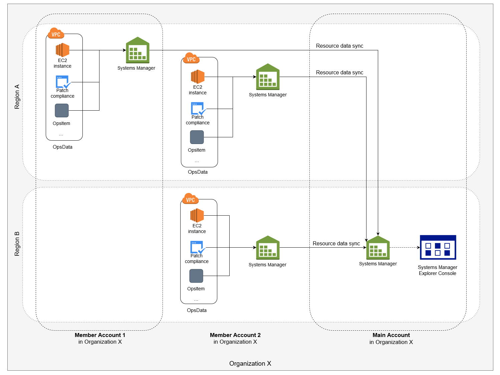

AWS Systems Manager Change Manager is no longer open to new customers. Existing customers can continue to use the service as normal. For more information, see
[AWS Systems Manager Change Manager availability change](change-manager-availability-change.md "change-manager-availability-change.md").

# Understanding

resource data syncs for Explorer

Resource data sync for Explorer offers two aggregation options:

- **Single-account/Multiple-regions:** You
  can configure Explorer to aggregate OpsItems and OpsData data from multiple
  AWS Regions, but the data set is limited to the current
  AWS account.
- **Multiple-accounts/Multiple-regions:**
  You can configure Explorer to aggregate data from multiple AWS Regions
  and accounts. This option requires that you set up and configure
  AWS Organizations. After you set up and configure AWS Organizations, you can aggregate
  data in Explorer by organizational unit (OU) or for an entire
  organization. Systems Manager aggregates the data into the AWS Organizations
  management account before displaying it in Explorer. For more
  information, see [What is AWS Organizations?](../../../organizations/latest/userguide.md "../../../organizations/latest/userguide.md") in
  the _AWS Organizations User Guide_.

###### Warning

If you configure Explorer to aggregate data from an organization in
AWS Organizations, the system enables OpsData in all member accounts in the
organization. Enabling OpsData sources in all member accounts increases the
number of calls to OpsCenter APIs like [CreateOpsItem](../APIReference/API_CreateOpsItem.md "../APIReference/API_CreateOpsItem.md") and [GetOpsSummary](../APIReference/API_GetOpsSummary.md "../APIReference/API_GetOpsSummary.md"). You are charged for calls to these API
actions.

The following diagram shows a resource data sync configured to work with
AWS Organizations. In this scenario, the user has two accounts defined in AWS Organizations.
Resource data sync aggregates data from both accounts and multiple AWS Regions
into the AWS Organizations management account where it's then displayed in
Explorer.

