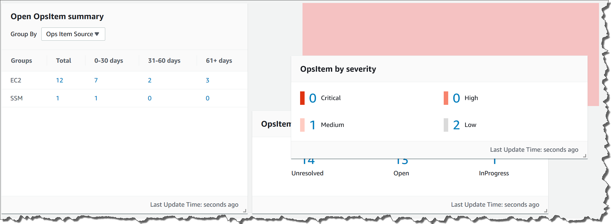
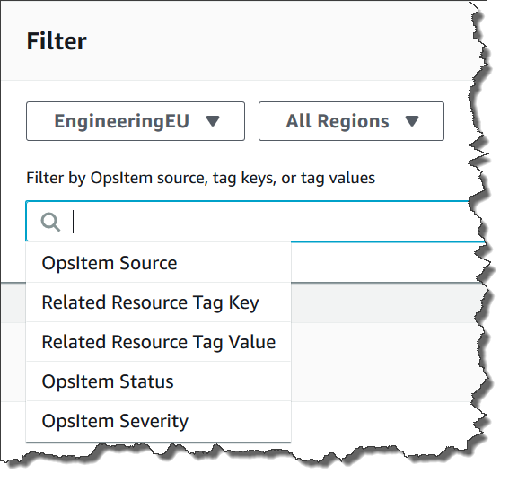

# Customizing the Explorer display

You can customize widget layout in AWS Systems Manager Explorer by using a drag-and-drop capability.
You can also customize the OpsData and OpsItems displayed in Explorer by using filters,
as described in this topic.

Before you customize widget layout, verify that the widgets you want to view are
currently displayed in Explorer. To view some widgets in Explorer (such as the
AWS Config compliance widget), you must enable them on the **Configure
dashboard** page.

###### To enable widgets to display in Explorer

1. Open the AWS Systems Manager console at [https://console.aws.amazon.com/systems-manager/](https://console.aws.amazon.com/systems-manager/ "https://console.aws.amazon.com/systems-manager/").
2. In the navigation pane, choose **Explorer**.
3. Choose **Dashboard actions**, **Configure
   dashboard**.
4. Choose the **Configure Dashboard** tab.
5. Either choose **Enable all** or turn on an individual
   widget or data source.
6. Choose **Explorer** to view your changes.
   To customize widget layout in Explorer, choose a widget that you want to move.
   Click and hold the name of the widget and then drag it to its new location.

Repeat this process for each widget that you want to reposition.

If you decide that you don't like the new layout, choose **Reset
layout** to move all widgets back to their original location.

## Using filters to the change

the data displayed in Explorer

By default, Explorer displays data for the current AWS account and the
current Region. If you create one or more resource data syncs, you can use
filters to change which sync is active. You can then choose to display data for
a specific Region or all Regions. You can also use the Search bar to filter on
different OpsItem and key-tag criteria.

###### To change the data displayed in Explorer by using filters

1. Open the AWS Systems Manager console at [https://console.aws.amazon.com/systems-manager/](https://console.aws.amazon.com/systems-manager/ "https://console.aws.amazon.com/systems-manager/").
2. In the navigation pane, choose **Explorer**.
3. In the **Filter** section, use the **Select a
   resource data sync** list to choose a sync.
4. Use the **Regions** list to choose either a specific
   AWS Region or choose **All Regions**.
5. Choose the Search bar, and then choose the criteria on which to filter
   the data.

 6. Press Enter.

Explorer retains the filter options you selected if you close and reopen the
page.
