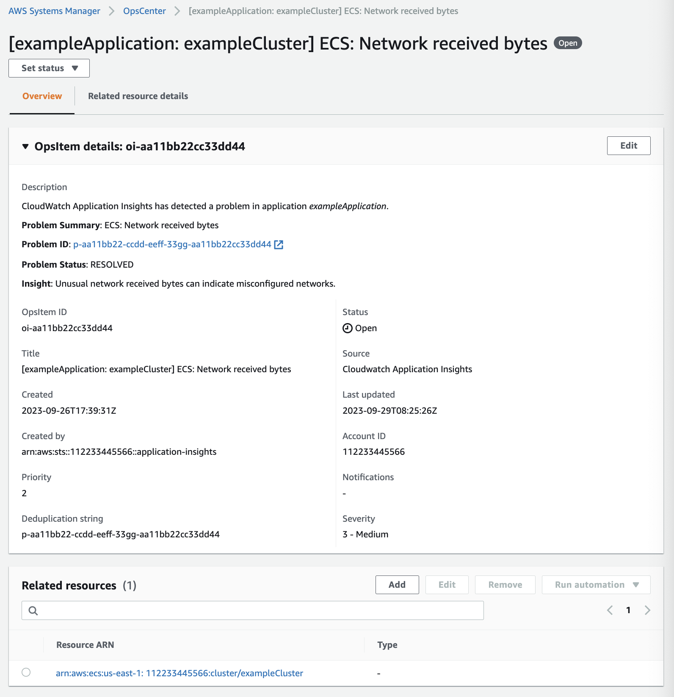

AWS Systems Manager Change Manager is no longer open to new customers. Existing customers can continue to use the service as normal. For more information, see
[AWS Systems Manager Change Manager availability change](change-manager-availability-change.md "change-manager-availability-change.md").

# Integrate OpsCenter with other

AWS services

OpsCenter, a tool in AWS Systems Manager, integrates with multiple AWS services to diagnose
and remediate issues with AWS resources. You must set up the AWS service before you
integrate it with OpsCenter.

By default, the following AWS services are integrated with OpsCenter and can create
OpsItems automatically:

- [Amazon CloudWatch](#OpsCenter-about-cloudwatch "#OpsCenter-about-cloudwatch")
- [Amazon CloudWatch Application Insights](#OpsCenter-about-cloudwatch-insights "#OpsCenter-about-cloudwatch-insights")
- [Amazon EventBridge](#OpsCenter-about-eventbridge "#OpsCenter-about-eventbridge")
- [AWS Config](#OpsCenter-about-AWS-config "#OpsCenter-about-AWS-config")
- [AWS Systems Manager Incident Manager](#OpsCenter-about-incident-manager "#OpsCenter-about-incident-manager")
  You have to integrate the following services with OpsCenter to create OpsItems
  automatically:

- [Amazon DevOps Guru](#OpsCenter-integrate-with-devops-guru "#OpsCenter-integrate-with-devops-guru")
- [AWS Security Hub CSPM](#OpsCenter-integrate-with-security-hub "#OpsCenter-integrate-with-security-hub")
  When any of these services create an OpsItem, you can manage and remediate the OpsItem from
  OpsCenter. For more information, see [Manage OpsItems](OpsCenter-working-with-OpsItems.md "OpsCenter-working-with-OpsItems.md") and [Remediate OpsItem issues](OpsCenter-remediating.md "OpsCenter-remediating.md").

For more information about each AWS service and how it integrates with OpsCenter,
see the following topics.

###### Topics

- [Understanding OpsCenter integration
  with Amazon CloudWatch](#OpsCenter-about-cloudwatch "#OpsCenter-about-cloudwatch")
- [Understanding OpsCenter
  integration with Amazon CloudWatch Application Insights](#OpsCenter-about-cloudwatch-insights "#OpsCenter-about-cloudwatch-insights")
- [Understanding OpsCenter
  integration with Amazon DevOps Guru](#OpsCenter-integrate-with-devops-guru "#OpsCenter-integrate-with-devops-guru")
- [Understanding OpsCenter integration
  with Amazon EventBridge](#OpsCenter-about-eventbridge "#OpsCenter-about-eventbridge")
- [Understanding OpsCenter integration
  with AWS Config](#OpsCenter-about-AWS-config "#OpsCenter-about-AWS-config")
- [Understanding OpsCenter
  integration with AWS Security Hub CSPM](#OpsCenter-integrate-with-security-hub "#OpsCenter-integrate-with-security-hub")
- [Understanding OpsCenter
  integration with Incident Manager](#OpsCenter-about-incident-manager "#OpsCenter-about-incident-manager")

## Understanding OpsCenter integration

with Amazon CloudWatch

Amazon CloudWatch monitors your AWS resources and services, and displays metrics on every
AWS service that you use. CloudWatch creates an OpsItem when an alarm enters the alarm
state. For example, you can configure an alarm to automatically create an OpsItem if
there is a spike in HTTP errors generated by your Application Load Balancer.

Some alarms that you can configure in CloudWatch to create OpsItems are shown in the
following list:

- Amazon DynamoDB: database read and write actions reach a threshold
- Amazon EC2: CPU utilization reaches a threshold
- AWS billing: estimated charges reach a threshold
- Amazon EC2: an instance fails a status check
- Amazon Elastic Block Store (EBS): disk space utilization reaches a threshold

You can either create an alarm or edit an existing alarm to create an OpsItem. For
more information, see [Configure CloudWatch
alarms to create OpsItems](OpsCenter-create-OpsItems-from-CloudWatch-Alarms.md "OpsCenter-create-OpsItems-from-CloudWatch-Alarms.md").

When you enable OpsCenter using Integrated Setup, it integrates CloudWatch with
OpsCenter.

## Understanding OpsCenter

integration with Amazon CloudWatch Application Insights

Using Amazon CloudWatch Application Insights, you can set up the most appropriate monitors for your application
resources to continuously analyze data for signs of problems with your applications.
When you configure application resources in CloudWatch Application Insights, you can choose to have the system
create OpsItems in OpsCenter. An OpsItem is created on the OpsCenter console for every
problem detected with the application. For information, see [Set up, configure, and manage
your application for monitoring](../../../AmazonCloudWatch/latest/monitoring/appinsights-setting-up.md "../../../AmazonCloudWatch/latest/monitoring/appinsights-setting-up.md") in the
_Amazon CloudWatch User Guide_.

###### Note

Starting October 16, 2023, the title and description for OpsItems created by CloudWatch Application Insights
now use the following improved format:

```
OpsItem title: [<APPLICATION NAME>: <RESOURCE ID>] <PROBLEM SUMMARY>

OpsItem description:

CloudWatch Application Insights has detected a problem in application <APPLICATION NAME>.
Problem summary: <PROBLEM SUMMARY>
Problem ID: <PROBLEM ID> (hyperlinks to the Application Insights problem summary page)
Problem Status: <PROBLEM STATUS>
Insight: <INSIGHT>
```

Here is an example:



## Understanding OpsCenter

integration with Amazon DevOps Guru

Amazon DevOps Guru applies machine learning to analyze your operational data, application
metrics, and application events to identify behaviors that deviate from normal
operating patterns. If you enable DevOps Guru to generate an OpsItem in OpsCenter, each
insight generates a new OpsItem. You can use OpsCenter to manage your OpsItems.

DevOps Guru automatically creates OpsItems. You can enable Amazon DevOps Guru to create OpsItems by
using Quick Setup, which is a tool in Systems Manager. The system creates OpsItems by using the
[AWSServiceRoleForDevOpsGuru](../../../devops-guru/latest/userguide/using-service-linked-roles.md "../../../devops-guru/latest/userguide/using-service-linked-roles.md") AWS Identity and Access Management (IAM) service-linked
role.

###### To integrate OpsCenter with DevOps Guru

1. Open the AWS Systems Manager console at [https://console.aws.amazon.com/systems-manager/](https://console.aws.amazon.com/systems-manager/ "https://console.aws.amazon.com/systems-manager/").
2. In the navigation pane, choose **Quick Setup**.
3. On the **Customize DevOps Guru configuration options** page,
   choose the **Library** tab.
4. In the **DevOps Guru** pane, choose
   **Create**.
5. For **Configuration options**, select **Enable
   AWS Systems Manager OpsItems.**
6. Select **Create** after you complete the setup.

## Understanding OpsCenter integration

with Amazon EventBridge

Amazon EventBridge delivers a stream of events that describe changes in AWS resources.
When you enable OpsCenter using Integrated Setup, it integrates EventBridge with OpsCenter,
and enables default EventBridge rules. Based on these rules, EventBridge creates OpsItems. Using
rules, you can filter and route events to OpsCenter for investigation and
remediation.

###### Note

Amazon EventBridge (formerly Amazon CloudWatch Events) provides all functionality of CloudWatch Events and some new
features, such as custom event buses, third-party event sources and schema
registry.

Following are some rules that you can configure in EventBridge to create an OpsItem:

- Security Hub CSPM: security alert issued
- Amazon DynamoDB a throttling event
- Amazon Elastic Compute Cloud Auto Scaling: failure to launch an instance
- Systems Manager: failure to run an automation
- AWS Health: an alert for scheduled maintenance
- Amazon EC2: instance state changed from running to stop

Based on your requirements, you can either create a rule or edit an existing rule
to create an OpsItems. For instructions on how to edit a rule to create an OpsItem, see
[Configure EventBridge rules to
create OpsItems](OpsCenter-automatically-create-OpsItems-2.md "OpsCenter-automatically-create-OpsItems-2.md").

## Understanding OpsCenter integration

with AWS Config

AWS Config provides a detailed view of the configuration of AWS resources in your
AWS account.

AWS Config does not integrate _directly_ with
OpsCenter. Instead, you create an AWS Config rule that sends an event to Amazon EventBridge, such as
when AWS Config detects a noncompliant instance. Then EventBridge evaluates that event against an
EventBridge rule you've created. If the rule matches, EventBridge transforms the event to an OpsItem
and transmits it to OpsCenter as the destination target.

Using this OpsItem, you can track details of the noncompliant resource, record
investigative actions, and provide access to consistent remediation actions.

**Related info**

[Configure EventBridge rules to
create OpsItems](OpsCenter-automatically-create-OpsItems-2.md "OpsCenter-automatically-create-OpsItems-2.md")

[Using AWS Systems Manager OpsCenter and AWS Config for compliance
monitoring](https://aws.amazon.com/blogs/mt/using-aws-systems-manager-opscenter-and-aws-config-for-compliance-monitoring/ "https://aws.amazon.com/blogs/mt/using-aws-systems-manager-opscenter-and-aws-config-for-compliance-monitoring/")

## Understanding OpsCenter

integration with AWS Security Hub CSPM

AWS Security Hub CSPM collects security data, called _findings_, from across AWS accounts and services. Using a set of
rules to detect and generate findings, Security Hub CSPM helps you identify, prioritize, and
remediate security issues for the resources you manage. After you configure
integration, as described in this topic, Systems Manager creates OpsItems for Security Hub CSPM findings in
OpsCenter.

###### Note

OpsCenter has bidirectional integration with Security Hub CSPM. This means that if you
update the **Status** or **Severity** field
for an OpsItem related to a security finding, the system synchronizes the changes
with Security Hub CSPM. Likewise, any changes to a finding are automatically updated in the
corresponding OpsItems in OpsCenter.

When an OpsItem is created from a Security Hub CSPM finding, Security Hub CSPM metadata is automatically
added to the operational data field of the OpsItem. If this metadata is deleted,
the bidirectional updates no longer function.

By default, Systems Manager creates OpsItems for critical and high severity findings. You can
manually configure OpsCenter to create OpsItems for medium and low severity findings.
OpsCenter doesn’t create OpsItems for informational findings as they don't require
remediation. For more information about Security Hub CSPM severity levels, see [Severity](../../../securityhub/1.0/APIReference/API_Severity.md "../../../securityhub/1.0/APIReference/API_Severity.md") in the _AWS Security Hub API Reference_.

###### Before you begin

Before you configure OpsCenter to create OpsItems based on Security Hub CSPM findings, verify
that you completed the Security Hub CSPM set up tasks. For more information, see [Setting up
Security Hub CSPM](../../../securityhub/latest/userguide/securityhub-settingup.md "../../../securityhub/latest/userguide/securityhub-settingup.md") in the _AWS Security Hub User Guide_.

When you integrate Security Hub CSPM with OpsCenter, the system creates OpsItems by using the
`AWSServiceRoleForSystemsManagerOpsDataSync` IAM service-linked
role. For more information about this role, see [Using roles to create OpsData and OpsItems for Explorer](using-service-linked-roles-service-action-3.md "using-service-linked-roles-service-action-3.md").

###### Warning

Note the following important information about pricing for OpsCenter
integration with Security Hub CSPM:

- If you are logged into the Security Hub CSPM administrator account when you
  configure OpsCenter and Security Hub CSPM integration, the system creates OpsItems for
  findings in the administrator _and_ all member
  accounts. The OpsItems are all created _in the administrator
  account_. Depending on a variety of factors, this can lead
  to an unexpectedly large bill from AWS.

If you are logged into a member account when you configure
integration, the system only creates OpsItems for findings in that
individual account. For more information about the Security Hub CSPM administrator
account, member accounts, and their relation to the EventBridge event feed for
findings, see [Types of Security Hub CSPM integration with EventBridge](../../../securityhub/latest/userguide/securityhub-cwe-integration-types.md "../../../securityhub/latest/userguide/securityhub-cwe-integration-types.md") in the
_AWS Security Hub User Guide_.

- For each finding that creates an OpsItem, you are charged the regular
  price for creating the OpsItem. You are also charged if you edit the OpsItem
  or if the corresponding finding is updated in Security Hub CSPM (which triggers an
  OpsItem update).
- OpsItems that are created by an integration with AWS Security Hub CSPM are
  _not_ currently limited by the maximum quota of
  500,000 OpsItems per account in a Region. It is therefore possible for
  Security Hub CSPM alerts to create more than 500,000 chargeable OpsItems in each Region
  in an account.

For high-production environments, we therefore recommend limiting the
scope of Security Hub CSPM findings to high severity issues only.

###### To configure OpsCenter to create OpsItems for Security Hub CSPM findings

1. Open the AWS Systems Manager console at [https://console.aws.amazon.com/systems-manager/](https://console.aws.amazon.com/systems-manager/ "https://console.aws.amazon.com/systems-manager/").
2. In the navigation pane, choose **OpsCenter**.
3. Choose **Settings**.
4. In the **Security Hub CSPM findings** section, choose
   **Edit.**
5. Choose the slider to change **Disabled** to
   **Enabled**.
6. If you want the system to create OpsItems for medium or low severity
   findings, toggle these options.
7. Choose **Save** to save your configuration.

Use the following procedure if you no longer want the system to create OpsItems for
Security Hub CSPM findings.

###### To stop receiving OpsItems for Security Hub CSPM findings

1. Open the AWS Systems Manager console at [https://console.aws.amazon.com/systems-manager/](https://console.aws.amazon.com/systems-manager/ "https://console.aws.amazon.com/systems-manager/").
2. In the navigation pane, choose **OpsCenter**.
3. Choose **Settings**.
4. In the **Security Hub CSPM findings** section, choose
   **Edit.**
5. Choose the slider to change **Enabled** to
   **Disabled**. If you aren't able to toggle the slider,
   Security Hub CSPM hasn't been enabled for your AWS account.
6. Choose **Save** to save your configuration. OpsCenter no
   longer creates OpsItems based on Security Hub CSPM findings.

###### Important

A Systems Manager delegated administrator or the AWS Organizations management account can enable
Security Hub CSPM findings in OpsCenter for multiple accounts and AWS Regions by creating
a resource data sync in Explorer. If the **Security Hub CSPM** source is
enabled in Explorer and a resource data sync exists that targets the member
account where you disabled Security Hub CSPM integration, then the settings selected by your
administrator take precedence. OpsCenter continues to create OpsItems for Security Hub CSPM
findings. To stop creating OpsItems for Security Hub CSPM findings in a member account targeted
by a resource data sync, contact your administrator and ask them to remove your
account from the resource data sync or turn off the **Security Hub CSPM**
source in Explorer. For information about changing settings in Explorer, see
[Editing Systems Manager Explorer data
sources](Explorer-using-editing-data-sources.md "Explorer-using-editing-data-sources.md").

## Understanding OpsCenter

integration with Incident Manager

Incident Manager, a tool in AWS Systems Manager, provides an incident management console that
helps you mitigate and recover from incidents affecting your AWS hosted
applications. An _incident_ is any unplanned
interruption or reduction in quality of services. After you set up and configure
[Incident Manager](../../../incident-manager/latest/userguide/what-is-incident-manager.md "../../../incident-manager/latest/userguide/what-is-incident-manager.md"), the system automatically creates OpsItems in OpsCenter.

When the system creates an incident in Incident Manager, it also creates an OpsItem in
OpsCenter, and displays the incident as a related item. If the OpsItem already exists,
Incident Manager doesn't create an OpsItem. The first OpsItem is known as the parent OpsItem. If
an incident grows in scale and scope, you can add incidents to an existing OpsItem. If
required, you can manually create an incident for an OpsItem. After an incident is
closed, you can create an analysis in Incident Manager to review and improve the
remediation process for similar issues.

By default, OpsCenter integrates with Incident Manager. If Incident Manager is not set up,
the OpsCenter page displays a message to set up Incident Manager. When Incident Manager
creates an OpsItem, you can manage and remediate the OpsItem from OpsCenter. For
instructions on creating an incident for an OpsItem, see [Creating an
incident for an OpsItem](OpsCenter-working-with-OpsItems-create-an-incident.md "OpsCenter-working-with-OpsItems-create-an-incident.md").
