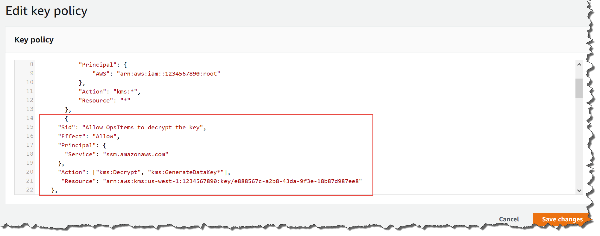
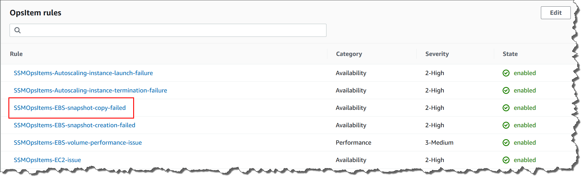

AWS Systems Manager Change Manager is no longer open to new customers. Existing customers can continue to use the service as normal. For more information, see
[AWS Systems Manager Change Manager availability change](change-manager-availability-change.md "change-manager-availability-change.md").

# (Optional) Set up Amazon SNS to receive

notifications about OpsItems

You can configure OpsCenter to send notifications to an Amazon Simple Notification Service (Amazon SNS) topic
when the system creates an OpsItem or updates an existing OpsItem.

Complete the following steps to receive notifications for OpsItems.

- [Step 1: Creating
  and subscribing to an Amazon SNS topic](#OpsCenter-getting-started-sns-create-topic "#OpsCenter-getting-started-sns-create-topic")
- [Step 2:
  Updating the Amazon SNS access policy](#OpsCenter-getting-started-sns-encryption-policy "#OpsCenter-getting-started-sns-encryption-policy")
- [Step 3: Updating the
  AWS KMS access policy](#OpsCenter-getting-started-sns-KMS-policy "#OpsCenter-getting-started-sns-KMS-policy")

###### Note

If you turn on AWS Key Management Service (AWS KMS) server-side encryption in Step 2,
then you must complete Step 3. Otherwise, you can skip Step 3.

- [Step 4: Turning on
  default OpsItems rules to send notifications for new OpsItems](#OpsCenter-getting-started-sns-default-rules "#OpsCenter-getting-started-sns-default-rules")

## Step 1: Creating

and subscribing to an Amazon SNS topic

To receive notifications, you must create and subscribe to an Amazon SNS topic. For
more information, see [Creating an
Amazon SNS topic](../../../sns/latest/dg/CreateTopic.md "../../../sns/latest/dg/CreateTopic.md") and [Subscribing to an Amazon SNS topic](../../../sns/latest/dg/sns-tutorial-create-subscribe-endpoint-to-topic.md "../../../sns/latest/dg/sns-tutorial-create-subscribe-endpoint-to-topic.md") in the
_Amazon Simple Notification Service Developer Guide_.

###### Note

If you're using OpsCenter in multiple AWS Regions or accounts, you must
create and subscribe to an Amazon SNS topic in _each_ Region or account where you want to receive OpsItem
notifications.

## Step 2:

Updating the Amazon SNS access policy

You have to associate an Amazon SNS topic with OpsItems. Use the following procedure
to set up an Amazon SNS access policy so that Systems Manager can publish OpsItems notifications
to the Amazon SNS topic that you created in Step 1.

1. Sign in to the AWS Management Console and open the Amazon SNS console at
   [https://console.aws.amazon.com/sns/v3/home](https://console.aws.amazon.com/sns/v3/home "https://console.aws.amazon.com/sns/v3/home").
2. In the navigation pane, choose **Topics**.
3. Choose the topic that you created in Step 1, and then choose
   **Edit**.
4. Expand **Access policy**.
5. Add the following `Sid` block to the existing policy.
   Replace each `example resource placeholder`
   with your own information.

```
{
      "Sid": "Allow OpsCenter to publish to this topic",
      "Effect": "Allow",
      "Principal": {
        "Service": "ssm.amazonaws.com"
      },
      "Action": "SNS:Publish",
      "Resource": "arn:aws:sns:`region`:`account ID`:`topic name`", // Account ID of the SNS topic owner
      "Condition": {
      "StringEquals": {
        "AWS:SourceAccount": "`account ID`" //  Account ID of the OpsItem owner
      }
   }
}
```

###### Note

The `aws:SourceAccount` global condition key protects
against the confused deputy scenario. To use this condition key, set
the value to the account ID of the OpsItem owner. For more information,
see [Confused
Deputy](../../../IAM/latest/UserGuide/confused-deputy.md "../../../IAM/latest/UserGuide/confused-deputy.md") in the _IAM User Guide_. 6. Choose **Save changes**.

The system now sends notifications to the Amazon SNS topic when OpsItems are created
or updated.

###### Important

If you configure the Amazon SNS topic with an AWS Key Management Service (AWS KMS) server-side
encryption key in the Step 2, then complete Step 3. Otherwise, you can skip
Step 3.

## Step 3: Updating the

AWS KMS access policy

If you turned on AWS KMS server-side encryption for your Amazon SNS topic, you must
also update the access policy of the AWS KMS key that you chose when you
configured the topic. Use the following procedure to update the access policy so
that Systems Manager can publish OpsItem notifications to the Amazon SNS topic you created in Step

1.

###### Note

OpsCenter doesn't support publishing OpsItems to an Amazon SNS topic that is
configured with an AWS managed key.

1. Open the AWS KMS console at [https://console.aws.amazon.com/kms](https://console.aws.amazon.com/kms "https://console.aws.amazon.com/kms").
2. To change the AWS Region, use the Region selector in the upper-right corner of the page.
3. In the navigation pane, choose **Customer managed keys**.
4. Choose the ID of the KMS key that you chose when you created the
   topic.
5. In the **Key policy** section, choose
   **Switch to policy view**.
6. Choose **Edit**.
7. Add the following `Sid` block to the existing policy.
   Replace each `example resource placeholder`
   with your own information.

```
{
      "Sid": "Allow OpsItems to decrypt the key",
      "Effect": "Allow",
      "Principal": {
        "Service": "ssm.amazonaws.com"
      },
      "Action": ["kms:Decrypt", "kms:GenerateDataKey*"],
       "Resource": "arn:aws:kms:`region`:`account ID`:key/`key ID`"
    }
```

In the following example, the new block is entered at line 14.

 8. Choose **Save changes**.

## Step 4: Turning on

default OpsItems rules to send notifications for new OpsItems

Default OpsItems rules in Amazon EventBridge aren't configured with an Amazon Resource Name
(ARN) for Amazon SNS notifications. Use the following procedure to edit a rule in
EventBridge and enter a `notifications` block.

###### To add a notifications block to a default OpsItem rule

1. Open the AWS Systems Manager console at [https://console.aws.amazon.com/systems-manager/](https://console.aws.amazon.com/systems-manager/ "https://console.aws.amazon.com/systems-manager/").
2. In the navigation pane, choose **OpsCenter**.
3. Choose the **OpsItems** tab, and then choose
   **Configure sources**.
4. Choose the name of the source rule that you want to configure with a
   `notifications` block, as shown in the following
   example.



The rule opens in Amazon EventBridge. 5. On the rule details page, on the **Targets** tab,
choose **Edit**. 6. In the **Additional settings** section, choose
**Configure input transformer**. 7. In the **Template** box, add a
`notifications` block in the following format.

```
"notifications":[{"arn":"arn:aws:sns:`region`:`account ID`:`topic name`"}],
```

Here's an example.

```
"notifications":[{"arn":"arn:aws:sns:us-west-2:1234567890:MySNSTopic"}],
```

Enter the notifications block before the `resources` block,
as shown in the following example for the US West (Oregon) (us-west-2)
Region.

```
{
    "title": "EBS snapshot copy failed",
    "description": "CloudWatch Event Rule SSMOpsItems-EBS-snapshot-copy-failed was triggered. Your EBS snapshot copy has failed. See below for more details.",
    "category": "Availability",
    "severity": "2",
    "source": "EC2",
    "notifications": [{
        "arn": "arn:aws:sns:us-west-2:1234567890:MySNSTopic"
    }],
    "resources": <resources>,
    "operationalData": {
        "/aws/dedup": {
            "type": "SearchableString",
            "value": "{\"dedupString\":\"SSMOpsItems-EBS-snapshot-copy-failed\"}"
        },
        "/aws/automations": {
            "value": "[ { \"automationType\": \"AWS:SSM:Automation\", \"automationId\": \"AWS-CopySnapshot\" } ]"
        },
        "failure-cause": {
            "value": <failure - cause>
        },
        "source": {
            "value": <source>
        },
        "start-time": {
            "value": <start - time>
        },
        "end-time": {
            "value": <end - time>
        }
    }
}
```

8. Choose **Confirm**.
9. Choose **Next**.
10. Choose **Next**.
11. Choose **Update rule**.

The next time that the system creates an OpsItem for the default rule, it
publishes a notification to the Amazon SNS topic.
