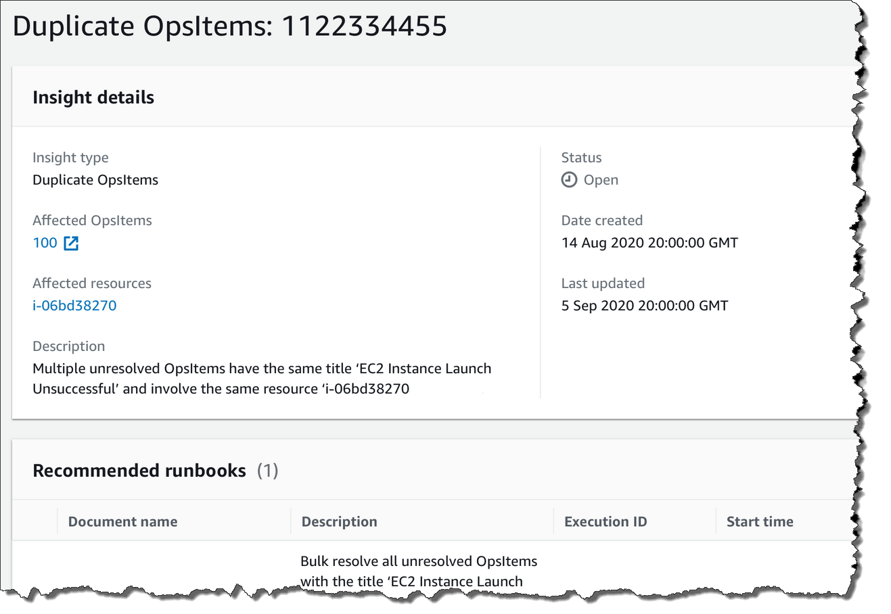

AWS Systems Manager Change Manager is no longer open to new customers. Existing customers can continue to use the service as normal. For more information, see
[AWS Systems Manager Change Manager availability change](change-manager-availability-change.md "change-manager-availability-change.md").

# Analyzing operational

insights to reduce OpsItems

OpsCenter _operational insights_ display
information about duplicate OpsItems. OpsCenter automatically analyzes OpsItems in your
account and generates three types of _insights_. You can view
this information in the **Operational insights** section of the
OpsCenter **Summary** tab.

- **Duplicate OpsItems** – An insight is generated when
  eight or more OpsItems have the same title for the same resource.
- **Most common titles** – An insight is generated
  when more than 50 OpsItems have the same title.
- **Resources generating the most OpsItems** – An
  insight is generated when an AWS resource has more than 10 open OpsItems.
  These insights and their corresponding resources are displayed in the
  **Resources generating the most OpsItems** table on the
  OpsCenter **Summary** tab. Resources are listed in
  decreasing order of OpsItem count.

###### Note

OpsCenter creates **Resources generating the most OpsItems**
insights for the following resource types:

- Amazon Elastic Compute Cloud (Amazon EC2) instances
- Amazon EC2 security groups
- Amazon EC2 Auto Scaling group
- Amazon Relational Database Service (Amazon RDS) database
- Amazon RDS cluster
- AWS Lambda function
- Amazon DynamoDB table
- Elastic Load Balancing load balancer
- Amazon Redshift cluster
- AWS Certificate Manager certificate
- Amazon Elastic Block Store volume
  OpsCenter enforces a limit of 15 insights per type. If a type reaches this limit,
  OpsCenter stops displaying more insights for that type. To view additional insights,
  you must resolve all OpsItems associated with an OpsInsight of that type. If a pending
  insight is prevented from being displayed in the console because of the 15-insight
  limit, that insight becomes visible after another insight is closed.

When you choose an insight, OpsCenter displays information about the affected
OpsItems and resources. The following screenshot shows an example with the details of a
duplicate OpsItem insight.

Operational insights are turned off by default. For more information about working
with operational insights, see the following topics.

###### Topics

- [Enabling
  operational insights](#OpsCenter-working-operational-insights-viewing "#OpsCenter-working-operational-insights-viewing")
- [Resolving
  duplicate OpsItems based on insights](#OpsCenter-working-operational-insights-resolve "#OpsCenter-working-operational-insights-resolve")
- [Disabling
  operational insights](#OpsCenter-working-operational-insights-disable "#OpsCenter-working-operational-insights-disable")

## Enabling

operational insights

You can enable operational insights on the **OpsCenter** page
in the Systems Manager console. When you enable operational insights, Systems Manager creates an
AWS Identity and Access Management (IAM) service-linked role called
`AWSServiceRoleForAmazonSSM_OpsInsights`. A service-linked role
is a unique type of IAM role that is linked directly to Systems Manager. Service-linked
roles are predefined and include all the permissions that the service requires
to call other AWS services on your behalf. For more information about the
`AWSServiceRoleForAmazonSSM_OpsInsights` service-linked role, see
[Using roles to create operational insight OpsItems in Systems Manager OpsCenter](using-service-linked-roles-service-action-4.md "using-service-linked-roles-service-action-4.md").

###### Note

Note the following important information:

- Your AWS account is charged for operational insights. For more
  information, see [AWS Systems Manager Pricing](https://aws.amazon.com/systems-manager/pricing/ "https://aws.amazon.com/systems-manager/pricing/").
- OpsCenter periodically refreshes insights using a batch process.
  This means the list of insights displayed in OpsCenter might be out
  of sync.

Use the following procedure to enable and view operational insights in
OpsCenter.

###### To enable and view operational insights

1. Open the AWS Systems Manager console at [https://console.aws.amazon.com/systems-manager/](https://console.aws.amazon.com/systems-manager/ "https://console.aws.amazon.com/systems-manager/").
2. In the navigation pane, choose **OpsCenter**.
3. In the **Operational insight is available** message
   box, choose **Enable**. If you don't see this message,
   scroll down to the **Operational insights** section and
   choose **Enable**.
4. After you enable this feature, on the **Summary**
   tab, scroll down to the **Operational insights**
   section.
5. To view a filtered list of insights, choose the link beside
   **Duplicate OpsItems**, **Most common
   titles**, or **Resources generating the most
   OpsItems**. To view all insights, choose **View all
   operational insights**.
6. Choose an insight ID to view more information.

## Resolving

duplicate OpsItems based on insights

To resolve insights, you must first resolve all OpsItems associated with an
insight. You can use the `AWS-BulkResolveOpsItemsForInsight` runbook
to resolve OpsItems associated with an insight.

To help you resolve duplicate OpsItems and reduce the number of OpsItems created by
a source, Systems Manager provides the following automation runbooks:

- The `AWS-BulkResolveOpsItems` runbook resolves OpsItems that
  match a specified filter.
- The `AWS-AddOpsItemDedupStringToEventBridgeRule` runbook
  adds a deduplication string for all OpsItem targets that are associated
  with a specific Amazon EventBridge rule. This runbook doesn't add a deduplication
  string if a rule already has one.
- The `AWS-DisableEventBridgeRule` turns off a rule in EventBridge
  if the rule is generating dozens or hundreds of OpsItems.

###### To resolve an operational insight

1. Open the AWS Systems Manager console at [https://console.aws.amazon.com/systems-manager/](https://console.aws.amazon.com/systems-manager/ "https://console.aws.amazon.com/systems-manager/").
2. In the navigation pane, choose **OpsCenter**.
3. On the **Overview** tab, scroll down to
   **Operational insights**.
4. Choose **View all operational insights**.
5. Choose an insight ID to view more information.
6. Choose a runbook and choose **Execute**.

## Disabling

operational insights

When you turn off operational insights, the system stops creating new insights
and stops displaying insights in the console. Any active insights remain
unchanged in the system, although you won't see them displayed in the console.
If you enable this feature again, the system displays previously unresolved
insights and starts creating new insights. Use the following procedure to turn
off operational insights.

###### To turn off operational insights

1. Open the AWS Systems Manager console at [https://console.aws.amazon.com/systems-manager/](https://console.aws.amazon.com/systems-manager/ "https://console.aws.amazon.com/systems-manager/").
2. In the navigation pane, choose **OpsCenter**.
3. Choose **Settings**.
4. In the **Operational insights** section, choose
   **Edit** and then toggle the
   **Disable** option.
5. Choose **Save**.
