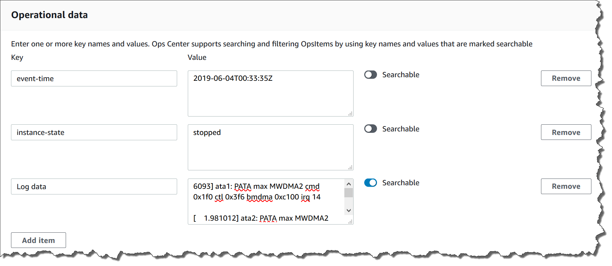

• AWS Systems Manager Change Manager is no longer open to new customers. Existing customers can continue to use the service as normal. For more information, see
[AWS Systems Manager Change Manager availability change](change-manager-availability-change.md "change-manager-availability-change.md").

 

• The AWS Systems Manager CloudWatch Dashboard will no longer be available after April 30, 2026. Customers can continue to use Amazon CloudWatch console to view, create, and manage their Amazon CloudWatch dashboards, just as they do today. For more information, see
[Amazon CloudWatch Dashboard documentation](../../../AmazonCloudWatch/latest/monitoring/CloudWatch_Dashboards.md "../../../AmazonCloudWatch/latest/monitoring/CloudWatch_Dashboards.md").

# Adding

operational data to an OpsItem

Operational data is custom data that provides useful reference details about an
OpsItem. You can enter multiple key-value pairs of operational data. For example, you
can specify log files, error strings, license keys, troubleshooting tips, or other
relevant data. The maximum length of the key can be 128 characters, and the maximum
size of the value can be 20 KB.

You can make the data searchable by other users in the account, or you can
restrict search access. Searchable data means that all users with access to the OpsItem
**Overview** page (as provided by the [DescribeOpsItems](../APIReference/API_DescribeOpsItems.md "../APIReference/API_DescribeOpsItems.md") API
operation) can view and search on the specified data. Operational data that isn't
searchable is only viewable by users who have access to the OpsItem (as provided by the
[GetOpsItem](../APIReference/API_GetOpsItem.md "../APIReference/API_GetOpsItem.md") API
operation).

###### To add operational data to an OpsItem

1. Open the AWS Systems Manager console at [https://console.aws.amazon.com/systems-manager/](https://console.aws.amazon.com/systems-manager/ "https://console.aws.amazon.com/systems-manager/").
2. In the navigation pane, choose **OpsCenter**.
3. Choose an OpsItem ID to open its details page.
4. Expand **Operational data**.
5. If no operational data exists for the OpsItem, choose
   **Add**. If operational data already exists for the
   OpsItem, choose **Manage**.

After you create operational data, you can edit the key and the value,
remove the operational data, or add additional key-value pairs by choosing
**Manage**. 6. For **Key**, specify a word or words to help users
understand the purpose of the data.

###### Important

Operational data keys _can't_ begin with the
following: `amazon`, `aws`, `amzn`,
`ssm`, `/amazon`, `/aws`,
`/amzn`, `/ssm`. 7. For **Value**, specify the data. 8. Choose **Save**.

###### Note

You can filter OpsItems by using the **Operational data**
operator on the **OpsItems** page. In the
**Search** box, choose **Operational
data**, and then enter a key-value pair in JSON. You must enter the
key-value pair by using the following format:
`{"key":"`key_name`","value":"`a_value`"}`
