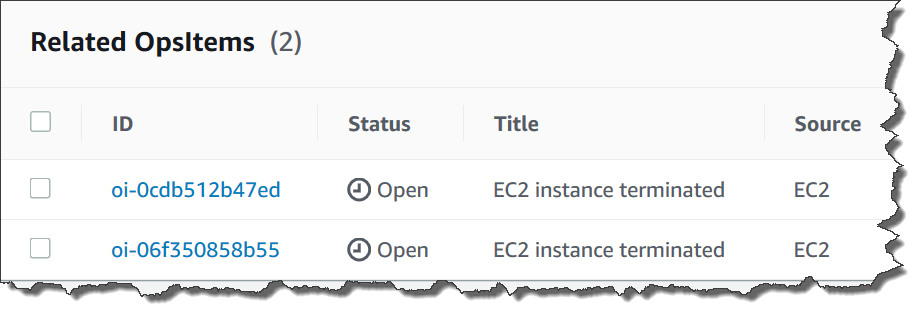

• AWS Systems Manager Change Manager is no longer open to new customers. Existing customers can continue to use the service as normal. For more information, see
[AWS Systems Manager Change Manager availability change](change-manager-availability-change.md "change-manager-availability-change.md").

 

• The AWS Systems Manager CloudWatch Dashboard will no longer be available after April 30, 2026. Customers can continue to use Amazon CloudWatch console to view, create, and manage their Amazon CloudWatch dashboards, just as they do today. For more information, see
[Amazon CloudWatch Dashboard documentation](../../../AmazonCloudWatch/latest/monitoring/CloudWatch_Dashboards.md "../../../AmazonCloudWatch/latest/monitoring/CloudWatch_Dashboards.md").

# Adding

related OpsItems to an OpsItem

By using **Related OpsItems** of the **OpsItems
Details** page, you can investigate operations issues and provide
context for an issue. OpsItems can be related in different ways, including a
parent-child relationship between OpsItems, a root cause, or a duplicate. You can
associate one OpsItem with another to display it in the **Related
OpsItem** section.You can specify a maximum of 10 IDs for other OpsItems that
are related to the current OpsItem.

###### To add a related OpsItem

1. Open the AWS Systems Manager console at [https://console.aws.amazon.com/systems-manager/](https://console.aws.amazon.com/systems-manager/ "https://console.aws.amazon.com/systems-manager/").
2. In the navigation pane, choose **OpsCenter**.
3. Choose an OpsItem ID to open the details page.
4. In the **Related OpsItem** section, choose
   **Add**.
5. For **OpsItem ID**, specify an ID.
6. Choose **Add**.
