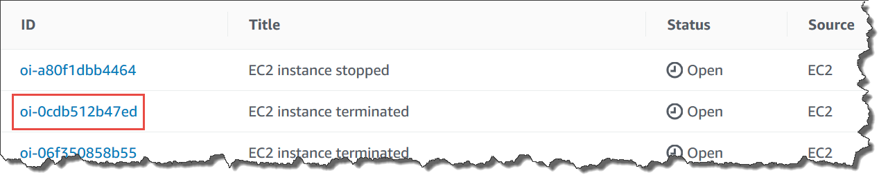
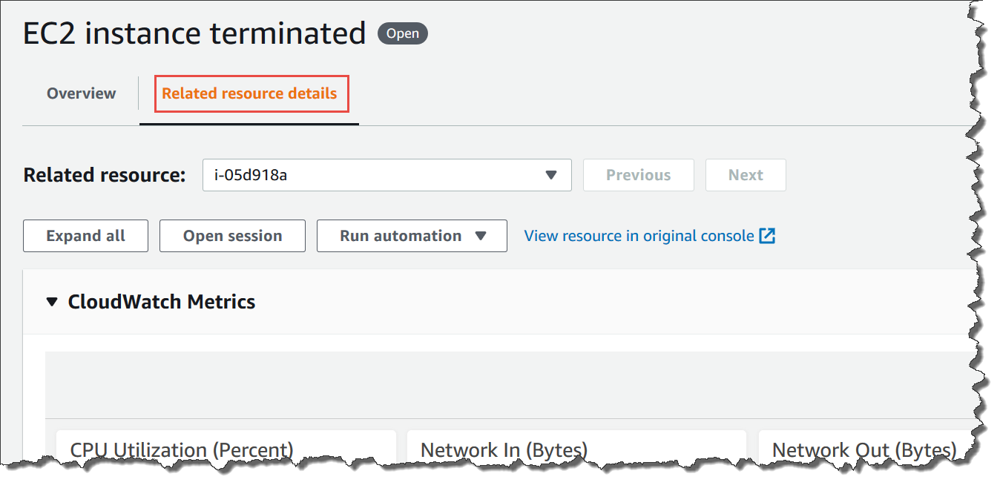

• AWS Systems Manager Change Manager is no longer open to new customers. Existing customers can continue to use the service as normal. For more information, see
[AWS Systems Manager Change Manager availability change](change-manager-availability-change.md "change-manager-availability-change.md").

 

• The AWS Systems Manager CloudWatch Dashboard will no longer be available after April 30, 2026. Customers can continue to use Amazon CloudWatch console to view, create, and manage their Amazon CloudWatch dashboards, just as they do today. For more information, see
[Amazon CloudWatch Dashboard documentation](../../../AmazonCloudWatch/latest/monitoring/CloudWatch_Dashboards.md "../../../AmazonCloudWatch/latest/monitoring/CloudWatch_Dashboards.md").

# Adding

related resources to an OpsItem

Each OpsItem includes a **Related resources** section that lists the
Amazon Resource Name (ARN) of the related resource. A _related
resource_ is the impacted AWS resource that needs to be
investigated.

If Amazon EventBridge creates the OpsItem, the system automatically populates the OpsItem with the
ARN of the resource. You can manually specify ARNs of related resources. For certain
ARN types, OpsCenter automatically creates a deep link that displays details about
the resource directly in the OpsCenter console. For example, if you specify the ARN
of an Amazon Elastic Compute Cloud (Amazon EC2) instance as a related resource, then OpsCenter pulls in
details about that EC2 instance. This allows you to view detailed information about
your impacted AWS resources without having to leave OpsCenter.

###### To view and add related resources to an OpsItem

1. Open the AWS Systems Manager console at [https://console.aws.amazon.com/systems-manager/](https://console.aws.amazon.com/systems-manager/ "https://console.aws.amazon.com/systems-manager/").
2. In the navigation pane, choose **OpsCenter**.
3. Choose the **OpsItems** tab.
4. Choose an OpsItem ID.

 5. To view information about the impacted resource, choose the
**Related resources details** tab.

This tab displays information about the resource from several
AWS services. Expand the **Resource details** section to
view information about this resource as provided by the AWS service that
hosts it. You can also toggle through other related resources associated
with this OpsItem by using the **Related resources**
list. 6. To add additional related resources, choose the
**Overview** tab. 7. In the **Related resources** section, choose
**Add**. 8. For **Resource type**, choose a resource from the
list. 9. For **Resource ID**, enter either the ID or the Amazon
Resource Name (ARN). The type of information you choose depends on the
resource that you chose in the previous step.

###### Note

You can manually add the ARNs of additional related resources. Each OpsItem can
list a maximum of 100 related resource ARNs.

The following table lists the resource types that automatically create deep links
to related resources.

| Supported resource types                                           | Resource name                                                                                                             | ARN format |
| ------------------------------------------------------------------ | ------------------------------------------------------------------------------------------------------------------------- | ---------- |
| AWS Certificate Manager certificate                                | `` arn:aws:acm:`region`:`account-id`:certificate/`certificate-id` ``                                                |
| Amazon EC2 Auto Scaling group                                      | `` arn:aws:autoscaling:`region`:`account-id`:autoScalingGroup:`groupid`:autoScalingGroupName/`groupfriendlyname` `` |
| Amazon CloudFront distribution                                     | `` arn:aws:cloudfront::`account-id`:* ``                                                                            |
| AWS CloudFormation stack                                           | `` arn:aws:cloudformation:`region`:`account-id`:stack/`stackname`/`additionalidentifier` ``                         |
| Amazon CloudWatch alarm                                            | `` arn:aws:cloudwatch:`region`:`account-id`:alarm:`alarm-name` ``                                                   |
| AWS CloudTrail trail                                               | `` arn:aws:cloudtrail:`region`:`account-id`:trail/`trailname` ``                                                    |
| AWS CodeBuild project                                              | `` arn:aws:codebuild:`region`:`account-id`:`resourcetype`/`resource` ``                                             |
| AWS CodePipeline                                                   | `` arn:aws:codepipeline:`region`:`account-id`:`resource-specifier` ``                                               |
| Amazon DevOps Guru insight                                         | `` arn:aws:devops-guru:`region`:`account-id`:insight/`proactive or reactive`/`resource-id` ``                       |
| Amazon DynamoDB table                                              | `` arn:aws:dynamodb:`region`:`account-id`:table/`tablename` ``                                                      |
| Amazon Elastic Compute Cloud (Amazon EC2) customer gateway         | `` arn:aws:ec2:`region`:`account-id`:customer-gateway/`cgw-id` ``                                                   |
| Amazon EC2 elastic IP                                              | `` arn:aws:ec2:`region`:`account-id`:eip/`eipalloc-id` ``                                                           |
| Amazon EC2 Dedicated Host                                          | `` arn:aws:ec2:`region`:`account-id`:dedicated-host/`host-id` ``                                                    |
| Amazon EC2 instance                                                | `` arn:aws:ec2:`region`:`account-id`:instance/`instance-id` ``                                                      |
| Amazon EC2 internet gateway                                        | `` arn:aws:ec2:`region`:`account-id`:internet-gateway/`igw-id` ``                                                   |
| Amazon EC2 network access control list (network ACL)               | `` arn:aws:ec2:`region`:`account-id`:network-acl/`nacl-id` ``                                                       |
| Amazon EC2 network interface                                       | `` arn:aws:ec2:`region`:`account-id`:network-interface/`eni-id` ``                                                  |
| Amazon EC2 route table                                             | `` arn:aws:ec2:`region`:`account-id`:route-table/`route-table-id` ``                                                |
| Amazon EC2 security group                                          | `` arn:aws:ec2:`region`:`account-id`:security-group/`security-group-id` ``                                          |
| Amazon EC2 subnet                                                  | `` arn:aws:ec2:`region`:`account-id`:subnet/`subnet-id` ``                                                          |
| Amazon EC2 volume                                                  | `` arn:aws:ec2:`region`:`account-id`:volume/`volume-id` ``                                                          |
| Amazon EC2 VPC                                                     | `` arn:aws:ec2:`region`:`account-id`:vpc/`vpc-id` ``                                                                |
| Amazon EC2 VPN connection                                          | `` arn:aws:ec2:`region`:`account-id`:vpn-connection/`vpn-id` ``                                                     |
| Amazon EC2 VPN gateway                                             | `` arn:aws:ec2:`region`:`account-id`:vpn-gateway/`vgw-id` ``                                                        |
| AWS Elastic Beanstalk application                                  | `` arn:aws:elasticbeanstalk:`region`:`account-id`:application/`applicationname` ``                                  |
| Elastic Load Balancing (Classic Load Balancer)                     | `` arn:aws:elasticloadbalancing:`region`:`account-id`:loadbalancer/`name` ``                                        |
| Elastic Load Balancing (Application Load Balancer)                 | `` arn:aws:elasticloadbalancing:`region`:`account-id`:loadbalancer/app/`load-balancer-name`/`load-balancer-id` ``   |
| Elastic Load Balancing (Network Load Balancer)                     | `` arn:aws:elasticloadbalancing:`region`:`account-id`:loadbalancer/net/`load-balancer-name`/`load-balancer-id` ``   |
| AWS Identity and Access Management (IAM) group                     | `` arn:aws:iam::`account-id`:group/`group-name` ``                                                                  |
| IAM policy                                                         | `` arn:aws:iam::`account-id`:policy/`policy-name` ``                                                                |
| IAM role                                                           | `` arn:aws:iam::`account-id`:role/`role-name` ``                                                                    |
| IAM user                                                           | `` arn:aws:iam::`account-id`:user/`user-name` ``                                                                    |
| AWS Lambda function                                                | `` arn:aws:lambda:`region`:`account-id`:function:`function-name` ``                                                 |
| Amazon Relational Database Service (Amazon RDS) cluster            | `` arn:aws:rds:`region`:`account-id`:cluster:`db-cluster-name` ``                                                   |
| Amazon RDS database instance                                       | `` arn:aws:rds:`region`:`account-id`:db:`db-instance-name` ``                                                       |
| Amazon RDS subscription                                            | `` arn:aws:rds:`region`:`account-id`:es:`subscription-name` ``                                                      |
| Amazon RDS security group                                          | `` arn:aws:rds:`region`:`account-id`:secgrp:`security-group-name` ``                                                |
| Amazon RDS cluster snapshot                                        | `` arn:aws:rds:`region`:`account-id`:cluster-snapshot:`cluster-snapshot-name` ``                                    |
| Amazon RDS subnet group                                            | `` arn:aws:rds:`region`:`account-id`:subgrp:`subnet-group-name` ``                                                  |
| Amazon Redshift cluster                                            | `` arn:aws:redshift:`region`:`account-id`:cluster:`cluster-name` ``                                                 |
| Amazon Redshift parameter group                                    | `` arn:aws:redshift:`region`:`account-id`:parametergroup:`parameter-group-name` ``                                  |
| Amazon Redshift security group                                     | `` arn:aws:redshift:`region`:`account-id`:securitygroup:`security-group-name` ``                                    |
| Amazon Redshift cluster snapshot                                   | `` arn:aws:redshift:`region`:`account-id`:snapshot:`cluster-name`/`snapshot-name` ``                                |
| Amazon Redshift subnet group                                       | `` arn:aws:redshift:`region`:`account-id`:subnetgroup:`subnet-group-name` ``                                        |
| Amazon Simple Storage Service (Amazon S3) bucket                   | `` arn:aws:s3:::`bucket_name` ``                                                                                    |
| AWS Config recording of AWS Systems Manager managed node inventory | `` arn:aws:ssm:`region`:`account-id`:managed-instance-inventory/`node_id` ``                                        |
| Systems Manager State Manager association                          | `` arn:aws:ssm:`region`:`account-id`:association/`association_ID` ``                                                |
