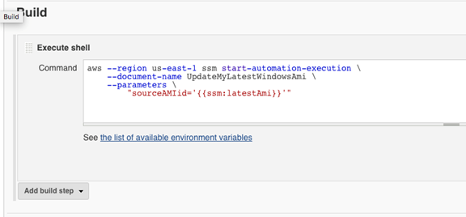
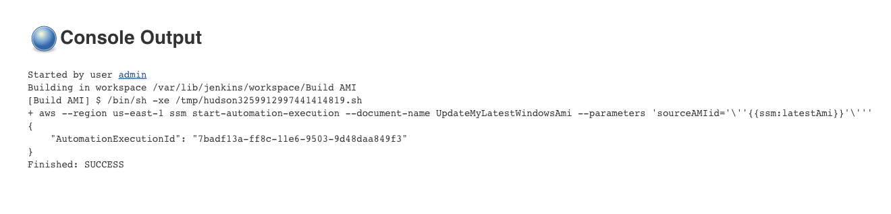

AWS Systems Manager Change Manager is no longer open to new customers. Existing customers can continue to use the service as normal. For more information, see
[AWS Systems Manager Change Manager availability change](change-manager-availability-change.md "change-manager-availability-change.md").

# Updating AMIs using Automation and Jenkins

If your organization uses Jenkins software in a CI/CD pipeline,
you can add Automation as a post-build step to pre-install application releases
into Amazon Machine Images (AMIs). Automation is a tool in AWS Systems Manager. You can also
use the Jenkins scheduling feature to call Automation and create
your own operating system (OS) patching cadence.

The example below shows how to invoke Automation from a Jenkins
server that is running either on-premises or in Amazon Elastic Compute Cloud (Amazon EC2). For
authentication, the Jenkins server uses AWS credentials based
on an IAM policy that you create in the example and attach to your instance
profile.

###### Note

Be sure to follow Jenkins security best practices when
configuring your instance.

###### Before you begin

Complete the following tasks before you configure Automation with
Jenkins:

- Complete the [Update a golden
  AMI using Automation, AWS Lambda, and Parameter Store](automation-tutorial-update-patch-golden-ami.md "automation-tutorial-update-patch-golden-ami.md")
  example. The following example uses the **UpdateMyLatestWindowsAmi** runbook created in that
  example.
- Configure IAM roles for Automation. Systems Manager requires an instance
  profile role and a service role ARN to process automations. For more
  information, see [Setting up Automation](automation-setup.md "automation-setup.md").

###### To create an IAM policy for the Jenkins server

1. Sign in to the AWS Management Console and open the IAM console at [https://console.aws.amazon.com/iam/](https://console.aws.amazon.com/iam/ "https://console.aws.amazon.com/iam/").
2. In the navigation pane, choose **Policies**, and then
   choose **Create policy**.
3. Choose the **JSON** tab.
4. Replace each `example resource placeholder`
   with your own information.

JSON

```
`{
 "Version":"2012-10-17",
 "Statement": [
 {
 "Effect": "Allow",
 "Action": "ssm:StartAutomationExecution",
 "Resource": [
 "arn:aws:ssm:`us-east-1`:`111122223333`:document/`UpdateMyLatestWindowsAmi`",
 "arn:aws:ssm:`us-east-1`:`111122223333`:automation-execution/*"
 ]
 }
 ]
}`

```

5. Choose **Review policy**.
6. On the **Review policy** page, for
   **Name**, enter a name for the inline policy, such
   as `JenkinsPolicy`.
7. Choose **Create policy**.
8. In the navigation pane, choose **Roles**.
9. Choose the instance profile that's attached to your
   Jenkins server.
10. In the **Permissions** tab, select **Add
    permissions** and choose **Attach
    policies**.
11. In the **Other permissions policies** section, enter
    the name of policy you created in the previous steps. For example,
    **JenkinsPolicy**.
12. Select the check box next to your policy, and choose **Attach
    policies**.
    Use the following procedure to configure the AWS CLI on your
    Jenkins server.

###### To configure the Jenkins server for Automation

1. Connect to your Jenkins server on port 8080 using your
   preferred browser to access the management interface.
2. Enter the password found in
   `/var/lib/jenkins/secrets/initialAdminPassword`.
   To display your password, run the following command.

```
sudo cat /var/lib/jenkins/secrets/initialAdminPassword
```

3. The Jenkins installation script directs you to the
   **Customize Jenkins** page. Select
   **Install suggested plugins**.
4. Once the installation is complete, choose **Administrator
   Credentials**, select **Save
   Credentials**, and then select **Start Using
   Jenkins**.
5. In the left navigation pane, choose **Manage
   Jenkins**, and then choose
   **Manage Plugins**.
6. Choose the **Available** tab, and then enter
   `Amazon EC2 plugin`.
7. Select the check box for `Amazon EC2 plugin`, and
   then select **Install without restart**.
8. When the installation completes, select **Go back to the top
   page**.
9. Choose **Manage Jenkins**, and then
   choose **Manage nodes and clouds**.
10. In the **Configure Clouds** section, select
    **Add a new cloud**, and then choose
    **Amazon EC2**.
11. Enter your information in the remaining fields. Make sure you select
    the **Use EC2 instance profile to obtain credentials**
    option.
    Use the following procedure to configure your Jenkins project
    to invoke Automation.

###### To configure your Jenkins server to invoke

Automation

1. Open the Jenkins console in a web browser.
2. Choose the project that you want to configure with Automation, and
   then choose **Configure**.
3. On the **Build** tab, choose **Add Build
   Step**.
4. Choose **Execute shell** or **Execute Windows
   batch command** (depending on your operating
   system).
5. In the **Command** field, run an AWS CLI command like
   the following. Replace each `example resource
placeholder` with your own information.

```
aws ssm start-automation-execution \
        --document-name `runbook name` \
        --region `AWS Region of your source AMI` \
        --parameters `runbook parameters`
```

The following example command uses the **UpdateMyLatestWindowsAmi** runbook and the Systems Manager Parameter
`latestAmi` created in [Update a golden
AMI using Automation, AWS Lambda, and Parameter Store](automation-tutorial-update-patch-golden-ami.md "automation-tutorial-update-patch-golden-ami.md").

```
aws ssm start-automation-execution \
        --document-name UpdateMyLatestWindowsAmi \
        --parameters \
            "sourceAMIid='{{ssm:latestAmi}}'"
        --region `region`

```

In Jenkins, the command looks like the example in the
following screenshot.

 6. In the Jenkins project, choose **Build
Now**. Jenkins returns output similar to the
following example.


