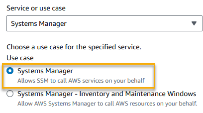

• AWS Systems Manager Change Manager is no longer open to new customers. Existing customers can continue to use the service as normal. For more information, see
[AWS Systems Manager Change Manager availability change](change-manager-availability-change.md "change-manager-availability-change.md").

 

• The AWS Systems Manager CloudWatch Dashboard will no longer be available after April 30, 2026. Customers can continue to use Amazon CloudWatch console to view, create, and manage their Amazon CloudWatch dashboards, just as they do today. For more information, see
[Amazon CloudWatch Dashboard documentation](../../../AmazonCloudWatch/latest/monitoring/CloudWatch_Dashboards.md "../../../AmazonCloudWatch/latest/monitoring/CloudWatch_Dashboards.md").

# Configuring roles and permissions for

Change Manager

###### Change Manager availability change

AWS Systems Manager Change Manager will no longer be open to new customers
starting November 7, 2025. If you would like to use Change Manager, sign up prior to that
date. Existing customers can continue to use the service as normal. For more
information, see [AWS Systems Manager Change Manager availability change](change-manager-availability-change.md "change-manager-availability-change.md").

By default, Change Manager doesn't have permission to perform actions on your resources.
You must grant access by using an AWS Identity and Access Management (IAM) service role, or _assume role_. This role enables Change Manager to securely run
the runbook workflows specified in an approved change request on your behalf. The
role grants AWS Security Token Service (AWS STS) [AssumeRole](../../../STS/latest/APIReference/API_AssumeRole.md "../../../STS/latest/APIReference/API_AssumeRole.md") trust to Change Manager.

By providing these permissions to a role to act on behalf of users in an
organization, users don't need to be granted that array of permissions themselves.
The actions allowed by the permissions are limited to approved operations
only.

When users in your account or organization create a change request, they can
select this assume role to perform the change operations.

You can create a new assume role for Change Manager or update an existing role with the
needed permissions.

If you need to create a service role for Change Manager, complete the following tasks.

###### Tasks

- [Task 1: Creating an assume role
  policy for Change Manager](#change-manager-role-policy "#change-manager-role-policy")
- [Task 2: Creating an assume role for
  Change Manager](#change-manager-role "#change-manager-role")
- [Task 3: Attaching the
  iam:PassRole policy to other roles](#change-manager-passpolicy "#change-manager-passpolicy")
- [Task 4: Adding inline
  policies to an assume role to invoke other AWS services](#change-manager-role-add-inline-policy "#change-manager-role-add-inline-policy")
- [Task 5: Configuring user access to
  Change Manager](#change-manager-passrole "#change-manager-passrole")

## Task 1: Creating an assume role

policy for Change Manager

Use the following procedure to create the policy that you will attach to your
Change Manager assume role.

###### To create an assume role policy for Change Manager

1. Open the IAM console at
   [https://console.aws.amazon.com/iam/](https://console.aws.amazon.com/iam/ "https://console.aws.amazon.com/iam/").
2. In the navigation pane, choose **Policies**, and then
   choose **Create Policy**.
3. On the **Create policy** page, choose the
   **JSON** tab and replace the default content with
   the following, which you will modify for your own Change Manager operations in
   following steps.

###### Note

If you're creating a policy to use with a single AWS account,
and not an organization with multiple accounts and AWS Regions,
you can omit the first statement block. The
`iam:PassRole` permission isn't required in the case
of a single account using Change Manager.

JSON

```
`{
 "Version":"2012-10-17",
 "Statement": [
 {
 "Effect": "Allow",
 "Action": "iam:PassRole",
 "Resource": "arn:aws:iam::`111122223333`:role/AWS-SystemsManager-`job-function`AdministrationRole",
 "Condition": {
 "StringEquals": {
 "iam:PassedToService": "ssm.amazonaws.com"
 }
 }
 },
 {
 "Effect": "Allow",
 "Action": [
 "ssm:DescribeDocument",
 "ssm:GetDocument",
 "ssm:StartChangeRequestExecution"
 ],
 "Resource": [
 "arn:aws:ssm:`us-east-1`::document/`template-name`",
 "arn:aws:ssm:`us-east-1`:`111122223333`:automation-execution/*"
 ]
 },
 {
 "Effect": "Allow",
 "Action": [
 "ssm:ListOpsItemEvents",
 "ssm:GetOpsItem",
 "ssm:ListDocuments",
 "ssm:DescribeOpsItems"
 ],
 "Resource": "*"
 }
 ]
}`

```

4. For the `iam:PassRole` action, update the
   `Resource` value to include the ARNs of all job functions
   defined for your organization that you want to grant permissions to
   initiate runbook workflows.
5. Replace the `region`,
   `account-id`,
   `template-name`,
   `delegated-admin-account-id`, and
   `job-function` placeholders with values for
   your Change Manager operations.
6. For the second `Resource` statement, modify the list to
   include all change templates that you want to grant permissions for.
   Alternatively, specify `"Resource": "*"` to grant permissions
   for all change templates in your organization.
7. Choose **Next: Tags**.
8. (Optional) Add one or more tag-key value pairs to organize, track, or
   control access for this policy.
9. Choose **Next: Review**.
10. On the **Review policy** page, enter a name in the
    **Name** box, such as
    `MyChangeManagerAssumeRole`, and then enter an
    optional description.
11. Choose **Create policy**, and continue to [Task 2: Creating an assume role for
    Change Manager](#change-manager-role "#change-manager-role").

## Task 2: Creating an assume role for

Change Manager

Use the following procedure to create a Change Manager assume role, a type of
service role, for Change Manager.

###### To create an assume role for Change Manager

1. Open the IAM console at
   [https://console.aws.amazon.com/iam/](https://console.aws.amazon.com/iam/ "https://console.aws.amazon.com/iam/").
2. In the navigation pane, choose **Roles**, and then
   choose **Create role**.
3. For **Select trusted entity**, make the following
   choices:
   1. For **Trusted entity type**, choose
      **AWS service**
   2. For **Use cases for other AWS services**,
      choose **Systems Manager**
   3. Choose **Systems Manager**, as shown in the following
      image.

   

4. Choose **Next**.
5. On the **Attached permissions policy** page, search
   for the assume role policy you created in [Task 1: Creating an assume role
   policy for Change Manager](#change-manager-role-policy "#change-manager-role-policy"), such as
   `MyChangeManagerAssumeRole`.
6. Select the check box next to the assume role policy name, and then
   choose **Next: Tags**.
7. For **Role name**, enter a name for your new instance
   profile, such as
   `MyChangeManagerAssumeRole`.
8. (Optional) For **Description**, update the
   description for this instance role.
9. (Optional) Add one or more tag-key value pairs to organize, track, or
   control access for this role.
10. Choose **Next: Review**.
11. (Optional) For **Tags**, add one or more tag-key
    value pairs to organize, track, or control access for this role, and
    then choose **Create role**. The system returns you to
    the **Roles** page.
12. Choose **Create role**. The system returns you to the
    **Roles** page.
13. On the **Roles** page, choose the role you just
    created to open the **Summary** page.

## Task 3: Attaching the

`iam:PassRole` policy to other roles

Use the following procedure to attach the `iam:PassRole` policy to
an IAM instance profile or IAM service role. (The Systems Manager service uses IAM
instance profiles to communicate with EC2 instances. For non-EC2 managed nodes
in a [hybrid and multicloud](operating-systems-and-machine-types.md#supported-machine-types "operating-systems-and-machine-types.md#supported-machine-types") environment, an IAM service role is used instead.)

By attaching the `iam:PassRole` policy, the Change Manager service can
pass assume role permissions to other services or Systems Manager tools when running
runbook workflows.

###### To attach the `iam:PassRole` policy to an IAM

instance profile or service role

1. Open the IAM console at
   [https://console.aws.amazon.com/iam/](https://console.aws.amazon.com/iam/ "https://console.aws.amazon.com/iam/").
2. In the navigation pane, choose **Roles**.
3. Search for the Change Manager assume role you created, such as
   `MyChangeManagerAssumeRole`, and choose its
   name.
4. In the **Summary** page for the assume role, choose
   the **Permissions** tab.
5. Choose **Add permissions, Create inline
   policy**.
6. On the **Create policy** page, choose the
   **Visual editor** tab.
7. Choose **Service**, and then choose
   **IAM**.
8. In the **Filter actions** text box, enter
   `PassRole`, and then choose the
   **PassRole** option.
9. Expand **Resources**. Verify that
   **Specific** is selected, and then choose
   **Add ARN**.
10. In the **Specify ARN for role** field, enter the ARN
    of the IAM instance profile role or IAM service role to which you
    want to pass assume role permissions. The system populates the
    **Account** and **Role name with
    path** fields.
11. Choose **Add**.
12. Choose **Review policy**.
13. For **Name**, enter a name to identify this policy,
    and then choose **Create policy**.

**More info**

- [Configure instance permissions required for Systems Manager](setup-instance-permissions.md "setup-instance-permissions.md")
- [Create the IAM service role required for Systems Manager in hybrid and multicloud environments](hybrid-multicloud-service-role.md "hybrid-multicloud-service-role.md")

## Task 4: Adding inline

policies to an assume role to invoke other AWS services

When a change request invokes other AWS services by using the Change Manager
assume role, the assume role must be configured with permission to invoke those
services. This requirement applies to all AWS Automation runbooks (AWS-\*
runbooks) that might be used in a change request, such as the
`AWS-ConfigureS3BucketLogging`,
`AWS-CreateDynamoDBBackup`, and
`AWS-RestartEC2Instance` runbooks. This requirement also applies
to any custom runbooks you create that invoke other AWS services by using
actions that call other services. For example, if you use the
`aws:executeAwsApi`, `aws:CreateStack`, or
`aws:copyImage` actions, then you must configure the service role
with permission to invoke those services. You can enable permissions to other
AWS services by adding an IAM inline policy to the role.

###### To add an inline policy to an assume role to invoke other AWS services

(IAM console)

1. Sign in to the AWS Management Console and open the IAM console at [https://console.aws.amazon.com/iam/](https://console.aws.amazon.com/iam/ "https://console.aws.amazon.com/iam/").
2. In the navigation pane, choose **Roles**.
3. In the list, choose the name of the assume role that you want to
   update, such as `MyChangeManagerAssumeRole`.
4. Choose the **Permissions** tab.
5. Choose **Add permissions, Create inline
   policy**.
6. Choose the **JSON** tab.
7. Enter a JSON policy document for the AWS services you want to
   invoke. Here are two example JSON policy documents.

**Amazon S3 `PutObject` and
`GetObject` example**

JSON

```
`{
 "Version":"2012-10-17",
 "Statement": [
 {
 "Effect": "Allow",
 "Action": [
 "s3:PutObject",
 "s3:GetObject"
 ],
 "Resource": "arn:aws:s3:::amzn-s3-demo-bucket/*"
 }
 ]
}`

```

**Amazon EC2 `CreateSnapshot` and
`DescribeSnapShots` example**

JSON

```
`{
 "Version":"2012-10-17",
 "Statement":[
 {
 "Effect":"Allow",
 "Action":"ec2:CreateSnapshot",
 "Resource":"*"
 },
 {
 "Effect":"Allow",
 "Action":"ec2:DescribeSnapshots",
 "Resource":"*"
 }
 ]
}`

```

For details about the IAM policy language, see [IAM JSON policy
reference](../../../IAM/latest/UserGuide/reference_policies.md "../../../IAM/latest/UserGuide/reference_policies.md") in the
_IAM User Guide_. 8. When you're finished, choose **Review policy**. The
[Policy Validator](../../../IAM/latest/UserGuide/access_policies_policy-validator.md "../../../IAM/latest/UserGuide/access_policies_policy-validator.md") reports any syntax errors. 9. For **Name**, enter a name to identify the policy
that you're creating. Review the policy **Summary** to
see the permissions that are granted by your policy. Then choose
**Create policy** to save your work. 10. After you create an inline policy, it's automatically embedded in your
role.

## Task 5: Configuring user access to

Change Manager

If your user, group, or role is assigned administrator permissions, then you
have access to Change Manager. If you don't have administrator permissions, then an
administrator must assign the `AmazonSSMFullAccess` managed policy,
or a policy that provides comparable permissions, to your user, group, or
role.

Use the following procedure to configure a user to use Change Manager. The user you
choose will have permission to configure and run Change Manager.

Depending on the identity application that you are using in your organization,
you can select any of the three options available to configure user access.
While configuring the user access, assign or add the following:

1. Assign the `AmazonSSMFullAccess` policy or a comparable
   policy that gives permission to access Systems Manager.
2. Assign the `iam:PassRole` policy.
3. Add the ARN for the Change Manager assume role you copied at the end of
   [Task 2: Creating an assume role for
   Change Manager](#change-manager-role "#change-manager-role").

To provide access, add permissions to your users, groups, or roles:

- Users and groups in AWS IAM Identity Center:

Create a permission set. Follow the instructions in [Create a permission set](../../../singlesignon/latest/userguide/howtocreatepermissionset.md "../../../singlesignon/latest/userguide/howtocreatepermissionset.md") in the _AWS IAM Identity Center User Guide_.

- Users managed in IAM through an identity provider:

Create a role for identity federation. Follow the instructions in [Create a role for a third-party identity provider (federation)](../../../IAM/latest/UserGuide/id_roles_create_for-idp.md "../../../IAM/latest/UserGuide/id_roles_create_for-idp.md")
in the _IAM User Guide_.

- IAM users:
  - Create a role that your user can assume. Follow the instructions in [Create a role for an IAM user](../../../IAM/latest/UserGuide/id_roles_create_for-user.md "../../../IAM/latest/UserGuide/id_roles_create_for-user.md") in the _IAM User Guide_.
  - (Not recommended) Attach a policy directly to a user or add a user to a user group. Follow the instructions in [Adding permissions to a user (console)](../../../IAM/latest/UserGuide/id_users_change-permissions.md#users_change_permissions-add-console "../../../IAM/latest/UserGuide/id_users_change-permissions.md#users_change_permissions-add-console") in the _IAM User Guide_.

You have finished configuring the required roles for Change Manager. You can now use
the Change Manager assume role ARN in your Change Manager operations.
