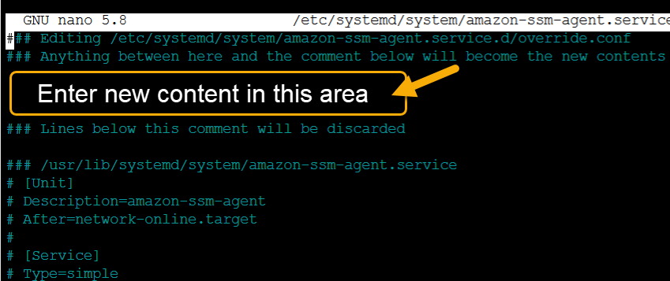

# Configuring SSM Agent to use a proxy on

Linux nodes

You can configure AWS Systems Manager Agent (SSM Agent) to communicate through an HTTP proxy
by creating an override configuration file and adding `http_proxy`, `https_proxy`, and `no_proxy` settings to the file. An override file also
preserves the proxy settings if you install newer or older versions of SSM Agent.
This section includes procedures for creating an override file in both
_upstart_ and _systemd_ environments. If
you intend to use Session Manager, note that HTTPS proxy servers aren't supported.

###### Topics

- [Configure SSM Agent to use a proxy
  (upstart)](#ssm-agent-proxy-upstart "#ssm-agent-proxy-upstart")
- [Configure SSM Agent to use a proxy
  (systemd)](#ssm-agent-proxy-systemd "#ssm-agent-proxy-systemd")

## Configure SSM Agent to use a proxy

(upstart)

Use the following procedure to create an override configuration file for an
`upstart` environment.

###### To configure SSM Agent to use a proxy (upstart)

1. Connect to the managed instance where you installed SSM Agent.
2. Open a simple editor like VIM, and depending on whether you're using
   an HTTP proxy server or HTTPS proxy server, add one of the following
   configurations.

**For an HTTP proxy server:**

```
env http_proxy=http://`hostname`:`port`
env https_proxy=http://`hostname`:`port`
env no_proxy=`IP address for instance metadata services (IMDS)`
```

**For an HTTPS proxy server:**

```
env http_proxy=http://`hostname`:`port`
env https_proxy=https://`hostname`:`port`
env no_proxy=`IP address for instance metadata services (IMDS)`
```

###### Important

Add the `no_proxy` setting to the file
and specify the IP address. The IP address for `no_proxy` is the instance metadata services (IMDS)
endpoint for Systems Manager. If you don't specify `no_proxy`, calls to Systems Manager take on the identity from the
proxy service (if IMDSv1 fallback is enabled) or calls to Systems Manager fail
(if IMDSv2 is enforced).

    * For IPv4, specify `no_proxy=169.254.169.254`.
    * For IPv6, specify `no_proxy=[fd00:ec2::254]`. The IPv6 address of
     the instance metadata service is compatible with IMDSv2
     commands. The IPv6 address is only accessible on instances
     built on the [AWS Nitro System](../../../ec2/latest/instancetypes/ec2-nitro-instances.md "../../../ec2/latest/instancetypes/ec2-nitro-instances.md"). For more information, see
     [How Instance Metadata Service Version 2 works](../../../AWSEC2/latest/UserGuide/instance-metadata-v2-how-it-works.md "../../../AWSEC2/latest/UserGuide/instance-metadata-v2-how-it-works.md")
     in the *Amazon EC2 User Guide*.

3. Save the file with the name
   `amazon-ssm-agent.override` in the following
   location: `/etc/init/`
4. Stop and restart SSM Agent using the following commands.

```
sudo service stop amazon-ssm-agent
sudo service start amazon-ssm-agent
```

###### Note

For more information about working with `.override`
files in Upstart environments, see [init: Upstart
init daemon job configuration](https://www.systutorials.com/docs/linux/man/5-init/ "https://www.systutorials.com/docs/linux/man/5-init/").

## Configure SSM Agent to use a proxy

(systemd)

Use the following procedure to configure SSM Agent to use a proxy in a
`systemd` environment.

###### Note

Some of the steps in this procedure contain explicit instructions for
Ubuntu Server instances where SSM Agent was installed using Snap.

1. Connect to the instance where you installed SSM Agent.
2. Run one of the follow commands, depending on the operating system
   type.
   - On Ubuntu Server instances where SSM Agent is installed by using
     a snap:

   ```
   sudo systemctl edit snap.amazon-ssm-agent.amazon-ssm-agent
   ```

   On other operating systems:

   ```
   sudo systemctl edit amazon-ssm-agent
   ```

3. Open a simple editor like VIM, and depending on whether you're using
   an HTTP proxy server or HTTPS proxy server, add one of the following
   configurations.



**For an HTTP proxy server:**

```
[Service]
Environment="http_proxy=http://`hostname`:`port`"
Environment="https_proxy=http://`hostname`:`port`"
Environment="no_proxy=`IP address for instance metadata services (IMDS)`"

```

**For an HTTPS proxy server:**

```
[Service]
Environment="http_proxy=http://`hostname`:`port`"
Environment="https_proxy=https://`hostname`:`port`"
Environment="no_proxy=`IP address for instance metadata services (IMDS)`"

```

###### Important

Add the `no_proxy` setting to the file
and specify the IP address. The IP address for `no_proxy` is the instance metadata services (IMDS)
endpoint for Systems Manager. If you don't specify `no_proxy`, calls to Systems Manager take on the identity from the
proxy service (if IMDSv1 fallback is enabled) or calls to Systems Manager fail
(if IMDSv2 is enforced).

    * For IPv4, specify `no_proxy=169.254.169.254`.
    * For IPv6, specify `no_proxy=[fd00:ec2::254]`. The IPv6 address of
     the instance metadata service is compatible with IMDSv2
     commands. The IPv6 address is only accessible on instances
     built on the [AWS Nitro System](../../../ec2/latest/instancetypes/ec2-nitro-instances.md "../../../ec2/latest/instancetypes/ec2-nitro-instances.md"). For more information, see
     [How Instance Metadata Service Version 2 works](../../../AWSEC2/latest/UserGuide/instance-metadata-v2-how-it-works.md "../../../AWSEC2/latest/UserGuide/instance-metadata-v2-how-it-works.md")
     in the *Amazon EC2 User Guide*.

4. Save your changes. The system automatically creates one of the
   following files, depending on the operating system type.
   - On Ubuntu Server instances where SSM Agent is installed by using
     a snap:

   `/etc/systemd/system/snap.amazon-ssm-agent.amazon-ssm-agent.service.d/**override.conf**`
   - On Amazon Linux 2, Amazon Linux 2023, and RHEL instances:

   `/etc/systemd/system/amazon-ssm-agent.service.d/**override.conf**`
   - On other operating systems:

   `/etc/systemd/system/amazon-ssm-agent.service.d/**amazon-ssm-agent.override**`

5. Restart SSM Agent by using one of the following commands, depending on
   the operating system type.
   - On Ubuntu Server instances installed by using a snap:

   ```
   sudo systemctl daemon-reload && sudo systemctl restart snap.amazon-ssm-agent.amazon-ssm-agent
   ```

   - On other operating systems:

   ```
   sudo systemctl daemon-reload && sudo systemctl restart amazon-ssm-agent
   ```

###### Note

For more information about working with `.override`
files in systemd environments, see [Modifying Existing Unit Files](https://access.redhat.com/documentation/en-us/red_hat_enterprise_linux/7/html/system_administrators_guide/chap-managing_services_with_systemd#sect-Managing_Services_with_systemd-Unit_File_Modify "https://access.redhat.com/documentation/en-us/red_hat_enterprise_linux/7/html/system_administrators_guide/chap-managing_services_with_systemd#sect-Managing_Services_with_systemd-Unit_File_Modify") in the _Red Hat
Enterprise Linux 7 System Administrator's Guide_.
