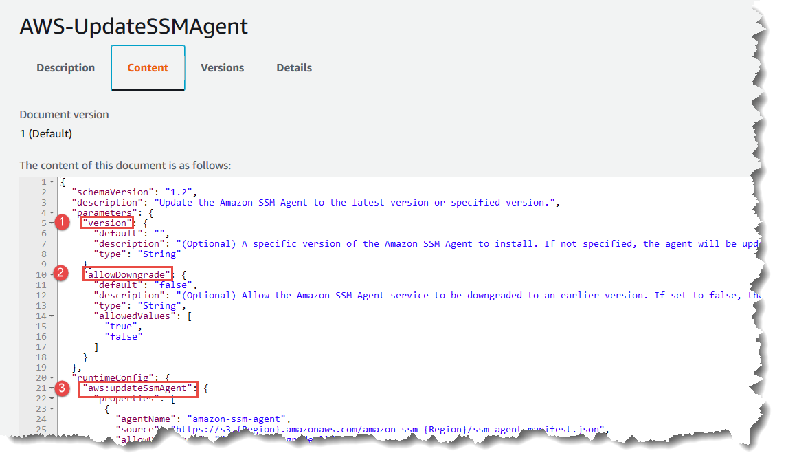

• AWS Systems Manager Change Manager is no longer open to new customers. Existing customers can continue to use the service as normal. For more information, see
[AWS Systems Manager Change Manager availability change](change-manager-availability-change.md "change-manager-availability-change.md").

 

• The AWS Systems Manager CloudWatch Dashboard will no longer be available after April 30, 2026. Customers can continue to use Amazon CloudWatch console to view, create, and manage their Amazon CloudWatch dashboards, just as they do today. For more information, see
[Amazon CloudWatch Dashboard documentation](../../../AmazonCloudWatch/latest/monitoring/CloudWatch_Dashboards.md "../../../AmazonCloudWatch/latest/monitoring/CloudWatch_Dashboards.md").

# Data elements and

parameters

This topic describes the data elements used in SSM documents. The schema version
used to create a document defines the syntax and data elements that the document
accepts. We recommend that you use schema version 2.2 or later for Command
documents. Automation runbooks use schema version 0.3. Additionally, Automation
runbooks support the use of Markdown, a markup language, which allows you to add
wiki-style descriptions to documents and individual steps within the document. For
more information about using Markdown, see [Using Markdown in the Console](../../../general/latest/gr/aws-markdown.md "../../../general/latest/gr/aws-markdown.md")
in the _AWS Management Console Getting Started Guide_.

The following section describes the data elements that you can include in a SSM
document.

## Top-level data elements

**schemaVersion**

The schema version to use.

Type: Version

Required: Yes

**description**

Information you provide to describe the purpose of the document.
You can also use this field to specify whether a parameter requires
a value for a document to run, or if providing a value for the
parameter is optional. Required and optional parameters can be seen
in the examples throughout this topic.

Type: String

Required: No

**parameters**

A structure that defines the parameters the document accepts.

For enhanced security when handling string parameters, you can use
environment variable interpolation by specifying the
`interpolationType` property. When set to
`ENV_VAR`, the system creates an environment variable
named `SSM_`parameter-name``
containing the parameter value.

The following includes an example of a parameter using environment
variable `interpolationType`:

```
{
    "schemaVersion": "2.2",
    "description": "An example document.",
    "parameters": {
        "Message": {
            "type": "String",
            "description": "Message to be printed",
            "default": "Hello",
            "interpolationType" : "ENV_VAR",
            "allowedPattern": "^[^"]*$"

        }
    },
    "mainSteps": [{
        "action": "aws:runShellScript",
        "name": "printMessage",
        "precondition" : {
           "StringEquals" : ["platformType", "Linux"]
        },
        "inputs": {
            "runCommand": [
              "echo {{Message}}"
            ]
        }
    }
}
```

###### Note

`allowedPattern` isn’t technically required in SSM
documents that don’t use double braces: `{{ }}`

For parameters that you use often, we recommend that you store
those parameters in Parameter Store, a tool in AWS Systems Manager. Then, you can
define parameters in your document that reference Parameter Store
parameters as their default value. To reference a Parameter Store
parameter, use the following syntax.

```
{{ssm:`parameter-name`}}
```

You can use a parameter that references a Parameter Store parameter the
same way as any other document parameters. In the following example,
the default value for the `commands` parameter is the
Parameter Store parameter `myShellCommands`. By specifying the
`commands` parameter as a `runCommand`
string, the document runs the commands stored in the
`myShellCommands` parameter.

YAML

```
---
schemaVersion: '2.2'
description: runShellScript with command strings stored as Parameter Store parameter
parameters:
  commands:
    type: StringList
    description: "(Required) The commands to run on the instance."
    default: ["{{ ssm:myShellCommands }}"],
            interpolationType : 'ENV_VAR'
            allowedPattern: '^[^"]*$'

mainSteps:
- action: aws:runShellScript
  name: runShellScriptDefaultParams
  inputs:
    runCommand:"{{ commands }}"
```

JSON

```
{
    "schemaVersion": "2.2",
    "description": "runShellScript with command strings stored as Parameter Store parameter",
    "parameters": {
      "commands": {
        "type": "StringList",
        "description": "(Required) The commands to run on the instance.",
        "default": ["{{ ssm:myShellCommands }}"],
        "interpolationType" : "ENV_VAR"
      }
    },
    "mainSteps": [
      {
        "action": "aws:runShellScript",
        "name": "runShellScriptDefaultParams",
        "inputs": {
            "runCommand": [
              "{{ commands }}"
          ]
        }
      }
    ]
  }
```

###### Note

You can reference `String` and
`StringList` Parameter Store parameters in the
`parameters` section of your document. You can't
reference `SecureString` Parameter Store parameters.

For more information about Parameter Store, see [AWS Systems Manager Parameter Store](systems-manager-parameter-store.md "systems-manager-parameter-store.md").

Type: Structure

The `parameters` structure accepts the following fields
and values:

- `type`: (Required) Allowed values include the
  following: `String`, `StringList`,
  `Integer`
  `Boolean`, `MapList`, and
  `StringMap`. To view examples of each type,
  see [SSM document parameter
  type examples](#top-level-properties-type "#top-level-properties-type") in the next
  section.

###### Note

Command type documents only support the
`String` and `StringList`
parameter types.

- `description`: (Optional) A description of the
  parameter.
- `default`: (Optional) The default value of the
  parameter or a reference to a parameter in Parameter Store.
- `allowedValues`: (Optional) An array of values
  allowed for the parameter. Defining allowed values for the
  parameter validates the user input. If a user inputs a value
  that isn't allowed, the execution fails to start.

YAML

```
DirectoryType:
  type: String
  description: "(Required) The directory type to launch."
  default: AwsMad
  allowedValues:
  - AdConnector
  - AwsMad
  - SimpleAd
```

JSON

```
"DirectoryType": {
  "type": "String",
  "description": "(Required) The directory type to launch.",
  "default": "AwsMad",
  "allowedValues": [
    "AdConnector",
    "AwsMad",
    "SimpleAd"
  ]
}
```

- `allowedPattern`: (Optional) A regular
  expression that validates whether the user input matches the
  defined pattern for the parameter. If the user input doesn't
  match the allowed pattern, the execution fails to
  start.

###### Note

Systems Manager performs two validations for
`allowedPattern`. The first validation is
performed using the [Java regex library](https://docs.oracle.com/javase/8/docs/api/java/util/regex/package-summary.html "https://docs.oracle.com/javase/8/docs/api/java/util/regex/package-summary.html") at the API level when
you use a document. The second validation is performed
on SSM Agent by using the [GO regexp
library](https://pkg.go.dev/regexp "https://pkg.go.dev/regexp") before processing the document.

YAML

```
InstanceId:
  type: String
  description: "(Required) The instance ID to target."
  allowedPattern: "^i-(?:[a-f0-9]{8}|[a-f0-9]{17})$"
  default: ''
```

JSON

```
"InstanceId": {
  "type": "String",
  "description": "(Required) The instance ID to target.",
  "allowedPattern": "^i-(?:[a-f0-9]{8}|[a-f0-9]{17})$",
  "default": ""
}
```

- `displayType`: (Optional) Used to display
  either a `textfield` or a `textarea`
  in the AWS Management Console. `textfield` is a single-line
  text box. `textarea` is a multi-line text
  area.
- `minItems`: (Optional) The minimum number of
  items allowed.
- `maxItems`: (Optional) The maximum number of
  items allowed.
- `minChars`: (Optional) The minimum number of
  parameter characters allowed.
- `maxChars`: (Optional) The maximum number of
  parameter characters allowed.
- `interpolationType`: (Optional) Defines how
  parameter values are processed before command execution.
  When set to `ENV_VAR`, the parameter value is
  made available as an environment variable named
  `SSM_`parameter-name``.
  This feature helps prevent command injection by treating
  parameter values as literal strings.

Type: String

Valid values: `ENV_VAR`

Required: No

**variables**

(Schema version 0.3 only) Values you can reference or update
throughout the steps in an Automation runbook. Variables are similar
to parameters, but differ in a very important way. Parameter values
are static in the context of a runbook, but the values of variables
can be changed in the context of the runbook. When updating the
value of a variable, the data type must match the defined data type.
For information about updating variables values in an automation,
see [aws:updateVariable
– Updates a value for a runbook variable](automation-action-update-variable.md "automation-action-update-variable.md")

Type: Boolean | Integer | MapList | String | StringList |
StringMap

Required: No

YAML

```
variables:
    payload:
        type: StringMap
        default: "{}"
```

JSON

```
{
    "variables": [
        "payload": {
            "type": "StringMap",
            "default": "{}"
        }
    ]
}
```

**runtimeConfig**

(Schema version 1.2 only) The configuration for the instance as
applied by one or more Systems Manager plugins. Plugins aren't guaranteed to
run in sequence.

Type: Dictionary<string,PluginConfiguration>

Required: No

**mainSteps**

(Schema version 0.3, 2.0, and 2.2 only) An object that can include
multiple steps (plugins). Plugins are defined within steps. Steps
run in sequential order as listed in the document.

Type: Dictionary<string,PluginConfiguration>

Required: Yes

**outputs**

(Schema version 0.3 only) Data generated by the execution of this
document that can be used in other processes. For example, if your
document creates a new AMI, you might specify
"CreateImage.ImageId" as the output value, and then use this output
to create new instances in a subsequent automation execution. For
more information about outputs, see [Using action outputs as
inputs](automation-action-outputs-inputs.md "automation-action-outputs-inputs.md").

Type: Dictionary<string,OutputConfiguration>

Required: No

**files**

(Schema version 0.3 only) The script files (and their checksums)
attached to the document and run during an automation execution.
Applies only to documents that include the
`aws:executeScript` action and for which attachments
have been specified in one or more steps.

To learn about the runtimes supported by Automation runbooks, see
[aws:executeScript
– Run a script](automation-action-executeScript.md "automation-action-executeScript.md"). For more
information about including scripts in Automation runbooks, see
[Using scripts in
runbooks](automation-document-script-considerations.md "automation-document-script-considerations.md") and
[Visual design experience for Automation runbooks](automation-visual-designer.md "automation-visual-designer.md").

When creating an Automation runbook with attachments, you must
also specify attachment files using the `--attachments`
option (for AWS CLI) or `Attachments` (for API and SDK).
You can specify the file location for SSM documents and files
stored in Amazon Simple Storage Service (Amazon S3) buckets. For more information, see [Attachments](../APIReference/API_CreateDocument.md#systemsmanager-CreateDocument-request-Attachments "../APIReference/API_CreateDocument.md#systemsmanager-CreateDocument-request-Attachments") in the AWS Systems Manager API Reference.

YAML

```
---
files:
  launch.py:
    checksums:
      sha256: 18871b1311b295c43d0f...[truncated]...772da97b67e99d84d342ef4aEXAMPLE

```

JSON

```
"files": {
    "launch.py": {
        "checksums": {
            "sha256": "18871b1311b295c43d0f...[truncated]...772da97b67e99d84d342ef4aEXAMPLE"
        }
    }
}
```

Type: Dictionary<string,FilesConfiguration>

Required: No

## SSM document parameter

`type` examples

Parameter types in SSM documents are static. This means the parameter type
can't be changed after it's defined. When using parameters with SSM document
plugins, the type of a parameter can't be dynamically changed within a plugin's
input. For example, you can't reference an `Integer` parameter within
the `runCommand` input of the `aws:runShellScript` plugin
because this input accepts a string or list of strings. To use a parameter for a
plugin input, the parameter type must match the accepted type. For example, you
must specify a `Boolean` type parameter for the
`allowDowngrade` input of the `aws:updateSsmAgent`
plugin. If your parameter type doesn't match the input type for a plugin, the
SSM document fails to validate and the system doesn't create the document.
This is also true when using parameters downstream within inputs for other
plugins or AWS Systems Manager Automation actions. For example, you can't reference a
`StringList` parameter within the `documentParameters`
input of the `aws:runDocument` plugin. The
`documentParameters` input accepts a map of strings even if the
downstream SSM document parameter type is a `StringList` parameter
and matches the parameter you're referencing.

When using parameters with Automation actions, parameter types aren't
validated when you create the SSM document in most cases. Only when you use
the `aws:runCommand` action are parameter types validated when you
create the SSM document. In all other cases, the parameter validation occurs
during the automation execution when an action's input is verified before
running the action. For example, if your input parameter is a
`String` and you reference it as the value for the
`MaxInstanceCount` input of the `aws:runInstances`
action, the SSM document is created. However, when running the document, the
automation fails while validating the `aws:runInstances` action
because the `MaxInstanceCount` input requires an
`Integer`.

The following are examples of each parameter `type`.

String

A sequence of zero or more Unicode characters wrapped in quotation
marks. For example, "i-1234567890abcdef0". Use backslashes to
escape.

String parameters can include an optional
`interpolationType` field with the value
`ENV_VAR` to enable environment variable
interpolation for improved security.

YAML

```
---
InstanceId:
  type: String
  description: "(Optional) The target EC2 instance ID."
  interpolationType: ENV_VAR
```

JSON

```
"InstanceId":{
  "type":"String",
  "description":"(Optional) The target EC2 instance ID.",
  "interpolationType": "ENV_VAR"
}
```

StringList

A list of String items separated by commas. For example, ["cd ~",
"pwd"].

YAML

```
---
commands:
  type: StringList
  description: "(Required) Specify a shell script or a command to run."
  default: ""
  minItems: 1
  displayType: textarea
```

JSON

```
"commands":{
  "type":"StringList",
  "description":"(Required) Specify a shell script or a command to run.",
  "minItems":1,
  "displayType":"textarea"
}
```

Boolean

Accepts only `true` or `false`. Doesn't
accept "true" or 0.

YAML

```
---
canRun:
  type: Boolean
  description: ''
  default: true
```

JSON

```
"canRun": {
  "type": "Boolean",
  "description": "",
  "default": true
}
```

Integer

Integral numbers. Doesn't accept decimal numbers, for example
3.14159, or numbers wrapped in quotation marks, for example
"3".

YAML

```
---
timeout:
  type: Integer
  description: The type of action to perform.
  default: 100
```

JSON

```
"timeout": {
  "type": "Integer",
  "description": "The type of action to perform.",
  "default": 100
}
```

StringMap

A mapping of keys to values. Keys and values must be strings. For
example, {"Env": "Prod"}.

YAML

```
---
notificationConfig:
  type: StringMap
  description: The configuration for events to be notified about
  default:
    NotificationType: 'Command'
    NotificationEvents:
    - 'Failed'
    NotificationArn: "$dependency.topicArn"
  maxChars: 150
```

JSON

```
"notificationConfig" : {
  "type" : "StringMap",
  "description" : "The configuration for events to be notified about",
  "default" : {
    "NotificationType" : "Command",
    "NotificationEvents" : ["Failed"],
    "NotificationArn" : "$dependency.topicArn"
  },
  "maxChars" : 150
}
```

MapList

A list of StringMap objects.

YAML

```
blockDeviceMappings:
  type: MapList
  description: The mappings for the create image inputs
  default:
  - DeviceName: "/dev/sda1"
    Ebs:
      VolumeSize: "50"
  - DeviceName: "/dev/sdm"
    Ebs:
      VolumeSize: "100"
  maxItems: 2
```

JSON

```
"blockDeviceMappings":{
  "type":"MapList",
  "description":"The mappings for the create image inputs",
  "default":[
    {
      "DeviceName":"/dev/sda1",
      "Ebs":{
        "VolumeSize":"50"
      }
    },
    {
      "DeviceName":"/dev/sdm",
      "Ebs":{
        "VolumeSize":"100"
      }
    }
  ],
  "maxItems":2
}
```

## Viewing SSM Command document

content

To preview the required and optional parameters for an AWS Systems Manager (SSM)
Command document, in addition to the actions the document runs, you can view the
content of the document in the Systems Manager console.

###### To view SSM Command document content

1. Open the AWS Systems Manager console at [https://console.aws.amazon.com/systems-manager/](https://console.aws.amazon.com/systems-manager/ "https://console.aws.amazon.com/systems-manager/").
2. In the navigation pane, choose **Documents**.
3. In the search box, select **Document type**, and then
   select **Command**.
4. Choose the name of a document, and then choose the
   **Content** tab.
5. In the content field, review the available parameters and action steps
   for the document.

For example, the following image shows that
(1) `version` and (2) `allowDowngrade` are
optional parameters for the `AWS-UpdateSSMAgent` document,
and that the first action run by the document is (3)
`aws:updateSsmAgent`.


