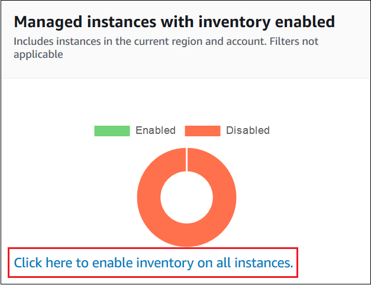
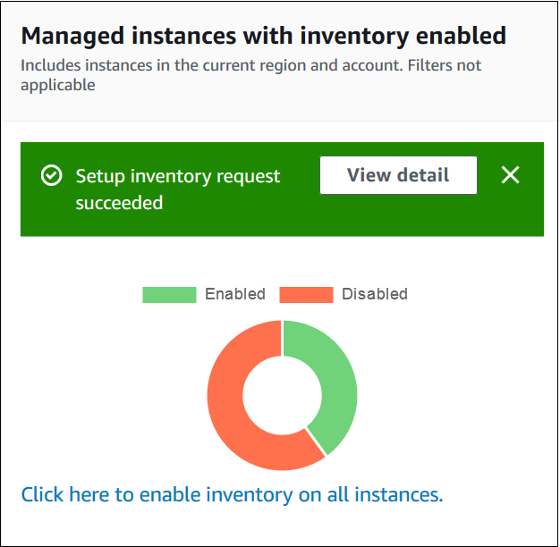

• AWS Systems Manager Change Manager is no longer open to new customers. Existing customers can continue to use the service as normal. For more information, see
[AWS Systems Manager Change Manager availability change](change-manager-availability-change.md "change-manager-availability-change.md").

 

• The AWS Systems Manager CloudWatch Dashboard will no longer be available after April 30, 2026. Customers can continue to use Amazon CloudWatch console to view, create, and manage their Amazon CloudWatch dashboards, just as they do today. For more information, see
[Amazon CloudWatch Dashboard documentation](../../../AmazonCloudWatch/latest/monitoring/CloudWatch_Dashboards.md "../../../AmazonCloudWatch/latest/monitoring/CloudWatch_Dashboards.md").

# Configuring inventory collection

This section describes how to configure AWS Systems Manager Inventory collection on one or more
managed nodes by using the Systems Manager console. For an example of how to configure inventory
collection by using the AWS Command Line Interface (AWS CLI), see [Using the AWS CLI to configure inventory data
collection](inventory-collection-cli.md "inventory-collection-cli.md").

When you configure inventory collection, you start by creating a AWS Systems Manager State Manager
association. Systems Manager collects the inventory data when the association is run. If you don't
create the association first, and attempt to invoke the
`aws:softwareInventory` plugin by using, for example, AWS Systems Manager Run Command,
the system returns the following error: `The aws:softwareInventory plugin can only
 be invoked via ssm-associate.`

###### Note

Be aware of the following behavior if you create multiple inventory associations
for a managed node:

- Each node can be assigned an inventory association that targets
  _all_ nodes (--targets
  "Key=InstanceIds,Values=\*").
- Each node can also be assigned a specific association that uses either tag
  key/value pairs or an AWS resource group.
- If a node is assigned multiple inventory associations, the status shows
  _Skipped_ for the association that hasn't run. The
  association that ran most recently displays the actual status of the
  inventory association.
- If a node is assigned multiple inventory associations and each uses a tag
  key/value pair, then those inventory associations fail to run on the node
  because of the tag conflict. The association still runs on nodes that don't
  have the tag key/value conflict.

###### Before You Begin

Before you configure inventory collection, complete the following tasks.

- Update AWS Systems Manager SSM Agent on the nodes you want to inventory. By running the
  latest version of SSM Agent, you ensure that you can collect metadata for all
  supported inventory types. For information about how to update SSM Agent by using
  State Manager, see [Walkthrough: Automatically update
  SSM Agent with the AWS CLI](state-manager-update-ssm-agent-cli.md "state-manager-update-ssm-agent-cli.md").
- Verify that you have completed the setup requirements for your Amazon Elastic Compute Cloud
  (Amazon EC2) instances and non-EC2 machines in a [hybrid and multicloud](operating-systems-and-machine-types.md#supported-machine-types "operating-systems-and-machine-types.md#supported-machine-types") environment. For
  information, see [Setting up managed nodes for
  AWS Systems Manager](systems-manager-setting-up-nodes.md "systems-manager-setting-up-nodes.md").
- For Microsoft Windows Server nodes, verify that your managed node is configured with
  Windows PowerShell 3.0 (or later). SSM Agent uses the `ConvertTo-Json`
  cmdlet in PowerShell to convert Windows update inventory data to the required
  format.
- (Optional) Create a resource data sync to centrally store inventory data in an
  Amazon S3 bucket. resource data sync then automatically updates the centralized data
  when new inventory data is collected. For more information, see [Walkthrough: Using resource data sync to
  aggregate inventory data](inventory-resource-data-sync.md "inventory-resource-data-sync.md").
- (Optional) Create a JSON file to collect custom inventory. For more
  information, see [Working with custom inventory](inventory-custom.md "inventory-custom.md").

## Inventory all managed nodes in

your AWS account

You can inventory all managed nodes in your AWS account by creating a global
inventory association. A global inventory association performs the following
actions:

- Automatically applies the global inventory configuration (association) to
  all existing managed nodes in your AWS account. Managed nodes that already
  have an inventory association are skipped when the global inventory
  association is applied and runs. When a node is skipped, the detailed status
  message states `Overridden By Explicit Inventory Association`.
  Those nodes are skipped by the global association, but they will still
  report inventory when they run their assigned inventory association.
- Automatically adds new nodes created in your AWS account to the global
  inventory association.

###### Note

- If a managed node is configured for the global inventory association,
  and you assign a specific association to that node, then Systems Manager Inventory
  deprioritizes the global association and applies the specific
  association.
- Global inventory associations are available in SSM Agent version
  2.0.790.0 or later. For information about how to update SSM Agent on your
  nodes, see [Updating the SSM Agent using
  Run Command](run-command-tutorial-update-software.md#rc-console-agentexample "run-command-tutorial-update-software.md#rc-console-agentexample").

### Configuring inventory

collection with one click (console)

Use the following procedure to configure Systems Manager Inventory for all managed nodes
in your AWS account and in a single AWS Region.

###### To configure all of your managed nodes in the current Region for Systems Manager

inventory

1. Open the AWS Systems Manager console at [https://console.aws.amazon.com/systems-manager/](https://console.aws.amazon.com/systems-manager/ "https://console.aws.amazon.com/systems-manager/").
2. In the navigation pane, choose **Inventory**.
3. In the **Managed instances with inventory enabled**
   card, choose **Click here to enable inventory on all
   instances**.

If successful, the console displays the following message.

Depending on the number of managed nodes in your account, it can take
several minutes for the global inventory association to be applied. Wait
a few minutes and then refresh the page. Verify that the graphic changes
to reflect that inventory is configured on all of your managed
nodes.

### Configuring collection by using

the console

This section includes information about how to configure Systems Manager Inventory to
collect metadata from your managed nodes by using the Systems Manager console. You can
quickly collect metadata from all nodes in a specific AWS account (and any
future nodes that might be created in that account) or you can selectively
collect inventory data by using tags or node IDs.

###### Note

Before completing this procedure, check to see if a global inventory
association already exists. If a global inventory association already
exists, anytime you launch a new instance, the association will be applied
to it, and the new instance will be inventoried.

###### To configure inventory collection

1. Open the AWS Systems Manager console at [https://console.aws.amazon.com/systems-manager/](https://console.aws.amazon.com/systems-manager/ "https://console.aws.amazon.com/systems-manager/").
2. In the navigation pane, choose **Inventory**.
3. Choose **Setup Inventory**.
4. In the **Targets** section, identify the nodes where
   you want to run this operation by choosing one of the following.
   - **Selecting all managed instances in this
     account** - This option selects all managed nodes
     for which there is no existing inventory association. If you
     choose this option, nodes that already had inventory
     associations are skipped during inventory collection, and shown
     with a status of **Skipped** in inventory
     results. For more information, see [Inventory all managed nodes in
     your AWS account](#inventory-management-inventory-all "#inventory-management-inventory-all").
   - **Specifying a tag** - Use this option to
     specify a single tag to identify nodes in your account from
     which you want to collect inventory. If you use a tag, any nodes
     created in the future with the same tag will also report
     inventory. If there is an existing inventory association with
     all nodes, using a tag to select specific nodes as a target for
     a different inventory overrides node membership in the
     **All managed instances** target group.
     Managed nodes with the specified tag are skipped on future
     inventory collection from **All managed
     instances**.
   - **Manually selecting instances** - Use this
     option to choose specific managed nodes in your account.
     Explicitly choosing specific nodes by using this option
     overrides inventory associations on the **All managed
     instances** target. The node is skipped on future
     inventory collection from **All managed
     instances**.

   ###### Note

   If a managed node you expect to see isn't listed, see [Troubleshooting managed
   node availability](fleet-manager-troubleshooting-managed-nodes.md "fleet-manager-troubleshooting-managed-nodes.md") for troubleshooting
   tips.

5. In the **Schedule** section, choose how often you
   want the system to collect inventory metadata from your nodes.
6. In the **Parameters** section, use the lists to turn
   on or turn off different types of inventory collection. For more
   information about collecting File and Windows Registry inventory, see
   [Working with file and Windows registry
   inventory](inventory-file-and-registry.md "inventory-file-and-registry.md").
7. In the **Advanced** section, choose **Sync
   inventory execution logs to an Amazon S3 bucket** if you want to
   store the association execution status in an Amazon S3 bucket.
8. Choose **Setup Inventory**. Systems Manager creates a State Manager
   association and immediately runs Inventory on the nodes.
9. In the navigation pane, choose **State Manager**. Verify
   that a new association was created that uses the
   `**AWS-GatherSoftwareInventory**`
   document. The association schedule uses a rate expression. Also, verify
   that the **Status** field shows
   **Success**. If you chose the option to
   **Sync inventory execution logs to an Amazon S3
   bucket**, then you can view the log data in Amazon S3 after a few
   minutes. If you want to view inventory data for a specific node, then
   choose **Managed Instances** in the navigation pane.
10. Choose a node, and then choose **View
    details**.
11. On the node details page, choose **Inventory**. Use
    the **Inventory type** lists to filter the
    inventory.
