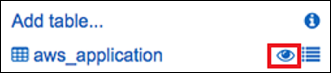

# Walkthrough: Using resource data sync to

aggregate inventory data

The following walkthrough describes how to create a resource data sync configuration
for AWS Systems Manager Inventory by using the AWS Command Line Interface (AWS CLI). A resource data sync
automatically ports inventory data from all of your managed nodes to a central Amazon Simple Storage Service
(Amazon S3) bucket. The sync automatically updates the data in the central Amazon S3 bucket
whenever new inventory data is discovered.

This walkthrough also describes how to use Amazon Athena and Amazon Quick Suite to query and analyze
the aggregated data. For information about creating a resource data sync by using Systems Manager
in the AWS Management Console, see Walkthrough: Using resource data sync to
aggregate inventory data. For information about querying
inventory from multiple AWS Regions and accounts by using Systems Manager in the AWS Management Console, see
[Querying inventory data from multiple
Regions and accounts](systems-manager-inventory-query.md "systems-manager-inventory-query.md").

###### Note

This walkthrough includes information about how to encrypt the sync by using
AWS Key Management Service (AWS KMS). Inventory doesn't collect any user-specific, proprietary, or
sensitive data so encryption is optional. For more information about AWS KMS, see
[AWS Key Management Service Developer Guide](../../../kms/latest/developerguide.md "../../../kms/latest/developerguide.md").

###### Before you begin

Review or complete the following tasks before you begin the walkthrough in this
section:

- Collect inventory data from your managed nodes. For the purpose of the
  Amazon Athena and Amazon Quick Suite sections in this walkthrough, we recommend that you
  collect Application data. For more information about how to collect inventory
  data, see [Configuring inventory collection](inventory-collection.md "inventory-collection.md") or [Using the AWS CLI to configure inventory data
  collection](inventory-collection-cli.md "inventory-collection-cli.md").
- (Optional) If the inventory data is stored in an Amazon Simple Storage Service (Amazon S3) bucket that
  uses AWS Key Management Service (AWS KMS) encryption, you must also configure your IAM account
  and the `Amazon-GlueServiceRoleForSSM` service role for AWS KMS
  encryption. If you don't configure your IAM account and this role, Systems Manager
  displays `Cannot load Glue tables` when you
  choose the **Detailed View** tab in the console. For more
  information, see [(Optional) Configure
  permissions for viewing AWS KMS encrypted data](systems-manager-inventory-query.md#systems-manager-inventory-query-kms "systems-manager-inventory-query.md#systems-manager-inventory-query-kms").
- (Optional) If you want to encrypt the resource data sync by using AWS KMS, then
  you must either create a new key that includes the following policy, or you must
  update an existing key and add this policy to it.

JSON

```
`{
 "Version":"2012-10-17",
 "Id": "ssm-access-policy",
 "Statement": [
 {
 "Sid": "ssm-access-policy-statement",
 "Action": [
 "kms:GenerateDataKey"
 ],
 "Effect": "Allow",
 "Principal": {
 "Service": "ssm.amazonaws.com"
 },
 "Resource": "arn:aws:kms:`us-east-1`:`123456789012`:key/`KMS_key_id`",
 "Condition": {
 "StringLike": {
 "aws:SourceAccount": "`123456789012`"
 },
 "ArnLike": {
 "aws:SourceArn": "arn:aws:ssm:*:`123456789012`:resource-data-sync/*"
 }
 }
 }
 ]
}`

```

###### To create a resource data sync for Inventory

1. Open the Amazon S3 console at
   [https://console.aws.amazon.com/s3/](https://console.aws.amazon.com/s3/ "https://console.aws.amazon.com/s3/").
2. Create a bucket to store your aggregated inventory data. For more information,
   see [Creating a
   bucket](../../../AmazonS3/latest/userguide/create-bucket-overview.md "../../../AmazonS3/latest/userguide/create-bucket-overview.md") in the _Amazon Simple Storage Service User Guide_.
   Make a note of the bucket name and the AWS Region where you created it.
3. After you create the bucket, choose the **Permissions** tab,
   and then choose **Bucket Policy**.
4. Copy and paste the following bucket policy into the policy editor. Replace
   amzn-s3-demo-bucket and `account-id` with the name of
   the Amazon S3 bucket you created and a valid AWS account ID. When adding multiple
   accounts, add an additional condition string and ARN for each account. Remove
   the additional placeholders from the example when adding one account.
   Optionally, replace `bucket-prefix` with the name of an
   Amazon S3 prefix (subdirectory). If you didn't created a prefix, remove
   `bucket-prefix/` from the ARN in the policy.

JSON

```
`{
 "Version":"2012-10-17",
 "Statement": [
 {
 "Sid": " SSMBucketDelivery",
 "Effect": "Allow",
 "Principal": {
 "Service": "ssm.amazonaws.com"
 },
 "Action": "s3:PutObject",
 "Resource": [
 "arn:aws:s3:::amzn-s3-demo-bucket/`bucket-prefix`/*/accountid=`111122223333`/*"
 ],
 "Condition": {
 "StringEquals": {
 "s3:x-amz-acl": "bucket-owner-full-control",
 "aws:SourceAccount": [
 "`111122223333`",
 "`444455556666`",
 "`123456789012`",
 "`777788889999`"
 ]
 },
 "ArnLike": {
 "aws:SourceArn": [
 "arn:aws:ssm:*:`111122223333`:resource-data-sync/*",
 "arn:aws:ssm:*:`444455556666`:resource-data-sync/*",
 "arn:aws:ssm:*:`123456789012`:resource-data-sync/*",
 "arn:aws:ssm:*:`777788889999`:resource-data-sync/*"
 ]
 }
 }
 }
 ]
}`

```

5. (Optional) If you want to encrypt the sync, then you must add the following
   conditions to the policy listed in the previous step. Add these in the
   `StringEquals` section.

```

"s3:x-amz-server-side-encryption":"aws:kms",
"s3:x-amz-server-side-encryption-aws-kms-key-id":"arn:aws:kms:`region`:`account_ID`:key/`KMS_key_ID`"

```

Here is an example:

```
"StringEquals": {
          "s3:x-amz-acl": "bucket-owner-full-control",
          "aws:SourceAccount": "`account-id`",
          "s3:x-amz-server-side-encryption":"aws:kms",
          "s3:x-amz-server-side-encryption-aws-kms-key-id":"arn:aws:kms:`region`:`account_ID`:key/`KMS_key_ID`"
        }
```

6. Install and configure the AWS Command Line Interface (AWS CLI), if you haven't already.

For information, see [Installing or updating the
latest version of the AWS CLI](../../../cli/latest/userguide/getting-started-install.md "../../../cli/latest/userguide/getting-started-install.md"). 7. (Optional) If you want to encrypt the sync, run the following command to
verify that the bucket policy is enforcing the AWS KMS key requirement. Replace
each `example resource placeholder` with your own
information.

Linux & macOS

```
aws s3 cp ./`A_file_in_the_bucket` s3://amzn-s3-demo-bucket/`prefix`/ \
--sse aws:kms \
--sse-kms-key-id "arn:aws:kms:`region`:`account_ID`:key/`KMS_key_id`" \
--region `region, for example, us-east-2`
```

Windows

```
aws s3 cp ./`A_file_in_the_bucket` s3://amzn-s3-demo-bucket/`prefix`/ ^
    --sse aws:kms ^
    --sse-kms-key-id "arn:aws:kms:`region`:`account_ID`:key/`KMS_key_id`" ^
    --region `region, for example, us-east-2`
```

8. Run the following command to create a resource data sync configuration with
   the Amazon S3 bucket you created at the start of this procedure. This command creates
   a sync from the AWS Region you're logged into.

###### Note

If the sync and the target Amazon S3 bucket are located in different regions,
you might be subject to data transfer pricing. For more information, see
[Amazon S3 Pricing](https://aws.amazon.com/s3/pricing/ "https://aws.amazon.com/s3/pricing/").

Linux & macOS

```
aws ssm create-resource-data-sync \
--sync-name `a_name` \
--s3-destination "BucketName=amzn-s3-demo-bucket,Prefix=`prefix_name, if_specified`,SyncFormat=JsonSerDe,Region=`bucket_region`"
```

Windows

```
aws ssm create-resource-data-sync ^
--sync-name `a_name` ^
--s3-destination "BucketName=amzn-s3-demo-bucket,Prefix=`prefix_name, if_specified`,SyncFormat=JsonSerDe,Region=`bucket_region`"
```

You can use the `region` parameter to specify where the sync
configuration should be created. In the following example, inventory data from
the us-west-1 Region, will be synchronized in the Amazon S3 bucket in the us-west-2
Region.

Linux & macOS

```
aws ssm create-resource-data-sync \
    --sync-name `InventoryDataWest` \
    --s3-destination "BucketName=amzn-s3-demo-bucket,Prefix=`HybridEnv`,SyncFormat=JsonSerDe,Region=`us-west-2`"
    --region `us-west-1`
```

Windows

```
aws ssm create-resource-data-sync ^
--sync-name `InventoryDataWest` ^
--s3-destination "BucketName=amzn-s3-demo-bucket,Prefix=`HybridEnv`,SyncFormat=JsonSerDe,Region=`us-west-2`" ^ --region `us-west-1`
```

(Optional) If you want to encrypt the sync by using AWS KMS, run the following
command to create the sync. If you encrypt the sync, then the AWS KMS key and the
Amazon S3 bucket must be in the same Region.

Linux & macOS

```
aws ssm create-resource-data-sync \
--sync-name `sync_name` \
--s3-destination "BucketName=amzn-s3-demo-bucket,Prefix=`prefix_name, if_specified`,SyncFormat=JsonSerDe,AWSKMSKeyARN=arn:aws:kms:`region`:`account_ID`:key/`KMS_key_ID`,Region=`bucket_region`" \
--region `region`
```

Windows

```
aws ssm create-resource-data-sync ^
--sync-name `sync_name` ^
--s3-destination "BucketName=amzn-s3-demo-bucket,Prefix=`prefix_name, if_specified`,SyncFormat=JsonSerDe,AWSKMSKeyARN=arn:aws:kms:`region`:`account_ID`:key/`KMS_key_ID`,Region=`bucket_region`" ^
--region `region`
```

9. Run the following command to view the status of sync configuration.

```
aws ssm list-resource-data-sync
```

If you created the sync configuration in a different Region, then you must
specify the `region` parameter, as shown in the following
example.

```
aws ssm list-resource-data-sync --region us-west-1
```

10. After the sync configuration is created successfully, examine the target
    bucket in Amazon S3. Inventory data should be displayed within a few minutes.
    **Working with the Data in Amazon Athena**

The following section describes how to view and query the data in Amazon Athena. Before
you begin, we recommend that you learn about Athena. For more information, see [What is Amazon Athena?](../../../athena/latest/ug/what-is.md "../../../athena/latest/ug/what-is.md") and [Working with Data](../../../athena/latest/ug/work-with-data.md "../../../athena/latest/ug/work-with-data.md") in the
_Amazon Athena User Guide_.

###### To view and query the data in Amazon Athena

1. Open the Athena console at
   [https://console.aws.amazon.com/athena/](https://console.aws.amazon.com/athena/home "https://console.aws.amazon.com/athena/home").
2. Copy and paste the following statement into the query editor and then choose
   **Run Query**.

```
CREATE DATABASE ssminventory
```

The system creates a database called ssminventory. 3. Copy and paste the following statement into the query editor and then choose
**Run Query**. Replace amzn-s3-demo-bucket and
`bucket_prefix` with the name and prefix of the
Amazon S3 target.

```
CREATE EXTERNAL TABLE IF NOT EXISTS ssminventory.AWS_Application (
Name string,
ResourceId string,
ApplicationType string,
Publisher string,
Version string,
InstalledTime string,
Architecture string,
URL string,
Summary string,
PackageId string
)
PARTITIONED BY (AccountId string, Region string, ResourceType string)
ROW FORMAT SERDE 'org.openx.data.jsonserde.JsonSerDe'
WITH SERDEPROPERTIES (
  'serialization.format' = '1'
) LOCATION 's3://amzn-s3-demo-bucket/`bucket_prefix`/AWS:Application/'

```

4. Copy and paste the following statement into the query editor and then choose
   **Run Query**.

```
MSCK REPAIR TABLE ssminventory.AWS_Application
```

The system partitions the table.

###### Note

If you create resource data syncs from additional AWS Regions or
AWS accounts, then you must run this command again to update the
partitions. You might also need to update your Amazon S3 bucket policy. 5. To preview your data, choose the view icon next to the
`AWS_Application` table.

 6. Copy and paste the following statement into the query editor and then choose
**Run Query**.

```
SELECT a.name, a.version, count( a.version) frequency
from aws_application a where
a.name = 'aws-cfn-bootstrap'
group by a.name, a.version
order  by frequency desc

```

The query returns a count of different versions of
`aws-cfn-bootstrap`, which is an AWS application present on
Amazon Elastic Compute Cloud (Amazon EC2) instances for Linux, macOS, and Windows Server. 7. Individually copy and paste the following statements into the query editor,
replace amzn-s3-demo-bucket and `bucket-prefix` with
information for Amazon S3, and then choose **Run Query**. These
statements set up additional inventory tables in Athena.

```
CREATE EXTERNAL TABLE IF NOT EXISTS ssminventory.AWS_AWSComponent (
 `ResourceId` string,
  `Name` string,
  `ApplicationType` string,
  `Publisher` string,
  `Version` string,
  `InstalledTime` string,
  `Architecture` string,
  `URL` string
)
PARTITIONED BY (AccountId string, Region string, ResourceType string)
ROW FORMAT SERDE 'org.openx.data.jsonserde.JsonSerDe'
WITH SERDEPROPERTIES (
  'serialization.format' = '1'
) LOCATION 's3://amzn-s3-demo-bucket/`bucket-prefix`/AWS:AWSComponent/'
```

```
MSCK REPAIR TABLE ssminventory.AWS_AWSComponent
```

```
CREATE EXTERNAL TABLE IF NOT EXISTS ssminventory.AWS_WindowsUpdate (
  `ResourceId` string,
  `HotFixId` string,
  `Description` string,
  `InstalledTime` string,
  `InstalledBy` string
)
PARTITIONED BY (AccountId string, Region string, ResourceType string)
ROW FORMAT SERDE 'org.openx.data.jsonserde.JsonSerDe'
WITH SERDEPROPERTIES (
  'serialization.format' = '1'
) LOCATION 's3://amzn-s3-demo-bucket/`bucket-prefix`/AWS:WindowsUpdate/'
```

```
MSCK REPAIR TABLE ssminventory.AWS_WindowsUpdate
```

```
CREATE EXTERNAL TABLE IF NOT EXISTS ssminventory.AWS_InstanceInformation (
  `AgentType` string,
  `AgentVersion` string,
  `ComputerName` string,
  `IamRole` string,
  `InstanceId` string,
  `IpAddress` string,
  `PlatformName` string,
  `PlatformType` string,
  `PlatformVersion` string
)
PARTITIONED BY (AccountId string, Region string, ResourceType string)
ROW FORMAT SERDE 'org.openx.data.jsonserde.JsonSerDe'
WITH SERDEPROPERTIES (
  'serialization.format' = '1'
) LOCATION 's3://amzn-s3-demo-bucket/`bucket-prefix`/AWS:InstanceInformation/'
```

```
MSCK REPAIR TABLE ssminventory.AWS_InstanceInformation
```

```
CREATE EXTERNAL TABLE IF NOT EXISTS ssminventory.AWS_Network (
  `ResourceId` string,
  `Name` string,
  `SubnetMask` string,
  `Gateway` string,
  `DHCPServer` string,
  `DNSServer` string,
  `MacAddress` string,
  `IPV4` string,
  `IPV6` string
)
PARTITIONED BY (AccountId string, Region string, ResourceType string)
ROW FORMAT SERDE 'org.openx.data.jsonserde.JsonSerDe'
WITH SERDEPROPERTIES (
  'serialization.format' = '1'
) LOCATION 's3://amzn-s3-demo-bucket/`bucket-prefix`/AWS:Network/'
```

```
MSCK REPAIR TABLE ssminventory.AWS_Network
```

```
CREATE EXTERNAL TABLE IF NOT EXISTS ssminventory.AWS_PatchSummary (
  `ResourceId` string,
  `PatchGroup` string,
  `BaselineId` string,
  `SnapshotId` string,
  `OwnerInformation` string,
  `InstalledCount` int,
  `InstalledOtherCount` int,
  `NotApplicableCount` int,
  `MissingCount` int,
  `FailedCount` int,
  `OperationType` string,
  `OperationStartTime` string,
  `OperationEndTime` string
)
PARTITIONED BY (AccountId string, Region string, ResourceType string)
ROW FORMAT SERDE 'org.openx.data.jsonserde.JsonSerDe'
WITH SERDEPROPERTIES (
  'serialization.format' = '1'
) LOCATION 's3://amzn-s3-demo-bucket/`bucket-prefix`/AWS:PatchSummary/'
```

```
MSCK REPAIR TABLE ssminventory.AWS_PatchSummary

```

**Working with the Data in Amazon Quick Suite**

The following section provides an overview with links for building a visualization in
Amazon Quick Suite.

###### To build a visualization in Amazon Quick Suite

1. Sign up for [Amazon Quick Suite](https://quicksight.aws/ "https://quicksight.aws/") and then log
   in to the Quick Suite console.
2. Create a data set from the `AWS_Application` table and any other
   tables you created. For more information, see [Creating a
   dataset using Amazon Athena data](../../../quicksuite/latest/userguide/create-a-data-set-athena.md "../../../quicksuite/latest/userguide/create-a-data-set-athena.md") in the _Amazon Quick Suite User
   Guide_.
3. Join tables. For example, you could join the `instanceid` column
   from `AWS_InstanceInformation` because it matches the
   `resourceid` column in other inventory tables. For more
   information about joining tables, see [Joining data](../../../quicksuite/latest/userguide/joining-data.md "../../../quicksuite/latest/userguide/joining-data.md") in
   the _Amazon Quick Suite User Guide_.
4. Build a visualization. For more information, see [Analyses and
   reports: Visualizing data in Amazon Quick Sight](../../../quicksuite/latest/userguide/working-with-visuals.md "../../../quicksuite/latest/userguide/working-with-visuals.md") in the
   _Amazon Quick Suite User Guide_.
