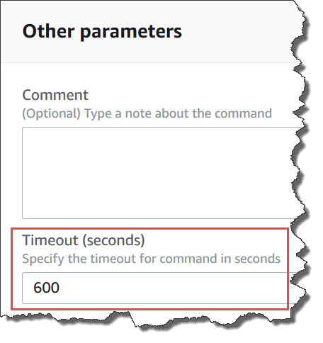
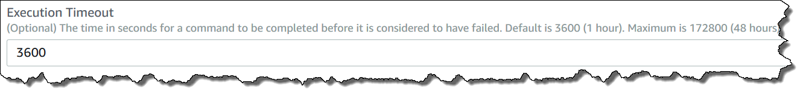

AWS Systems Manager Change Manager is no longer open to new customers. Existing customers can continue to use the service as normal. For more information, see
[AWS Systems Manager Change Manager availability change](change-manager-availability-change.md "change-manager-availability-change.md").

# Understanding command statuses

Run Command, a tool in AWS Systems Manager, reports detailed status information about the different
states a command experiences during processing and for each managed node that processed
the command. You can monitor command statuses using the following methods:

- Choose the **Refresh** icon on the
  **Commands** tab in the Run Command console interface.
- Call [list-commands](../../../cli/latest/reference/ssm/list-commands.md "../../../cli/latest/reference/ssm/list-commands.md") or
  [list-command-invocations](../../../cli/latest/reference/ssm/list-command-invocations.md "../../../cli/latest/reference/ssm/list-command-invocations.md") using the AWS Command Line Interface (AWS CLI). Or call
  [Get-SSMCommand](../../../powershell/latest/reference/items/Get-SSMCommand.md "../../../powershell/latest/reference/items/Get-SSMCommand.md") or [Get-SSMCommandInvocation](../../../powershell/latest/reference/items/Get-SSMCommandInvocation.md "../../../powershell/latest/reference/items/Get-SSMCommandInvocation.md") using AWS Tools for Windows PowerShell.
- Configure Amazon EventBridge to respond to state or status changes.
- Configure Amazon Simple Notification Service (Amazon SNS) to send notifications for all status changes or
  specific statuses such as `Failed` or `TimedOut`.

## Run Command status

Run Command reports status details for three areas: plugins, invocations, and an
overall command status. A _plugin_ is a code-execution block that
is defined in your command's SSM document. For more information about plugins, see
[Command document plugin
reference](documents-command-ssm-plugin-reference.md "documents-command-ssm-plugin-reference.md").

When you send a command to multiple managed nodes at the same time, each copy of
the command targeting each node is a _command invocation_. For
example, if you use the `AWS-RunShellScript` document and send an
`ifconfig` command to 20 Linux instances, that command has 20
invocations. Each command invocation individually reports status. The plugins for a
given command invocation individually report status as well.

Lastly, Run Command includes an aggregated command status for all plugins and
invocations. The aggregated command status can be different than the status reported
by plugins or invocations, as noted in the following tables.

###### Note

If you run commands to large numbers of managed nodes using the
`max-concurrency` or `max-errors` parameters, command
status reflects the limits imposed by those parameters, as described in the
following tables. For more information about these parameters, see [Run commands at scale](send-commands-multiple.md "send-commands-multiple.md").

| Detailed status for command plugins and invocations | Status                                                                                                                                                                                                                                                                                                                                                                                                                                                                                                                                                                                                                                                                                                                                                                                                                                                                                                                                                                                                                                                                                                                                                                                                                                                                                                                                                                                                                                                                                                                                                                                                                                                                                                                                  | Details |
| --------------------------------------------------- | --------------------------------------------------------------------------------------------------------------------------------------------------------------------------------------------------------------------------------------------------------------------------------------------------------------------------------------------------------------------------------------------------------------------------------------------------------------------------------------------------------------------------------------------------------------------------------------------------------------------------------------------------------------------------------------------------------------------------------------------------------------------------------------------------------------------------------------------------------------------------------------------------------------------------------------------------------------------------------------------------------------------------------------------------------------------------------------------------------------------------------------------------------------------------------------------------------------------------------------------------------------------------------------------------------------------------------------------------------------------------------------------------------------------------------------------------------------------------------------------------------------------------------------------------------------------------------------------------------------------------------------------------------------------------------------------------------------------------------------- | ------- |
| Pending                                             | The command hasn't yet been sent to the managed node or hasn't<br>been received by SSM Agent. If the command isn't received by the<br>agent before the length of time passes that is equal to the sum of<br>the **Timeout (seconds)\*<br>• parameter and the<br>**Execution timeout\*<br>• parameter, the status<br>changes to `Delivery Timed Out`.                                                                                                                                                                                                                                                                                                                                                                                                                                                                                                                                                                                                                                                                                                                                                                                                                                                                                                                                                                                                                                                                                                                                                                                                                                                                                                                                                                                    |
| InProgress                                          | Systems Manager is attempting to send the command to the managed node, or<br>the command was received by SSM Agent and has started running on the<br>instance. Depending on the result of all command plugins, the status<br>changes to `Success`, `Failed`, `Delivery<br>Timed Out`, or `Execution Timed Out`. _Exception_: If the agent isn't running<br>or available on the node, the command status remains at `In<br>Progress` until the agent is available again, or until the<br>execution timeout limit is reached. The status then changes to a<br>terminal state.                                                                                                                                                                                                                                                                                                                                                                                                                                                                                                                                                                                                                                                                                                                                                                                                                                                                                                                                                                                                                                                                                                                                                             |
| Delayed                                             | The system attempted to send the command to the managed node but<br>wasn't successful. The system retries again.                                                                                                                                                                                                                                                                                                                                                                                                                                                                                                                                                                                                                                                                                                                                                                                                                                                                                                                                                                                                                                                                                                                                                                                                                                                                                                                                                                                                                                                                                                                                                                                                                        |
| Success                                             | This status is returned under a variety of conditions. This<br>status \*doesn't<br>• mean the command was processed<br>on the node. For example, the command can be received by SSM Agent on<br>the managed node and return an exit code of zero as a result of your<br>PowerShell `ExecutionPolicy` preventing the command from<br>running. This is a terminal state. Conditions that result in a<br>command returning a `Success` status are:<br>• When targeting a single instance, the command was<br>received by SSM Agent on the managed node and returned an<br>exit code of zero.<br>• When targeting multiple instances, the number of<br>failed invocations has not crossed the error threshold<br>specified in the command.<br>• When targeting multiple instances, at least 1<br>invocation has succeeded while others have timed out.<br>The specified error threshold still applies.<br>• When targeting a tag, no instances are found<br>associated with the tag.<br>• When targeting a tag, the number of failed invocations<br>has not crossed the error threshold specified in the<br>command.<br>• When targeting a tag, at least 1 invocation has<br>succeeded while others have timed out. The specified<br>error threshold still applies.<br>• You have applications or policies enforced at the OS<br>level that prevent or override the execution of a<br>command resulting in an exit code of zero being<br>returned.<br>NoteThe same conditions apply when targeting resource groups.<br>To troubleshoot errors or get more information about the<br>command execution, send a command that handles errors or<br>exceptions by returning appropriate exit codes (non-zero<br>exit codes for command failure). |
| DeliveryTimedOut                                    | The command wasn't delivered to the managed node before the total<br>timeout expired. Total timeouts don't count against the parent<br>command’s `max-errors` limit, but they do contribute to<br>whether the parent command status is `Success`,<br>`Incomplete`, or `Delivery Timed Out`.<br>This is a terminal state.                                                                                                                                                                                                                                                                                                                                                                                                                                                                                                                                                                                                                                                                                                                                                                                                                                                                                                                                                                                                                                                                                                                                                                                                                                                                                                                                                                                                                |
| ExecutionTimedOut                                   | Command automation started on the managed node, but the command<br>wasn’t completed before the execution timeout expired. Execution<br>timeouts count as a failure, which will send a non-zero reply and<br>Systems Manager will exit the attempt to run the command automation, and<br>report a failure status.                                                                                                                                                                                                                                                                                                                                                                                                                                                                                                                                                                                                                                                                                                                                                                                                                                                                                                                                                                                                                                                                                                                                                                                                                                                                                                                                                                                                                        |
| Failed                                              | The command wasn't successful on the managed node. For a plugin,<br>this indicates that the result code wasn't zero. For a command<br>invocation, this indicates that the result code for one or more<br>plugins wasn't zero. Invocation failures count against the<br>`max-errors` limit of the parent command. This is a<br>terminal state.                                                                                                                                                                                                                                                                                                                                                                                                                                                                                                                                                                                                                                                                                                                                                                                                                                                                                                                                                                                                                                                                                                                                                                                                                                                                                                                                                                                           |
| Cancelled                                           | The command was canceled before it was completed. This is a<br>terminal state.                                                                                                                                                                                                                                                                                                                                                                                                                                                                                                                                                                                                                                                                                                                                                                                                                                                                                                                                                                                                                                                                                                                                                                                                                                                                                                                                                                                                                                                                                                                                                                                                                                                          |
| Undeliverable                                       | The command can't be delivered to the managed node. The node<br>might not exist or it might not be responding. Undeliverable<br>invocations don't count against the parent command’s<br>`max-errors` limit, but they do contribute to whether<br>the parent command status is `Success` or<br>`Incomplete`. For example, if all invocations in a<br>command have the status `Undeliverable`, then the command<br>status returned is `Failed`. However, if a command has<br>five invocations, four of which return the status<br>`Undeliverable` and one of which returns the status<br>`Success`, then the parent command's status is<br>`Success`. This is a terminal state.                                                                                                                                                                                                                                                                                                                                                                                                                                                                                                                                                                                                                                                                                                                                                                                                                                                                                                                                                                                                                                                           |
| Terminated                                          | The parent command exceeded its `max-errors` limit and<br>subsequent command invocations were canceled by the system. This is<br>a terminal state.                                                                                                                                                                                                                                                                                                                                                                                                                                                                                                                                                                                                                                                                                                                                                                                                                                                                                                                                                                                                                                                                                                                                                                                                                                                                                                                                                                                                                                                                                                                                                                                      |
| InvalidPlatform                                     | The command was sent to a managed node that didn't match the<br>required platforms specified by the chosen document. `Invalid<br>Platform` doesn't count against the parent command’s<br>max-errors limit, but it does contribute to whether the parent<br>command status is Success or Failed. For example, if all invocations<br>in a command have the status `Invalid Platform`, then the<br>command status returned is `Failed`. However, if a<br>command has five invocations, four of which return the status<br>`Invalid Platform` and one of which returns the<br>status `Success`, then the parent command's status is<br>`Success`. This is a terminal state.                                                                                                                                                                                                                                                                                                                                                                                                                                                                                                                                                                                                                                                                                                                                                                                                                                                                                                                                                                                                                                                                 |
| AccessDenied                                        | The AWS Identity and Access Management (IAM) user or role initiating the command doesn't<br>have access to the targeted managed node. `Access Denied`<br>doesn't count against the parent command’s `max-errors`<br>limit, but it does contribute to whether the parent command status<br>is `Success` or `Failed`. For example, if all<br>invocations in a command have the status `Access Denied`,<br>then the command status returned is `Failed`. However, if<br>a command has five invocations, four of which return the status<br>`Access Denied` and one of which returns the status<br>`Success`, then the parent command's status is<br>`Success`. This is a terminal state.                                                                                                                                                                                                                                                                                                                                                                                                                                                                                                                                                                                                                                                                                                                                                                                                                                                                                                                                                                                                                                                   |

| Detailed status for a command | Status                                                                                                                                                                                                                                                                                                                                                                                                                                                                                                                                                                                                                             | Details |
| ----------------------------- | ---------------------------------------------------------------------------------------------------------------------------------------------------------------------------------------------------------------------------------------------------------------------------------------------------------------------------------------------------------------------------------------------------------------------------------------------------------------------------------------------------------------------------------------------------------------------------------------------------------------------------------- | ------- |
| Pending                       | The command wasn't yet received by an agent on any managed<br>nodes.                                                                                                                                                                                                                                                                                                                                                                                                                                                                                                                                                               |
| InProgress                    | The command has been sent to at least one managed node but hasn't<br>reached a final state on all nodes.                                                                                                                                                                                                                                                                                                                                                                                                                                                                                                                           |
| Delayed                       | The system attempted to send the command to the node but wasn't<br>successful. The system retries again.                                                                                                                                                                                                                                                                                                                                                                                                                                                                                                                           |
| Success                       | The command was received by SSM Agent on all specified or targeted<br>managed nodes and returned an exit code of zero. All command<br>invocations have reached a terminal state, and the value of<br>`max-errors` wasn't reached. This status<br>\*doesn't<br>• mean the command was successfully<br>processed on all specified or targeted managed nodes. This is a<br>terminal state. NoteTo troubleshoot errors or get more information about the<br>command execution, send a command that handles errors or<br>exceptions by returning appropriate exit codes (non-zero<br>exit codes for command failure).                   |
| DeliveryTimedOut              | The command wasn't delivered to the managed node before the total<br>timeout expired. The value of `max-errors` or more<br>command invocations shows a status of `Delivery Timed<br>Out`. This is a terminal state.                                                                                                                                                                                                                                                                                                                                                                                                                |
| Failed                        | The command wasn't successful on the managed node. The value<br>of `max-errors` or more command invocations shows a<br>status of `Failed`. This is a terminal state.                                                                                                                                                                                                                                                                                                                                                                                                                                                               |
| Incomplete                    | The command was attempted on all managed nodes and one or more of<br>the invocations doesn't have a value of `Success`.<br>However, not enough invocations failed for the status to be<br>`Failed`. This is a terminal state.                                                                                                                                                                                                                                                                                                                                                                                                      |
| Cancelled                     | The command was canceled before it was completed. This is a<br>terminal state.                                                                                                                                                                                                                                                                                                                                                                                                                                                                                                                                                     |
| RateExceeded                  | The number of managed nodes targeted by the command exceeded the<br>account quota for pending invocations. The system has canceled the<br>command before executing it on any node. This is a terminal<br>state.                                                                                                                                                                                                                                                                                                                                                                                                                    |
| AccessDenied                  | The user or role initiating the command doesn't have access to<br>the targeted resource group. `AccessDenied` doesn't count<br>against the parent command’s `max-errors` limit, but does<br>contribute to whether the parent command status is<br>`Success` or `Failed`. (For example, if<br>all invocations in a command have the status<br>`AccessDenied`, then the command status returned is<br>`Failed`. However, if a command has 5 invocations, 4<br>of which return the status `AccessDenied` and 1 of which<br>returns the status `Success`, then the parent command's<br>status is `Success`.) This is a terminal state. |
| No Instances In Tag           | The tag key-pair value or resource group targeted by the command<br>doesn't match any managed nodes. This is a terminal state.                                                                                                                                                                                                                                                                                                                                                                                                                                                                                                     |

## Understanding command timeout

values

Systems Manager enforces the following timeout values when running commands.

###### Total Timeout

In the Systems Manager console, you specify the timeout value in the **Timeout
(seconds)** field. After a command is sent, Run Command checks whether
the command has expired or not. If a command reaches the command expiration
limit (total timeout), it changes status to `DeliveryTimedOut` for
all invocations that have the status `InProgress`,
`Pending` or `Delayed`.



On a more technical level, total timeout (**Timeout (seconds)**)
is a combination of two timeout values, as shown here:

`Total timeout = "Timeout(seconds)" from the console + "timeoutSeconds": "{{
 executionTimeout }}" from your SSM document`

For example, the default value of **Timeout (seconds)** in the
Systems Manager console is 600 seconds. If you run a command by using the
`AWS-RunShellScript` SSM document, the default value of
**"timeoutSeconds": "{{ executionTimeout }}"** is 3600 seconds,
as shown in the following document sample:

```

  "executionTimeout": {
      "type": "String",
      "default": "3600",

  "runtimeConfig": {
    "aws:runShellScript": {
      "properties": [
        {
          "timeoutSeconds": "{{ executionTimeout }}"

```

This means the command runs for 4,200 seconds (70 minutes) before the system sets
the command status to `DeliveryTimedOut`.

###### Execution Timeout

In the Systems Manager console, you specify the execution timeout value in the
**Execution Timeout** field, if available. Not all SSM
documents require that you specify an execution timeout. The **Execution
Timeout** field is only displayed when a corresponding input
parameter has been defined in the SSM document. If specified, the command must
complete within this time period.

###### Note

Run Command relies on the SSM Agent document terminal response to determine
whether or not the command was delivered to the agent. SSM Agent must send an
`ExecutionTimedOut` signal for an invocation or command to be
marked as `ExecutionTimedOut`.



###### Default Execution Timeout

If a SSM document doesn't require that you explicitly specify an execution
timeout value, then Systems Manager enforces the hard-coded default execution
timeout.

###### How Systems Manager reports timeouts

If Systems Manager receives an `execution timeout` reply from SSM Agent on a
target, then Systems Manager marks the command invocation as
`executionTimeout`.

If Run Command doesn't receive a document terminal response from SSM Agent, the
command invocation is marked as `deliveryTimeout`.

To determine timeout status on a target, SSM Agent combines all parameters and the
content of the SSM document to calculate for `executionTimeout`. When
SSM Agent determines that a command has timed out, it sends
`executionTimeout` to the service.

The default for **Timeout (seconds)** is 3600 seconds. The
default for **Execution Timeout** is also 3600 seconds. Therefore,
the total default timeout for a command is 7200 seconds.

###### Note

SSM Agent processes `executionTimeout` differently depending on the
type of SSM document and the document version.
