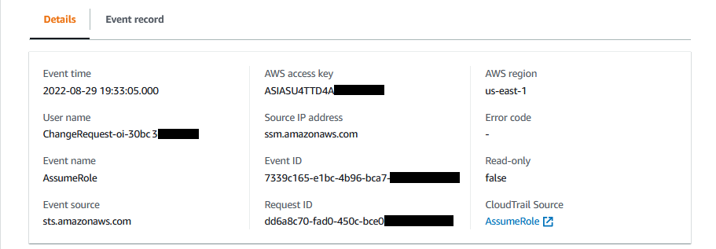
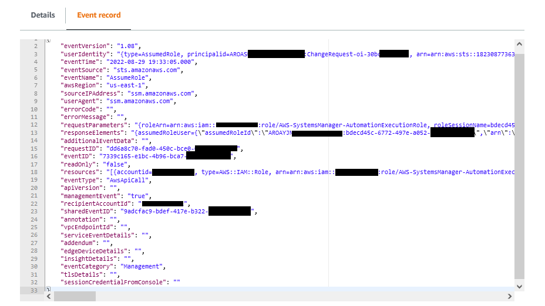

• AWS Systems Manager Change Manager is no longer open to new customers. Existing customers can continue to use the service as normal. For more information, see
[AWS Systems Manager Change Manager availability change](change-manager-availability-change.md "change-manager-availability-change.md").

 

• The AWS Systems Manager CloudWatch Dashboard will no longer be available after April 30, 2026. Customers can continue to use Amazon CloudWatch console to view, create, and manage their Amazon CloudWatch dashboards, just as they do today. For more information, see
[Amazon CloudWatch Dashboard documentation](../../../AmazonCloudWatch/latest/monitoring/CloudWatch_Dashboards.md "../../../AmazonCloudWatch/latest/monitoring/CloudWatch_Dashboards.md").

# Monitoring your change request

events

###### Change Manager availability change

AWS Systems Manager Change Manager will no longer be open to new customers
starting November 7, 2025. If you would like to use Change Manager, sign up prior to that
date. Existing customers can continue to use the service as normal. For more
information, see [AWS Systems Manager Change Manager availability change](change-manager-availability-change.md "change-manager-availability-change.md").

After turning on integration with AWS CloudTrail Lake and creating an event data store, you
can view auditable details about the change requests that are run in your account or
organization. This includes details such as the following:

- The identity of the user that initiated the change request
- The AWS Regions where the changes were made
- The source IP address for the request
- The AWS access key used for the request
- The API actions run for the change request
- The request parameters included for those actions
- The resources updated during the process
  The following are samples of event details you can view for a
  change request after creating the event data store in AWS CloudTrail Lake.

Details
The following image shows the high-level information about a
change request available on the **Details** tab. These
details include information such as the time the change request operation
began, the ID of the user that initiated the change request, the impacted
AWS Region, and the event ID and request ID associated with the
request.

Event record
The following image shows the structure of the JSON content provided by
CloudTrail Lake for a change request event. This data is provided on the
**Event record** tab in a change request.

###### Important

If you're using Change Manager for an organization, you can complete the following
procedure while signed in to either the management account or the delegated
administrator account for Change Manager.

However, to use the delegated administrator account to complete these steps, the same
delegated administrator account must be specified for both CloudTrail and Change Manager.

When you sign in to the management account for Change Manager, you can add or change the
delegated administrator account for CloudTrail on the CloudTrail [Settings](https://console.aws.amazon.com/cloudtrailv2/home#/settings "https://console.aws.amazon.com/cloudtrailv2/home#/settings") page. This must be done
before the delegated administrator account can create an event data store for use by the entire
organization.

###### To turn on CloudTrail Lake event tracking from Change Manager

1. Open the AWS Systems Manager console at [https://console.aws.amazon.com/systems-manager/](https://console.aws.amazon.com/systems-manager/ "https://console.aws.amazon.com/systems-manager/").
2. In the navigation pane, choose **Change Manager**.
3. Choose the **Requests** tab.
4. Choose any existing change request, and then choose the **Associated
   events** tab.
5. Choose **Enable CloudTrail Lake**.
6. Follow the steps in [Create an event data store for CloudTrail events](../../../awscloudtrail/latest/userguide/query-event-data-store-cloudtrail.md "../../../awscloudtrail/latest/userguide/query-event-data-store-cloudtrail.md") in the
   _AWS CloudTrail User Guide_.

To ensure that event data for your change requests is stored, make the
following selections as you complete the procedure:

    * For **Event type**, leave the defaults
     **AWS events** and **CloudTrail
     events** selected.
    * If you're using Change Manager with an organization, select **Enable
     for all accounts in my organization**.
    * For **Management events**, do not clear the
     **Write** check box.

Other options you choose when creating your event data store don't affect the
storage of event data for your change requests.
