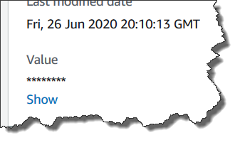

# Creating a Parameter Store parameter using

the console

You can use the AWS Systems Manager console to create and run `String`, `StringList`, and
`SecureString` parameter types. After deleting a parameter, wait
for at least 30 seconds to create a parameter with the same name.

###### Note

Parameters are only available in the AWS Region where they were
created.

The following procedure walks you through the process of creating a parameter
in the Parameter Store console. You can create `String`, `StringList`, and `SecureString`
parameter types from the console.

###### To create a parameter

1. Open the AWS Systems Manager console at [https://console.aws.amazon.com/systems-manager/](https://console.aws.amazon.com/systems-manager/ "https://console.aws.amazon.com/systems-manager/").
2. In the navigation pane, choose **Parameter Store**.
3. Choose **Create parameter**.
4. In the **Name** box, enter a hierarchy and a name.
   For example, enter `/Test/helloWorld`.

For more information about parameter hierarchies, see [Working with parameter hierarchies
in Parameter Store](sysman-paramstore-hierarchies.md "sysman-paramstore-hierarchies.md"). 5. In the **Description** box, type a description that
identifies this parameter as a test parameter. 6. For **Parameter tier** choose either
**Standard** or **Advanced**. For
more information about advanced parameters, see [Managing parameter
tiers](parameter-store-advanced-parameters.md "parameter-store-advanced-parameters.md"). 7. For **Type**, choose **String**,
**StringList**, or
**SecureString**.

    * If you choose **String**, the **Data
     type** field is displayed. If you're creating a
     parameter to hold the resource ID for an Amazon Machine Image (AMI),
     select `aws:ec2:image`. Otherwise, keep the default
     `text` selected.
    * If you choose **SecureString,** the
     **KMS Key ID** field is displayed. If you
     don't provide an AWS Key Management Service AWS KMS key ID, an AWS KMS key
     Amazon Resource Name (ARN), an alias name, or an alias ARN, then
     the system uses `alias/aws/ssm`, which is the
     AWS managed key for Systems Manager. If you don't want to use this key,
     then you can use a customer managed key. For more information about
     AWS managed keys and customer managed keys, see [AWS Key Management Service Concepts](../../../kms/latest/developerguide/concepts.md "../../../kms/latest/developerguide/concepts.md")
     in the *AWS Key Management Service Developer Guide*. For more
     information about Parameter Store and AWS KMS encryption, see [How
     AWS Systems Manager Parameter Store Uses AWS KMS](../../../kms/latest/developerguide/services-parameter-store.md "../../../kms/latest/developerguide/services-parameter-store.md").


    ###### Important

    Parameter Store only supports [symmetric encryption KMS keys](../../../kms/latest/developerguide/symm-asymm-choose-key-spec.md#symmetric-cmks "../../../kms/latest/developerguide/symm-asymm-choose-key-spec.md#symmetric-cmks"). You can't use an [asymmetric encryption KMS key](../../../kms/latest/developerguide/symmetric-asymmetric.md "../../../kms/latest/developerguide/symmetric-asymmetric.md") to encrypt your parameters. For help
     determining whether a KMS key is symmetric or asymmetric, see [Identifying symmetric and asymmetric KMS keys](../../../kms/latest/developerguide/find-symm-asymm.md "../../../kms/latest/developerguide/find-symm-asymm.md") in the
     *AWS Key Management Service Developer Guide*
    * When creating a `SecureString` parameter in the
     console by using the `key-id` parameter with either a
     customer managed key alias name or an alias ARN, specify the prefix
     `alias/` before the alias. Following is an ARN
     example.


    ```
    arn:aws:kms:us-east-2:123456789012:alias/abcd1234-ab12-cd34-ef56-abcdeEXAMPLE
    ```

    Following is an alias name example.


    ```
    alias/MyAliasName
    ```

8. In the **Value** box, type a value. For example, type
   `This is my first parameter` or
   `ami-0dbf5ea29aEXAMPLE`.

###### Note

Parameters can't be referenced or nested in the values of other parameters. You
can't include `{{}}` or
`{{ssm:`parameter-name`}}` in a parameter
value.

If you chose **SecureString**, the value of the
parameter is masked by default ("\*\*\*\*\*\*") when you view it later on
the parameter **Overview** tab, as shown in the
following illlustration. Choose **Show** to display
the parameter value.

 9. (Optional) In the **Tags** area, apply one or more
tag key-value pairs to the parameter.

Tags are optional metadata that you assign to a resource. Tags allow
you to categorize a resource in different ways, such as by purpose,
owner, or environment. For example, you might want to tag a Systems Manager
parameter to identify the type of resource to which it applies, the
environment, or the type of configuration data referenced by the
parameter. In this case, you could specify the following key-value
pairs:

    * `Key=Resource,Value=S3bucket`
    * `Key=OS,Value=Windows`
    * `Key=ParameterType,Value=LicenseKey`

10. Choose **Create parameter**.
11. In the parameters list, choose the name of the parameter you just
    created. Verify the details on the **Overview** tab. If
    you created a `SecureString` parameter, choose
    **Show** to view the unencrypted value.

###### Note

You can’t change an advanced parameter to a standard parameter. If you no
longer need an advanced parameter, or if you no longer want to incur charges
for an advanced parameter, delete it and recreate it as a new standard
parameter.
