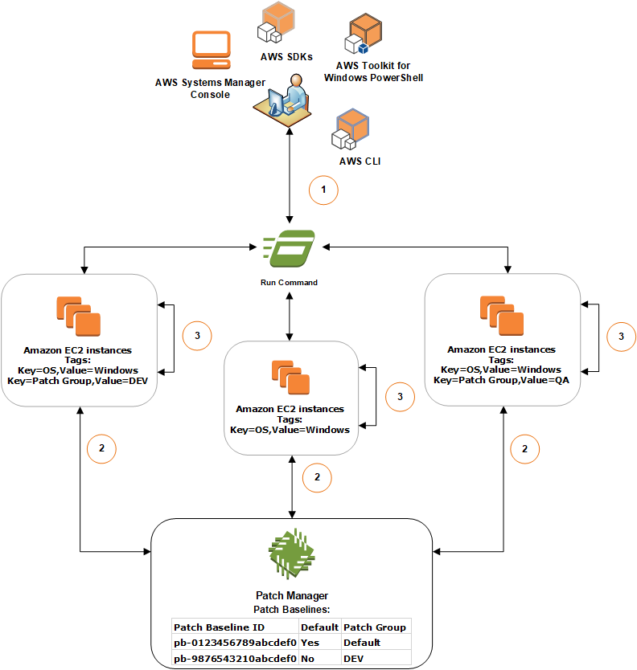

• AWS Systems Manager Change Manager is no longer open to new customers. Existing customers can continue to use the service as normal. For more information, see
[AWS Systems Manager Change Manager availability change](change-manager-availability-change.md "change-manager-availability-change.md").

 

• The AWS Systems Manager CloudWatch Dashboard will no longer be available after April 30, 2026. Customers can continue to use Amazon CloudWatch console to view, create, and manage their Amazon CloudWatch dashboards, just as they do today. For more information, see
[Amazon CloudWatch Dashboard documentation](../../../AmazonCloudWatch/latest/monitoring/CloudWatch_Dashboards.md "../../../AmazonCloudWatch/latest/monitoring/CloudWatch_Dashboards.md").

# Patch groups

###### Note

Patch groups are not used in patching operations that are based on
_patch policies_. For information about working with
patch policies, see [Patch policy configurations in Quick Setup](patch-manager-policies.md "patch-manager-policies.md").

Patch group functionality is not supported in the console for account-Region
pairs that did not already use patch groups before patch policy support was
released on December 22, 2022. Patch group functionality is still available in
account-Region pairs that began using patch groups before this date.

You can use a _patch group_ to associate managed nodes with a
specific patch baseline in Patch Manager, a tool in AWS Systems Manager. Patch groups help ensure
that you're deploying the appropriate patches, based on the associated patch
baseline rules, to the correct set of nodes. Patch groups can also help you avoid
deploying patches before they have been adequately tested. For example, you can
create patch groups for different environments (such as Development, Test, and
Production) and register each patch group to an appropriate patch baseline.

When you run `AWS-RunPatchBaseline` or other SSM Command documents for
patching, you can target managed nodes using their ID or tags. SSM Agent and Patch Manager
then evaluate which patch baseline to use based on the patch group value that you
added to the managed node.

## Using tags to define patch groups

You create a patch group by using tags applied to your Amazon Elastic Compute Cloud (Amazon EC2)
instances and non-EC2 nodes in a [hybrid and multicloud](operating-systems-and-machine-types.md#supported-machine-types "operating-systems-and-machine-types.md#supported-machine-types") environment. Note the following
details about using tags for patch groups:

- A patch group must be defined using either the tag key `Patch
 Group` or `PatchGroup` applied to your managed
  nodes. When registering a patch group for a patch baseline, any
  identical _values_ specified for these
  two keys are interpreted to be part of the same group. For instance, say
  that you have tagged five nodes with the first of the following
  key-value pairs, and five with the second:

      + `key=PatchGroup,value=DEV`
      + `key=Patch Group,value=DEV`

  The Patch Manager command to create a baseline combines these 10 managed
  nodes into a single group based on the value `DEV`. The AWS CLI
  equivalent for the command to create a patch baseline for patch groups
  is as follows:

```
aws ssm register-patch-baseline-for-patch-group \
    --baseline-id pb-0c10e65780EXAMPLE \
    --patch-group DEV
```

Combining values from different keys into a single target is unique to
this Patch Manager command for creating a new patch group and not supported
by other API actions. For example, if you run
[send-command](../../../cli/latest/reference/ssm/send-command.md "../../../cli/latest/reference/ssm/send-command.md") actions using `PatchGroup` and
`Patch Group` keys with the same values, you are
targeting two completely different sets of nodes:

```
aws ssm send-command \
    --document-name AWS-RunPatchBaseline \
    --targets "Key=tag:PatchGroup,Values=DEV"
```

```
aws ssm send-command \
    --document-name AWS-RunPatchBaseline \
    --targets "Key=tag:Patch Group,Values=DEV"
```

- There are limits on tag-based targeting. Each array of targets for
  `SendCommand` can contain a maximum of five key-value
  pairs.
- We recommend that you choose only one of these tag key conventions,
  either `PatchGroup` (without a space) or `Patch
Group` (with a space). However, if you have [allowed tags in EC2 instance metadata](../../../AWSEC2/latest/UserGuide/Using_Tags.md#allow-access-to-tags-in-IMDS "../../../AWSEC2/latest/UserGuide/Using_Tags.md#allow-access-to-tags-in-IMDS") on an instance, you
  must use `PatchGroup`.
- The key is case-sensitive. You can specify any _value_ to help you identify and target the resources in
  that group, for example "web servers" or "US-EAST-PROD", but the key
  must be `Patch Group` or `PatchGroup`.

After you create a patch group and tag managed nodes, you can register the
patch group with a patch baseline. Registering the patch group with a patch
baseline ensures that the nodes within the patch group use the rules defined in
the associated patch baseline.

For more information about how to create a patch group and associate the patch
group to a patch baseline, see [Creating and managing patch
groups](patch-manager-tag-a-patch-group.md "patch-manager-tag-a-patch-group.md") and [Add a patch group to a patch baseline](patch-manager-tag-a-patch-group.md#sysman-patch-group-patchbaseline "patch-manager-tag-a-patch-group.md#sysman-patch-group-patchbaseline").

To view an example of creating a patch baseline and patch groups by using the
AWS Command Line Interface (AWS CLI), see [Tutorial: Patch a
server environment using the AWS CLI](patch-manager-patch-servers-using-the-aws-cli.md "patch-manager-patch-servers-using-the-aws-cli.md"). For more
information about Amazon EC2 tags, see [Tag your Amazon EC2
resources](../../../AWSEC2/latest/UserGuide/Using_Tags.md "../../../AWSEC2/latest/UserGuide/Using_Tags.md") in the _Amazon EC2 User Guide_.

## How it works

When the system runs the task to apply a patch baseline to a managed node,
SSM Agent verifies that a patch group value is defined for the node. If the node
is assigned to a patch group, Patch Manager then verifies which patch baseline is
registered to that group. If a patch baseline is found for that group, Patch Manager
notifies SSM Agent to use the associated patch baseline. If a node isn't
configured for a patch group, Patch Manager automatically notifies SSM Agent to use
the currently configured default patch baseline.

###### Important

A managed node can only be in one patch group.

A patch group can be registered with only one patch baseline for each
operating system type.

You can't apply the `Patch Group` tag (with a space) to an
Amazon EC2 instance if the **Allow tags in instance metadata**
option is enabled on the instance. Allowing tags in instance metadata
prevents tag key names from containing spaces. If you have [allowed tags in EC2 instance metadata](../../../AWSEC2/latest/UserGuide/Using_Tags.md#allow-access-to-tags-in-IMDS "../../../AWSEC2/latest/UserGuide/Using_Tags.md#allow-access-to-tags-in-IMDS"), you must use the tag key
`PatchGroup` (without a space).

**Diagram 1: General example of patching operations
process flow**

The following illustration shows a general example of the processes that Systems Manager
performs when sending a Run Command task to your fleet of servers to patch using
Patch Manager. These processes determine which patch baselines to use in patching
operations. (A similar process is used when a maintenance window is configured
to send a command to patch using Patch Manager.)

The full process is explained below the illustration.



In this example, we have three groups of EC2 instances for Windows Server with the
following tags applied:

| EC2 instances group | Tags                                                 |
| ------------------- | ---------------------------------------------------- |
| Group 1             | `key=OS,value=Windows`<br>`key=PatchGroup,value=DEV` |
| Group 2             | `key=OS,value=Windows`                               |
| Group 3             | `key=OS,value=Windows`<br>`key=PatchGroup,value=QA`  |

For this example, we also have these two Windows Server patch baselines:

| Patch baseline ID      | Default | Associated patch group |
| ---------------------- | ------- | ---------------------- |
| `pb-0123456789abcdef0` | Yes     | `Default`              |
| `pb-9876543210abcdef0` | No      | `DEV`                  |

The general process to scan or install patches using Run Command, a tool in
AWS Systems Manager, and Patch Manager is as follows:

1. **Send a command to patch**: Use the
   Systems Manager console, SDK, AWS Command Line Interface (AWS CLI), or AWS Tools for Windows PowerShell to send a Run Command
   task using the document `AWS-RunPatchBaseline`. The diagram
   shows a Run Command task to patch managed instances by targeting the tag
   `key=OS,value=Windows`.
2. **Patch baseline determination**:
   SSM Agent verifies the patch group tags applied to the EC2 instance and
   queries Patch Manager for the corresponding patch baseline.
   - **Matching patch group value associated
     with patch baseline:**
     1. SSM Agent, which is installed on EC2 instances in group
        one, receives the command issued in Step 1 to begin a
        patching operation. SSM Agent validates that the EC2
        instances have the patch group tag-value
        `DEV` applied and queries Patch Manager for an
        associated patch baseline.
     2. Patch Manager verifies that patch baseline
        `pb-9876543210abcdef0` has the patch
        group `DEV` associated and notifies
        SSM Agent.
     3. SSM Agent retrieves a patch baseline snapshot from
        Patch Manager based on the approval rules and exceptions
        configured in `pb-9876543210abcdef0` and
        proceeds to the next step.

   - **No patch group tag added to
     instance:**
     1. SSM Agent, which is installed on EC2 instances in group
        two, receives the command issued in Step 1 to begin a
        patching operation. SSM Agent validates that the EC2
        instances don't have a `Patch Group` or
        `PatchGroup` tag applied and as a result,
        SSM Agent queries Patch Manager for the default Windows patch
        baseline.
     2. Patch Manager verifies that the default Windows Server patch
        baseline is `pb-0123456789abcdef0` and
        notifies SSM Agent.
     3. SSM Agent retrieves a patch baseline snapshot from
        Patch Manager based on the approval rules and exceptions
        configured in the default patch baseline
        `pb-0123456789abcdef0` and proceeds to
        the next step.

   - **No matching patch group value associated
     with a patch baseline:**
     1. SSM Agent, which is installed on EC2 instances in group
        three, receives the command issued in Step 1 to begin a
        patching operation. SSM Agent validates that the EC2
        instances have the patch group tag-value `QA`
        applied and queries Patch Manager for an associated patch
        baseline.
     2. Patch Manager doesn't find a patch baseline that has the
        patch group `QA` associated.
     3. Patch Manager notifies SSM Agent to use the default Windows
        patch baseline `pb-0123456789abcdef0`.
     4. SSM Agent retrieves a patch baseline snapshot from
        Patch Manager based on the approval rules and exceptions
        configured in the default patch baseline
        `pb-0123456789abcdef0` and proceeds to
        the next step.

3. **Patch scan or install**: After
   determining the appropriate patch baseline to use, SSM Agent begins
   either scanning for or installing patches based on the operation value
   specified in Step 1. The patches that are scanned for or installed are
   determined by the approval rules and patch exceptions defined in the
   patch baseline snapshot provided by Patch Manager.

**More info**

- [Patch compliance state
  values](patch-manager-compliance-states.md "patch-manager-compliance-states.md")
