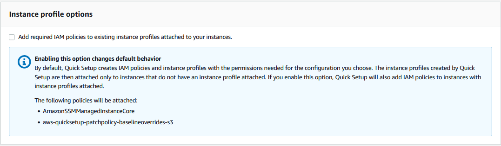

AWS Systems Manager Change Manager is no longer open to new customers. Existing customers can continue to use the service as normal. For more information, see
[AWS Systems Manager Change Manager availability change](change-manager-availability-change.md "change-manager-availability-change.md").

# Troubleshooting Patch Manager

Use the following information to help you troubleshoot problems with Patch Manager, a tool
in AWS Systems Manager.

###### Topics

- [Issue: "Invoke-PatchBaselineOperation : Access Denied" error or "Unable to
  download file from S3" error for
  baseline_overrides.json](#patch-manager-troubleshooting-patch-policy-baseline-overrides "#patch-manager-troubleshooting-patch-policy-baseline-overrides")
- [Issue: Patching fails without an apparent
  cause or error message](#race-condition-conflict "#race-condition-conflict")
- [Issue: Unexpected patch
  compliance results](#patch-manager-troubleshooting-compliance "#patch-manager-troubleshooting-compliance")
- [Errors when running
  AWS-RunPatchBaseline on Linux](#patch-manager-troubleshooting-linux "#patch-manager-troubleshooting-linux")
- [Errors when running
  AWS-RunPatchBaseline on Windows Server](#patch-manager-troubleshooting-windows "#patch-manager-troubleshooting-windows")
- [Using
  AWS Support Automation runbooks](#patch-manager-troubleshooting-using-support-runbooks "#patch-manager-troubleshooting-using-support-runbooks")
- [Contacting
  AWS Support](#patch-manager-troubleshooting-contact-support "#patch-manager-troubleshooting-contact-support")

## Issue: "Invoke-PatchBaselineOperation : Access Denied" error or "Unable to

download file from S3" error for
`baseline_overrides.json`

**Problem**: When the patching operations specified
by your patch policy run, you receive an error similar to the following example.

Example error on Windows Server

```
----------ERROR-------
Invoke-PatchBaselineOperation : Access Denied
At C:\ProgramData\Amazon\SSM\InstanceData\i-02573cafcfEXAMPLE\document\orchestr
ation\792dd5bd-2ad3-4f1e-931d-abEXAMPLE\PatchWindows\_script.ps1:219 char:13
+ $response = Invoke-PatchBaselineOperation -Operation Install -Snapsho ...
+ ~~~~~~~~~~~~~~~~~~~~~~~~~~~~~~~~~~~~~~~~~~~~~~~~~~~~~~~~~
+ CategoryInfo : OperationStopped: (Amazon.Patch.Ba...UpdateOpera
tion:InstallWindowsUpdateOperation) [Invoke-PatchBaselineOperation], Amazo
nS3Exception
+ FullyQualifiedErrorId : PatchBaselineOperations,Amazon.Patch.Baseline.Op
erations.PowerShellCmdlets.InvokePatchBaselineOperation
failed to run commands: exit status 0xffffffff
```

Example error on Linux

```
[INFO]: Downloading Baseline Override from s3://aws-quicksetup-patchpolicy-123456789012-abcde/baseline_overrides.json
[ERROR]: Unable to download file from S3: s3://aws-quicksetup-patchpolicy-123456789012-abcde/baseline_overrides.json.
[ERROR]: Error loading entrance module.
```

**Cause**: You created a patch policy in Quick Setup,
and some of your managed nodes already had an instance profile attached (for EC2
instances) or a service role attached (for non-EC2 machines).

However, as shown in the following image, you didn't select the **Add
required IAM policies to existing instance profiles attached to your
instances** check box.



When you create a patch policy, an Amazon S3 bucket is also created to store the
policy's configuration `baseline_overrides.json` file. If you
don't select the **Add required IAM policies to existing instance profiles
attached to your instances** check box when creating the policy, the
IAM policies and resource tags that are needed to access
`baseline_overrides.json` in the S3 bucket are not
automatically added to your existing IAM instance profiles and service
roles.

**Solution 1**: Delete the existing patch policy
configuration, then create a replacement, making sure to select the **Add
required IAM policies to existing instance profiles attached to your
instances** check box. This selection applies the IAM policies
created by this Quick Setup configuration to nodes that already have an instance
profile or service role attached. (By default, Quick Setup adds the required policies
to instances and nodes that do _not_ already have
instance profiles or service roles.) For more information, see [Automate
organization-wide patching using a Quick Setup patch policy](quick-setup-patch-manager.md "quick-setup-patch-manager.md").

**Solution 2**: Manually add the required permissions
and tags to each IAM instance profile and IAM service role that you use with
Quick Setup. For instructions, see [Permissions for the patch
policy S3 bucket](quick-setup-patch-manager.md#patch-policy-s3-bucket-permissions "quick-setup-patch-manager.md#patch-policy-s3-bucket-permissions").

## Issue: Patching fails without an apparent

cause or error message

**Problem**: A patching operation fails without
returning an error message.

**Possible cause**: If more than one invocation of
`AWS-RunPatchBaseline` occurs at a time, they can conflict with one
another, causing patching tasks to fail. This might not be indicated in patching
logs.

To check whether concurrent patching operations might have interrupted each other,
review the command history in Run Command, a tool in AWS Systems Manager. For a managed node with
a patching failure, check to see if multiple operations attempted to patch the
machine within 2 minutes of one another. This scenario can sometimes cause a
failure.

You can also use the AWS Command Line Interface (AWS CLI) to check for concurrent patching attempts
by using the following command. Replace the value for
`node-id` with the ID for your managed node.

```
aws ssm list-commands \
    --filter "key=DocumentName,value=AWS-RunPatchBaseline" \
    --query 'Commands[*].{CommandId:CommandId,RequestedDateTime:RequestedDateTime,Status:Status}' \
    --instance-id `node-id` \
    --output table
```

**Solution**: If you determine that patching failed
because of competing patching operations on the same managed node, adjust your
patching configurations to avoid this occurring again. For example, if two
maintenance windows specify overlapping patching times, remove or revise one of
them. If a maintenance windows specifies one patching operation, but a patch policy
specifies a different one for the same time, consider removing the task from the
maintenance window.

If you determine that conflicting patching operations weren't the cause of the
failure in this scenario, we recommend contacting [AWS Support](#patch-manager-troubleshooting-contact-support "#patch-manager-troubleshooting-contact-support").

## Issue: Unexpected patch

compliance results

**Problem**: When reviewing the patching compliance
details generated after a `Scan` operation, the results include
information that don't reflect the rules set up in your patch baseline. For example,
an exception you added to the **Rejected patches** list in a patch
baseline is listed as `Missing`. Or patches classified as
`Important` are listed as missing even though your patch baseline
specifies `Critical` patches only.

**Cause**: Patch Manager currently supports multiple
methods of running `Scan` operations:

- A patch policy configured in Quick Setup
- A Host Management option configured in Quick Setup
- A maintenance window to run a patch `Scan` or
  `Install` task
- An on-demand **Patch now** operation

When a `Scan` operation runs, it overwrites the compliance details from
the most recent scan. If you have more than one method set up to run a
`Scan` operation, and they use different patch baselines with
different rules, they will result in differing patch compliance results.

**Solution**: To avoid unexpected patch compliance
results, we recommend using only one method at a time for running the Patch
Manager
`Scan` operation. For more information, see [Identifying the
execution that created patch compliance data](patch-manager-compliance-data-overwrites.md "patch-manager-compliance-data-overwrites.md").

## Errors when running

`AWS-RunPatchBaseline` on Linux

###### Topics

- [Issue: 'No such file or
  directory' error](#patch-manager-troubleshooting-linux-1 "#patch-manager-troubleshooting-linux-1")
- [Issue: 'another process
  has acquired yum lock' error](#patch-manager-troubleshooting-linux-2 "#patch-manager-troubleshooting-linux-2")
- [Issue: 'Permission
  denied / failed to run commands' error](#patch-manager-troubleshooting-linux-3 "#patch-manager-troubleshooting-linux-3")
- [Issue: 'Unable to
  download payload' error](#patch-manager-troubleshooting-linux-4 "#patch-manager-troubleshooting-linux-4")
- [Issue: 'unsupported
  package manager and python version combination' error](#patch-manager-troubleshooting-linux-5 "#patch-manager-troubleshooting-linux-5")
- [Issue: Patch Manager isn't
  applying rules specified to exclude certain packages](#patch-manager-troubleshooting-linux-6 "#patch-manager-troubleshooting-linux-6")
- [Issue: Patching fails
  and Patch Manager reports that the Server Name Indication extension to TLS is not
  available](#patch-manager-troubleshooting-linux-7 "#patch-manager-troubleshooting-linux-7")
- [Issue: Patch Manager reports
  'No more mirrors to try'](#patch-manager-troubleshooting-linux-8 "#patch-manager-troubleshooting-linux-8")
- [Issue: Patching fails
  with 'Error code returned from curl is 23'](#patch-manager-troubleshooting-linux-9 "#patch-manager-troubleshooting-linux-9")
- [Issue: Patching fails with ‘Error
  unpacking rpm package…’ message](#error-unpacking-rpm "#error-unpacking-rpm")
- [Issue: Patching fails with 'Encounter
  service side error when uploading the inventory'](#inventory-upload-error "#inventory-upload-error")
- [Issue: Patching fails with ‘Errors
  were encountered while downloading packages’ message](#errors-while-downloading "#errors-while-downloading")
- [Issue: Patching fails with a message
  that 'The following signatures couldn't be verified because the public key
  is not available'](#public-key-unavailable "#public-key-unavailable")
- [Issue: Patching fails with a
  'NoMoreMirrorsRepoError' message](#no-more-mirrors-repo-error "#no-more-mirrors-repo-error")
- [Issue: Patching fails with an 'Unable
  to download payload' message](#payload-download-error "#payload-download-error")
- [Issue: Patching fails with a message
  'install errors: dpkg: error: dpkg frontend is locked by another
  process'](#dpkg-frontend-locked "#dpkg-frontend-locked")
- [Issue: Patching on Ubuntu Server fails with a
  'dpkg was interrupted' error](#dpkg-interrupted "#dpkg-interrupted")
- [Issue: The package manager utility can't
  resolve a package dependency](#unresolved-dependency "#unresolved-dependency")
- [Issue: Zypper
  package lock dependency failures on SLES managed nodes](#patch-manager-troubleshooting-linux-zypper-locks "#patch-manager-troubleshooting-linux-zypper-locks")

### Issue: 'No such file or

directory' error

**Problem**: When you run
`AWS-RunPatchBaseline`, patching fails with one of the following
errors.

```
IOError: [Errno 2] No such file or directory: 'patch-baseline-operations-X.XX.tar.gz'
```

```
Unable to extract tar file: /var/log/amazon/ssm/patch-baseline-operations/patch-baseline-operations-1.75.tar.gz.failed to run commands: exit status 155
```

```
Unable to load and extract the content of payload, abort.failed to run commands: exit status 152
```

**Cause 1**: Two commands to run
`AWS-RunPatchBaseline` were running at the same time on the same
managed node. This creates a race condition that results in the temporary
`file patch-baseline-operations*` not being created or
accessed properly.

**Cause 2**: Insufficient storage space remains
under the `/var` directory.

**Solution 1**: Ensure that no maintenance window
has two or more Run Command tasks that run `AWS-RunPatchBaseline` with
the same Priority level and that run on the same target IDs. If this is the
case, reorder the priority. Run Command is a tool in AWS Systems Manager.

**Solution 2**: Ensure that only one maintenance
window at a time is running Run Command tasks that use
`AWS-RunPatchBaseline` on the same targets and on the same
schedule. If this is the case, change the schedule.

**Solution 3**: Ensure that only one State Manager
association is running `AWS-RunPatchBaseline` on the same schedule
and targeting the same managed nodes. State Manager is a tool in AWS Systems Manager.

**Solution 4**: Free up sufficient storage space
under the `/var` directory for the update packages.

### Issue: 'another process

has acquired yum lock' error

**Problem**: When you run
`AWS-RunPatchBaseline`, patching fails with the following
error.

```
12/20/2019 21:41:48 root [INFO]: another process has acquired yum lock, waiting 2 s and retry.
```

**Cause**: The `AWS-RunPatchBaseline`
document has started running on a managed node where it's already running in
another operation and has acquired the package manager `yum`
process.

**Solution**: Ensure that no State Manager
association, maintenance window tasks, or other configurations that run
`AWS-RunPatchBaseline` on a schedule are targeting the same
managed node around the same time.

### Issue: 'Permission

denied / failed to run commands' error

**Problem**: When you run
`AWS-RunPatchBaseline`, patching fails with the following
error.

```
sh:
/var/lib/amazon/ssm/instanceid/document/orchestration/commandid/PatchLinux/_script.sh: Permission denied
failed to run commands: exit status 126
```

**Cause**: `/var/lib/amazon/` might be
mounted with `noexec` permissions. This is an issue because SSM Agent
downloads payload scripts to `/var/lib/amazon/ssm` and runs them from
that location.

**Solution**: Ensure that you have configured
exclusive partitions to `/var/log/amazon` and
`/var/lib/amazon`, and that they're mounted with
`exec` permissions.

### Issue: 'Unable to

download payload' error

**Problem**: When you run
`AWS-RunPatchBaseline`, patching fails with the following
error.

```
Unable to download payload: https://s3.amzn-s3-demo-bucket.region.amazonaws.com/aws-ssm-region/patchbaselineoperations/linux/payloads/patch-baseline-operations-X.XX.tar.gz.failed to run commands: exit status 156
```

**Cause**: The managed node doesn't have the
required permissions to access the specified Amazon Simple Storage Service (Amazon S3) bucket.

**Solution**: Update your network configuration
so that S3 endpoints are reachable. For more details, see information about
required access to S3 buckets for Patch Manager in [SSM Agent communications with
AWS managed S3 buckets](ssm-agent-technical-details.md#ssm-agent-minimum-s3-permissions "ssm-agent-technical-details.md#ssm-agent-minimum-s3-permissions").

### Issue: 'unsupported

package manager and python version combination' error

**Problem**: When you run
`AWS-RunPatchBaseline`, patching fails with the following
error.

```
An unsupported package manager and python version combination was found. Apt requires Python3 to be installed.
failed to run commands: exit status 1
```

**Cause**: A supported version of python3 isn't
installed on the Debian Server or Ubuntu Server instance.

**Solution**: Install a supported version of
python3 (3.0 - 3.12) on the server, which is required for
Debian Server and Ubuntu Server managed nodes.

### Issue: Patch Manager isn't

applying rules specified to exclude certain packages

**Problem**: You have attempted to exclude
certain packages by specifying them in the `/etc/yum.conf`
file, in the format
`exclude=`package-name``, but they aren't
 excluded during the Patch Manager `Install` operation.

**Cause**: Patch Manager doesn't incorporate
exclusions specified in the `/etc/yum.conf` file.

**Solution**: To exclude specific packages,
create a custom patch baseline and create a rule to exclude the packages you
don't want installed.

### Issue: Patching fails

and Patch Manager reports that the Server Name Indication extension to TLS is not
available

**Problem**: The patching operation issues the
following message.

```
/var/log/amazon/ssm/patch-baseline-operations/urllib3/util/ssl_.py:369:
SNIMissingWarning: An HTTPS request has been made, but the SNI (Server Name Indication) extension
to TLS is not available on this platform. This might cause the server to present an incorrect TLS
certificate, which can cause validation failures. You can upgrade to a newer version of Python
to solve this.
For more information, see https://urllib3.readthedocs.io/en/latest/advanced-usage.html#ssl-warnings
```

**Cause**: This message doesn't indicate an
error. Instead, it's a warning that the older version of Python distributed with
the operating system doesn't support TLS Server Name Indication. The Systems Manager patch
payload script issues this warning when connecting to AWS APIs that support
SNI.

**Solution**: To troubleshoot any patching
failures when this message is reported, review the contents of the
`stdout` and `stderr` files. If you
haven't configured the patch baseline to store these files in an S3 bucket or in
Amazon CloudWatch Logs, you can locate the files in the following location on your Linux
managed node.

`/var/lib/amazon/ssm/`instance-id`/document/orchestration/`Run-Command-execution-id`/awsrunShellScript/PatchLinux`

### Issue: Patch Manager reports

'No more mirrors to try'

**Problem**: The patching operation issues the
following message.

```
[Errno 256] No more mirrors to try.
```

**Cause**: The repositories configured on the
managed node are not working correctly. Possible causes for this include:

- The `yum` cache is corrupted.
- A repository URL can't be reached due to network-related
  issues.

**Solution**: Patch Manager uses the managed node’s
default package manager to perform patching operation. Double-check that
repositories are configured and operating correctly.

### Issue: Patching fails

with 'Error code returned from curl is 23'

**Problem**: A patching operating that uses
`AWS-RunPatchBaseline` fails with an error similar to the
following:

```
05/01/2025 17:04:30 root [ERROR]: Error code returned from curl is 23
```

**Cause**: The curl tool in use on your systems
lacks the permissions needed to write to the filesystem. This can occur when if
the package manager's default curl tool was replaced by a different version,
such as one installed with snap.

**Solution**: If the curl version provided by the
package manager was uninstalled when a different version was installed,
reinstall it.

If you need to keep multiple curl versions installed, ensure that the version
associated with the package manager is in the first directory listed in the
`PATH` variable. You can check this by running the command
`echo $PATH` to see the current order of directories that are
checked for executable files on your system.

### Issue: Patching fails with ‘Error

unpacking rpm package…’ message

**Problem**: A patching operation fails with an
error similar to the following:

```
Error : Error unpacking rpm package python-urllib3-1.25.9-1.amzn2.0.2.noarch
python-urllib3-1.25.9-1.amzn2.0.1.noarch was supposed to be removed but is not!
failed to run commands: exit status 1
```

**Cause 1**: When a particular package is present
in multiple package installers, such as both `pip` and
`yum` or `dnf`, conflicts can occur
when using the default package manager.

A common example occurs with the `urllib3` package, which
is found in `pip`, `yum`, and
`dnf`.

**Cause 2**: The
`python-urllib3` package is corrupted. This can happen if
the package files were installed or updated by `pip` after
the `rpm` was package was previously installed by
`yum` or `dnf`.

**Solution**: Remove the
`python-urllib3` package from pip by running the command
`sudo pip uninstall urllib3`, keeping the package only in the
default package manager (`yum` or `dnf`).

### Issue: Patching fails with 'Encounter

service side error when uploading the inventory'

**Problem**: When running the
`AWS-RunPatchBaseline` document, you receive the following error
message:

```
Encounter service side error when uploading the inventory
```

**Cause**: Two commands to run
`AWS-RunPatchBaseline` were running at the same time on the same
managed node. This creates a race condition when initializing boto3 client
during patching operations.

**Solution**: Ensure that no State Manager
association, maintenance window tasks, or other configurations that run
`AWS-RunPatchBaseline` on a schedule are targeting the same
managed node around the same time.

### Issue: Patching fails with ‘Errors

were encountered while downloading packages’ message

**Problem**: During patching, you receive an
error similar to the following:

```
YumDownloadError: [u'Errors were encountered while downloading
packages.', u'libxml2-2.9.1-6.el7_9.6.x86_64: [Errno 5] [Errno 12]
Cannot allocate memory', u'libxslt-1.1.28-6.el7.x86_64: [Errno 5]
[Errno 12] Cannot allocate memory', u'libcroco-0.6.12-6.el7_9.x86_64:
[Errno 5] [Errno 12] Cannot allocate memory', u'openldap-2.4.44-25.el7_9.x86_64:
[Errno 5] [Errno 12] Cannot allocate memory',
```

**Cause**: This error can occur when insufficient
memory is available on a managed node.

**Solution**: Configure the swap memory, or
upgrade the instance to a different type to increase the memory support. Then
start a new patching operation.

### Issue: Patching fails with a message

that 'The following signatures couldn't be verified because the public key
is not available'

**Problem**: Patching fails on Ubuntu Server with
an error similar to the following:

```
02/17/2022 21:08:43 root [ERROR]: W:GPG error:
http://repo.mysql.com/apt/ubuntu  bionic InRelease: The following
signatures couldn't be verified because the public key is not available:
NO_PUBKEY 467B942D3A79BD29, E:The repository ' http://repo.mysql.com/apt/ubuntu bionic
```

**Cause**: The GNU Privacy Guard (GPG) key has
expired or is missing.

**Solution**: Refresh the GPG key, or add the key
again.

For example, using the error shown previously, we see that the
`467B942D3A79BD29` key is missing and must be added. To
do so, run either of the following commands:

```
sudo apt-key adv --keyserver hkps://keyserver.ubuntu.com --recv-keys 467B942D3A79BD29
```

```
sudo apt-key adv --keyserver hkp://keyserver.ubuntu.com:80 --recv-keys 467B942D3A79BD29
```

Or, to refresh all keys, run the following command:

```
sudo apt-key adv --keyserver hkps://keyserver.ubuntu.com --refresh-keys
```

If the error recurs after this, we recommend reporting the issue to the
organization that maintains the repository. Until a fix is available, you can
edit the `/etc/apt/sources.list` file to omit the repository
during the patching process.

To do so, open the `sources.list` file for editing, locate
the line for the repository, and insert a `#` character at the
beginning of the line to comment it out. Then save and close the file.

### Issue: Patching fails with a

'NoMoreMirrorsRepoError' message

**Problem**: You receive an error similar to the
following:

```
NoMoreMirrorsRepoError: failure: repodata/repomd.xml from pgdg94: [Errno 256] No more mirrors to try.
```

**Cause**: There is an error in the source
repository.

**Solution**: We recommend reporting the issue to
the organization that maintains the repository. Until the error is fixed, you
can disable the repository at the operating system level. To do so, run the
following command, replacing the value for `repo-name`
with your repository name:

```
yum-config-manager --disable `repo-name`
```

Following is an example.

```
yum-config-manager --disable pgdg94
```

After you run this command, run another patching operation.

### Issue: Patching fails with an 'Unable

to download payload' message

**Problem**: You receive an error similar to the
following:

```
Unable to download payload:
https://s3.dualstack.eu-west-1.amazonaws.com/aws-ssm-eu-west-1/patchbaselineoperations/linux/payloads/patch-baseline-operations-1.83.tar.gz.
failed  to run commands: exit status 156
```

**Cause**: The managed node configuration
contains errors or is incomplete.

**Solution**: Make sure that the managed node is
configured with the following:

- Outbound TCP 443 rule in security group.
- Egress TCP 443 rule in NACL.
- Ingress TCP 1024-65535 rule in NACL.
- NAT/IGW in route table to provide connectivity to an S3 endpoint. If
  the instance doesn't have internet access, provide it connectivity with
  the S3 endpoint. To do that, add an S3 gateway endpoint in the VPC and
  integrate it with the route table of the managed node.

### Issue: Patching fails with a message

'install errors: dpkg: error: dpkg frontend is locked by another
process'

**Problem**: Patching fails with an error similar
to the following:

```
install errors: dpkg: error: dpkg frontend is locked by another process
failed to run commands: exit status 2
Failed to install package; install status Failed
```

**Cause**: The package manager is already running
another process on a managed node at the operating system level. If that other
process takes a long time to complete, the Patch Manager patching operation can time
out and fail.

**Solution**: After the other process that’s
using the package manager completes, run a new patching operation.

### Issue: Patching on Ubuntu Server fails with a

'dpkg was interrupted' error

**Problem**: On Ubuntu Server, patching fails with
an error similar to the following:

```
E: dpkg was interrupted, you must manually run
'dpkg --configure -a' to correct the problem.
```

**Cause**: One or more packages is
misconfigured.

**Solution**: Perform the following steps:

1. Check to see which packages are affected, and what the issues are with
   each package by running the following commands, one at a time:

```
sudo apt-get check
```

```
sudo dpkg -C
```

```
dpkg-query -W -f='${db:Status-Abbrev} ${binary:Package}\n' | grep -E ^.[^nci]
```

2. Correct the packages with issues by running the following
   command:

```
sudo dpkg --configure -a
```

3. If the previous command didn't fully resolve the issue, run the
   following command:

```
sudo apt --fix-broken install
```

### Issue: The package manager utility can't

resolve a package dependency

**Problem**: The native package manager on the
managed node is unable to resolve a package dependency and patching fails. The
following error message example indicates this type of failure on an operating
system that uses `yum` as the package manager.

```
09/22/2020 08:56:09 root [ERROR]: yum update failed with result code: 1,
message: [u'rpm-python-4.11.3-25.amzn2.0.3.x86_64 requires rpm = 4.11.3-25.amzn2.0.3',
u'awscli-1.18.107-1.amzn2.0.1.noarch requires python2-botocore = 1.17.31']
```

**Cause**: On Linux operating systems, Patch Manager
uses the native package manager on the machine to run patching operations. such
as `yum`, `dnf`, `apt`,
and `zypper`. The applications automatically detect, install,
update, or remove dependent packages as required. However, some conditions can
result in the package manager being unable to complete a dependency operation,
such as:

- Multiple conflicting repositories are configured on the operating
  system.
- A remote repository URL is inaccessible due to network-related
  issues.
- A package for the wrong architecture is found in the
  repository.

**Solution**: Patching might fail because of a
dependency issue for a wide variety of reasons. Therefore, we recommend that you
contact AWS Support to assist with troubleshooting.

### Issue: Zypper

package lock dependency failures on SLES managed nodes

**Problem**: When you run
`AWS-RunPatchBaseline` with the `Install` operation on
SUSE Linux Enterprise Server instances, patching fails with dependency check errors related to
package locks. You might see error messages similar to the following:

```
Problem: mock-pkg-has-dependencies-0.2.0-21.adistro.noarch requires mock-pkg-standalone = 0.2.0, but this requirement cannot be provided
  uninstallable providers: mock-pkg-standalone-0.2.0-21.adistro.noarch[local-repo]
 Solution 1: remove lock to allow installation of mock-pkg-standalone-0.2.0-21.adistro.noarch[local-repo]
 Solution 2: do not install mock-pkg-has-dependencies-0.2.0-21.adistro.noarch
 Solution 3: break mock-pkg-has-dependencies-0.2.0-21.adistro.noarch by ignoring some of its dependencies

Choose from above solutions by number or cancel [1/2/3/c] (c): c
```

In this example, the package `mock-pkg-standalone` is locked, which
you could verify by running `sudo zypper locks` and looking for this
package name in the output.

Or you might see log entries indicating dependency check failures:

```
Encountered a known exception in the CLI Invoker: CLIInvokerError(error_message='Dependency check failure during commit process', error_code='4')
```

###### Note

This issue only occurs during `Install` operations.
`Scan` operations do not apply package locks and are not
affected by existing locks."

**Cause**: This error occurs when zypper package
locks prevent the installation or update of packages due to dependency
conflicts. Package locks can be present for several reasons:

- **Customer-applied locks**: You or your
  system administrator manually locked packages using zypper commands such
  as `zypper addlock`.
- **Patch Manager rejected patches**:
  Patch Manager automatically applies package locks when you specify packages
  in the **Rejected patches** list of your patch baseline
  to prevent their installation.
- **Residual locks from interrupted
  operations**: In rare cases, if a patch operation was
  interrupted (such as by a system reboot) before Patch Manager could clean up
  temporary locks, residual package locks might remain on your managed
  node.

**Solution**: To resolve zypper package lock
issues, follow these steps based on the cause:

**Step 1: Identify locked packages**

Connect to your SLES managed node and run the following command to list all
currently locked packages:

```
sudo zypper locks
```

**Step 2: Determine the source of locks**

- If the locked packages are ones you intentionally locked for system
  stability, consider whether they need to remain locked or if they can be
  temporarily unlocked for patching.
- If the locked packages match entries in your patch baseline's
  **Rejected patches** list, these are likely
  residual locks from an interrupted patch operation. During normal
  operations, Patch Manager applies these locks temporarily and removes them
  automatically when the operation completes. You can either remove the
  packages from the rejected list or modify your patch baseline
  rules.
- If you don't recognize the locked packages and they weren't
  intentionally locked, they might be residual locks from a previous
  interrupted patch operation.

**Step 3: Remove locks as appropriate**

To remove specific package locks, use the following command:

```
sudo zypper removelock package-name
```

To remove all package locks (use with caution), run:

```
sudo zypper cleanlocks
```

**Step 4: Update your patch baseline (if
applicable)**

If the locks were caused by rejected patches in your patch baseline:

1. Open the AWS Systems Manager console at [https://console.aws.amazon.com/systems-manager/](https://console.aws.amazon.com/systems-manager/ "https://console.aws.amazon.com/systems-manager/").
2. In the navigation pane, choose **Patch Manager**.
3. Choose the **Patch baselines** tab, and then choose
   your custom patch baseline.
4. Choose **Actions**, **Modify patch
   baseline**.
5. In the **Rejected patches** section, review the
   listed packages and remove any that should be allowed to install.
6. Choose **Save changes**.

**Step 5: Retry the patch operation**

After removing the problematic locks and updating your patch baseline if
necessary, run the `AWS-RunPatchBaseline` document again.

###### Note

When Patch Manager applies locks for rejected patches during
`Install` operations, it's designed to clean up these locks
automatically after the patch operation completes. If you see these locks
when running `sudo zypper locks`, it indicates a previous patch
operation was interrupted before cleanup could occur. However, if a patch
operation is interrupted, manual cleanup might be required as described in
this procedure.

**Prevention**: To avoid future zypper lock
conflicts:

- Carefully review your patch baseline's rejected patches list to ensure
  it only includes packages you truly want to exclude.
- Avoid manually locking packages that might be required as dependencies
  for security updates.
- If you must lock packages manually, document the reasons and review
  the locks periodically.
- Ensure patch operations complete successfully and aren't interrupted
  by system reboots or other factors.
- Monitor patch operations to completion and avoid interrupting them
  with system reboots or other actions that could prevent proper cleanup
  of temporary locks.

## Errors when running

`AWS-RunPatchBaseline` on Windows Server

###### Topics

- [Issue:
  mismatched product family/product pairs](#patch-manager-troubleshooting-product-family-mismatch "#patch-manager-troubleshooting-product-family-mismatch")
- [Issue:
  AWS-RunPatchBaseline output returns an HRESULT
  (Windows Server)](#patch-manager-troubleshooting-hresult "#patch-manager-troubleshooting-hresult")
- [Issue: managed
  node doesn't have access to Windows Update Catalog or WSUS](#patch-manager-troubleshooting-instance-access "#patch-manager-troubleshooting-instance-access")
- [Issue:
  PatchBaselineOperations PowerShell module is not downloadable](#patch-manager-troubleshooting-module-not-downloadable "#patch-manager-troubleshooting-module-not-downloadable")
- [Issue: missing
  patches](#patch-manager-troubleshooting-missing-patches "#patch-manager-troubleshooting-missing-patches")

### Issue:

mismatched product family/product pairs

**Problem**: When you create a patch baseline in
the Systems Manager console, you specify a product family and a product. For example, you
might choose:

- **Product family**: `Office`

**Product**: `Office 2016`

**Cause**: If you attempt to create a patch
baseline with a mismatched product family/product pair, an error message is
displayed. The following are reasons this can occur:

- You selected a valid product family and product pair but then removed
  the product family selection.
- You chose a product from the **Obsolete or mismatched
  options** sublist instead of the **Available and
  matching options** sublist.

Items in the product **Obsolete or mismatched
options** sublist might have been entered in error through
an SDK or AWS Command Line Interface (AWS CLI) `create-patch-baseline` command.
This could mean a typo was introduced or a product was assigned to the
wrong product family. A product is also included in the
**Obsolete or mismatched options** sublist if it
was specified for a previous patch baseline but has no patches available
from Microsoft.

**Solution**: To avoid this issue in the console,
always choose options from the **Currently available options**
sublists.

You can also view the products that have available patches by using the
`describe-patch-properties` command in the AWS CLI
or the `DescribePatchProperties` API command.

### Issue:

`AWS-RunPatchBaseline` output returns an `HRESULT`
(Windows Server)

**Problem**: You received an error like the
following.

```
----------ERROR-------
Invoke-PatchBaselineOperation : Exception Details: An error occurred when
attempting to search Windows Update.
Exception Level 1:
 Error Message: Exception from HRESULT: 0x80240437
 Stack Trace: at WUApiLib.IUpdateSearcher.Search(String criteria)..
(Windows updates)
11/22/2020 09:17:30 UTC | Info | Searching for Windows Updates.
11/22/2020 09:18:59 UTC | Error | Searching for updates resulted in error: Exception from HRESULT: 0x80240437
----------ERROR-------
failed to run commands: exit status 4294967295
```

**Cause**: This output indicates that the native
Windows Update APIs were unable to run the patching operations.

**Solution**: Check the `HResult` code
in the following microsoft.com topics to identify troubleshooting steps for
resolving the error:

- [Windows Update error codes by component](https://learn.microsoft.com/en-us/windows/deployment/update/windows-update-error-reference "https://learn.microsoft.com/en-us/windows/deployment/update/windows-update-error-reference")
- [Windows Update common errors and mitigation](https://learn.microsoft.com/en-us/troubleshoot/windows-client/deployment/common-windows-update-errors "https://learn.microsoft.com/en-us/troubleshoot/windows-client/deployment/common-windows-update-errors")

### Issue: managed

node doesn't have access to Windows Update Catalog or WSUS

**Problem**: You received an error like the
following.

```
Downloading PatchBaselineOperations PowerShell module from https://s3.aws-api-domain/path_to_module.zip to C:\Windows\TEMP\Amazon.PatchBaselineOperations-1.29.zip.

Extracting PatchBaselineOperations zip file contents to temporary folder.

Verifying SHA 256 of the PatchBaselineOperations PowerShell module files.

Successfully downloaded and installed the PatchBaselineOperations PowerShell module.

Patch Summary for

PatchGroup :

BaselineId :

Baseline : null

SnapshotId :

RebootOption : RebootIfNeeded

OwnerInformation :

OperationType : Scan

OperationStartTime : 1970-01-01T00:00:00.0000000Z

OperationEndTime : 1970-01-01T00:00:00.0000000Z

InstalledCount : -1

InstalledRejectedCount : -1

InstalledPendingRebootCount : -1

InstalledOtherCount : -1

FailedCount : -1

MissingCount : -1

NotApplicableCount : -1

UnreportedNotApplicableCount : -1

EC2AMAZ-VL3099P - PatchBaselineOperations Assessment Results - 2020-12-30T20:59:46.169

----------ERROR-------

Invoke-PatchBaselineOperation : Exception Details: An error occurred when attempting to search Windows Update.

Exception Level 1:

Error Message: Exception from HRESULT: 0x80072EE2

Stack Trace: at WUApiLib.IUpdateSearcher.Search(String criteria)

at Amazon.Patch.Baseline.Operations.PatchNow.Implementations.WindowsUpdateAgent.SearchForUpdates(String

searchCriteria)

At C:\ProgramData\Amazon\SSM\InstanceData\i-02573cafcfEXAMPLE\document\orchestration\3d2d4864-04b7-4316-84fe-eafff1ea58

e3\PatchWindows\_script.ps1:230 char:13

+ $response = Invoke-PatchBaselineOperation -Operation Install -Snapsho ...

+ ~~~~~~~~~~~~~~~~~~~~~~~~~~~~~~~~~~~~~~~~~~~~~~~~~~~~~~~~~

+ CategoryInfo : OperationStopped: (Amazon.Patch.Ba...UpdateOperation:InstallWindowsUpdateOperation) [Inv

oke-PatchBaselineOperation], Exception

+ FullyQualifiedErrorId : Exception Level 1:

Error Message: Exception Details: An error occurred when attempting to search Windows Update.

Exception Level 1:

Error Message: Exception from HRESULT: 0x80072EE2

Stack Trace: at WUApiLib.IUpdateSearcher.Search(String criteria)

at Amazon.Patch.Baseline.Operations.PatchNow.Implementations.WindowsUpdateAgent.SearchForUpdates(String searc

---Error truncated----
```

**Cause**: This error could be related to the
Windows Update components, or to a lack of connectivity to the Windows Update
Catalog or Windows Server Update Services (WSUS).

**Solution**: Confirm that the managed node has
connectivity to the [Microsoft Update
Catalog](https://www.catalog.update.microsoft.com/home.aspx "https://www.catalog.update.microsoft.com/home.aspx") through an internet gateway, NAT gateway, or NAT instance.
If you're using WSUS, confirm that the managed node has connectivity to the WSUS
server in your environment. If connectivity is available to the intended
destination, check the Microsoft documentation for other potential causes of
`HResult 0x80072EE2`. This might indicate an operating system
level issue.

### Issue:

PatchBaselineOperations PowerShell module is not downloadable

**Problem**: You received an error like the
following.

```
Preparing to download PatchBaselineOperations PowerShell module from S3.

Downloading PatchBaselineOperations PowerShell module from https://s3.aws-api-domain/path_to_module.zip to C:\Windows\TEMP\Amazon.PatchBaselineOperations-1.29.zip.
----------ERROR-------

C:\ProgramData\Amazon\SSM\InstanceData\i-02573cafcfEXAMPLE\document\orchestration\aaaaaaaa-bbbb-cccc-dddd-4f6ed6bd5514\

PatchWindows\_script.ps1 : An error occurred when executing PatchBaselineOperations: Unable to connect to the remote server

+ CategoryInfo : NotSpecified: (:) [Write-Error], WriteErrorException

+ FullyQualifiedErrorId : Microsoft.PowerShell.Commands.WriteErrorException,_script.ps1

failed to run commands: exit status 4294967295
```

**Solution**: Check the managed node connectivity
and permissions to Amazon Simple Storage Service (Amazon S3). The managed node's AWS Identity and Access Management (IAM) role
must use the minimum permissions cited in [SSM Agent communications with
AWS managed S3 buckets](ssm-agent-technical-details.md#ssm-agent-minimum-s3-permissions "ssm-agent-technical-details.md#ssm-agent-minimum-s3-permissions"). The node must
communicate with the Amazon S3 endpoint through the Amazon S3 gateway endpoint, NAT
gateway, or internet gateway. For more information about the VPC Endpoint
requirements for AWS Systems Manager SSM Agent (SSM Agent), see [Improve the security of EC2 instances by using VPC
endpoints for Systems Manager](setup-create-vpc.md "setup-create-vpc.md").

### Issue: missing

patches

**Problem**: `AWS-RunPatchbaseline`
completed successfully, but there are some missing patches.

The following are some common causes and their solutions.

**Cause 1**: The baseline isn't effective.

**Solution 1**: To check if this is the cause,
use the following procedure.

1. Open the AWS Systems Manager console at [https://console.aws.amazon.com/systems-manager/](https://console.aws.amazon.com/systems-manager/ "https://console.aws.amazon.com/systems-manager/").
2. In the navigation pane, choose **Run Command**.
3. Select the **Command history** tab and then select
   the command whose baseline you want to check.
4. Select the managed node that has missing patches.
5. Select **Step 1 - Output** and find the
   `BaselineId` value.
6. Check the assigned [patch baseline configuration](patch-manager-predefined-and-custom-patch-baselines.md#patch-manager-baselines-custom "patch-manager-predefined-and-custom-patch-baselines.md#patch-manager-baselines-custom"), that is, the operating system,
   product name, classification, and severity for the patch
   baseline.
7. Go to the [Microsoft
   Update Catalog](https://www.catalog.update.microsoft.com/home.aspx "https://www.catalog.update.microsoft.com/home.aspx").
8. Search the Microsoft Knowledge Base (KB) article IDs (for example,
   KB3216916).
9. Verify that the value under **Product** matches that
   of your managed node and select the corresponding
   **Title**. A new **Update
   Details** window will open.
10. In the **Overview** tab, the
    **classification** and **MSRC
    severity** must match the patch baseline configuration you
    found earlier.

**Cause 2**: The patch was replaced.

**Solution 2**: To check if this is true, use the
following procedure.

1. Go to the [Microsoft
   Update Catalog](https://www.catalog.update.microsoft.com/home.aspx "https://www.catalog.update.microsoft.com/home.aspx").
2. Search the Microsoft Knowledge Base (KB) article IDs (for example,
   KB3216916).
3. Verify that the value under **Product** matches that
   of your managed node and select the corresponding
   **Title**. A new **Update
   Details** window will open.
4. Go to the **Package Details** tab. Look for an entry
   under the **This update has been replaced by the following
   updates:** header.

**Cause 3**: The same patch might have different
KB numbers because the WSUS and Window online updates are handled as independent
Release Channels by Microsoft.

**Solution 3**: Check the patch eligibility. If
the package isn't available under WSUS, install [OS Build 14393.3115](https://support.microsoft.com/en-us/topic/july-16-2019-kb4507459-os-build-14393-3115-511a3df6-c07e-14e3-dc95-b9898a7a7a57 "https://support.microsoft.com/en-us/topic/july-16-2019-kb4507459-os-build-14393-3115-511a3df6-c07e-14e3-dc95-b9898a7a7a57"). If the package is available for all operating
system builds, install [OS Builds 18362.1256 and 18363.1256](https://support.microsoft.com/en-us/topic/december-8-2020-kb4592449-os-builds-18362-1256-and-18363-1256-c448f3df-a5f1-1d55-aa31-0e1cf7a440a9 "https://support.microsoft.com/en-us/topic/december-8-2020-kb4592449-os-builds-18362-1256-and-18363-1256-c448f3df-a5f1-1d55-aa31-0e1cf7a440a9").

## Using

AWS Support Automation runbooks

AWS Support provides two Automation runbooks you can use to troubleshoot certain
issues related to patching.

- `AWSSupport-TroubleshootWindowsUpdate` – The
  [`AWSSupport-TroubleshootWindowsUpdate`](../../../systems-manager-automation-runbooks/latest/userguide/awssupport-troubleshoot-windows-update.md "../../../systems-manager-automation-runbooks/latest/userguide/awssupport-troubleshoot-windows-update.md")
  runbook is used to identify issues that could fail the Windows Server updates for
  Amazon Elastic Compute Cloud (Amazon EC2) Windows Server instances.
- `AWSSupport-TroubleshootPatchManagerLinux` – The
  [`AWSSupport-TroubleshootPatchManagerLinux`](../../../systems-manager-automation-runbooks/latest/userguide/automation-troubleshoot-patch-manager-linux.md "../../../systems-manager-automation-runbooks/latest/userguide/automation-troubleshoot-patch-manager-linux.md")
  runbook troubleshoots common issues that can cause a patch failure on
  Linux-based managed nodes using Patch Manager. The main goal of this runbook is
  to identify the patch command failure root cause and suggest a remediation
  plan.

###### Note

There is a charge to run Automation runbooks. For information, see [AWS Systems Manager Pricing
for Automation](https://aws.amazon.com/systems-manager/pricing/#Automation "https://aws.amazon.com/systems-manager/pricing/#Automation").

## Contacting

AWS Support

If you can't find troubleshooting solutions in this section or in the Systems Manager issues in [AWS re:Post](https://repost.aws/tags/TA-UbbRGVYRWCDaCvae6itYg/aws-systems-manager "https://repost.aws/tags/TA-UbbRGVYRWCDaCvae6itYg/aws-systems-manager"), and you have a [Developer, Business, or Enterprise Support
plan](https://aws.amazon.com/premiumsupport/plans "https://aws.amazon.com/premiumsupport/plans"), you can create a technical support case at [AWS Support](https://aws.amazon.com/premiumsupport/ "https://aws.amazon.com/premiumsupport/").

Before you contact Support, collect the following items:

- [SSM agent logs](ssm-agent-logs.md "ssm-agent-logs.md")
- Run Command command ID, maintenance window ID, or Automation execution
  ID
- For Windows Server managed nodes, also collect the following:
  - `%PROGRAMDATA%\Amazon\PatchBaselineOperations\Logs` as
    described on the **Windows** tab of [How patches are installed](patch-manager-installing-patches.md "patch-manager-installing-patches.md")
  - Windows update logs: For Windows Server 2012 R2 and older, use
    `%windir%/WindowsUpdate.log`. For Windows Server 2016 and
    newer, first run the PowerShell command [`Get-WindowsUpdateLog`](https://docs.microsoft.com/en-us/powershell/module/windowsupdate/get-windowsupdatelog?view=win10-ps "https://docs.microsoft.com/en-us/powershell/module/windowsupdate/get-windowsupdatelog?view=win10-ps") before using
    `%windir%/WindowsUpdate.log`

- For Linux managed nodes, also collect the following:
  - The contents of the directory
    `/var/lib/amazon/ssm/`instance-id`/document/orchestration/`Run-Command-execution-id`/awsrunShellScript/PatchLinux`
