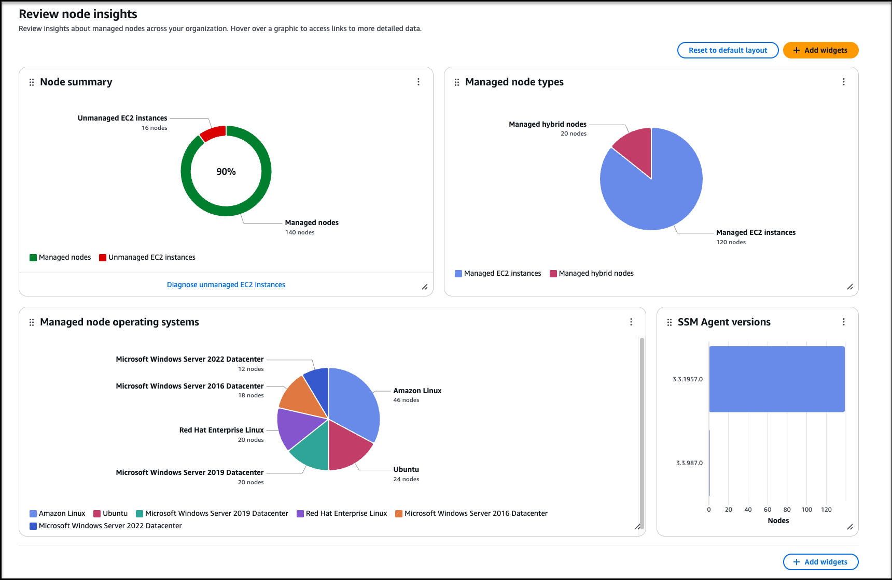

AWS Systems Manager Change Manager is no longer open to new customers. Existing customers can continue to use the service as normal. For more information, see
[AWS Systems Manager Change Manager availability change](change-manager-availability-change.md "change-manager-availability-change.md").

# Reviewing node insights

You can gain insights into the overall status of managed nodes and unmanaged EC2 instances
in your organization or account by using the unified Systems Manager console.

Systems Manager provides a visual overview into your managed nodes and EC2 instances that are not
yet managed by Systems Manager. (A managed node is any machine configured for use with Systems Manager in
[hybrid and multicloud](operating-systems-and-machine-types.md#supported-machine-types "operating-systems-and-machine-types.md#supported-machine-types") environments. For information about supported machine types, see [Supported machine types in hybrid and
multicloud environments](operating-systems-and-machine-types.md#supported-machine-types "operating-systems-and-machine-types.md#supported-machine-types").)

This overview is provided through individual report boxes, called _widgets_, which feature interactive pie charts and other graphics.

###### Before you begin

In order to review node insights, you must first onboard your organization or account
to the unified Systems Manager console. For more information, see [Setting up AWS Systems Manager](systems-manager-setting-up-console.md "systems-manager-setting-up-console.md").

After onboarding, open the [Systems
Manager console](https://console.aws.amazon.com/systems-manager/explorer "https://console.aws.amazon.com/systems-manager/explorer") and choose **Review node insights**.

The following image shows the individual report boxes, called _widgets_, which are available on the **Review node
insights** page.

The display supports widgets that provide you with the following information.

**Node summary**

Indicates how many EC2 instances in your organization or account aren't
currently managed nodes, and how many managed nodes are in your organization's
or account's fleet.

###### What is an unmanaged instance?

When you stop a managed EC2 instance, it is reported as "Unmanaged" in the
Systems Manager console. This is expected behavior because SSM Agent doesn't have an
active connection to the service.

###### Note

This is different from how AWS Config defines an instance as unmanaged. If
an instance is currently stopped, AWS Config reports what the status of the
instance was the last time a "heartbeat" connection was made between
SSM Agent on the instance and the Systems Manager service.

When the instance restarts, it automatically reconnects to the Systems Manager service,
and its status in the unified console is restored to "Managed" within five
minutes. No manual intervention is required, and all Systems Manager configurations for
the instance are preserved during the Stop/Start cycle.

However, if the instance is still not reported as "Managed" several minutes
after starting, the instance is likely not properly configured for Systems Manager
management. In this case, we recommend running a diagnosis to identify why the
instance remains in an unmanaged state. For more information, see [Diagnosing and remediating unmanaged
Amazon EC2 instances in Systems Manager](remediating-unmanaged-instances.md "remediating-unmanaged-instances.md").

If the diagnostic scan is not able to determine the issue, refer to the
following topics to verify that the requirements for SSM Agent, AWS Identity and Access Management (IAM)
roles, and Systems Manager prerequisites have all been met:

- [Troubleshooting SSM Agent](troubleshooting-ssm-agent.md "troubleshooting-ssm-agent.md")
- [Configure instance permissions required for
  Systems Manager](setup-instance-permissions.md "setup-instance-permissions.md")
- [Troubleshooting managed
  node availability](fleet-manager-troubleshooting-managed-nodes.md "fleet-manager-troubleshooting-managed-nodes.md")

**Managed node types**

Indicates how many managed nodes in your fleet are EC2 instances and how many
are other server types, including servers on your own premises (on-premises
servers), AWS IoT Greengrass core devices, AWS IoT and non-AWS edge devices, and
virtual machines (VMs), including VMs in other cloud environments. You can hover
over the **Node types** graphic to access links to more details
in the **Explore nodes** page.

For more information about AWS support for hybrid and multicloud
environments, see [AWS
Solutions for Hybrid and Multicloud](https://aws.amazon.com/hybrid-multicloud/ "https://aws.amazon.com/hybrid-multicloud/").

**SSM Agent versions**

Provides information about installations of AWS Systems Manager Agent (SSM Agent) in your
fleet. SSM Agent is Amazon software that runs on your managed nodes. SSM Agent
makes it possible for Systems Manager to update, manage, and configure these resources.
The agent processes requests from the Systems Manager service in the AWS Cloud, and then
runs them as specified in the request.

For managed nodes in your fleet, this widget reports on the SSM Agent
versions
in your fleet, from newest to oldest. You can hover over the
**SSM Agent versions** graphic to access links
to more details in the **Explore nodes** page.

For more information about SSM Agent, see [Working with SSM Agent](ssm-agent.md "ssm-agent.md").

**Managed node operating systems**

Provides a breakdown of the percentage of each operating system on managed
nodes in your fleet. You can hover over the **Managed nodes
by operating systems** graphic to access links to more details in
the **Explore nodes** page.

You can customize widget layout on the **Review node insights** page by
using a drag-and-drop capability, and by removing and adding widgets to the display.

Use information in the following topics to help you work with the Systems Manager node insights
widgets.

###### Topics

- [Adding or removing widgets
  from the Review node insights page](review-node-insights-add-and-remove-widgets.md "review-node-insights-add-and-remove-widgets.md")
- [Rearranging widgets in the
  Review node insights page](review-node-insights-rearrange-widgets.md "review-node-insights-rearrange-widgets.md")
