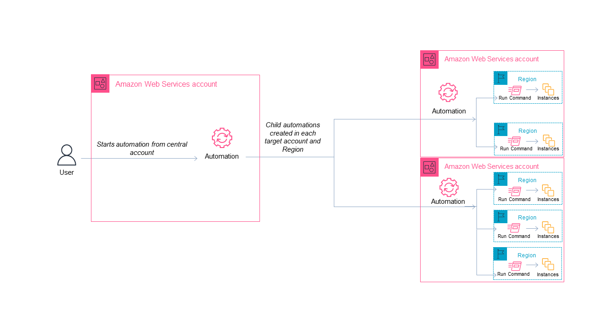

# Running automations in

multiple AWS Regions and accounts

You can run AWS Systems Manager automations across multiple AWS Regions and AWS accounts or
AWS Organizations organizational units (OUs) from a central account. Automation is a tool in
AWS Systems Manager. Running automations in multiple Regions and accounts or OUs reduces the time
required to administer your AWS resources while enhancing the security of your
computing environment.

For example, you can do the following by using automation runbooks:

- Implement patching and security updates centrally.
- Remediate compliance drift on VPC configurations or Amazon S3 bucket
  policies.
- Manage resources, such as Amazon Elastic Compute Cloud (Amazon EC2) EC2 instances, at scale.
  The following diagram shows an example of a user who is running the
  `AWS-RestartEC2Instances` runbook in multiple Regions and accounts from a
  central account. The automation locates the instances by using the specified tags in the
  targeted Regions and accounts.



###### Choose a central account for Automation

If you want to run automations across OUs, the central account must have
permissions to list all of the accounts in the OUs. This is only possible from a
delegated administrator account, or the management account of the organization. We
recommend that you follow AWS Organizations best practices and use a delegated administrator
account. For more information about AWS Organizations best practices, see [Best
practices for the management account](../../../organizations/latest/userguide/orgs_best-practices_mgmt-acct.md "../../../organizations/latest/userguide/orgs_best-practices_mgmt-acct.md") in the
_AWS Organizations User Guide_. To create a delegated administrator
account for Systems Manager, you can use the `register-delegated-administrator`
command with the AWS CLI as shown in the following example.

```
aws organizations register-delegated-administrator \
    --account-id `delegated admin account ID` \
    --service-principal ssm.amazonaws.com
```

If you want to run automations across multiple accounts that are not managed by
AWS Organizations, we recommend creating a dedicated account for automation management. Running
all cross-account automations from a dedicated account simplifies IAM permissions
management, troubleshooting efforts, and creates a layer of separation between
operations and administration. This approach is also recommended if you use AWS Organizations,
but only want to target individual accounts and not OUs.

###### How running automations works

Running automations across multiple Regions and accounts or OUs works as
follows:

1. Sign in to the account that you want to configure as the Automation central
   account.
2. Use the [Setting up management account
   permissions for multi-Region and multi-account automation](#setup-management-account-iam-roles "#setup-management-account-iam-roles") procedure in this topic
   to create the following IAM roles:
   - `**AWS-SystemsManager-AutomationAdministrationRole**`
   * This role gives the user permission to run automations in multiple
     accounts and OUs.
   - `**AWS-SystemsManager-AutomationExecutionRole**`
   * This role gives the user permission to run automations in the targeted
     accounts.

3. Choose the runbook, Regions, and accounts or OUs where you want to run the
   automation.

###### Note

Be sure that the target OU contains the desired accounts. If you choose a
custom runbook, the runbook must be shared with all of the target accounts.
For information about sharing runbooks, see [Sharing SSM documents](documents-ssm-sharing.md "documents-ssm-sharing.md").
For information about using shared runbooks, see [Using shared SSM documents](documents-ssm-sharing.md#using-shared-documents "documents-ssm-sharing.md#using-shared-documents"). 4. Run the automation. 5. Use the [GetAutomationExecution](../APIReference/API_GetAutomationExecution.md "../APIReference/API_GetAutomationExecution.md"), [DescribeAutomationStepExecutions](../APIReference/API_DescribeAutomationStepExecutions.md "../APIReference/API_DescribeAutomationStepExecutions.md"), and [DescribeAutomationExecutions](../APIReference/API_DescribeAutomationExecutions.md "../APIReference/API_DescribeAutomationExecutions.md") API operations from the AWS Systems Manager
console or the AWS CLI to monitor automation progress. The output of the steps for
the automation in your primary account will be the
`AutomationExecutionId` of the child automations. To view the
output of the child automations created in your target accounts, be sure to
specify the appropriate account, Region, and `AutomationExecutionId`
in your request.

## Setting up management account

permissions for multi-Region and multi-account automation

Use the following procedure to create the required IAM roles for Systems Manager
Automation multi-Region and multi-account automation by using AWS CloudFormation. This
procedure describes how to create the
`AWS-SystemsManager-AutomationAdministrationRole` role. You only need
to create this role in the Automation central account. This procedure also describes
how to create the `AWS-SystemsManager-AutomationExecutionRole` role. You
must create this role in _every_ account that you want to target
to run multi-Region and multi-account automations. We recommend using AWS CloudFormation
StackSets to create the `AWS-SystemsManager-AutomationExecutionRole` role
in the accounts you want to target to run multi-Region and multi-account
automations.

###### To create the required IAM administration role for multi-Region and

multi-account automations by using AWS CloudFormation

1. Download and unzip the [`AWS-SystemsManager-AutomationAdministrationRole.zip`](samples/AWS-SystemsManager-AutomationAdministrationRole.md "samples/AWS-SystemsManager-AutomationAdministrationRole.md").

-or-

If your accounts are managed by AWS Organizations [`AWS-SystemsManager-AutomationAdministrationRole
(org).zip`](samples/AWS-SystemsManager-AutomationAdministrationRole (org).md "samples/AWS-SystemsManager-AutomationAdministrationRole (org).md").

These files contain the
`AWS-SystemsManager-AutomationAdministrationRole.yaml`
and `AWS-SystemsManager-AutomationAdministrationRole (org).yaml`
AWS CloudFormation template files, respectively. 2. Open the AWS CloudFormation console at
[https://console.aws.amazon.com/cloudformation](https://console.aws.amazon.com/cloudformation/ "https://console.aws.amazon.com/cloudformation/"). 3. Choose **Create stack**. 4. In the **Specify template** section, choose
**Upload a template**. 5. Choose **Choose file**, and then choose the
`AWS-SystemsManager-AutomationAdministrationRole.yaml`
or `AWS-SystemsManager-AutomationAdministrationRole
 (org).yaml` AWS CloudFormation template file, depending on your selection
in step 1. 6. Choose **Next**. 7. On the **Specify stack details** page, in the
**Stack name** field, enter a name. 8. Choose **Next**. 9. On the **Configure stack options** page, enter values for
any options you want to use. Choose **Next**. 10. On the **Review** page, scroll down and choose the
**I acknowledge that AWS CloudFormation might create IAM resources with
custom names** option. 11. Choose **Create stack**.

AWS CloudFormation shows the **CREATE_IN_PROGRESS** status for approximately
three minutes. The status changes to **CREATE_COMPLETE**.

You must repeat the following procedure in _every_ account that
you want to target to run multi-Region and multi-account automations.

###### To create the required IAM automation role for multi-Region and

multi-account automations by using AWS CloudFormation

1. Download the [`AWS-SystemsManager-AutomationExecutionRole.zip`](samples/AWS-SystemsManager-AutomationExecutionRole.md "samples/AWS-SystemsManager-AutomationExecutionRole.md").

-or

If your accounts are managed by AWS Organizations [`AWS-SystemsManager-AutomationExecutionRole
(org).zip`](samples/AWS-SystemsManager-AutomationExecutionRole (org).md "samples/AWS-SystemsManager-AutomationExecutionRole (org).md").

These files contains the
`AWS-SystemsManager-AutomationExecutionRole.yaml` and
`AWS-SystemsManager-AutomationExecutionRole
 (org).yaml`AWS CloudFormation template files,
respectively. 2. Open the AWS CloudFormation console at
[https://console.aws.amazon.com/cloudformation](https://console.aws.amazon.com/cloudformation/ "https://console.aws.amazon.com/cloudformation/"). 3. Choose **Create stack**. 4. In the **Specify template** section, choose
**Upload a template**. 5. Choose **Choose file**, and then choose the
`AWS-SystemsManager-AutomationExecutionRole.yaml` or
`AWS-SystemsManager-AutomationExecutionRole
 (org).yaml` AWS CloudFormation template file, depending on your selection
in step 1. 6. Choose **Next**. 7. On the **Specify stack details** page, in the
**Stack name** field, enter a name. 8. In the **Parameters** section, in the
**AdminAccountId** field, enter the ID for the
Automation central account. 9. If you are setting up this role for an AWS Organizations environment, there is
another field in the section called **OrganizationID**.
Enter the ID of your AWS organization. 10. Choose **Next**. 11. On the **Configure stack options** page, enter values for
any options you want to use. Choose **Next**. 12. On the **Review** page, scroll down and choose the
**I acknowledge that AWS CloudFormation might create IAM resources with
custom names** option. 13. Choose **Create stack**.

AWS CloudFormation shows the **CREATE_IN_PROGRESS** status for approximately
three minutes. The status changes to **CREATE_COMPLETE**.

## Run an automation in multiple Regions and

accounts (console)

The following procedure describes how to use the Systems Manager console to run an
automation in multiple Regions and accounts from the Automation management
account.

###### Before you begin

Before you complete the following procedure, note the following
information:

- The user or role you use to run a multi-Region or multi-account automation
  must have the `iam:PassRole` permission for the
  `AWS-SystemsManager-AutomationAdministrationRole`
  role.
- AWS account IDs or OUs where you want to run the automation.
- [Regions supported by Systems Manager](../../../general/latest/gr/ssm.md#ssm_region "../../../general/latest/gr/ssm.md#ssm_region") where you want to run the
  automation.
- The tag key and the tag value, or the name of the resource group, where
  you want to run the automation.

###### To run an automation in multiple Regions and accounts

1. Open the AWS Systems Manager console at [https://console.aws.amazon.com/systems-manager/](https://console.aws.amazon.com/systems-manager/ "https://console.aws.amazon.com/systems-manager/").
2. In the navigation pane, choose **Automation**, and then choose
   **Execute automation**.
3. In the **Automation document** list, choose a runbook. Choose one or
   more options in the **Document categories** pane to filter SSM
   documents according to their purpose. To view a runbook that you own, choose the
   **Owned by me** tab. To view a runbook that is shared with your
   account, choose the **Shared with me** tab. To view all runbooks,
   choose the **All documents** tab.

###### Note

You can view information about a runbook by choosing the runbook name. 4. In the **Document details** section, verify that **Document
version** is set to the version that you want to run. The system includes
the following version options:

    * **Default version at runtime** – Choose this option if
     the Automation runbook is updated periodically and a new default version is
     assigned.
    * **Latest version at runtime** – Choose this option if
     the Automation runbook is updated periodically, and you want to run the version
     that was most recently updated.
    * **1 (Default)** – Choose this option to run the first
     version of the document, which is the default.

5. Choose **Next**.
6. On the **Execute automation document** page, choose
   **Multi-account and Region**.
7. In the **Target accounts and Regions** section, use the
   **Accounts, organizational units (OUs), and roots**
   field to specify the different AWS accounts or AWS organizational units
   (OUs) where you want to run the automation. Separate multiple accounts or
   OUs with a comma.
   1. (Optional) Select the **Include child OUs**
      checkbox to include all child organizational units within the
      specified OUs.
   2. (Optional) In the **Exclude accounts and organizational
      units (OUs)** field, enter a comma-separated list of
      account IDs and OU IDs that you want to exclude from the expanded
      entities entered above.

8. Use the **Regions** list to choose one or more Regions
   where you want to run the automation.
9. Use the **Multi-Region and account rate control** options
   to restrict the automation to a limited number of accounts running in a
   limited number of Regions. These options don't restrict the number of AWS
   resources that can run the automations.
   1. In the **Location (account-Region pair)
      concurrency** section, choose an option to restrict the
      number of automations that can run in multiple accounts and Regions
      at the same time. For example, if you choose to run an automation in
      five (5) AWS accounts, which are located in four (4)
      AWS Regions, then Systems Manager runs automations in a total of 20
      account-Region pairs. You can use this option to specify an absolute
      number, such as `2`, so that the automation
      only runs in two account-Region pairs at the same time. Or you can
      specify a percentage of the account-Region pairs that can run at the
      same time. For example, with 20 account-Region pairs, if you specify
      20%, then the automation simultaneously runs in a maximum of five
      (5) account-Region pairs.
      - Choose **targets** to enter an absolute
        number of account-Region pairs that can run the automation
        simultaneously.
      - Choose **percent** to enter a percentage
        of the total number of account-Region pairs that can run the
        automation simultaneously.

   2. In the **Error threshold** section, choose an
      option:
      - Choose **errors** to enter an absolute
        number of errors allowed before Automation stops sending the
        automation to other resources.
      - Choose **percent** to enter a percentage
        of errors allowed before Automation stops sending the
        automation to other resources.

10. In the **Targets** section, choose how you want to target the AWS
    resources where you want to run the Automation. These options are required.
    1. Use the **Parameter** list to choose a parameter. The items in
       the **Parameter** list are determined by the parameters in the
       Automation runbook that you selected at the start of this procedure. By choosing a
       parameter you define the type of resource on which the Automation workflow runs.
    2. Use the **Targets** list to choose how you want to target
       resources.
       1. If you chose to target resources by using parameter values, then enter the
          parameter value for the parameter you chose in the **Input
          parameters** section.
       2. If you chose to target resources by using AWS Resource Groups, then choose the name
          of the group from the **Resource Group** list.
       3. If you chose to target resources by using tags, then enter the tag key and
          (optionally) the tag value in the fields provided. Choose
          **Add**.
       4. If you want to run an Automation runbook on all instances in the current
          AWS account and AWS Region, then choose **All
          instances**.

11. In the **Input parameters** section, specify the required
    inputs. Choose the
    `AWS-SystemsManager-AutomationAdministrationRole` IAM
    service role from the **AutomationAssumeRole** list.

###### Note

You might not need to choose some of the options in the
**Input parameters** section. This is because you
targeted resources in multiple Regions and accounts by using tags or a
resource group. For example, if you chose the
`AWS-RestartEC2Instance` runbook, then you don't need to
specify or choose instance IDs in the **Input
parameters** section. The automation locates the instances
to restart by using the tags you specified. 12. (Optional) Choose a CloudWatch alarm to apply to your automation for monitoring.
To attach a CloudWatch alarm to your automation, the IAM principal that starts
the automation must have permission for the
`iam:createServiceLinkedRole` action. For more information
about CloudWatch alarms, see [Using
Amazon CloudWatch alarms](../../../AmazonCloudWatch/latest/monitoring/AlarmThatSendsEmail.md "../../../AmazonCloudWatch/latest/monitoring/AlarmThatSendsEmail.md"). Note that if your alarm activates, the
automation is cancelled and any `OnCancel` steps you have defined
run. If you use AWS CloudTrail, you will see the API call in your trail. 13. Use the options in the **Rate control** section to restrict the
number of AWS resources that can run the Automation within each account-Region pair.

In the **Concurrency** section, choose an option:

    * Choose **targets** to enter an absolute number of targets
     that can run the Automation workflow simultaneously.
    * Choose **percentage** to enter a percentage of the target set
     that can run the Automation workflow simultaneously.

14. In the **Error threshold** section, choose an option:
    - Choose **errors** to enter an absolute number of errors
      allowed before Automation stops sending the workflow to other resources.
    - Choose **percentage** to enter a percentage of errors allowed
      before Automation stops sending the workflow to other resources.

15. Choose **Execute**.

After an automation execution completes, you can rerun the execution with the same
or modified parameters. For more information, see [Rerunning automation executions](automation-rerun-executions.md "automation-rerun-executions.md").

## Run an automation in multiple Regions and accounts

(command line)

The following procedure describes how to use the AWS CLI (on Linux or Windows) or
AWS Tools for PowerShell to run an automation in multiple Regions and accounts from the
Automation management account.

###### Before you begin

Before you complete the following procedure, note the following
information:

- AWS account IDs or OUs where you want to run the automation.
- [Regions supported by Systems Manager](../../../general/latest/gr/ssm.md#ssm_region "../../../general/latest/gr/ssm.md#ssm_region") where you want to run the
  automation.
- The tag key and the tag value, or the name of the resource group, where
  you want to run the automation.

###### To run an automation in multiple Regions and accounts

1. Install and configure the AWS CLI or the AWS Tools for PowerShell, if you haven't already.

For information, see [Installing or updating the
latest version of the AWS CLI](../../../cli/latest/userguide/getting-started-install.md "../../../cli/latest/userguide/getting-started-install.md") and [Installing the
AWS Tools for PowerShell](../../../powershell/latest/userguide/pstools-getting-set-up.md "../../../powershell/latest/userguide/pstools-getting-set-up.md"). 2. Use the following format to create a command to run an automation in
multiple Regions and accounts. Replace each `example resource
 placeholder` with your own information.

Linux & macOS

```
aws ssm start-automation-execution \
        --document-name `runbook name` \
        --parameters AutomationAssumeRole=arn:aws:iam::`management account ID`:role/AWS-SystemsManager-AutomationAdministrationRole \
        --target-parameter-name `parameter name` \
        --targets Key=`tag key`,Values=`value` \
        --target-locations Accounts=`account ID`,`account ID 2`,Regions=`Region`,`Region 2`,ExecutionRoleName=AWS-SystemsManager-AutomationExecutionRole
```

Windows

```
aws ssm start-automation-execution ^
        --document-name `runbook name` ^
        --parameters AutomationAssumeRole=arn:aws:iam::`management account ID`:role/AWS-SystemsManager-AutomationAdministrationRole ^
        --target-parameter-name `parameter name` ^
        --targets Key=`tag key`,Values=`value` ^
        --target-locations Accounts=`account ID`,`account ID 2`,Regions=`Region`,`Region 2`,ExecutionRoleName=AWS-SystemsManager-AutomationExecutionRole
```

PowerShell

```
$Targets = New-Object Amazon.SimpleSystemsManagement.Model.Target
    $Targets.Key = "`tag key`"
    $Targets.Values = "`value`"

    Start-SSMAutomationExecution `
        -DocumentName "`runbook name`" `
        -Parameter @{
        "AutomationAssumeRole"="arn:aws:iam::`management account ID`:role/AWS-SystemsManager-AutomationAdministrationRole" } `
        -TargetParameterName "`parameter name`" `
        -Target $Targets `
        -TargetLocation @{
        "Accounts"="`account ID`","`account ID 2`";
        "Regions"="`Region`","`Region 2`";
        "ExecutionRoleName"="AWS-SystemsManager-AutomationExecutionRole" }
```

###### Examples: Running an automation in multiple Regions and

accounts

The following are examples demonstrating how to use the AWS CLI and
PowerShell to run automations in multiple accounts and Regions with a
single command.

**Example 1**: This example restarts EC2
instances in three Regions across an entire AWS Organizations organization. This is
achieved by targeting the root ID of the organization, and including child
OUs.

Linux & macOS

```
aws ssm start-automation-execution \
        --document-name "AWS-RestartEC2Instance" \
        --target-parameter-name InstanceId \
        --targets '[{"Key":"AWS::EC2::Instance","Values":["*"]}]' \
        --target-locations '[{
            "Accounts": ["r-`example`"],
            "IncludeChildOrganizationUnits": true,
            "Regions": ["us-east-1", "us-east-2", "us-west-2"]
        }]'
```

Windows

```
aws ssm start-automation-execution \
        --document-name "AWS-RestartEC2Instance" ^
        --target-parameter-name InstanceId ^
        --targets '[{"Key":"AWS::EC2::Instance","Values":["*"]}]' ^
        --target-locations '[{
            "Accounts": ["r-`example`"],
            "IncludeChildOrganizationUnits": true,
            "Regions": ["us-east-1", "us-east-2", "us-west-2"]
        }]'
```

PowerShell

```
Start-SSMAutomationExecution `
        -DocumentName "AWS-RestartEC2Instance" `
        -TargetParameterName "InstanceId" `
        -Targets '[{"Key":"AWS::EC2::Instance","Values":["*"]}]'
        -TargetLocation @{
            "Accounts"="r-`example`";
            "Regions"="us-east-1", "us-east-2", "us-west-2";
            "IncludeChildOrganizationUnits"=true}
```

**Example 2**: This example restarts specific
EC2 instances in different accounts and Regions.

###### Note

The `TargetLocationMaxConcurrency` option is available
using the AWS CLI and AWS SDKs.

Linux & macOS

```
aws ssm start-automation-execution \
        --document-name "AWS-RestartEC2Instance" \
        --target-parameter-name InstanceId \
        --target-locations '[{
            "Accounts": ["123456789012"],
            "Targets": [{
                "Key":"ParameterValues",
                "Values":["i-02573cafcfEXAMPLE", "i-0471e04240EXAMPLE"]
            }],
            "TargetLocationMaxConcurrency": "100%",
            "Regions": ["us-east-1"]
        }, {
            "Accounts": ["987654321098"],
            "Targets": [{
                "Key":"ParameterValues",
                "Values":["i-07782c72faEXAMPLE"]
            }],
            "TargetLocationMaxConcurrency": "100%",
            "Regions": ["us-east-2"]
        }]'
```

Windows

```
aws ssm start-automation-execution ^
        --document-name "AWS-RestartEC2Instance" ^
        --target-parameter-name InstanceId ^
        --target-locations '[{
            "Accounts": ["123456789012"],
            "Targets": [{
                "Key":"ParameterValues",
                "Values":["i-02573cafcfEXAMPLE", "i-0471e04240EXAMPLE"]
            }],
            "TargetLocationMaxConcurrency": "100%",
            "Regions": ["us-east-1"]
        }, {
            "Accounts": ["987654321098"],
            "Targets": [{
                "Key":"ParameterValues",
                "Values":["i-07782c72faEXAMPLE"]
            }],
            "TargetLocationMaxConcurrency": "100%",
            "Regions": ["us-east-2"]
        }]'
```

PowerShell

```
Start-SSMAutomationExecution `
        -DocumentName "AWS-RestartEC2Instance" `
        -TargetParameterName "InstanceId" `
        -Targets '[{"Key":"AWS::EC2::Instance","Values":["*"]}]'
        -TargetLocation @({
            "Accounts"="123456789012",
            "Targets"= @{
                "Key":"ParameterValues",
                "Values":["i-02573cafcfEXAMPLE", "i-0471e04240EXAMPLE"]
            },
            "TargetLocationMaxConcurrency"="100%",
            "Regions"=["us-east-1"]
        }, {
            "Accounts"="987654321098",
            "Targets": @{
                "Key":"ParameterValues",
                "Values":["i-07782c72faEXAMPLE"]
            },
            "TargetLocationMaxConcurrency": "100%",
            "Regions"=["us-east-2"]
        })
```

**Example 3**: This example demonstrates
specifying multiple AWS accounts and Regions where the automation should
run using the `--target-locations-url` option. The value for this
option must be a JSON file in a publicly accessible [presigned Amazon S3
URL](../../../AmazonS3/latest/userguide/using-presigned-url.md "../../../AmazonS3/latest/userguide/using-presigned-url.md").

###### Note

`--target-locations-url` is available when using the AWS CLI
and AWS SDKs.

Linux & macOS

```
aws ssm start-automation-execution \
    --document-name "MyCustomAutomationRunbook" \
    --target-locations-url "https://amzn-s3-demo-bucket.s3.amazonaws.com/target-locations.json"
```

Windows

```
aws ssm start-automation-execution ^
    --document-name "MyCustomAutomationRunbook" ^
    --target-locations-url "https://amzn-s3-demo-bucket.s3.amazonaws.com/target-locations.json"
```

PowerShell

```
Start-SSMAutomationExecution `
    -DocumentName "MyCustomAutomationRunbook" `
    -TargetLocationsUrl "https://amzn-s3-demo-bucket.s3.amazonaws.com/target-locations.json"

```

Sample content for the JSON file:

```
[
{
         "Accounts": [ "123456789012", "987654321098", "456789123012" ],
         "ExcludeAccounts": [ "111222333444", "999888444666" ],
         "ExecutionRoleName": "MyAutomationExecutionRole",
         "IncludeChildOrganizationUnits": true,
         "Regions": [ "us-east-1", "us-west-2", "ap-south-1", "ap-northeast-1" ],
         "Targets": ["Key": "AWS::EC2::Instance", "Values": ["i-2"]],
         "TargetLocationMaxConcurrency": "50%",
         "TargetLocationMaxErrors": "10",
         "TargetsMaxConcurrency": "20",
         "TargetsMaxErrors": "12"
 }
]
```

**Example 4**: This example restarts EC2
instances in the `123456789012` and `987654321098`
accounts, which are located in the `us-east-2` and
`us-west-1` Regions. The instances must be tagged with the
tag key-pair value `Env-PROD`.

Linux & macOS

```
aws ssm start-automation-execution \
        --document-name AWS-RestartEC2Instance \
        --parameters AutomationAssumeRole=arn:aws:iam::123456789012:role/AWS-SystemsManager-AutomationAdministrationRole \
        --target-parameter-name InstanceId \
        --targets Key=tag:Env,Values=PROD \
        --target-locations Accounts=123456789012,987654321098,Regions=us-east-2,us-west-1,ExecutionRoleName=AWS-SystemsManager-AutomationExecutionRole
```

Windows

```
aws ssm start-automation-execution ^
        --document-name AWS-RestartEC2Instance ^
        --parameters AutomationAssumeRole=arn:aws:iam::123456789012:role/AWS-SystemsManager-AutomationAdministrationRole ^
        --target-parameter-name InstanceId ^
        --targets Key=tag:Env,Values=PROD ^
        --target-locations Accounts=123456789012,987654321098,Regions=us-east-2,us-west-1,ExecutionRoleName=AWS-SystemsManager-AutomationExecutionRole
```

PowerShell

```
$Targets = New-Object Amazon.SimpleSystemsManagement.Model.Target
    $Targets.Key = "tag:Env"
    $Targets.Values = "PROD"

    Start-SSMAutomationExecution `
        -DocumentName "AWS-RestartEC2Instance" `
        -Parameter @{
        "AutomationAssumeRole"="arn:aws:iam::123456789012:role/AWS-SystemsManager-AutomationAdministrationRole" } `
        -TargetParameterName "InstanceId" `
        -Target $Targets `
        -TargetLocation @{
        "Accounts"="123456789012","987654321098";
        "Regions"="us-east-2","us-west-1";
        "ExecutionRoleName"="AWS-SystemsManager-AutomationExecutionRole" }
```

**Example 5**: This example restarts EC2
instances in the `123456789012` and `987654321098`
accounts, which are located in the `eu-central-1` Region. The
instances must be members of the `prod-instances` AWS resource
group.

Linux & macOS

```
aws ssm start-automation-execution \
        --document-name AWS-RestartEC2Instance \
        --parameters AutomationAssumeRole=arn:aws:iam::123456789012:role/AWS-SystemsManager-AutomationAdministrationRole \
        --target-parameter-name InstanceId \
        --targets Key=ResourceGroup,Values=prod-instances \
        --target-locations Accounts=123456789012,987654321098,Regions=eu-central-1,ExecutionRoleName=AWS-SystemsManager-AutomationExecutionRole
```

Windows

```
aws ssm start-automation-execution ^
        --document-name AWS-RestartEC2Instance ^
        --parameters AutomationAssumeRole=arn:aws:iam::123456789012:role/AWS-SystemsManager-AutomationAdministrationRole ^
        --target-parameter-name InstanceId ^
        --targets Key=ResourceGroup,Values=prod-instances ^
        --target-locations Accounts=123456789012,987654321098,Regions=eu-central-1,ExecutionRoleName=AWS-SystemsManager-AutomationExecutionRole
```

PowerShell

```
$Targets = New-Object Amazon.SimpleSystemsManagement.Model.Target
    $Targets.Key = "ResourceGroup"
    $Targets.Values = "prod-instances"

    Start-SSMAutomationExecution `
        -DocumentName "AWS-RestartEC2Instance" `
        -Parameter @{
        "AutomationAssumeRole"="arn:aws:iam::123456789012:role/AWS-SystemsManager-AutomationAdministrationRole" } `
        -TargetParameterName "InstanceId" `
        -Target $Targets `
        -TargetLocation @{
        "Accounts"="123456789012","987654321098";
        "Regions"="eu-central-1";
        "ExecutionRoleName"="AWS-SystemsManager-AutomationExecutionRole" }
```

**Example 6**: This example restarts EC2
instances in the `ou-1a2b3c-4d5e6c` AWS organizational unit (OU). The
instances are located in the `us-west-1` and
`us-west-2` Regions. The instances must be members of the
`WebServices` AWS resource group.

Linux & macOS

```
aws ssm start-automation-execution \
        --document-name AWS-RestartEC2Instance \
        --parameters AutomationAssumeRole=arn:aws:iam::123456789012:role/AWS-SystemsManager-AutomationAdministrationRole \
        --target-parameter-name InstanceId \
        --targets Key=ResourceGroup,Values=WebServices \
        --target-locations Accounts=ou-1a2b3c-4d5e6c,Regions=us-west-1,us-west-2,ExecutionRoleName=AWS-SystemsManager-AutomationExecutionRole
```

Windows

```
aws ssm start-automation-execution ^
        --document-name AWS-RestartEC2Instance ^
        --parameters AutomationAssumeRole=arn:aws:iam::123456789012:role/AWS-SystemsManager-AutomationAdministrationRole ^
        --target-parameter-name InstanceId ^
        --targets Key=ResourceGroup,Values=WebServices ^
        --target-locations Accounts=ou-1a2b3c-4d5e6c,Regions=us-west-1,us-west-2,ExecutionRoleName=AWS-SystemsManager-AutomationExecutionRole
```

PowerShell

```
$Targets = New-Object Amazon.SimpleSystemsManagement.Model.Target
    $Targets.Key = "ResourceGroup"
    $Targets.Values = "WebServices"

    Start-SSMAutomationExecution `
        -DocumentName "AWS-RestartEC2Instance" `
        -Parameter @{
        "AutomationAssumeRole"="arn:aws:iam::123456789012:role/AWS-SystemsManager-AutomationAdministrationRole" } `
        -TargetParameterName "InstanceId" `
        -Target $Targets `
        -TargetLocation @{
        "Accounts"="ou-1a2b3c-4d5e6c";
        "Regions"="us-west-1";
        "ExecutionRoleName"="AWS-SystemsManager-AutomationExecutionRole" }
```

The system returns information similar to the following.

Linux & macOS

```
{
        "AutomationExecutionId": "4f7ca192-7e9a-40fe-9192-5cb15EXAMPLE"
    }
```

Windows

```
{
        "AutomationExecutionId": "4f7ca192-7e9a-40fe-9192-5cb15EXAMPLE"
    }
```

PowerShell

```
4f7ca192-7e9a-40fe-9192-5cb15EXAMPLE
```

3. Run the following command to view details for the automation. Replace
   `automation execution ID` with your own
   information.

Linux & macOS

```
aws ssm describe-automation-executions \
        --filters Key=ExecutionId,Values=`automation execution ID`
```

Windows

```
aws ssm describe-automation-executions ^
        --filters Key=ExecutionId,Values=`automation execution ID`
```

PowerShell

```
Get-SSMAutomationExecutionList | `
        Where {$_.AutomationExecutionId -eq "`automation execution ID`"}
```

4. Run the following command to view details about the automation
   progress.

Linux & macOS

```
aws ssm get-automation-execution \
        --automation-execution-id `4f7ca192-7e9a-40fe-9192-5cb15EXAMPLE`
```

Windows

```
aws ssm get-automation-execution ^
        --automation-execution-id `4f7ca192-7e9a-40fe-9192-5cb15EXAMPLE`
```

PowerShell

```
Get-SSMAutomationExecution `
        -AutomationExecutionId `a4a3c0e9-7efd-462a-8594-01234EXAMPLE`
```

###### Note

You can also monitor the status of the automation in the console. In
the **Automation executions** list, choose the
automation you just ran and then choose the **Execution
steps** tab. This tab shows the status of the automation
actions.

**More info**

[Centralized multi-account and multi-Region patching with AWS Systems Manager
Automation](https://aws.amazon.com/blogs/mt/centralized-multi-account-and-multi-region-patching-with-aws-systems-manager-automation/ "https://aws.amazon.com/blogs/mt/centralized-multi-account-and-multi-region-patching-with-aws-systems-manager-automation/")
