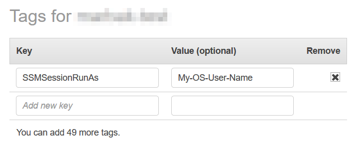

AWS Systems Manager Change Manager is no longer open to new customers. Existing customers can continue to use the service as normal. For more information, see
[AWS Systems Manager Change Manager availability change](change-manager-availability-change.md "change-manager-availability-change.md").

# Turn on Run As support for

Linux and macOS managed nodes

By default, Session Manager authenticates connections using the credentials of the
system-generated `ssm-user` account that is created on a
managed node. (On Linux and macOS machines, this account is added to
`/etc/sudoers/`.) If you choose, you can instead
authenticate sessions using the credentials of an operating system (OS) user
account, or a domain user for instances joined to an Active Directory. In this
case, Session Manager verifies that the OS account that you specified exists on the node,
or in the domain, before starting the session. If you attempt to start a session
using an OS account that doesn't exist on the node, or in the domain, the
connection fails.

###### Note

Session Manager does not support using an operating system's
`root` user account to authenticate connections. For
sessions that are authenticated using an OS user account, the node's
OS-level and directory policies, like login restrictions or system resource
usage restrictions, might not apply.

###### How it works

If you turn on Run As support for sessions, the system checks for access
permissions as follows:

1. For the user who is starting the session, has their IAM entity (user
   or role) been tagged with `SSMSessionRunAs = `os
   user account name``?

If Yes, does the OS user name exist on the managed node? If it does,
start the session. If it doesn't, don't allow a session to start.

If the IAM entity has _not_ been
tagged with `SSMSessionRunAs = `os user account
name``, continue to step 2.
2. If the IAM entity hasn't been tagged with `SSMSessionRunAs
 = `os user account name``, has an
OS user name been specified in the AWS account's Session Manager
preferences?

If Yes, does the OS user name exist on the managed node? If it does,
start the session. If it doesn't, don't allow a session to start.

###### Note

When you activate Run As support, it prevents Session Manager from starting
sessions using the `ssm-user` account on a managed node.
This means that if Session Manager fails to connect using the specified OS user
account, it doesn't fall back to connecting using the default method.

If you activate Run As without specifying an OS account or tagging an
IAM entity, and you have not specified an OS account in Session Manager
preferences, session connection attempts will fail.

###### To turn on Run As support for Linux and macOS managed

nodes

1. Open the AWS Systems Manager console at [https://console.aws.amazon.com/systems-manager/](https://console.aws.amazon.com/systems-manager/ "https://console.aws.amazon.com/systems-manager/").
2. In the navigation pane, choose **Session Manager**.
3. Choose the **Preferences** tab, and then choose
   **Edit**.
4. Select the check box next to **Enable Run As support for
   Linux instances**.
5. Do one of the following:
   - **Option 1**: In the **Operating
     system user name** field, enter the name of the OS
     user account that you want to use to start sessions. Using this
     option, all sessions are run by the same OS user for all users
     in your AWS account who connect using Session Manager.
   - **Option 2** (Recommended): Choose the
     **Open the IAM console** link. In the
     navigation pane, choose either **Users** or
     **Roles**. Choose the entity (user or role)
     to add tags to, and then choose the **Tags**
     tab. Enter `SSMSessionRunAs` for the key
     name. Enter the name of an OS user account for the key value.
     Choose **Save changes**.

   Using this option, you can specify unique OS users for
   different IAM entities if you choose. For more information
   about tagging IAM entities (users or roles), see [Tagging IAM resources](../../../IAM/latest/UserGuide/id_tags.md "../../../IAM/latest/UserGuide/id_tags.md") in the
   _IAM User Guide_.

   The following is an example.

   

6. Choose **Save**.
