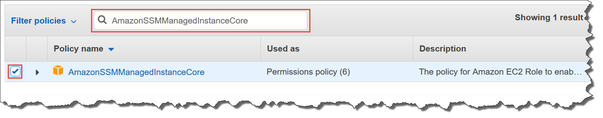

AWS Systems Manager Change Manager is no longer open to new customers. Existing customers can continue to use the service as normal. For more information, see
[AWS Systems Manager Change Manager availability change](change-manager-availability-change.md "change-manager-availability-change.md").

# Configure instance permissions required for

Systems Manager

By default, AWS Systems Manager doesn't have permission to perform actions on your instances.
You can provide instance permissions at the account level using an AWS Identity and Access Management (IAM)
role, or at the instance level using an instance profile. If your use case allows, we
recommend granting access at the account level using the Default Host Management
Configuration.

###### Note

You can skip this step and allow Systems Manager to apply the required permissions to your
instances for you when setting up the unified console. For more information, see
[Setting up AWS Systems Manager](systems-manager-setting-up-console.md "systems-manager-setting-up-console.md").

## Recommended configuration for EC2 instance

permissions

Default Host Management Configuration allows Systems Manager to manage your Amazon EC2 instances
automatically. After you've turned on this setting, all instances using Instance
Metadata Service Version 2 (IMDSv2) in the AWS Region and AWS account with
SSM Agent version 3.2.582.0 or later installed automatically become managed
instances. Default Host Management Configuration doesn't support Instance Metadata
Service Version 1. For information about transitioning to IMDSv2, see [Transition to using Instance Metadata Service Version 2](../../../AWSEC2/latest/UserGuide/instance-metadata-transition-to-version-2.md "../../../AWSEC2/latest/UserGuide/instance-metadata-transition-to-version-2.md") in the
_Amazon EC2 User Guide_. For information about checking the
version of the SSM Agent installed on your instance, see [Checking the SSM Agent version number](ssm-agent-get-version.md "ssm-agent-get-version.md"). For
information about updating the SSM Agent, see [Automatically updating
SSM Agent](ssm-agent-automatic-updates.md#ssm-agent-automatic-updates-console "ssm-agent-automatic-updates.md#ssm-agent-automatic-updates-console"). Benefits of managed
instances include the following:

- Connect to your instances securely using Session Manager.
- Perform automated patch scans using Patch Manager.
- View detailed information about your instances using Systems Manager
  Inventory.
- Track and manage instances using Fleet Manager.
- Keep the SSM Agent up to date automatically.

Fleet Manager, Inventory, Patch Manager, and Session Manager are tools in AWS Systems Manager.

Default Host Management Configuration allows instance management without the use
of instance profiles and ensures that Systems Manager has permissions to manage all instances
in the Region and account. If the permissions provided aren't sufficient for your
use case, you can also add policies to the default IAM role created by the Default
Host Management Configuration. Alternatively, if you don't need permissions for all
of the capabilities provided by the default IAM role, you can create your own
custom role and policies. Any changes made to the IAM role you choose for Default
Host Management Configuration applies to all managed Amazon EC2 instances in the Region
and account. For more information about the policy used by Default Host Management
Configuration, see [AWS
managed policy: AmazonSSMManagedEC2InstanceDefaultPolicy](security-iam-awsmanpol.md#security-iam-awsmanpol-AmazonSSMManagedEC2InstanceDefaultPolicy "security-iam-awsmanpol.md#security-iam-awsmanpol-AmazonSSMManagedEC2InstanceDefaultPolicy"). For more information about the Default Host Management Configuration, see [Managing EC2
instances automatically with Default Host Management Configuration](fleet-manager-default-host-management-configuration.md "fleet-manager-default-host-management-configuration.md").

###### Important

Instances registered using Default Host Management Configuration store
registration information locally in the `/lib/amazon/ssm` or
`C:\ProgramData\Amazon` directories. Removing these
directories or their files will prevent the instance from acquiring the
necessary credentials to connect to Systems Manager using Default Host
Management Configuration. In these cases, you must use an instance profile to
provide the required permissions to your instance, or recreate the
instance.

###### Note

This procedure is intended to be performed only by administrators.
Implement least privilege access when allowing individuals to configure or
modify the Default Host Management Configuration. You must turn on the
Default Host Management Configuration in each AWS Region you wish to
automatically manage your Amazon EC2 instances.

###### To turn on the Default Host Management Configuration setting

You can turn on the Default Host Management Configuration from the
Fleet Manager console. To successfully complete this procedure using either the
AWS Management Console or your preferred command line tool, you must have permissions for
the [GetServiceSetting](../APIReference/API_GetServiceSetting.md "../APIReference/API_GetServiceSetting.md"), [ResetServiceSetting](../APIReference/API_ResetServiceSetting.md "../APIReference/API_ResetServiceSetting.md"), and [UpdateServiceSetting](../APIReference/API_UpdateServiceSetting.md "../APIReference/API_UpdateServiceSetting.md") API operations. Additionally, you must
have permissions for the `iam:PassRole` permission for the
`AWSSystemsManagerDefaultEC2InstanceManagementRole` IAM
role. The following is an example policy. Replace each `example
 resource placeholder` with your own information.

JSON

```
`{
 "Version":"2012-10-17",
 "Statement": [
 {
 "Effect": "Allow",
 "Action": [
 "ssm:GetServiceSetting",
 "ssm:ResetServiceSetting",
 "ssm:UpdateServiceSetting"
 ],
 "Resource": "arn:aws:ssm:`us-east-1`:`111122223333`:servicesetting/ssm/managed-instance/default-ec2-instance-management-role"
 },
 {
 "Effect": "Allow",
 "Action": [
 "iam:PassRole"
 ],
 "Resource": "arn:aws:iam::`111122223333`:role/`service-role/AWSSystemsManagerDefaultEC2InstanceManagementRole`",
 "Condition": {
 "StringEquals": {
 "iam:PassedToService": [
 "ssm.amazonaws.com"
 ]
 }
 }
 }
 ]
}`

```

Before you begin, if you have instance profiles attached to your Amazon EC2
instances, remove any permissions that allow the
`ssm:UpdateInstanceInformation` operation. The SSM Agent attempts
to use instance profile permissions before using the Default Host Management
Configuration permissions. If you allow the
`ssm:UpdateInstanceInformation` operation in your instance
profiles, the instance will not use the Default Host Management Configuration
permissions.

1. Open the AWS Systems Manager console at [https://console.aws.amazon.com/systems-manager/](https://console.aws.amazon.com/systems-manager/ "https://console.aws.amazon.com/systems-manager/").
2. In the navigation pane, choose **Fleet Manager**.
3. Choose **Configure Default Host Management
   Configuration** under the **Account
   management** dropdown.
4. Turn on **Enable Default Host Management
   Configuration**.
5. Choose the IAM role used to enable Systems Manager tools for your instances.
   We recommend using the default role provided by Default Host Management
   Configuration. It contains the minimum set of permissions necessary to
   manage your Amazon EC2 instances using Systems Manager. If you prefer to use a custom
   role, the role's trust policy must allow Systems Manager as a trusted
   entity.
6. Choose **Configure** to complete setup.

After turning on the Default Host Management Configuration, it might take up
30 minutes for your instances to use the credentials of the role you chose. You
must turn on the Default Host Management Configuration in each Region you wish
to automatically manage your Amazon EC2 instances.

[Show moreShow less](# "#")

## Alternative configuration for EC2

instance permissions

You can grant access at the individual instance level by using an AWS Identity and Access Management
(IAM) instance profile. An instance profile is a container that passes IAM role
information to an Amazon Elastic Compute Cloud (Amazon EC2) instance at launch. You can create an instance
profile for Systems Manager by attaching one or more IAM policies that define the necessary
permissions to a new role or to a role you already created.

###### Note

You can use Quick Setup, a tool in AWS Systems Manager, to quickly configure an instance
profile on all instances in your AWS account. Quick Setup also creates an IAM
service role (or _assume_ role), which allows Systems Manager to
securely run commands on your instances on your behalf. By using Quick Setup, you
can skip this step (Step 3) and Step 4. For more information, see [AWS Systems Manager Quick Setup](systems-manager-quick-setup.md "systems-manager-quick-setup.md").

Note the following details about creating an IAM instance profile:

- If you're configuring non-EC2 machines in a [hybrid and multicloud](operating-systems-and-machine-types.md#supported-machine-types "operating-systems-and-machine-types.md#supported-machine-types") environment for
  Systems Manager, you don't need to create an instance profile for them. Instead,
  configure your servers and VMs to use an IAM service role. For more
  information, see [Create the IAM service role required for Systems Manager in hybrid and multicloud environments](hybrid-multicloud-service-role.md "hybrid-multicloud-service-role.md").
- If you change the IAM instance profile, it might take some time for the
  instance credentials to refresh. SSM Agent won't process requests until this
  happens. To speed up the refresh process, you can restart SSM Agent or
  restart the instance.

Depending on whether you're creating a new role for your instance profile or
adding the necessary permissions to an existing role, use one of the following
procedures.

###### To create an instance

profile for Systems Manager managed instances (console)

1. Open the IAM console at
   [https://console.aws.amazon.com/iam/](https://console.aws.amazon.com/iam/ "https://console.aws.amazon.com/iam/").
2. In the navigation pane, choose **Roles**, and then
   choose **Create role**.
3. For **Trusted entity type**, choose
   **AWS service**.
4. Immediately under **Use case**, choose
   **EC2**, and then choose
   **Next**.
5. On the **Add permissions** page, do the following:
   - Use the **Search** field to locate the
     **AmazonSSMManagedInstanceCore** policy.
     Select the check box next to its name, as shown in the following
     illustration.

   

   The console retains your selection even if you search for
   other policies.
   - If you created a custom S3 bucket policy in the previous
     procedure, [(Optional) Create a custom
     policy for S3 bucket access](#instance-profile-custom-s3-policy "#instance-profile-custom-s3-policy"), search
     for it and select the check box next to its name.
   - If you plan to join instances to an Active Directory managed
     by AWS Directory Service, search for
     **AmazonSSMDirectoryServiceAccess** and
     select the check box next to its name.
   - If you plan to use EventBridge or CloudWatch Logs to manage or monitor your
     instance, search for
     **CloudWatchAgentServerPolicy** and select
     the check box next to its name.

6. Choose **Next**.
7. For **Role name**, enter a name for your new instance
   profile, such as `SSMInstanceProfile`.

###### Note

Make a note of the role name. You will choose this role when you
create new instances that you want to manage by using Systems Manager. 8. (Optional) For **Description**, update the
description for this instance profile. 9. (Optional) For **Tags**, add one or more tag-key
value pairs to organize, track, or control access for this role, and
then choose **Create role**. The system returns you to
the **Roles** page.

[Show moreShow less](# "#")

###### To add instance profile

permissions for Systems Manager to an existing role (console)

1. Open the IAM console at
   [https://console.aws.amazon.com/iam/](https://console.aws.amazon.com/iam/ "https://console.aws.amazon.com/iam/").
2. In the navigation pane, choose **Roles**, and then
   choose the existing role you want to associate with an instance profile
   for Systems Manager operations.
3. On the **Permissions** tab, choose **Add
   permissions, Attach policies**.
4. On the **Attach policy** page, do the
   following:
   - Use the **Search** field to locate the
     **AmazonSSMManagedInstanceCore** policy.
     Select the check box next to its name.
   - If you have created a custom S3 bucket policy, search for it
     and select the check box next to its name. For information about
     custom S3 bucket policies for an instance profile, see [(Optional) Create a custom
     policy for S3 bucket access](#instance-profile-custom-s3-policy "#instance-profile-custom-s3-policy").
   - If you plan to join instances to an Active Directory managed
     by AWS Directory Service, search for
     **AmazonSSMDirectoryServiceAccess** and
     select the check box next to its name.
   - If you plan to use EventBridge or CloudWatch Logs to manage or monitor your
     instance, search for
     **CloudWatchAgentServerPolicy** and select
     the check box next to its name.

5. Choose **Attach policies**.

[Show moreShow less](# "#")
For information about how to update a role to include a trusted entity or further
restrict access, see [Modifying a role](../../../IAM/latest/UserGuide/id_roles_manage_modify.md "../../../IAM/latest/UserGuide/id_roles_manage_modify.md")
in the _IAM User Guide_.

## (Optional) Create a custom

policy for S3 bucket access

Creating a custom policy for Amazon S3 access is required only if you're using a VPC
endpoint or using an S3 bucket of your own in your Systems Manager operations. You can attach
this policy to the default IAM role created by the Default Host Management
Configuration, or an instance profile you created in the previous procedure.

For information about the AWS managed S3 buckets you provide access to in the
following policy, see [SSM Agent communications with
AWS managed S3 buckets](ssm-agent-technical-details.md#ssm-agent-minimum-s3-permissions "ssm-agent-technical-details.md#ssm-agent-minimum-s3-permissions").

1. Open the IAM console at
   [https://console.aws.amazon.com/iam/](https://console.aws.amazon.com/iam/ "https://console.aws.amazon.com/iam/").
2. In the navigation pane, choose **Policies**, and then
   choose **Create policy**.
3. Choose the **JSON** tab, and replace the default text
   with the following.

JSON

```
`{
 "Version":"2012-10-17",
 "Statement": [
 {
 "Effect": "Allow",
 "Action": "s3:GetObject",
 "Resource": [
 "arn:aws:s3:::aws-ssm-`us-east-2`/*",
 "arn:aws:s3:::aws-windows-downloads-`us-east-2`/*",
 "arn:aws:s3:::amazon-ssm-`us-east-2`/*",
 "arn:aws:s3:::amazon-ssm-packages-`us-east-2`/*",
 "arn:aws:s3:::`us-east-2`-birdwatcher-prod/*",
 "arn:aws:s3:::aws-ssm-distributor-file-`us-east-2`/*",
 "arn:aws:s3:::aws-ssm-document-attachments-`us-east-2`/*",
 "arn:aws:s3:::patch-baseline-snapshot-`us-east-2`/*"
 ]
 },
 {
 "Effect": "Allow",
 "Action": [
 "s3:GetObject",
 "s3:PutObject",
 "s3:PutObjectAcl",
 "s3:GetEncryptionConfiguration"
 ],
 "Resource": [
 "arn:aws:s3:::`amzn-s3-demo-bucket`/*",
 "arn:aws:s3:::`amzn-s3-demo-bucket`"
 ]
 }
 ]
}`

```

###### Note

The first `Statement` element is required only if you're
using a VPC endpoint.

The second `Statement` element is required only if you're
using an S3 bucket that you created to use in your Systems Manager
operations.

The `PutObjectAcl` access control list permission is
required only if you plan to support cross-account access to S3 buckets
in other accounts.

The `GetEncryptionConfiguration` element is required if
your S3 bucket is configured to use encryption.

If your S3 bucket is configured to use encryption, then the S3 bucket
root (for example, `arn:aws:s3:::amzn-s3-demo-bucket`)
must be listed in the **Resource** section. Your user,
group, or role must be configured with access to the root bucket. 4. If you're using a VPC endpoint in your operations, do the following:

In the first `Statement` element, replace each
`region` placeholder with the identifier of the
AWS Region this policy will be used in. For example, use
`us-east-2` for the US East (Ohio) Region. For a list of supported
`region` values, see the **Region** column in [Systems Manager service endpoints](../../../general/latest/gr/ssm.md#ssm_region "../../../general/latest/gr/ssm.md#ssm_region") in the
_Amazon Web Services General Reference_.

###### Important

We recommend that you avoid using wildcard characters (\*) in place of
specific Regions in this policy. For example, use
`arn:aws:s3:::aws-ssm-us-east-2/*` and do not use
`arn:aws:s3:::aws-ssm-*/*`. Using wildcards could
provide access to S3 buckets that you don’t intend to grant access to.
If you want to use the instance profile for more than one Region, we
recommend repeating the first `Statement` element for each
Region.

-or-

If you aren't using a VPC endpoint in your operations, you can delete the
first `Statement` element. 5. If you're using an S3 bucket of your own in your Systems Manager operations, do the
following:

In the second `Statement` element, replace
`amzn-s3-demo-bucket` with the name of an S3
bucket in your account. You will use this bucket for your Systems Manager operations.
It provides permission for objects in the bucket, using
`"arn:aws:s3:::my-bucket-name/*"` as the resource. For
more information about providing permissions for buckets or objects in
buckets, see the topic [Amazon S3
actions](../../../AmazonS3/latest/dev/using-with-s3-actions.md "../../../AmazonS3/latest/dev/using-with-s3-actions.md") in the _Amazon Simple Storage Service User Guide_ and the AWS
blog post [IAM Policies and Bucket Policies and ACLs! Oh, My! (Controlling
Access to S3 Resources)](https://aws.amazon.com/blogs/security/iam-policies-and-bucket-policies-and-acls-oh-my-controlling-access-to-s3-resources/ "https://aws.amazon.com/blogs/security/iam-policies-and-bucket-policies-and-acls-oh-my-controlling-access-to-s3-resources/").

###### Note

If you use more than one bucket, provide the ARN for each one. See the
following example for permissions on buckets.

```
"Resource": [
"arn:aws:s3:::`amzn-s3-demo-bucket1`/*",
"arn:aws:s3:::`amzn-s3-demo-bucket2`/*"
               ]

```

-or-

If you aren't using an S3 bucket of your own in your Systems Manager operations, you
can delete the second `Statement` element. 6. Choose **Next: Tags**. 7. (Optional) Add tags by choosing **Add tag**, and entering
the preferred tags for the policy. 8. Choose **Next: Review**. 9. For **Name**, enter a name to identify this policy, such
as `SSMInstanceProfileS3Policy`. 10. Choose **Create policy**.

## Additional policy

considerations for managed instances

This section describes some of the policies you can add to the default IAM role
created by the Default Host Management Configuration, or your instance profiles for
AWS Systems Manager. To provide permissions for communication between instances and the Systems Manager
API, we recommend creating custom policies that reflect your system needs and
security requirements. Depending on your operations plan, you might need permissions
represented in one or more of the other policies.

**Policy: `AmazonSSMDirectoryServiceAccess`**

Required only if you plan to join Amazon EC2 instances for Windows Server to a
Microsoft AD directory.

This AWS managed policy allows SSM Agent to access AWS Directory Service on your
behalf for requests to join the domain by the managed instance. For more
information, see [Seamlessly join a Windows EC2 Instance](../../../directoryservice/latest/admin-guide/launching_instance.md "../../../directoryservice/latest/admin-guide/launching_instance.md") in the
_AWS Directory Service Administration Guide_.

**Policy: `CloudWatchAgentServerPolicy`**

Required only if you plan to install and run the CloudWatch agent on your
instances to read metric and log data on an instance and write it to
Amazon CloudWatch. These help you monitor, analyze, and quickly respond to issues
or changes to your AWS resources.

Your default IAM role created by the Default Host Management
Configuration or instance profile needs this policy only if you will use
features such as Amazon EventBridge or Amazon CloudWatch Logs. (You can also create a more
restrictive policy that, for example, limits writing access to a
specific CloudWatch Logs log stream.)

###### Note

Using EventBridge and CloudWatch Logs features is optional. However, we recommend
setting them up at the beginning of your Systems Manager configuration process
if you have decided to use them. For more information, see the
_[Amazon EventBridge User Guide](../../../eventbridge/latest/userguide.md "../../../eventbridge/latest/userguide.md")_ and the
_[Amazon CloudWatch Logs User Guide](../../../AmazonCloudWatch/latest/logs.md "../../../AmazonCloudWatch/latest/logs.md")_.

To create IAM policies with permissions for additional Systems Manager tools,
see the following resources:

- [Restricting access to Parameter Store parameters
  using IAM policies](sysman-paramstore-access.md "sysman-paramstore-access.md")
- [Setting up Automation](automation-setup.md "automation-setup.md")
- [Step 2: Verify or add instance permissions for Session Manager](session-manager-getting-started-instance-profile.md "session-manager-getting-started-instance-profile.md")

## Attach the Systems Manager instance profile to an

instance (console)

The following procedure describes how to attach an IAM instance profile to an
Amazon EC2 instance using the Amazon EC2 console.

1. Sign in to the AWS Management Console and open the Amazon EC2 console at
   [https://console.aws.amazon.com/ec2/](https://console.aws.amazon.com/ec2/ "https://console.aws.amazon.com/ec2/").
2. In the navigation pane, under **Instances**, choose
   **Instances**.
3. Navigate to and choose your EC2 instance from the list.
4. In the **Actions** menu, choose
   **Security**, **Modify IAM
   role**.
5. For **IAM role**, select the instance profile you
   created using the procedure in [Alternative configuration for EC2
   instance permissions](#instance-profile-add-permissions "#instance-profile-add-permissions").
6. Choose **Update **IAM role\*\*\*\*.

For more information about attaching IAM roles to instances, choose one of the
following, depending on your selected operating system type:

- [Attach an IAM role to an instance](../../../AWSEC2/latest/UserGuide/iam-roles-for-amazon-ec2.md#attach-iam-role "../../../AWSEC2/latest/UserGuide/iam-roles-for-amazon-ec2.md#attach-iam-role") in the
  _Amazon EC2 User Guide_
- [Attach an IAM role to an instance](../../../AWSEC2/latest/WindowsGuide/iam-roles-for-amazon-ec2.md#attach-iam-role "../../../AWSEC2/latest/WindowsGuide/iam-roles-for-amazon-ec2.md#attach-iam-role") in the
  _Amazon EC2 User Guide_

Continue to [Improve the security of EC2 instances by using VPC
endpoints for Systems Manager](setup-create-vpc.md "setup-create-vpc.md").
